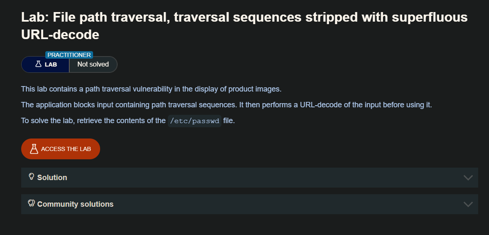
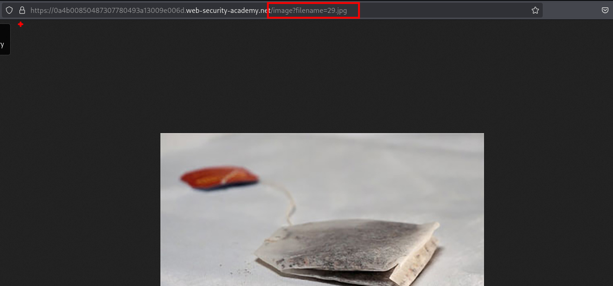
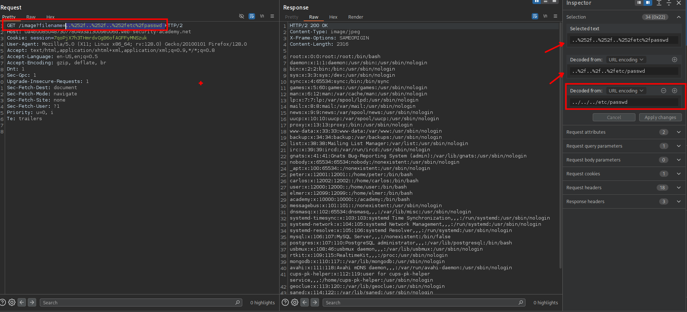

En algunos contextos, como en una ruta URL o en el parámetro de nombre de archivo de una solicitud `multipart/form-data`, los servidores web pueden eliminar cualquier secuencia de navegación por directorios antes de pasar la entrada a la aplicación. A veces se puede evitar este tipo de desinfección codificando la URL, o incluso codificando doblemente la URL, con los caracteres `../`. Esto resulta en ` %2e%2e%2f` y `%252e%252e%252f ` respectivamente. También pueden funcionar varias codificaciones no estándar, como `..%c0%af` o `..%ef%bc%8f`.

Para los usuarios de Burp Suite Professional, Burp Intruder proporciona la lista de carga predefinida Fuzzing - path traversal. Contiene algunas secuencias de path traversal codificadas que puede probar.

## LAB




Tenemos el parametro `filename` el cual podemos modificar.



En el parámetro `filename` ingresamos `../../../etc/passwd`, el servidor nos dara un mensaje de `Not such file` por lo que debemos ponerle en url encode, y al enviar esta también nos dará el mismo mensaje por lo que debemos de poner otra vez en url encode. Luego de enviar la solicitud tendremos el contenido del archivo `passwd`

```c
../../../etc/passwd

..%2f..%2f..%2fetc/passwd

..%252f..%252f..%252fetc%2fpasswd 
```



