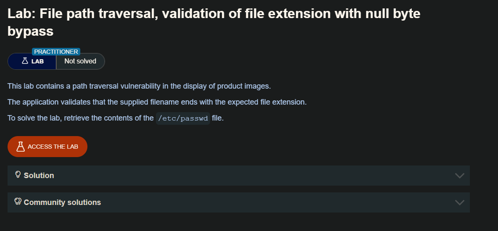
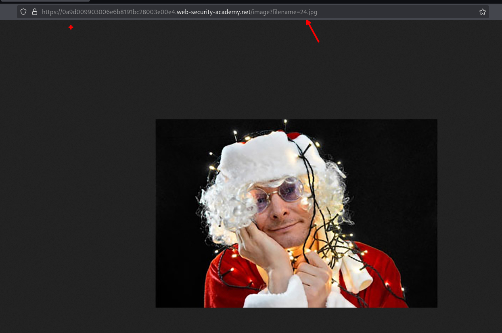
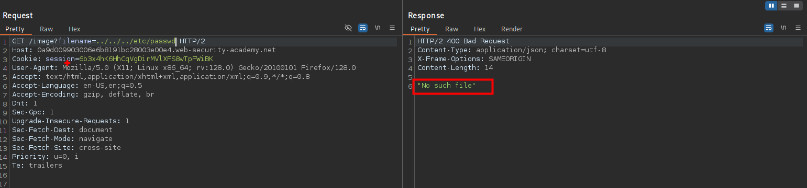
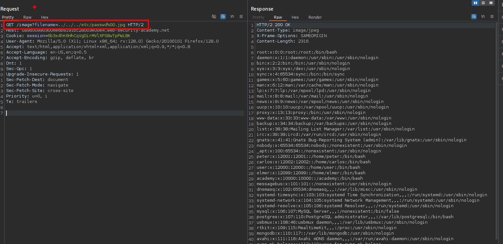

Una aplicación puede requerir que el nombre de archivo proporcionado por el usuario termine con una extensión de archivo esperada, como .png. En este caso, es posible utilizar un byte nulo para terminar la ruta del archivo antes de la extensión requerida. Por ejemplo: `filename=../../../etc/passwd%00.png.`

## LAB 



Tenemos un parámetro `filename` el cual hace llama a la imagen que muestra, en este caso al imagen 24. 


Bien, al intentar todas las maneras anteriores las que se ha estudiado, ninguna de estas nos permite leer el archivo `paswd` por lo que hacemos uso del [Byte Null](https://hacknotes.github.io/vulnerabilidades/lfi/)



En caso de que el servidor hace una validación de que el parámetro contenga la extensión `jpg`, con el byte null podremos saltarnos esta validación

```c
/image?filename=../../../etc/passwd%00.jpg 
```

Así podremos leer el archivo `passwd`



