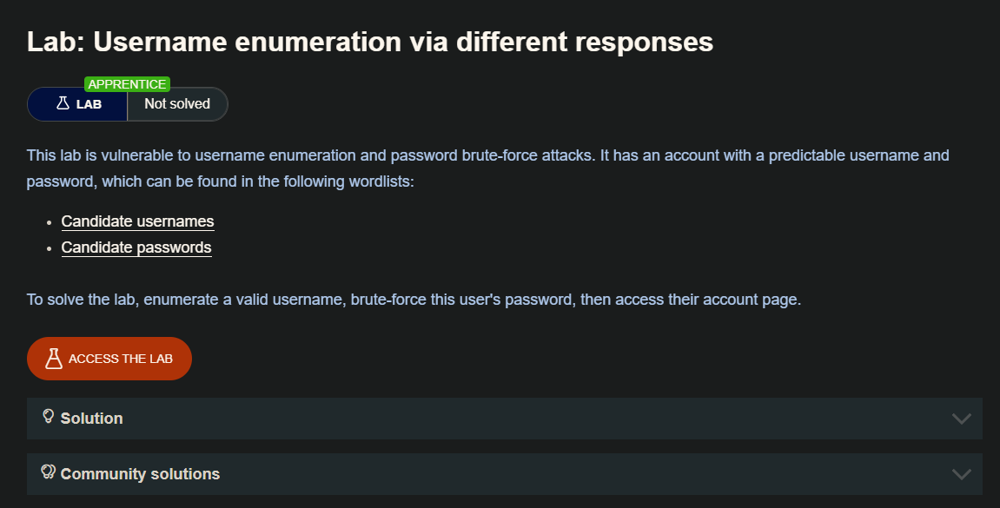
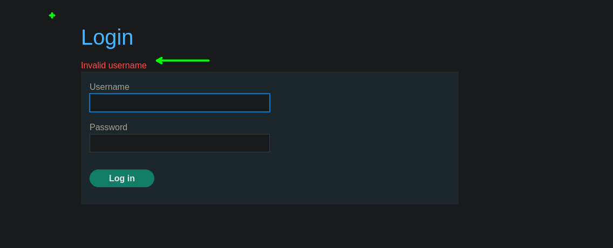
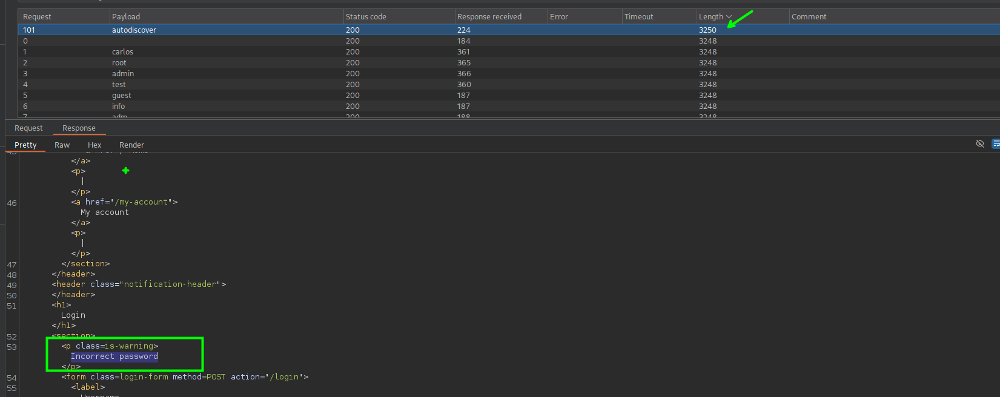
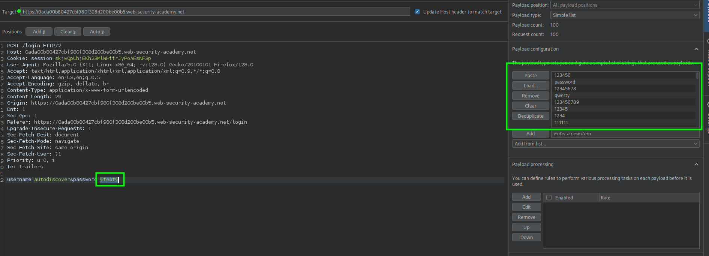
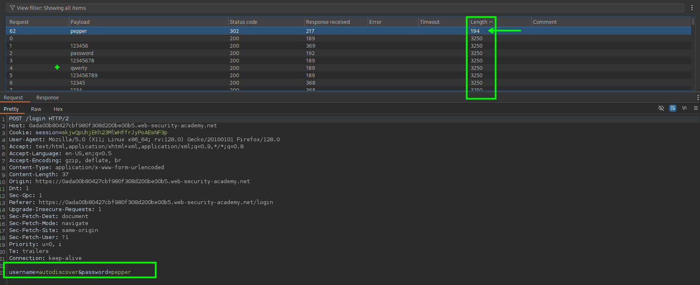

Al intentar forzar una página de inicio de sesión, debe prestar especial atención a cualquier diferencia en:

**Status codes** Durante un ataque de fuerza bruta, es probable que el código de estado HTTP devuelto sea el mismo para la gran mayoría de las conjeturas porque la mayoría de ellas serán erróneas. Si una suposición devuelve un código de estado diferente, es un claro indicio de que el nombre de usuario era correcto. Es una buena práctica que los sitios web devuelvan siempre el mismo código de estado independientemente del resultado, pero no siempre se sigue esta práctica.

**Error messages**: A veces el mensaje de error devuelto es diferente dependiendo de si tanto el nombre de usuario como la contraseña son incorrectos o sólo la contraseña es incorrecta. Es una buena práctica que los sitios web utilicen mensajes idénticos y genéricos en ambos casos, pero a veces se cuelan pequeños errores tipográficos. Un solo carácter fuera de lugar hace que los dos mensajes sean distintos, incluso en los casos en que el carácter no es visible en la página renderizada.

**Response times**: Si la mayoría de las peticiones se gestionaron con un tiempo de respuesta similar, cualquiera que se desvíe de esto sugiere que algo diferente estaba ocurriendo entre bastidores. Esta es otra indicación de que el nombre de usuario adivinado podría ser correcto. Por ejemplo, un sitio web podría comprobar si la contraseña es correcta sólo si el nombre de usuario es válido. Este paso extra podría causar un ligero aumento en el tiempo de respuesta. Esto puede ser sutil, pero un atacante puede hacer que este retraso sea más obvio introduciendo una contraseña excesivamente larga que el sitio web tarde notablemente más en procesar.

## LAB


Al ingresar con un usuario aleatorio y una contraseña, este nos da un mensaje de `Invalid username` 



Por lo que ahora probaremos con el listado de usuarios proporcionados.  Las solicitudes que se enviaran serán desde el intruder desde el burpsuite

Luego de esperar a que finalice, podremos observar que tenemos una respuesta de `Incorrect password ` con el usuario `autodiscover`

- users: [https://portswigger.net/web-security/authentication/auth-lab-usernames](https://portswigger.net/web-security/authentication/auth-lab-usernames)



Por lo que el usuario `autodiscover` es valido pero la contraseña no, ahora vamos a hacer brute force para encontrar la contraseña

- Passwords: [https://portswigger.net/web-security/authentication/auth-lab-passwords](https://portswigger.net/web-security/authentication/auth-lab-passwords)



Luego de un tiempo encontraremos que la contraseña para el usuario `autodiscover` es `pepper`



```c
username=autodiscover&password=pepper
```