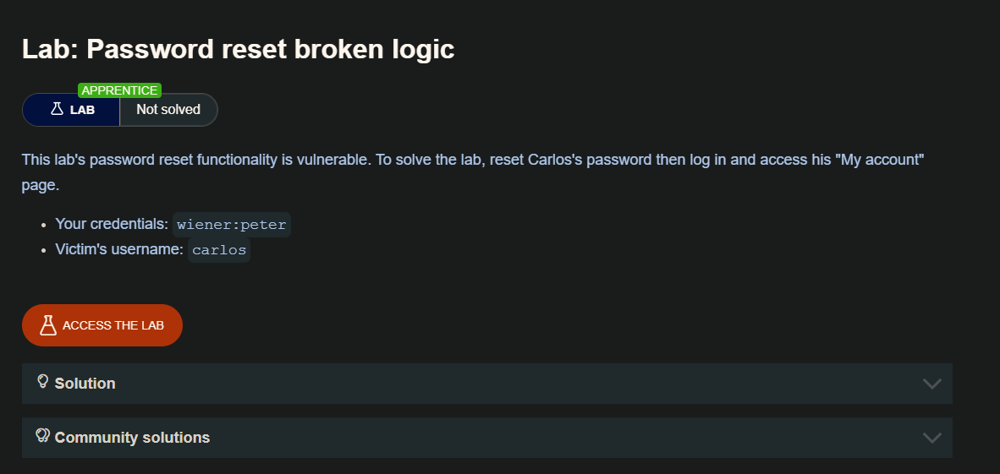
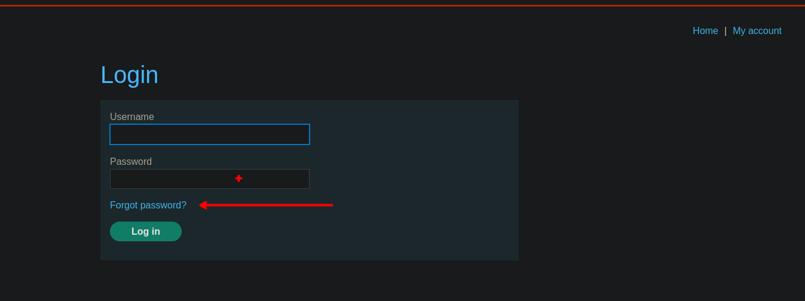
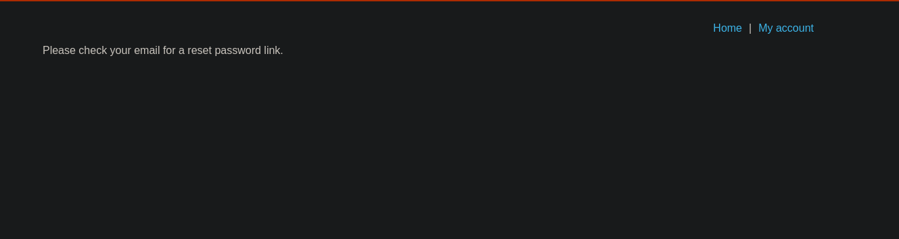
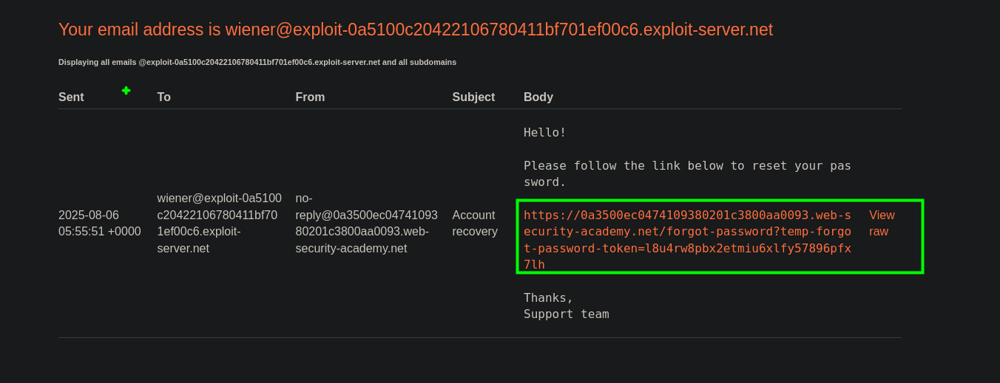
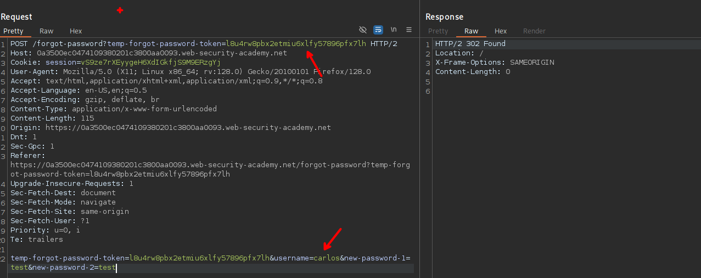

## Resetting user passwords

En la práctica, algunos usuarios olvidan su contraseña, por lo que es habitual que dispongan de un método para restablecerla. Como la autenticación habitual basada en contraseña es obviamente imposible en este escenario, los sitios web tienen que confiar en métodos alternativos para asegurarse de que el usuario real está restableciendo su propia contraseña. Por esta razón, la funcionalidad de restablecimiento de contraseña es intrínsecamente peligrosa y debe implementarse de forma segura.

Existen varias formas de implementar esta función, con distintos grados de vulnerabilidad.

## Sending passwords by email

Ni que decir tiene que no debería ser posible enviar a los usuarios su contraseña actual si un sitio web gestiona las contraseñas de forma segura en primer lugar. En su lugar, algunos sitios web generan una nueva contraseña y la envían al usuario por correo electrónico.

En general, debe evitarse el envío de contraseñas persistentes a través de canales inseguros. En este caso, la seguridad depende de que la contraseña generada caduque al cabo de muy poco tiempo o de que el usuario vuelva a cambiarla inmediatamente. De lo contrario, este enfoque es muy susceptible a los ataques de intermediario.

Por lo general, el correo electrónico tampoco se considera seguro, ya que las bandejas de entrada son persistentes y no están diseñadas para almacenar información confidencial de forma segura. Muchos usuarios también sincronizan automáticamente su bandeja de entrada entre varios dispositivos a través de canales inseguros.

## Resetting passwords using a URL

Un método más robusto para restablecer contraseñas es enviar una URL única a los usuarios que les lleve a una página de restablecimiento de contraseñas. Las implementaciones menos seguras de este método utilizan una URL con un parámetro fácil de adivinar para identificar qué cuenta se está restableciendo, por ejemplo:

```c
http://vulnerable-website.com/reset-password?user=victim-user
```

En este ejemplo, un atacante podría cambiar el parámetro de usuario para referirse a cualquier nombre de usuario que haya identificado. A continuación, se les llevaría directamente a una página en la que podrían establecer una nueva contraseña para este usuario arbitrario.

Una mejor implementación de este proceso es generar un token de alta entropía y difícil de adivinar y crear la URL de restablecimiento basada en él. En el mejor de los casos, esta URL no debería proporcionar ninguna pista sobre qué contraseña de usuario se está restableciendo.

```c
http://vulnerable-website.com/reset-password?token=a0ba0d1cb3b63d13822572fcff1a241895d893f659164d4cc550b421ebdd48a8
```

Cuando el usuario visita esta URL, el sistema debe comprobar si este token existe en el back-end y, en caso afirmativo, qué contraseña de usuario se supone que debe restablecer. Este token debería caducar tras un breve periodo de tiempo y destruirse inmediatamente después de restablecer la contraseña.

Sin embargo, algunos sitios web no vuelven a validar el token cuando se envía el formulario de restablecimiento. En este caso, un atacante podría simplemente visitar el formulario de restablecimiento desde su propia cuenta, eliminar el token y aprovechar esta página para restablecer la contraseña de un usuario arbitrario.

## LAB



El sitio web permite al usuario hacer el reset de la contraseña a través de la funcionalidad de `forgot password`




Luego de ingresar nuestro correo este nos da un mensaje el que nos informa que se a enviado el link de reset a nuestro correo



Al revisar el correo, podemos observar que tenemos el link de reset con el token.



Por otro lado, al revisar las solicitudes interceptadas por burpsuite tenemos una el que solo valida el nombre del  usuario independiente del token, ya que este token es valido y se puede usar para el usuario Carlos y cambiarle la contraseña para posteriormente ingresar a su cuenta.



