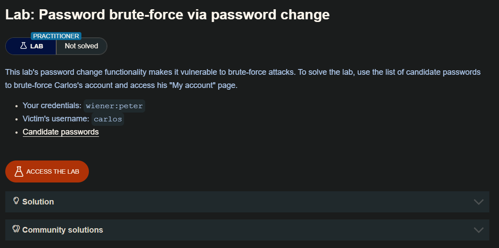
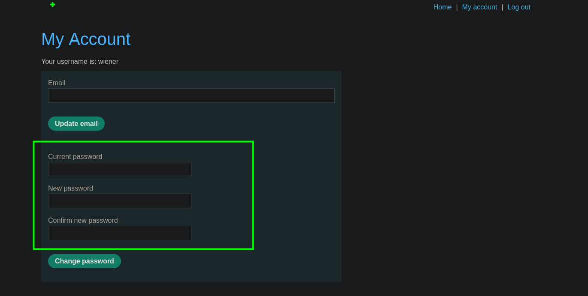
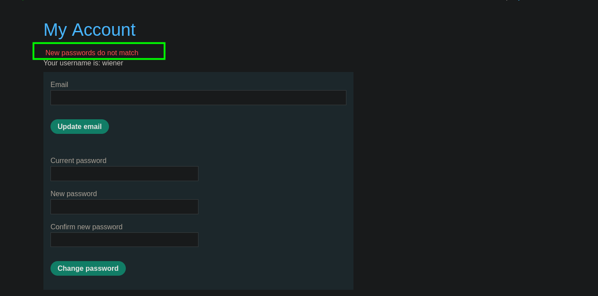
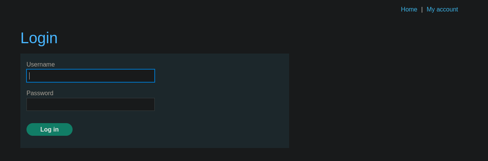
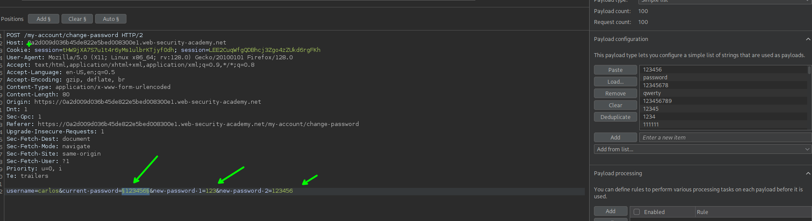
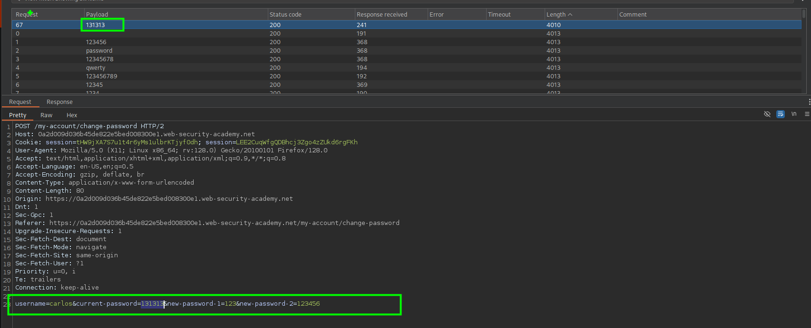
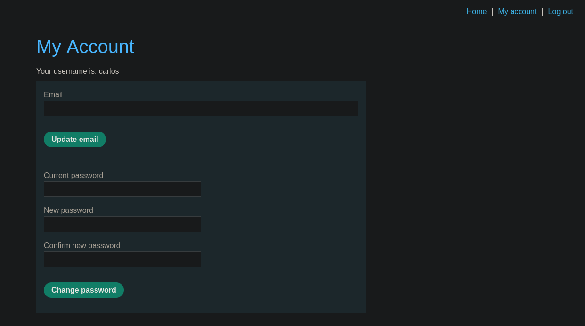

Normalmente, el cambio de contraseña implica introducir la contraseña actual y, a continuación, la nueva contraseña dos veces. Estas páginas se basan fundamentalmente en el mismo proceso para comprobar que los nombres de usuario y las contraseñas actuales coinciden que una página de inicio de sesión normal. Por lo tanto, estas páginas pueden ser vulnerables a las mismas técnicas.

La funcionalidad de cambio de contraseña puede ser especialmente peligrosa si permite a un atacante acceder a ella directamente sin haber iniciado sesión como el usuario víctima. Por ejemplo, si el nombre de usuario se proporciona en un campo oculto, un atacante podría ser capaz de editar este valor en la solicitud para dirigirse a usuarios arbitrarios. Esto puede ser potencialmente explotado para enumerar nombres de usuario y contraseñas de fuerza bruta.

Al ingresar con las credenciales del usuario `wiener` y al ir en nuestra cuenta observamos que podemos cambiar nuestra contraseña, pero proporcionando la contraseña actual.

En el primer caso si la contraseña actual es la correcta pero la nueva difieren te da un mensaje de `New password do not match`

en caso de que la contraseña actual sea incorrecta y las otras hagan `match` este te llevara al login principal

Teniendo esto en cuenta e interceptando la solicitud de cambio de contraseña y cambiamos el nombre de usuario de `wiener` a `carlos` para luego hacer un ataque del tipo `snniper`  y asi hacer un brute force para encontrar la contraseña correcta

Luego de enviar el ataque encontraremos que la contraseña para el usuario `carlos` es `131313`

