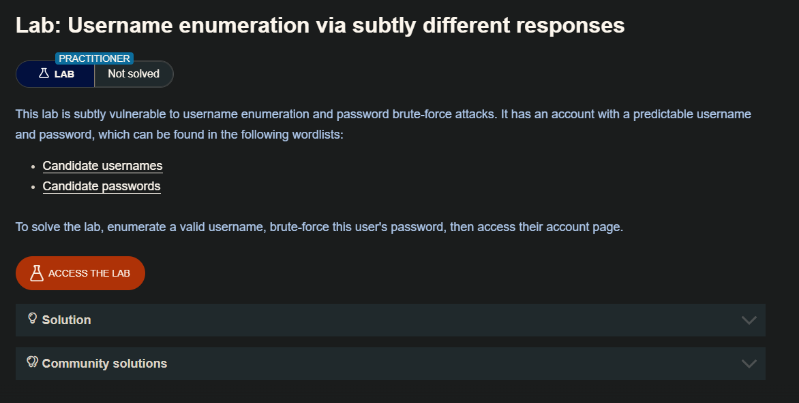
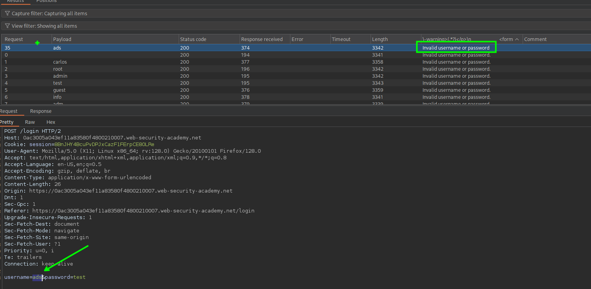
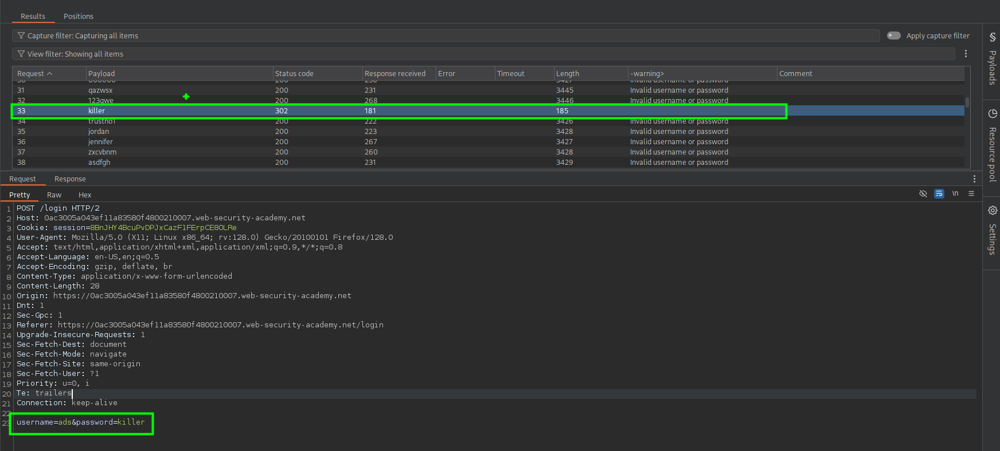

Para este laboratorio usaremos la herramienta de Burpsuite `intruder` el cual nos permitira el enviar varias solicitudes haciendo brute force con un usuario y una contraseña.

Al enviar las peticiones y haciendo uso de expresiones regulares del Burp, observaremos que del lado del servidor tenemos una respuesta de `Invalid username or password ` y otra `Invalid username or password.`, quizás no se vea a primera vista la diferencia pero el según tiene un `.` el cual nos indica que el usuario es valido.
 

Ahora realizaremos brute force a la contraseña del usuario encontrado anteriormente

Luego de un tiempo podremos encontrar la contraseña del usuario `ads`