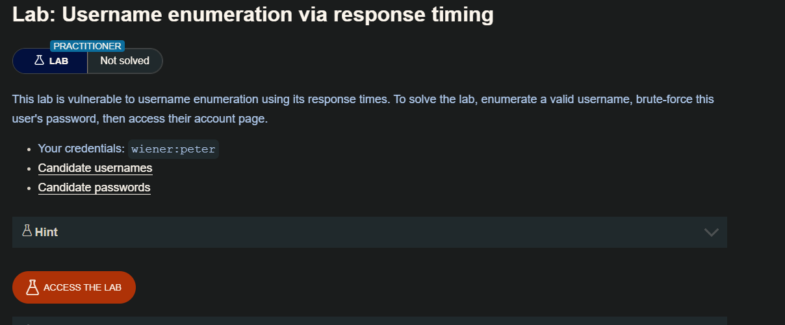
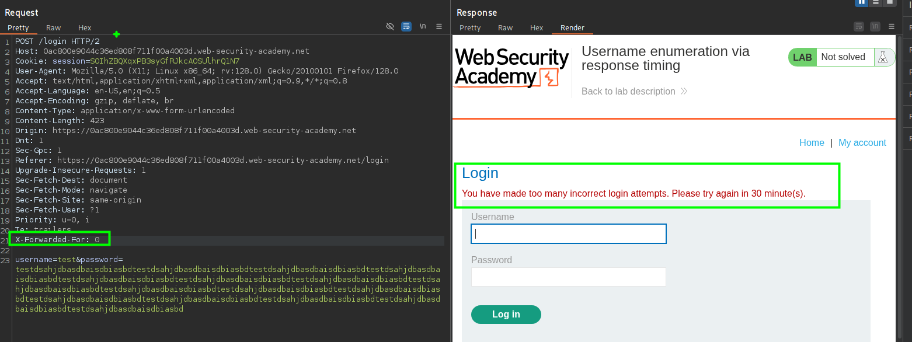
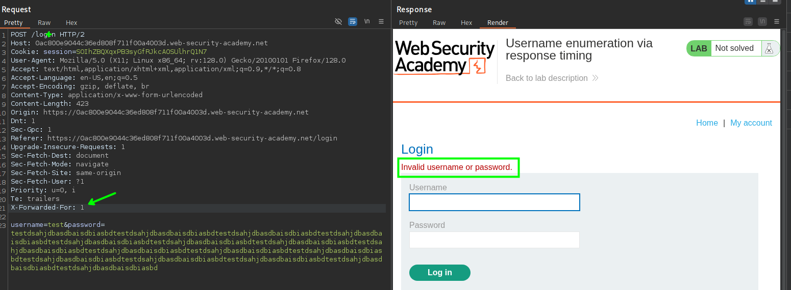
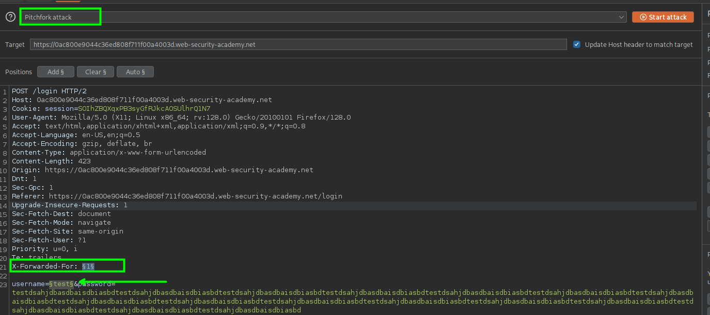
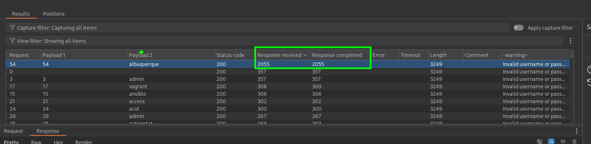
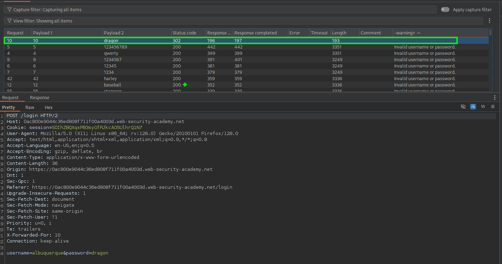

## Bypass de IP Block usando `X-Forwarded-For`

Algunas aplicaciones web implementan **control de acceso basado en IP** (ej., permitir solo tráfico desde ciertas IP o bloquear direcciones sospechosas).  
Para identificar al cliente, el servidor normalmente revisa:

- **`REMOTE_ADDR`** → IP real que hace la conexión.
- **Cabeceras HTTP opcionales** como `X-Forwarded-For` o `X-Real-IP`.

`X-Forwarded-For` (XFF) es un header estándar que se utiliza para indicar la IP original del cliente cuando la petición pasa por un **proxy o balanceador**. Ejemplo:


Esto le dice al backend: *“la IP real del cliente es 203.0.113.25”*.
### El problema
Muchos desarrolladores confían **ciegamente** en `X-Forwarded-For` sin validar:

- ¿Proviene realmente de un proxy interno de confianza?
- ¿Es un valor legítimo?

Esto permite a un atacante **inyectar su propia IP en la cabecera y engañar al sistema**.
### Ejemplo de bypass
Supón que una aplicación bloquea todo tráfico excepto desde `192.168.1.10`.  
El atacante agrega:


Si el backend usa `X-Forwarded-For` para la validación, **cree que eres la IP whitelisted**.

### Por qué funciona
- Las cabeceras HTTP son controladas por el cliente, a menos que el servidor las filtre.
- Muchos frameworks (`PHP`, `ASP.NET`, `Java`) asignan directamente `X-Forwarded-For` a la IP "real" si está presente.

## LAB



Interceptando las solicitudes desde el burpsuite, observamos que en cierto numero de logins inválidos, el servidor ya no nos deja enviar otra.



Por lo que tenemos que bypasear esta restricción de bloqueo de IP. 

- [https://rajanagori.medium.com/bypass-ip-block-with-the-x-forwarded-for-header-8c1dbd89ae58](https://rajanagori.medium.com/bypass-ip-block-with-the-x-forwarded-for-header-8c1dbd89ae58)

En el anterior articulo encontraremos que haciendo uso o cambiando el valor del header `X-Forwarded-For: 1` e iterando valores de este podemos enviar solicitudes sin que el servidor nos bloquee



```c
X-Forwarded-For: 1
```

Entendiendo esto, usaremos un ataque de tipo `Pitchfork attack` el cual nos permitira enviar dos listas, una para el header `X-Forwarded-For:` y otra para el `username` 



Luego de espera un tiempo, podemos ver que tenemos una solicitud que tiene un tiempo de respuesta mayar en comparación a las otras.



Entonces el usuario es: 

```c
albuquerque
```

Ahora, teniendo usuario intentaremos hacer brute force para encontrar la password.



Luego de lanzar la solicitudes vemos que tenemos la contraseña, para este caso yo use `Grep - Extract` para filtrar cual es la solicitud que no tenia `Invalid Username or password`. Asi tendríamos la contraseña `dragon`

```c
username=albuquerque&password=dragon
```