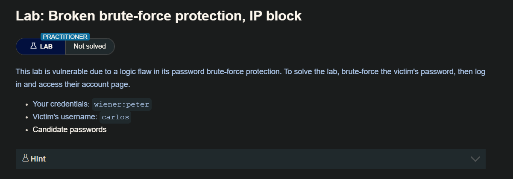
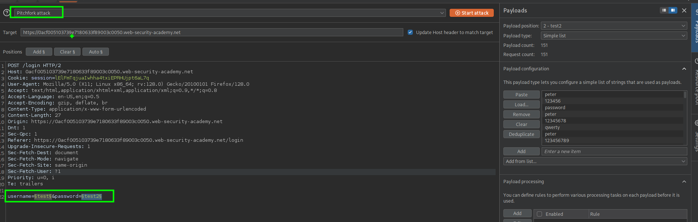
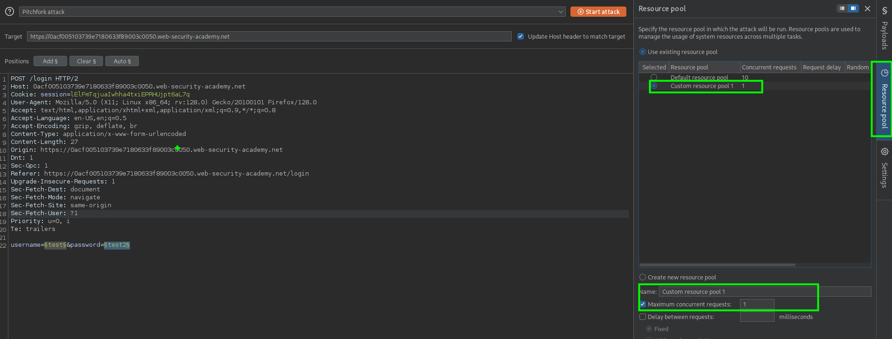
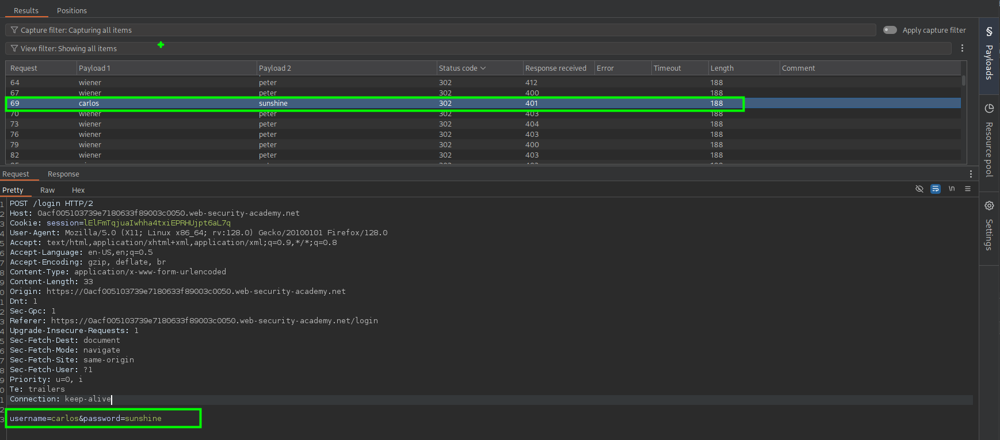

Es muy probable que un ataque de fuerza bruta implique muchos intentos fallidos antes de que el atacante logre comprometer una cuenta. Lógicamente, la protección de fuerza bruta gira en torno a intentar que sea lo más difícil posible automatizar el proceso y ralentizar el ritmo al que un atacante puede intentar iniciar sesión. Las dos formas más comunes de prevenir los ataques de fuerza bruta son:

Bloquear la cuenta a la que el usuario remoto está intentando acceder si realiza demasiados intentos de inicio de sesión fallidos
Bloquear la dirección IP del usuario remoto si realiza demasiados intentos de inicio de sesión en rápida sucesión
Ambos enfoques ofrecen diversos grados de protección, pero ninguno es invulnerable, especialmente si se implementan utilizando una lógica errónea.

Por ejemplo, a veces puede ocurrir que se bloquee tu IP si no consigues conectarte demasiadas veces. En algunas implementaciones, el contador del número de intentos fallidos se reinicia si el propietario de la IP se conecta con éxito. Esto significa que un atacante simplemente tendría que iniciar sesión en su propia cuenta cada pocos intentos para evitar que se alcance este límite.

En este caso, la mera inclusión de sus propias credenciales de inicio de sesión a intervalos regulares a lo largo de la lista de palabras es suficiente para hacer que esta defensa sea prácticamente inútil.

## LAB



Al intentar dos veces y luego enviar la tercera solicitud el servidor nos enía un mensaje
`You have made too many incorrect login attemtps. please try again in 1 minute(s)` el cual indica que nuestra IP ha sido bloqueada por 1 minuto por intento de logins fallidos.

Para bypaser esto, lo que haremos será intentar dos vez con el usuario `carlos` y luego usar las credenciales de wiener y hacer un login exitoso, haciendo que el servidor no bloquee nuestra dirección IP 

- [portswigger.net/web-security/authentication/auth-lab-passwords](portswigger.net/web-security/authentication/auth-lab-passwords)

Para ello debemos construir una lista de credenciales en el siguiente formato: 

```c
[credencial de wiener]
password1
password2
[credencial de wiener]
password3
password4
[credencial de wiener]
...
```

También debemos tener una lista de usuarios en el siguiente formato:

```c
wiener
carlos
carlos
wiener
carlos
carlos
wiener
carlos
carlos
...
```

Para construir nuestra lista de contraseñas usaremos el siguiente comando:

```c
❯ awk 'NR%2==0{print $0 RS "peter"; next} {print}' password.txt > password
```

- `NR%2==0` → cuando el número de línea es par (cada dos líneas).
    
- `{print $0 RS "carlos"; next}` → imprime la línea actual y luego agrega `"carlos"` en la siguiente línea.
    
- `{print}` → para las demás líneas, imprime normal.
    
- `RS` → separador de registros (salto de línea).
    
- `> output.txt` → guarda el resultado en otro archivo.

Y para la lista de usuarios usaremos un for con con 50 repeticiones

```c
❯ for i in {1..50}; do printf "carlos\ncarlos\nwiener\n"; done > users
```

Una vez con nuestras wordlist, enviaremos la peticion al `intruder` y mediante un ataque de `Pitchfork attack` añadiremos las dos listas



Además configuraremos el numero de solicitudes que se envían en paralelo



Luego iniciaremos el ataque, después de un tiempo obtendremos las credenciales para el usuario `carlos`.



```c
username=carlos&password=sunshine
```

