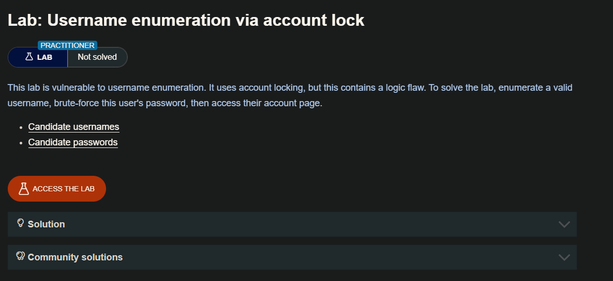
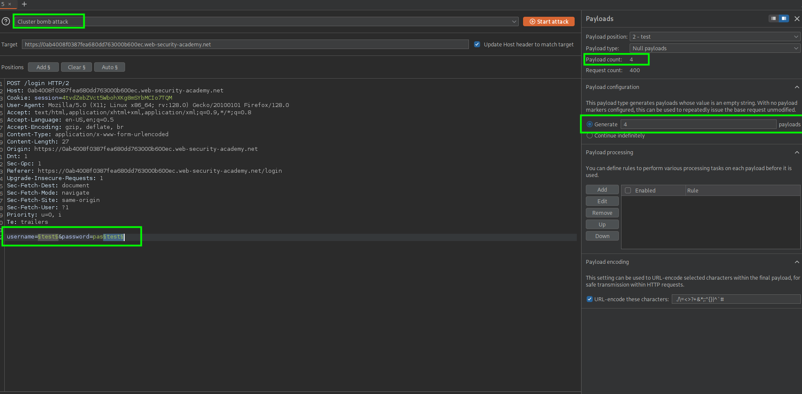
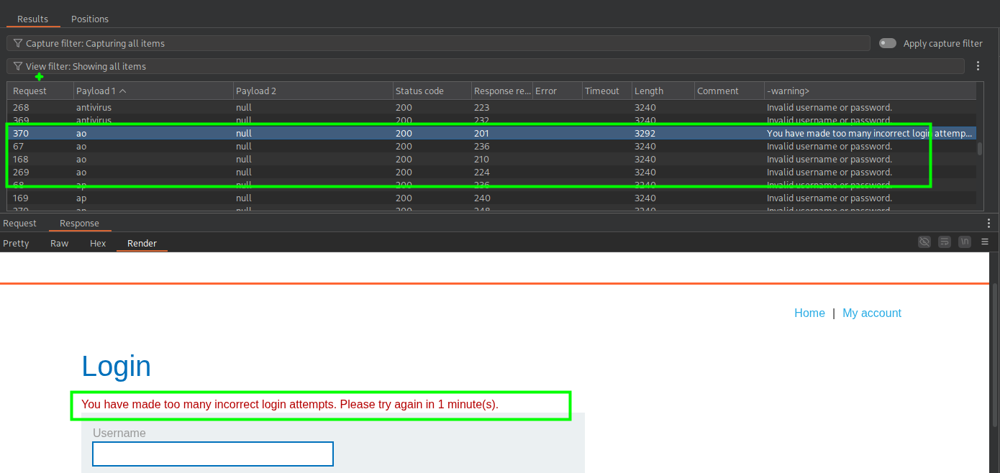
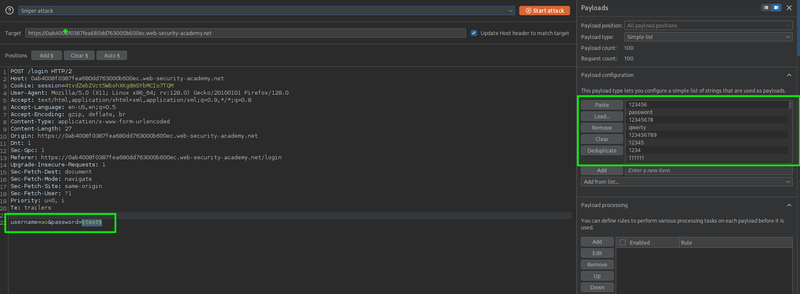
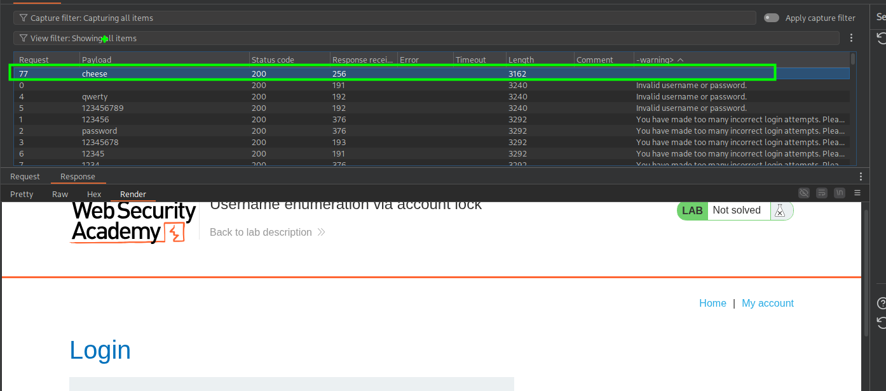

Una forma en la que los sitios web intentan evitar el forzamiento brusco es bloquear la cuenta si se cumplen ciertos criterios sospechosos, normalmente un número determinado de intentos de inicio de sesión fallidos. Al igual que ocurre con los errores de inicio de sesión normales, las respuestas del servidor que indican que una cuenta está bloqueada también pueden ayudar a un atacante a enumerar los nombres de usuario.

El bloqueo de una cuenta ofrece cierta protección contra el forzamiento brusco selectivo de una cuenta específica. Sin embargo, este enfoque no evita adecuadamente los ataques de fuerza bruta en los que el atacante sólo intenta acceder a cualquier cuenta aleatoria que pueda.

Por ejemplo, se puede utilizar el siguiente método para eludir este tipo de protección:

1. Establecer una lista de nombres de usuario candidatos que probablemente sean válidos. Esto puede hacerse mediante la enumeración de nombres de usuario o simplemente basándose en una lista de nombres de usuario comunes.
2. Decide una lista muy reducida de contraseñas que creas que al menos un usuario puede tener. Lo más importante es que el número de contraseñas que elijas no supere el número de intentos de inicio de sesión permitidos. Por ejemplo, si has calculado que el límite es de 3 intentos, tienes que elegir un máximo de 3 contraseñas.
3. Utilizando una herramienta como Burp Intruder, pruebe cada una de las contraseñas seleccionadas con cada uno de los nombres de usuario candidatos. De esta forma, podrá intentar la fuerza bruta en todas las cuentas sin activar el bloqueo de cuentas. Sólo es necesario que un único usuario utilice una de las tres contraseñas para comprometer una cuenta.

El bloqueo de cuentas tampoco protege contra los `credential stuffing attacks`. Esto implica el uso de un diccionario masivo de pares de nombre de usuario y contraseña, compuesto por credenciales de inicio de sesión auténticas robadas en filtraciones de datos. El relleno de credenciales se basa en el hecho de que muchas personas reutilizan el mismo nombre de usuario y contraseña en varios sitios web y, por lo tanto, existe la posibilidad de que algunas de las credenciales comprometidas del diccionario también sean válidas en el sitio web objetivo. El bloqueo de cuentas no protege contra el `credential stuffing attacks` porque cada nombre de usuario sólo se intenta una vez. El `credential stuffing` es especialmente peligroso porque, en ocasiones, el atacante puede comprometer muchas cuentas diferentes con un único ataque automatizado.

## LAB

Al intentar ingresar con un usuario valido y una contraseña no valida, el usuario sera bloqueado por 1 min, por lo que haremos será: enviar 4 solicitudes de login con con un mismo usuario  y con con una contraseña incorrecta, si el usuario es valido el usuario sera bloqueado. Por ello interceptaremos la petición de login, luego usando el `intruder` usaremos el ataque `cluster bomb attack`. 

Al enviar el ataque y haciendo un filtro encontraremos al usuario que fue bloqueado `ao`

Ahora que tenemos un usuario debemos encontrar la password del usuario, por lo que haremos un ataque `sniper attack` y con la lista compartida.

Luego de enviar y filtrar por la respuesta del servidor, obtendremos la contraseña para el usuario `ao` `username=ao&password=pass`

