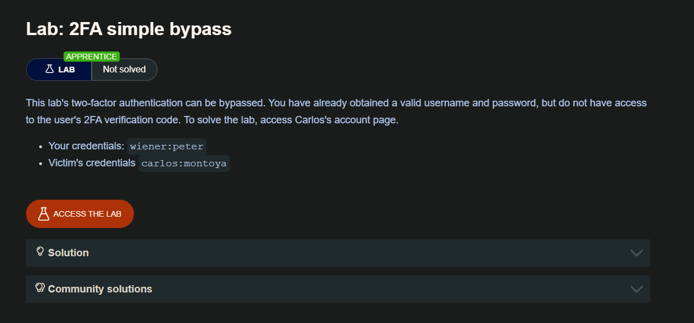
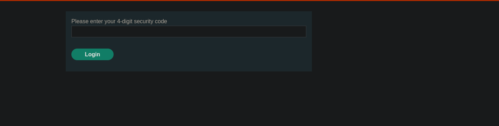
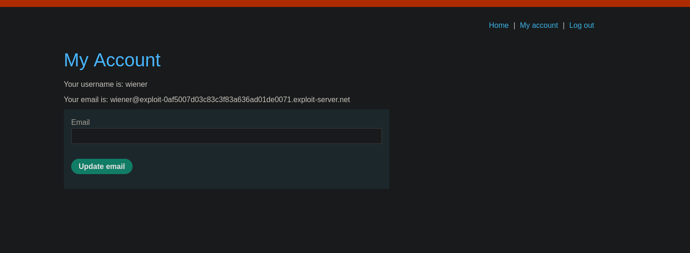
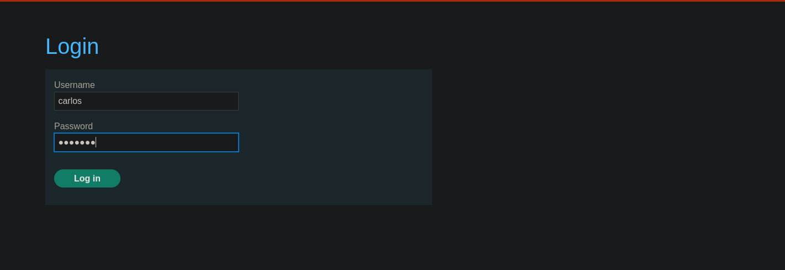
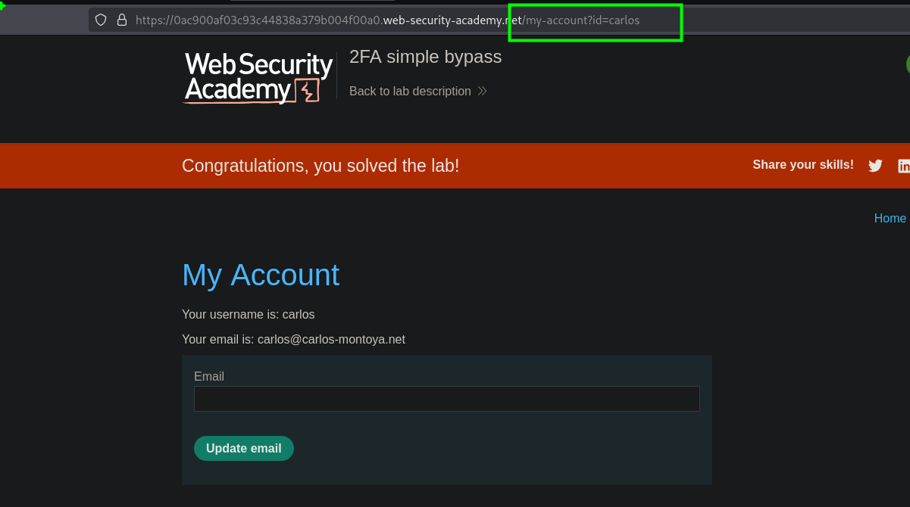

## HTTP autenticación básica 
Aunque es bastante antigua, su relativa simplicidad y facilidad de implementación hace que a veces veas que se utiliza la autenticación básica HTTP. En la autenticación básica HTTP, el cliente recibe un token de autenticación del servidor, que se construye concatenando el nombre de usuario y la contraseña, y codificándolo en Base64. Este token es almacenado y gestionado por el navegador, que lo añade automáticamente a la cabecera Authorization de cada petición posterior de la siguiente manera:

```c
Authorization: Basic base64(username:password)
```

Por una serie de razones, generalmente no se considera un método de autenticación seguro. En primer lugar, implica enviar repetidamente las credenciales de inicio de sesión del usuario con cada solicitud. A menos que el sitio web también implemente HSTS, las credenciales del usuario están expuestas a ser capturadas en un ataque man-in-the-middle.

Además, las implementaciones de la autenticación básica HTTP a menudo no admiten la protección por fuerza bruta. Como el token consiste exclusivamente en valores estáticos, puede ser vulnerable a la fuerza bruta.

La autenticación básica HTTP también es particularmente vulnerable a los exploits relacionados con sesiones, especialmente CSRF, contra los que no ofrece protección por sí misma.

En algunos casos, explotar una autenticación básica HTTP vulnerable sólo puede dar a un atacante acceso a una página aparentemente poco interesante. Sin embargo, además de proporcionar una superficie de ataque adicional, las credenciales expuestas de esta forma podrían reutilizarse en otros contextos más confidenciales.

## Vulnerabilities in multi-factor authentication

En esta sección, veremos algunas de las vulnerabilidades que pueden ocurrir en los mecanismos de autenticación multifactor. También hemos proporcionado varios laboratorios interactivos para demostrar cómo puedes explotar estas vulnerabilidades en la autenticación multifactor.

Muchos sitios web se basan exclusivamente en la autenticación de un solo factor utilizando una contraseña para autenticar a los usuarios. Sin embargo, algunos requieren que los usuarios demuestren su identidad utilizando múltiples factores de autenticación.

La verificación de factores biométricos es poco práctica para la mayoría de los sitios web. Sin embargo, cada vez es más frecuente ver autenticación de dos factores (2FA), tanto obligatoria como opcional, basada en algo que se sabe y algo que se tiene. Esto suele requerir que los usuarios introduzcan tanto una contraseña tradicional como un código de verificación temporal desde un dispositivo físico fuera de banda en su posesión.

Aunque a veces es posible que un atacante obtenga un único factor basado en el conocimiento, como una contraseña, poder obtener simultáneamente otro factor de una fuente fuera de banda es considerablemente menos probable. Por esta razón, la autenticación de dos factores es manifiestamente más segura que la autenticación de un solo factor. Sin embargo, como ocurre con cualquier medida de seguridad, sólo es tan segura como su aplicación. Una autenticación de dos factores mal implementada puede ser burlada, o incluso evitada por completo, al igual que ocurre con la autenticación de un solo factor.

También hay que tener en cuenta que sólo se obtienen todas las ventajas de la autenticación multifactor si se verifican varios factores diferentes. Verificar el mismo factor de dos formas distintas no es una auténtica autenticación de dos factores. La 2FA basada en el correo electrónico es un ejemplo de ello. Aunque el usuario tiene que proporcionar una contraseña y un código de verificación, el acceso al código sólo depende de que conozca las credenciales de inicio de sesión de su cuenta de correo electrónico. Por lo tanto, el factor de autenticación de conocimiento simplemente se está verificando dos veces.

## Two-factor authentication tokens

Los códigos de verificación suelen ser leídos por el usuario desde un dispositivo físico de algún tipo. Muchos sitios web de alta seguridad proporcionan ahora a los usuarios un dispositivo dedicado a este fin, como el token RSA o el dispositivo de teclado que usted podría utilizar para acceder a su banca en línea o a su ordenador portátil del trabajo. Además de estar diseñados específicamente para la seguridad, estos dispositivos tienen la ventaja de generar directamente el código de verificación. También es habitual que los sitios web utilicen una aplicación móvil específica, como Google Authenticator, por el mismo motivo.

Por otro lado, algunos sitios web envían códigos de verificación al teléfono móvil del usuario en forma de mensaje de texto. Aunque técnicamente esto sigue verificando el factor de "algo que tienes", se presta a abusos. En primer lugar, el código se transmite por SMS en lugar de ser generado por el propio dispositivo. Esto crea la posibilidad de que el código sea interceptado. También existe el riesgo de que un atacante obtenga fraudulentamente una tarjeta SIM con el número de teléfono de la víctima. El atacante recibiría entonces todos los mensajes SMS enviados a la víctima, incluido el que contiene su código de verificación.

## Bypassing two-factor authentication

A veces, la implementación de la autenticación de dos factores es defectuosa hasta el punto de que puede eludirse por completo.

Si primero se pide al usuario que introduzca una contraseña y luego se le pide que introduzca un código de verificación en una página separada, el usuario se encuentra efectivamente en un estado "conectado" antes de haber introducido el código de verificación. En este caso, merece la pena probar si se puede saltar directamente a las páginas "sólo para usuarios registrados" después de completar el primer paso de autenticación. A veces, un sitio web no comprueba si el usuario ha completado o no el segundo paso antes de cargar la página.

## LAB 



Haciendo uso de las credenciales de wiener ingresamos y luego vemos que nos solicita un código de 4 dígitos que el sitio web envía a nuestro correo.

```c
 wiener:peter
```



Una vez ingresado el código, el sitio web nos lleva al directorio `/my-account?id=wiener` 

```c
https://0ac900af03c93c44838a379b004f00a0.web-security-academy.net/my-account?id=wiener
```



Ahora aplicquemos la teoria explicada en el laboratorio, el cual algunos directorios o rutas del sitio web no validan que el codigo MF2 se haya ingresado al inciar sesion, por lo que haciendo uso de la cuenta de `carlos` ingresaremos



Luego ingresar al panel donde nos solicita el código 2FA, cambiaremos la ruta la url de `https://0ac900af03c93c44838a379b004f00a0.web-security-academy.net/login2` a  `https://0ac900af03c93c44838a379b004f00a0.web-security-academy.net/my-account?id=carlos` y veremos que esto funciona. Logrando ingresar a la cuenta de Carlos



