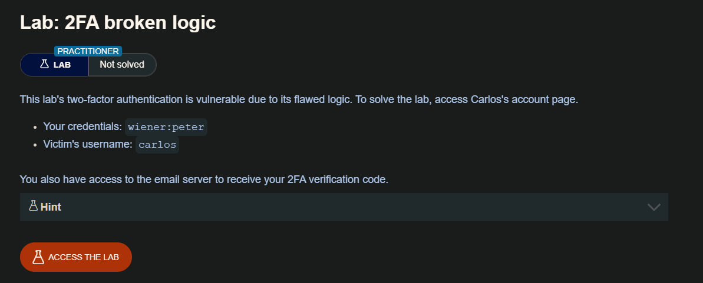
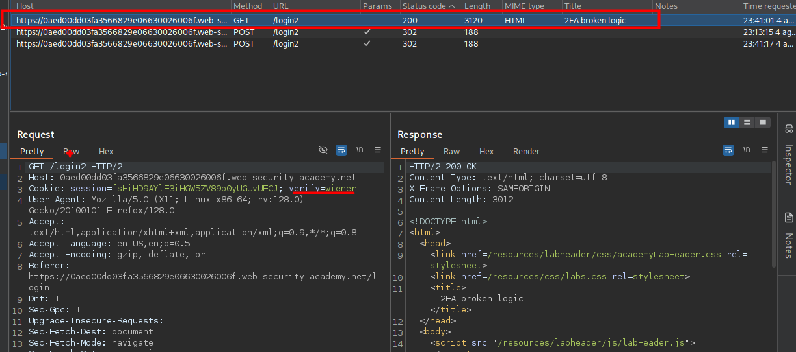
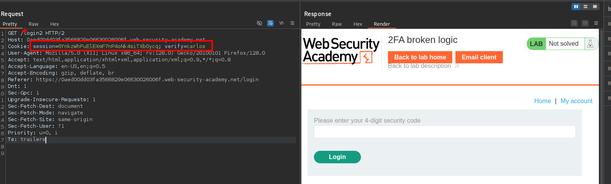
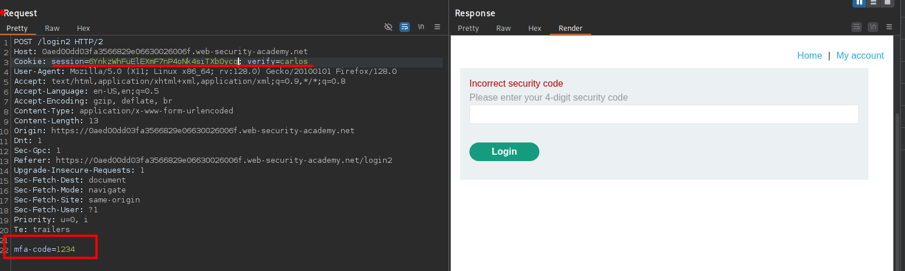
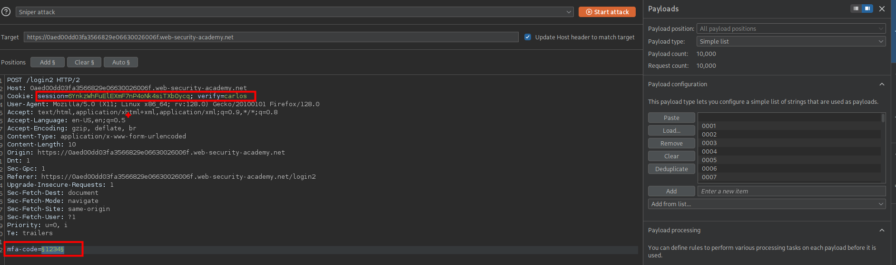
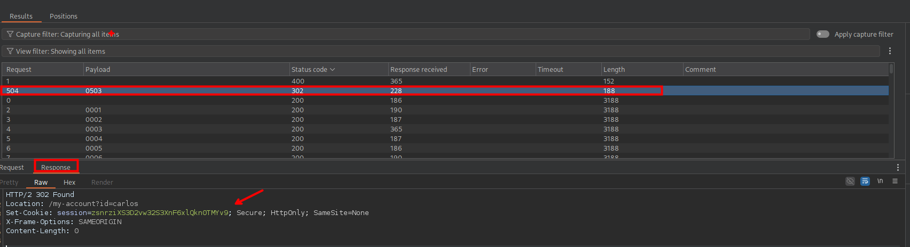

## Flawed two-factor verification logic

A veces la lógica defectuosa en la autenticación de dos factores significa que después de que un usuario haya completado el paso inicial de inicio de sesión, el sitio web no verifica adecuadamente que el mismo usuario está completando el segundo paso.

Por ejemplo, el usuario inicia sesión con sus credenciales normales en el primer paso de la siguiente manera:

```c
POST /login-steps/first HTTP/1.1
Host: vulnerable-website.com
...
username=carlos&password=qwerty
```

A continuación, se les asigna una cookie relacionada con su cuenta, antes de llevarles al segundo paso del proceso de inicio de sesión:

```c
HTTP/1.1 200 OK
Set-Cookie: account=carlos

GET /login-steps/second HTTP/1.1
Cookie: account=carlos
```

Al enviar el código de verificación, la solicitud utiliza esta cookie para determinar a qué cuenta está intentando acceder el usuario:

```c
POST /login-steps/second HTTP/1.1
Host: vulnerable-website.com
Cookie: account=carlos
...
verification-code=123456
```

En este caso, un atacante podría iniciar sesión utilizando sus propias credenciales, pero luego cambiar el valor de la cookie de cuenta a cualquier nombre de usuario arbitrario al enviar el código de verificación.

```c
POST /login-steps/second HTTP/1.1
Host: vulnerable-website.com
Cookie: account=victim-user
...
verification-code=123456
```

Esto es extremadamente peligroso si el atacante es capaz de forzar el código de verificación, ya que le permitiría acceder a cuentas de usuarios arbitrarios basándose únicamente en su nombre de usuario. Ni siquiera necesitarían conocer la contraseña del usuario.

## LAB 



La manera de explotar el sitio web es de la siguiente manera: 

Debemos que interceptar las solicitudes cuando ingresamos las credenciales de `wiener` y en una de ellos con encontraremos que este hace una solicitud `GET` con una `cookie` en la que lleva el nombre de usuario al cual envía el código "2FA" 



Entonces el modo de ataque es que cambiemos el valor de  `verify` de wiener a carlos.



Una vez cambiada, se le enviara el código `2FA` al correo del usuario `carlos` pero no sabemos el correo de este usuario, por lo que teniendo la cookie usada para que se genere el envió de código al usuario realizaremos fuerza bruta para encontrar el código.




Luego de generar números de 4 dígitos y realizar un ataque del tipo `sniper attack` 



Luego de esperar un poco encontraremos el código correcto.



