## Vulnerabilidades en otros mecanismos de autenticación

Además de la función básica de inicio de sesión, la mayoría de los sitios web ofrecen funciones complementarias para que los usuarios puedan gestionar su cuenta. Por ejemplo, normalmente los usuarios pueden cambiar su contraseña o restablecerla cuando la olvidan. Estos mecanismos también pueden introducir vulnerabilidades que pueden ser explotadas por un atacante.

Los sitios web suelen tener cuidado de evitar vulnerabilidades conocidas en sus páginas de inicio de sesión. Pero es fácil pasar por alto el hecho de que es necesario tomar medidas similares para garantizar que la funcionalidad relacionada sea igualmente robusta. Esto es especialmente importante en los casos en los que un atacante es capaz de crear su propia cuenta y, en consecuencia, tiene fácil acceso para estudiar estas páginas adicionales.

## Mantener a los usuarios conectados

Una característica común es la opción de permanecer conectado incluso después de cerrar la sesión del navegador. Suele tratarse de una simple casilla de verificación etiquetada como "Recordarme" o "Mantener la sesión iniciada".

Esta funcionalidad suele implementarse generando un token "recuérdame" de algún tipo, que luego se almacena en una cookie persistente. Dado que la posesión de esta cookie permite eludir todo el proceso de inicio de sesión, la mejor práctica es que no sea posible adivinarla. Sin embargo, algunos sitios web generan esta cookie basándose en una concatenación predecible de valores estáticos, como el nombre de usuario y una marca de tiempo. Algunos incluso utilizan la contraseña como parte de la cookie. Este enfoque es especialmente peligroso si un atacante es capaz de crear su propia cuenta, ya que puede estudiar su propia cookie y deducir potencialmente cómo se genera. Una vez averiguada la fórmula, puede intentar forzar las cookies de otros usuarios para acceder a sus cuentas.

Algunos sitios web asumen que si la cookie está encriptada de alguna manera no será adivinable aunque utilice valores estáticos. Aunque esto puede ser cierto si se hace correctamente, "cifrar" ingenuamente la cookie utilizando una simple codificación bidireccional como Base64 no ofrece protección alguna. Incluso el uso de un cifrado adecuado con una función hash unidireccional no es completamente a prueba de balas. Si el atacante es capaz de identificar fácilmente el algoritmo hash, y no se utiliza ninguna sal, puede potencialmente forzar la cookie simplemente haciendo un hash de sus listas de palabras. Este método puede utilizarse para eludir los límites de intentos de inicio de sesión si no se aplica un límite similar a los intentos de adivinar la cookie.

Incluso si el atacante no es capaz de crear su propia cuenta, todavía puede ser capaz de explotar esta vulnerabilidad. Utilizando las técnicas habituales, como XSS, un atacante podría robar la cookie "recuérdame" de otro usuario y deducir cómo se construye la cookie a partir de ahí. Si el sitio web se construyó utilizando un marco de código abierto, los detalles clave de la construcción de la cookie pueden incluso estar documentados públicamente.

## LAB 

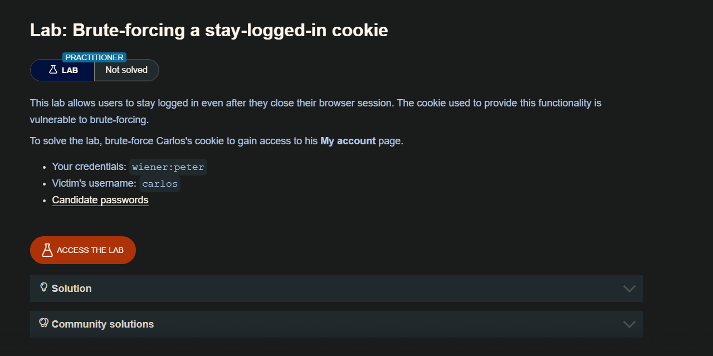

En el panel de login vemos una opción `stay logged in` el cual mantiene la sesion iniciada

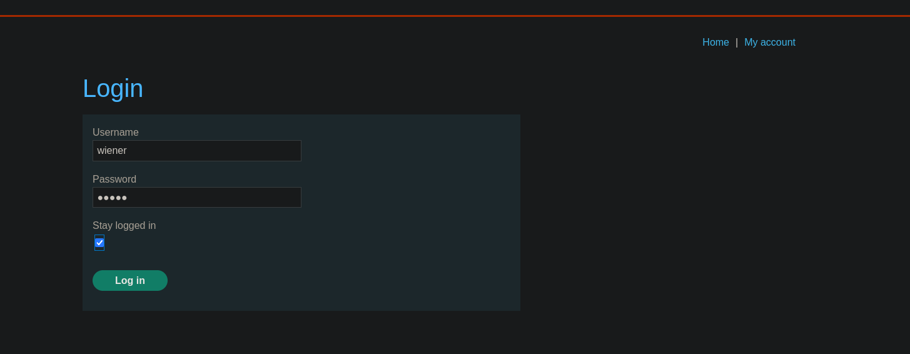

Vemos que si no marcamos la opción de `stay logged in` tenemos una cookie normal

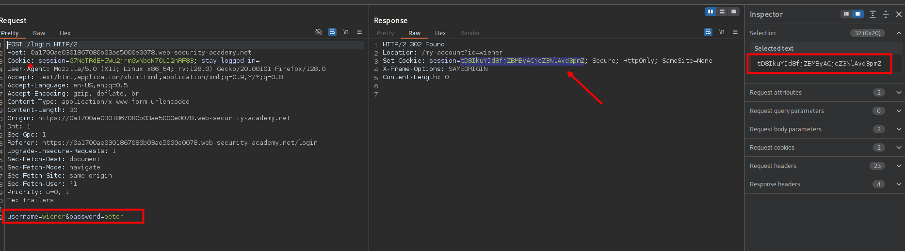

Luego al ingresar marcando la opción `stay logged in` optenemos una cookie que esta en base64 y la contraseña en `md5`

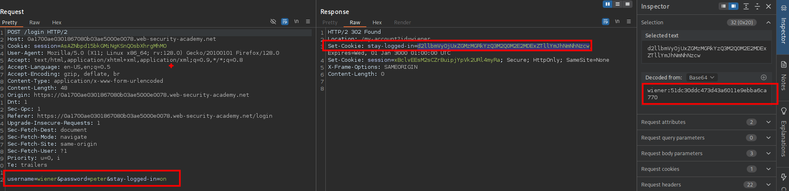


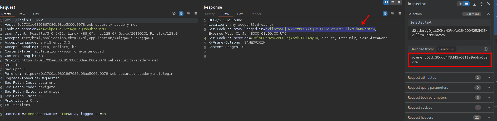

Esto lo podemos ver desde el mismo burpsuite 

```c
d2llbmVyOjUxZGMzMGRkYzQ3M2Q0M2E2MDExZTllYmJhNmNhNzcw

wiener:51dc30ddc473d43a6011e9ebba6ca770
```

 Desde la terminal
 
```c
❯ echo -n "peter"| md5sum
51dc30ddc473d43a6011e9ebba6ca770  -

```

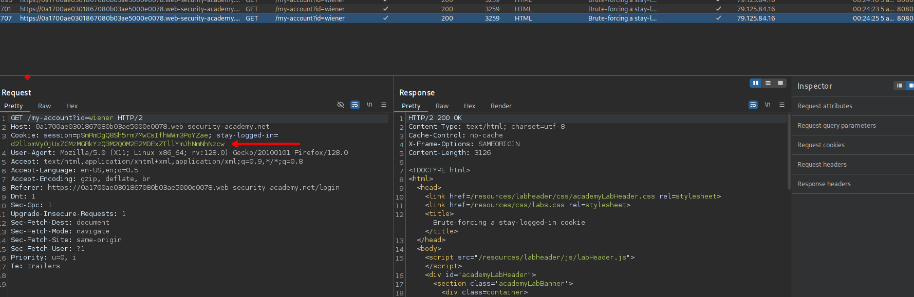

- [https://portswigger.net/web-security/authentication/auth-lab-passwords](https://portswigger.net/web-security/authentication/auth-lab-passwords)

Ahora, realizaremos un ataque `sniper attack` pero lo que haremos poder la contraseña en md5 y luego agregar al usuario `carlos:` como prefijo, luego encodearemos en base64.  

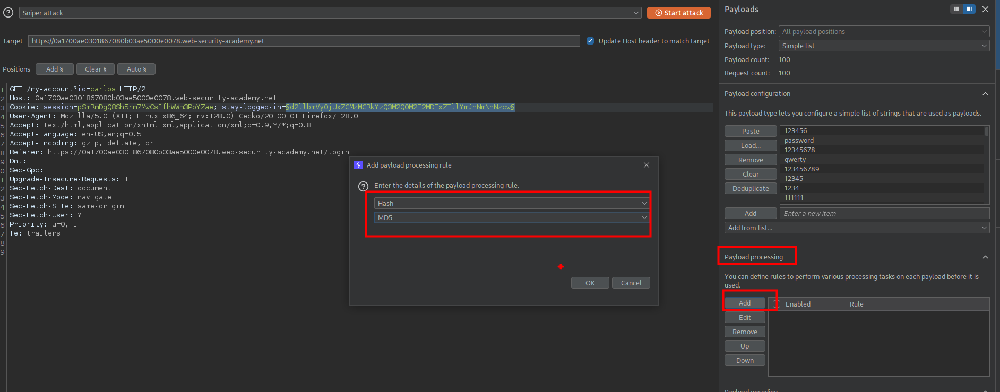

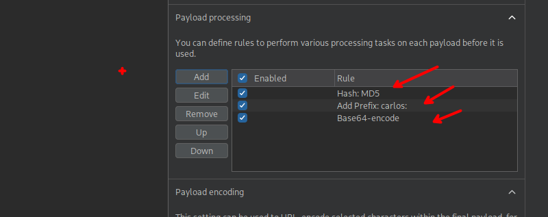

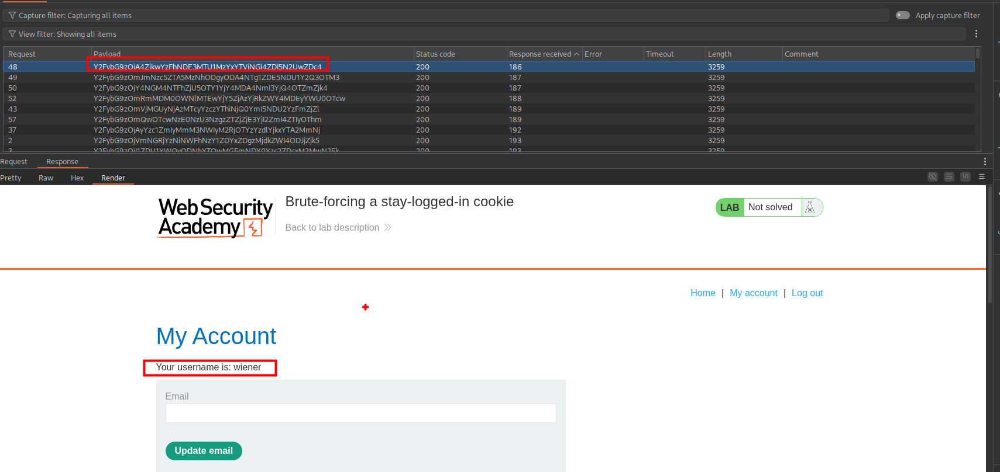

Aqui algo importante que no lo hice es borrar la `session=` 

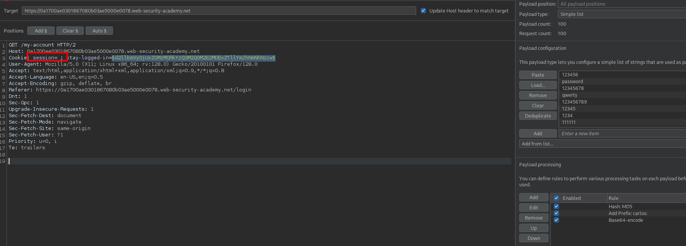

Y luego debemos iniciar el ataque 

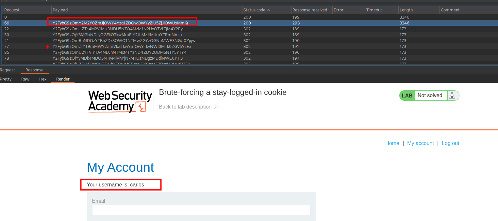

Ahora solo debemos crackear la contraseña, en mi caso use `crackstation` y nuestra contraseña es `777777`

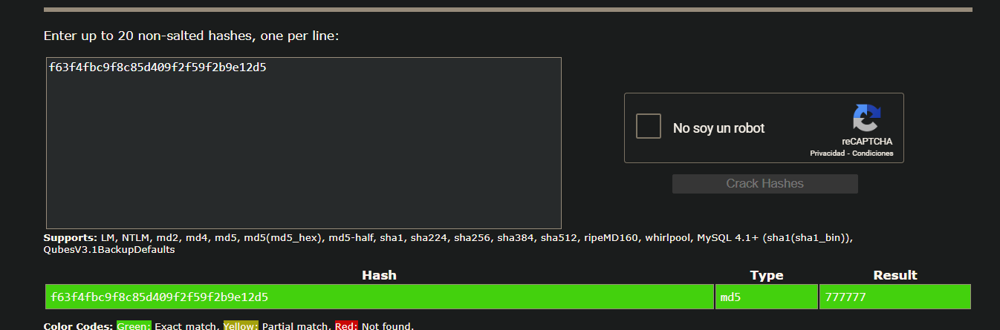

