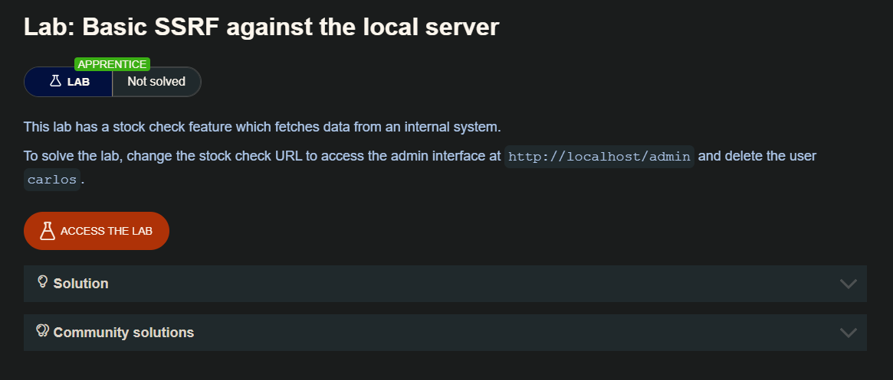
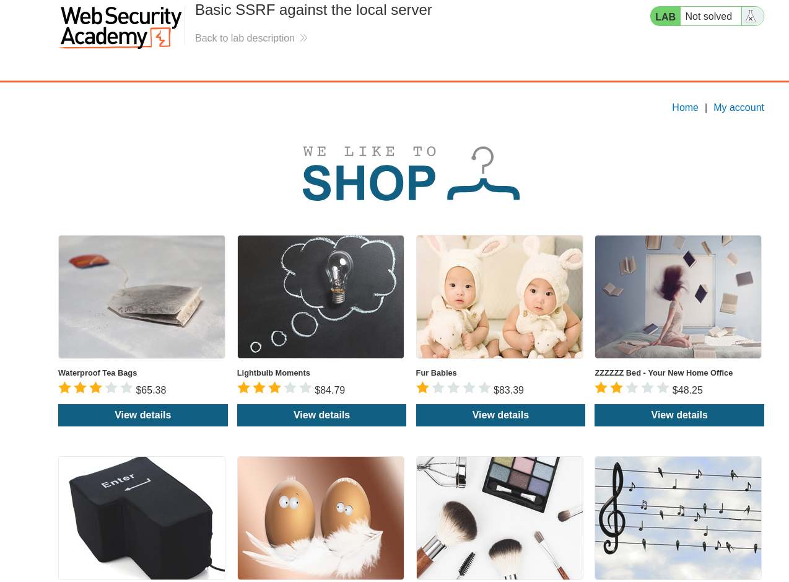
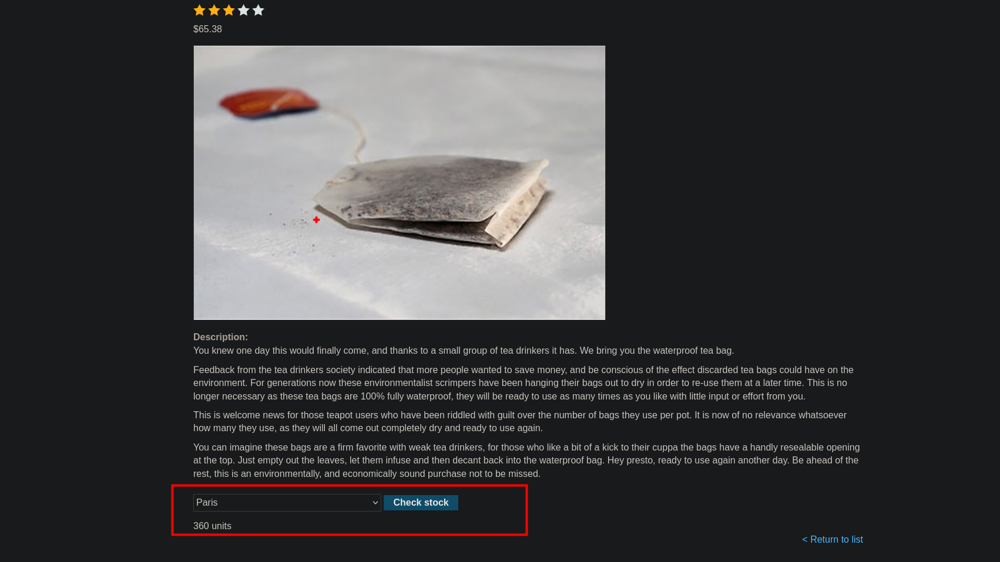
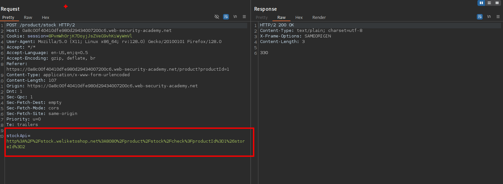
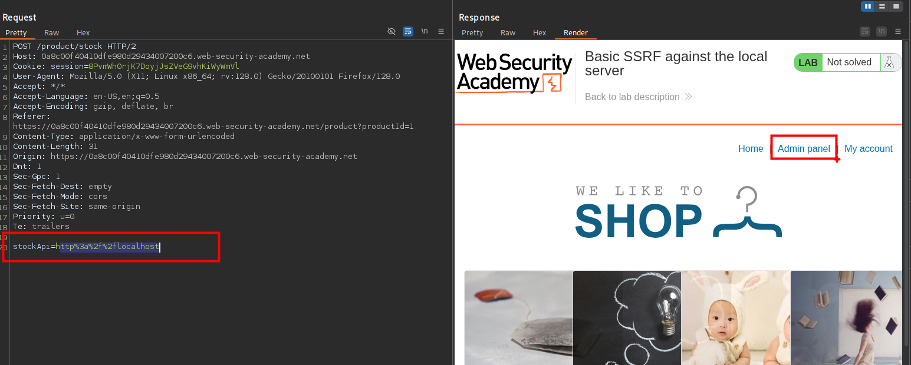
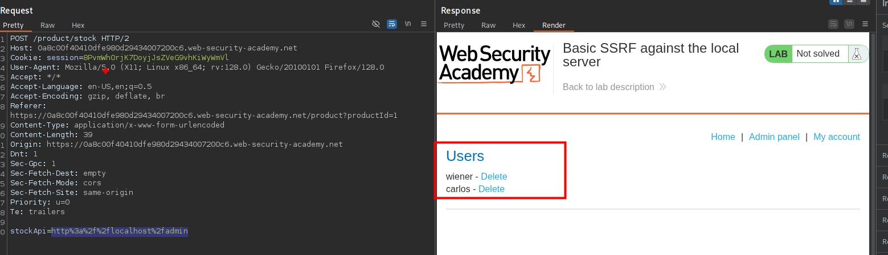
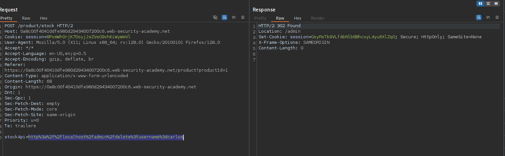
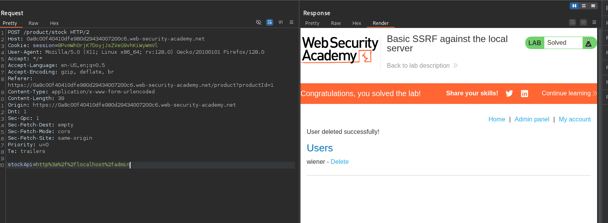

## Ataques SSRF contra el servidor

En un ataque SSRF contra el servidor, el atacante hace que la aplicación realice una petición HTTP al servidor que aloja la aplicación, a través de su interfaz de red loopback. Esto normalmente implica suministrar una URL con un nombre de host como 127.0.0.1 (una dirección IP reservada que apunta al adaptador loopback) o localhost (un nombre comúnmente utilizado para el mismo adaptador).

Por ejemplo, imagina una aplicación de compras que permite al usuario ver si un artículo está en stock en una tienda determinada. Para obtener la información sobre las existencias, la aplicación debe consultar varias API REST de back-end. Para ello, pasa la URL al punto final de la API back-end correspondiente a través de una solicitud HTTP front-end. Cuando un usuario consulta el estado de las existencias de un artículo, su navegador realiza la siguiente petición:

```c
POST /product/stock HTTP/1.0 Content-Type: application/x-www-form-urlencoded Content-Length: 118

stockApi=http://stock.weliketoshop.net:8080/product/stock/check%3FproductId%3D6%26storeId%3D1
```

Esto hace que el servidor realice una petición a la URL especificada, recupere el estado de las existencias y se lo devuelva al usuario.

En este ejemplo, un atacante puede modificar la solicitud para especificar una URL local al servidor:


```c
POST /product/stock HTTP/1.0
Content-Type: application/x-www-form-urlencoded
Content-Length: 118

stockApi=http://localhost/admin
```

El servidor obtiene el contenido de la URL /admin y lo devuelve al usuario.

Un atacante puede visitar la URL` /admin`, pero la funcionalidad administrativa normalmente sólo es accesible para usuarios autenticados. Esto significa que un atacante no verá nada de interés. Sin embargo, si la petición a la URL ` /admin` proviene de la máquina local, los controles de acceso normales se saltan. La aplicación concede acceso completo a la funcionalidad administrativa, porque la petición parece originarse desde una ubicación de confianza.

## LAB



Al iniciar el laboratorio  observaremos algunos articulos



En los artículos veremos la opción de consultar el stock



En la solicitud del stock podremos ver que lleva datos en el parámetro `stockApi` 



En este parámetro, al cambiar el valor a `http://localhost` observaremos que este hace una solicitud al servidor y nos devuelve el panel del administrador.



Al revisar un poco el código HTML observamos que tenemos:

```c
<a href="/admin">Admin panel</a>
```

En esta ruta esta el panel de administración de usuarios `/admin`  como lo muestro la imagen



Una vez realizada la request y para poder eliminar al usuario `Carlos` debemos enviar nuevamente una solicitud pero a esta ruta `/admin/delete?username=carlos` y por si te lo preguntas este lo puedes ver inspeccionando la web de la solicitud anterior

```c
stockApi=http%3a%2f%2flocalhost%2fadmin%2fdelete%3fusername%3dcarlos
```



Enviada la solicitud, podremos ver que efectivamente se elimino el usuario `Carlos`




