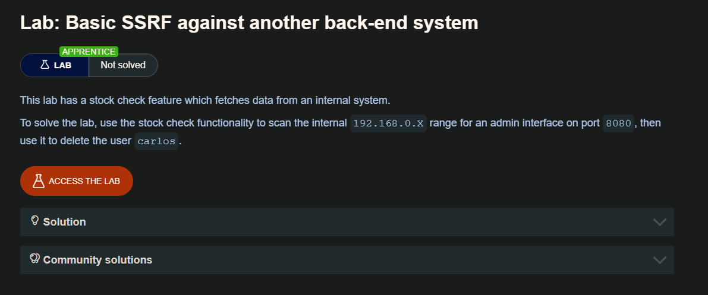
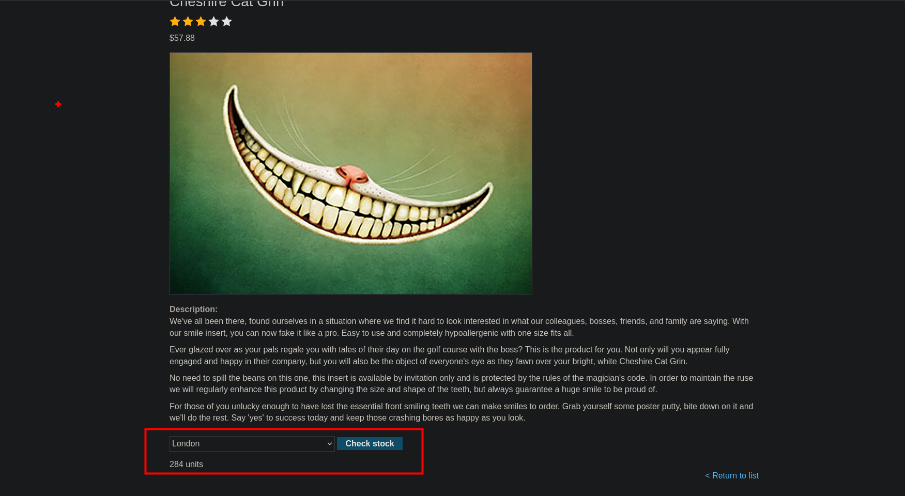
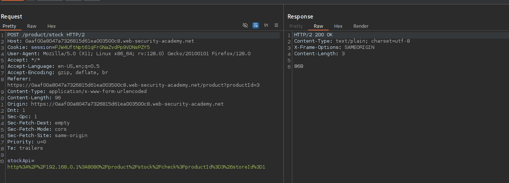
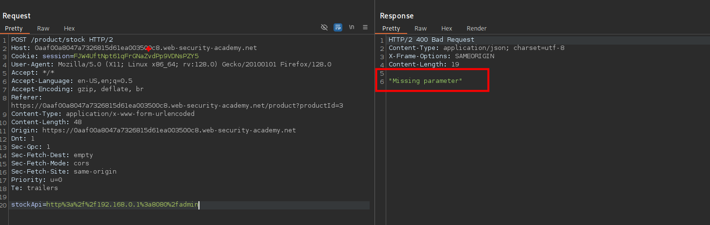
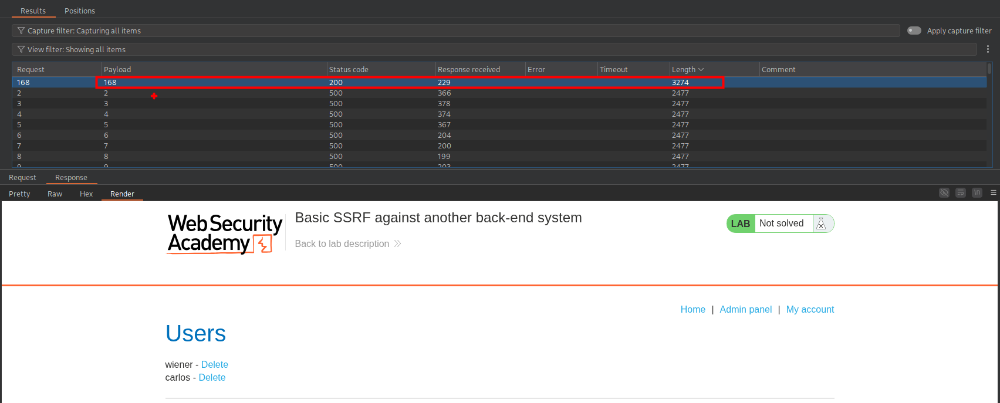
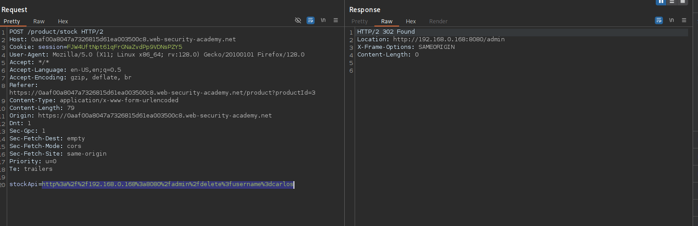
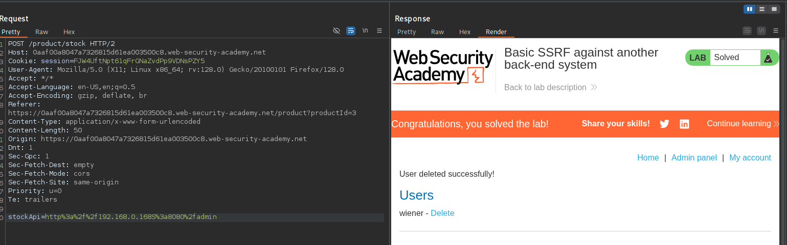

## SSRF attacks against other back-end systems

En algunos casos, el servidor de aplicaciones puede interactuar con sistemas back-end a los que los usuarios no pueden acceder directamente. Estos sistemas suelen tener direcciones IP privadas no enrutables. Los sistemas back-end suelen estar protegidos por la topología de la red, por lo que a menudo tienen una postura de seguridad más débil. En muchos casos, los sistemas back-end internos contienen funciones confidenciales a las que puede acceder sin autenticación cualquier persona que pueda interactuar con los sistemas.

En el ejemplo anterior, imaginemos que hay una interfaz administrativa en la URL back-end https://192.168.0.68/admin. Un atacante puede enviar la siguiente solicitud para explotar la vulnerabilidad SSRF y acceder a la interfaz administrativa:

```c
POST /product/stock HTTP/1.0
Content-Type: application/x-www-form-urlencoded
Content-Length: 118

stockApi=http://192.168.0.68/admin
```

## Lab: Basic SSRF against another back-end system



Al ingresar al sitio web encontraremos artículos, de los cuales podemos realizar la consulta del stock




En la solicitud del stock observaremos que la solicitud va a una dirección IP, de esta aprovecharemos para enumerar activos dentro del servidor



Cambiamos a `http://192.168.0.1:8080` y enviamos la solicitud, pero nos da un `Missing parameter` por lo que intuyo que la dirección IP no es la correcta para el administrador



Por lo que enviaremos al `intruder` para iterar y buscar la dirección IP para el sitio web del administrador



Ahora para poder eliminar al usuario Carlos, podemos observar que la siguiente linea de código 

```c
<a href="/http://192.168.0.168:8080/admin/delete?username=carlos">Delete
```

En esta hace una solicitud a `/admin/delete?username=carlos`



Luego de enviar la solicitud podemos ver que este usuario (`carlos`) fue eliminado.




