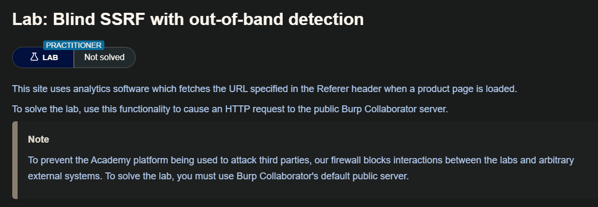
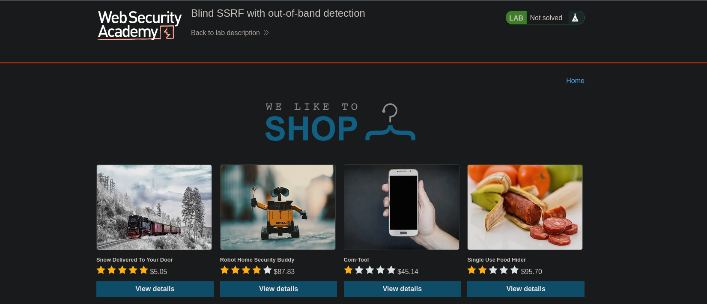
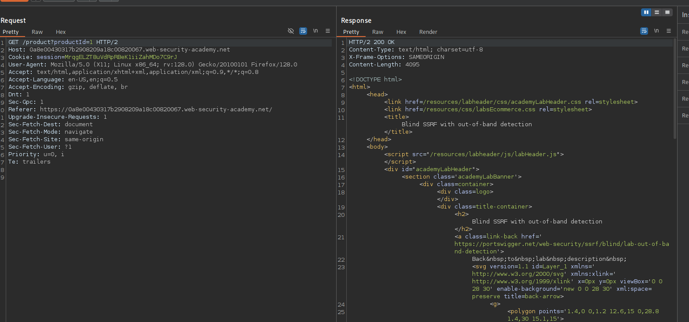
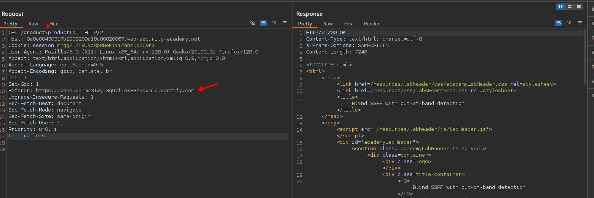

La forma más fiable de detectar vulnerabilidades SSRF ciegas es utilizando técnicas fuera de banda (OAST). Esto implica intentar activar una solicitud HTTP a un sistema externo que usted controle y supervisar las interacciones de red con ese sistema.

La forma más fácil y eficaz de utilizar técnicas fuera de banda es mediante Burp Collaborator. Puede utilizar Burp Collaborator para generar nombres de dominio únicos, enviarlos en cargas útiles a la aplicación y supervisar cualquier interacción con esos dominios. Si se observa una solicitud HTTP entrante procedente de la aplicación, entonces es vulnerable a SSRF.

Al realizar pruebas para detectar vulnerabilidades SSRF, es habitual observar una búsqueda DNS para el dominio colaborador proporcionado, pero no una solicitud HTTP posterior. Esto suele ocurrir porque la aplicación intentó realizar una solicitud HTTP al dominio, lo que provocó la búsqueda DNS inicial, pero la solicitud HTTP real fue bloqueada por el filtrado a nivel de red. Es relativamente habitual que la infraestructura permita el tráfico DNS saliente, ya que es necesario para muchos fines, pero bloquee las conexiones HTTP a destinos inesperados.

El simple hecho de identificar una vulnerabilidad SSRF ciega que puede desencadenar solicitudes HTTP fuera de banda no proporciona por sí solo una vía para su explotación. Dado que no se puede ver la respuesta de la solicitud del back-end, el comportamiento no se puede utilizar para explorar el contenido de los sistemas a los que puede acceder el servidor de aplicaciones. Sin embargo, aún se puede aprovechar para buscar otras vulnerabilidades en el propio servidor o en otros sistemas back-end. Se puede barrer a ciegas el espacio de direcciones IP internas, enviando cargas útiles diseñadas para detectar vulnerabilidades conocidas. Si esas cargas útiles también emplean técnicas ciegas fuera de banda, es posible que se descubra una vulnerabilidad crítica en un servidor interno sin parchear.

Otra forma de explotar las vulnerabilidades SSRF ciegas es inducir a la aplicación a conectarse a un sistema bajo el control del atacante y devolver respuestas maliciosas al cliente HTTP que realiza la conexión. Si puede explotar una vulnerabilidad grave del lado del cliente en la implementación HTTP del servidor, es posible que pueda lograr la ejecución remota de código dentro de la infraestructura de la aplicación.

## Lab: Blind SSRF with out-of-band detection

En este laboratorio observaremos que al visitar el producto en los headers arrastra el `referer` por lo que debemos cambiar por la url que nos da el burp collaborator 

Una vez cambiado esto, podremos visualizar que el servidor victima hace una petición.
