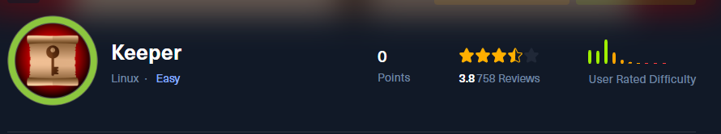

Keeper es una máquina Linux de nivel de dificultad fácil que cuenta con un sistema de tickets de soporte que utiliza credenciales predeterminadas. Al enumerar el servicio, podemos ver las credenciales de texto sin formato que conducen al acceso SSH. Con el acceso "SSH", podemos obtener acceso a un archivo de volcado de la base de datos de KeePass, que podemos aprovechar para recuperar la contraseña maestra. Con acceso a la base de datos "Keepass", podemos acceder a las claves "SSH" raíz, que se utilizan para obtener un shell privilegiado en el host.

# Enumeración

Iniciamos con la enumeración de los puertos abiertos con ayuda de nmap

```c
❯ nmap -p- --open --min-rate 5000 -Pn -n -vvv 10.10.11.227 -oG allportsScan

PORT   STATE SERVICE REASON
22/tcp open  ssh     syn-ack
80/tcp open  http    syn-ack

```

Observamos dos puertos abiertos, ahora enumeraremos los servicios y versiones que se ejecutan en dichos puertos

```c
❯ nmap -p22,80 -sC -sV -vvv -Pn -n 10.10.11.227 -oN servicesScan

PORT   STATE SERVICE REASON  VERSION
22/tcp open  ssh     syn-ack OpenSSH 8.9p1 Ubuntu 3ubuntu0.3 (Ubuntu Linux; protocol 2.0)
| ssh-hostkey: 
|   256 35:39:d4:39:40:4b:1f:61:86:dd:7c:37:bb:4b:98:9e (ECDSA)
| ecdsa-sha2-nistp256 AAAAE2VjZHNhLXNoYTItbmlzdHAyNTYAAAAIbmlzdHAyNTYAAABBBKHZRUyrg9VQfKeHHT6CZwCwu9YkJosNSLvDmPM9EC0iMgHj7URNWV3LjJ00gWvduIq7MfXOxzbfPAqvm2ahzTc=
|   256 1a:e9:72:be:8b:b1:05:d5:ef:fe:dd:80:d8:ef:c0:66 (ED25519)
|_ssh-ed25519 AAAAC3NzaC1lZDI1NTE5AAAAIBe5w35/5klFq1zo5vISwwbYSVy1Zzy+K9ZCt0px+goO
80/tcp open  http    syn-ack nginx 1.18.0 (Ubuntu)
|_http-title: Site doesn't have a title (text/html).
| http-methods: 
|_  Supported Methods: GET HEAD
|_http-server-header: nginx/1.18.0 (Ubuntu)
Service Info: OS: Linux; CPE: cpe:/o:linux:linux_kernel

```

## Puerto 80

Navegando en el sitio web del servicio http `80` encontraremos en principio un link

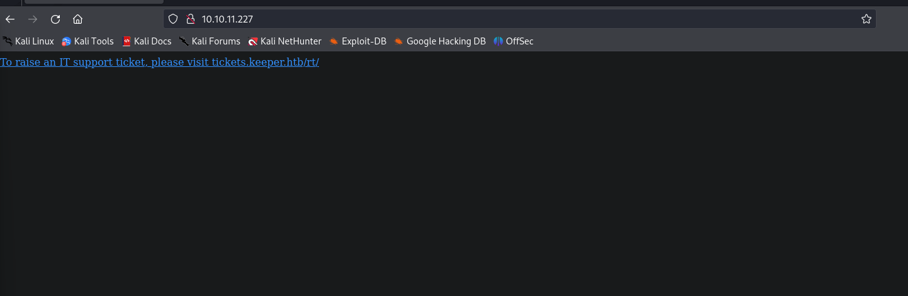

Este link no llevara a [tickets.keeper.htb](tickets.keeper.htb) el cual debemos de agregar a nuestro archivo `/etc/hosts` para que pueda cargar el sitio web.

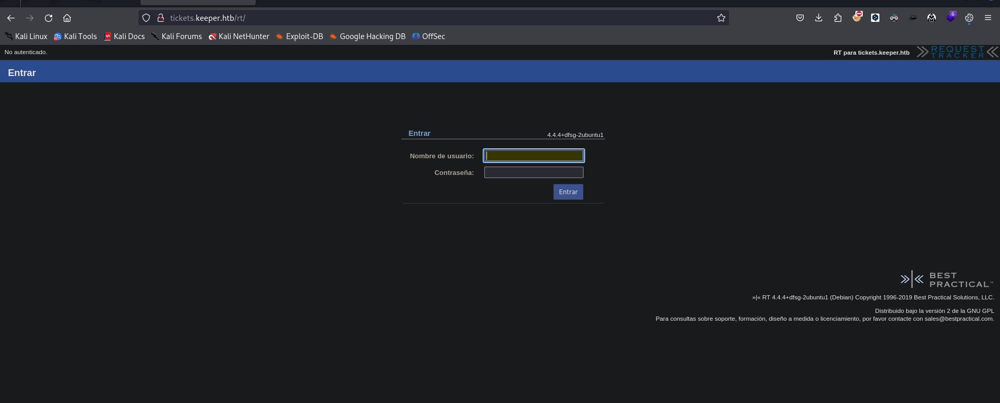

## Reques Tracker

Investigando un poco dimos con las credenciales por defecto del servicio, las cuales son las siguientes:

```c
root : password
```

Estas credenciales no permitirán ingresar al panel de gestión del servicio `requets tracker`

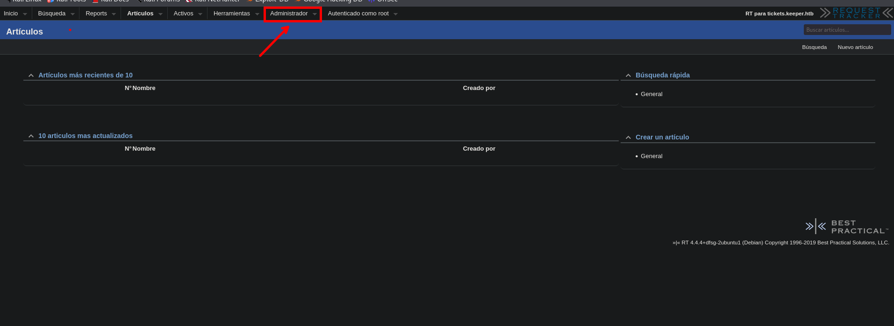
# Shell - lnorgaard

Dirigiendonos al panel de usuarios encontraremos a un usuario llamado `inorgaard` 

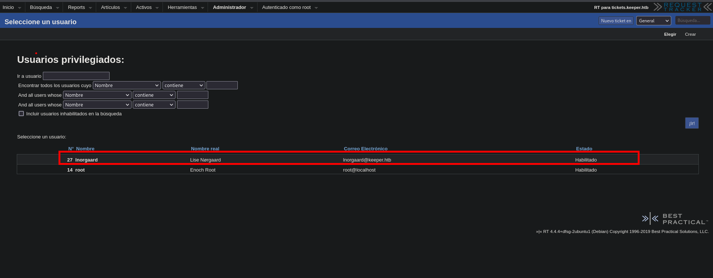

Y en los comentarios encontraremos una credencial

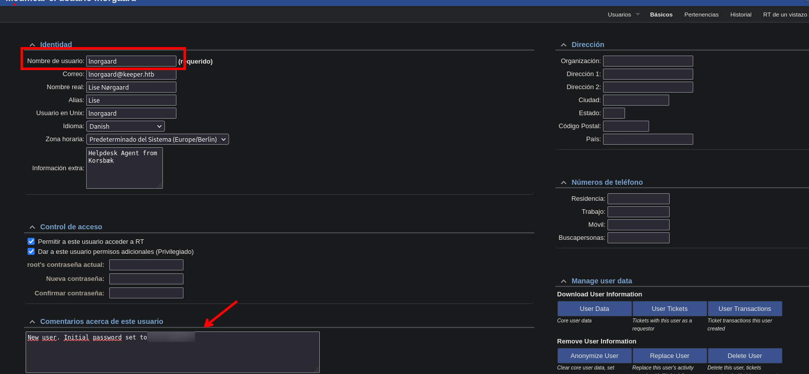

Esta credencial es la siguiente, el cual nos permitirá iniciar sesión por el servicio `ssh`

```c
lnorgaard : Welcome2023!
```

Haciendo uso de la credencial encontrada podemos iniciar sesión por `ssh`

```c
❯ ssh lnorgaard@10.10.11.227

```

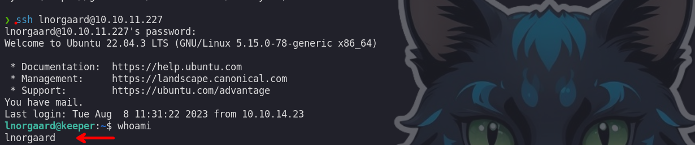

# Shell - root

Enumerando el directorio encontraremos un archivo llamado `RT30000.zip`

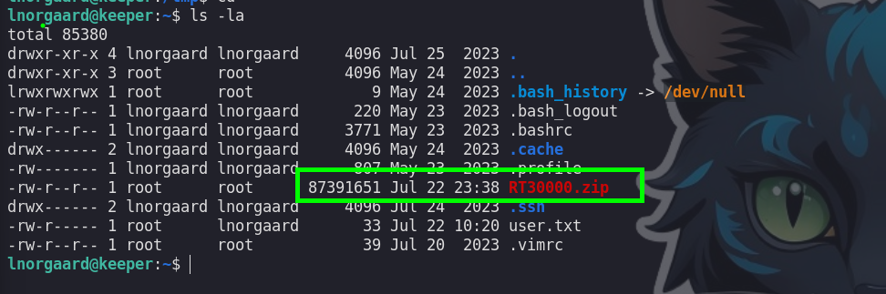

Copiaremos a nuestra maquina atacante el archivo que encontramos y lo descomprimimos, al descomprimir encontraremos los siguientes archivos:


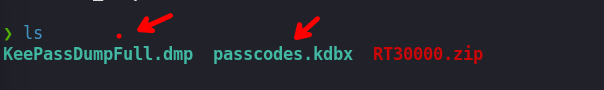

## CVE-2023-32784

Investigando un poco encontraremos con una vulnerabilidad en la que nos permita extraer la contraseña con el archivo `KeePassDumpFull.dmp` 

Para entender mejor sobre la vulnerabilidad puedes revisar el articulo:
- [https://www.incibe.es/incibe-cert/alerta-temprana/vulnerabilidades/cve-2023-32784](https://www.incibe.es/incibe-cert/alerta-temprana/vulnerabilidades/cve-2023-32784)

Con ayuda de un script en python podremos extraer la contraseña en texto plano:

- [https://github.com/z-jxy/keepass_dump](https://github.com/z-jxy/keepass_dump)

Ejecutamos el script y podremos ver parte de la contraseña

```c
python3 keepass_dump.py -f KeePassDumpFull.dmp
```

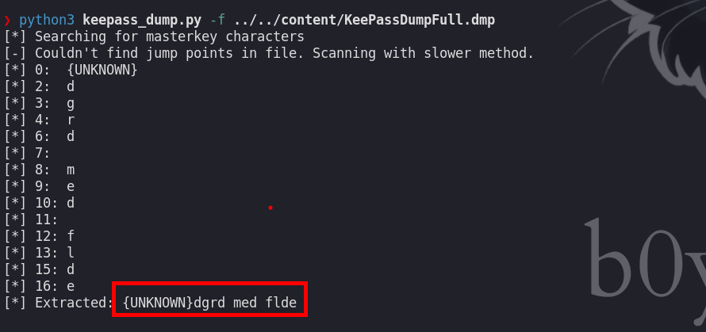

No tenemos la contraseña completa, pero es una parte `dgrd med flde`

Buscando por internet encontramos algo asociado a la palabra que encotramos

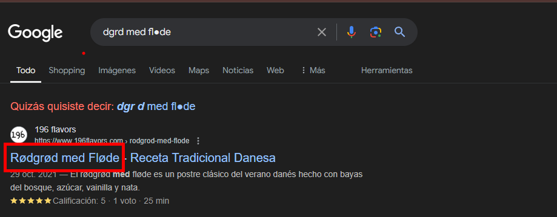

Entonces me decidí a probar dicho texto y haciendo variaciones, en este caso me funciono todas en minusculas:

```c
rødgrød med fløde
```

Luego de ingresar al podremos encontrar dos credenciales

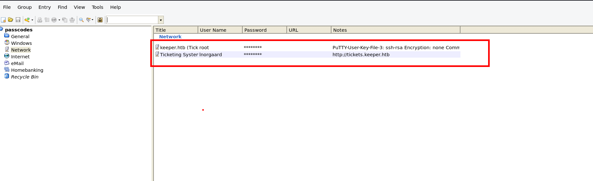

La que nos interesa es la de root, pero esta contraseña no parece ser la correcta.

```c
F4><3K0nd!
```

## Putty User Key

En las notas encontraremos un ssh rsa de Putty, el cual nos copiamos a un archivo para verlo mejor.

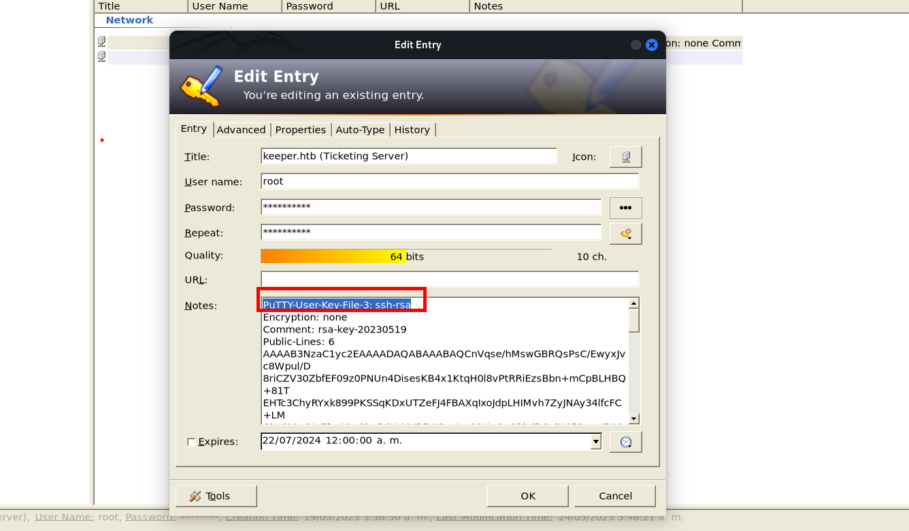

Investigando un poco encontre como convertirlo a una id_rsa, esto lo puedes revisar en el siguiente articulo:

- [https://www.baeldung.com/linux/ssh-key-types-convert-ppk](https://www.baeldung.com/linux/ssh-key-types-convert-ppk)

Esto es un ejemplo de como lo podríamos hacer:

```c
puttygen pp_id_rsa.ppk -O private-openssh -o id_rsa
```

Con el ejemplo de ejecución de comandos podremos generar nuestra id_rsa

```c
❯ puttygen ssh_rsa_putty -O private-openssh -o id_rsa
```

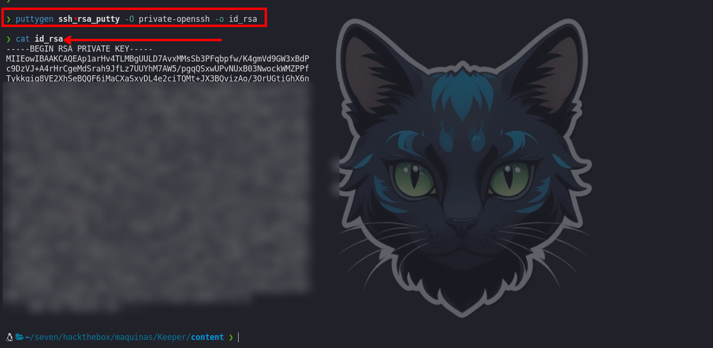

Y haciendo uso de esta id_rsa podremos iniciar sesión como el usuario root:

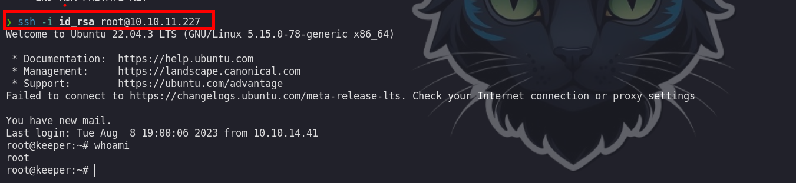